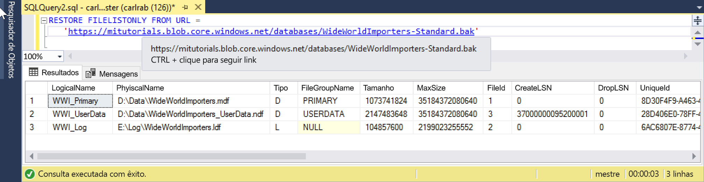

# <a name="quickstart-restore-a-database-to-a-managed-instance"></a>Início Rápido: Restaurar um banco de dados em uma Instância Gerenciada 

Neste início rápido, você usará o SSMS (SQL Server Management Studio) para restaurar um banco de dados (o arquivo de backup Wide World Importers – Standard) do Armazenamento de Blobs do Azure em uma [Instância Gerenciada](sql-database-managed-instance.md) do Banco de Dados SQL do Azure. 

> [!VIDEO https://www.youtube.com/embed/RxWYojo_Y3Q]

> [!NOTE]
> - Para obter mais informações sobre a migração usando o DMS (Serviço de Migração de Banco de Dados do Azure), confira [Migração da Instância Gerenciada usando o DMS](../dms/tutorial-sql-server-to-managed-instance.md). 
> - Para obter mais informações sobre vários métodos de migração, confira [Migração da Instância do SQL Server para a Instância Gerenciada do Banco de Dados SQL do Azure](sql-database-managed-instance-migrate.md).

## <a name="prerequisites"></a>Pré-requisitos

Este início rápido:

- Usa os recursos do início rápido [Criar uma Instância Gerenciada](sql-database-managed-instance-get-started.md).
- Exige que o computador tenha a última versão do [SQL Server Management Studio](https://docs.microsoft.com/sql/ssms/sql-server-management-studio-ssms) instalada.
- Exige o uso do SSMS para se conectar à Instância Gerenciada. Confira estes inícios rápidos sobre como se conectar:
  - [Conectar-se a uma Instância Gerenciada do Banco de Dados SQL do Azure de uma VM do Azure](sql-database-managed-instance-configure-vm.md)
  - [Configurar uma conexão ponto a site com uma Instância Gerenciada do Banco de Dados SQL do Azure do local](sql-database-managed-instance-configure-p2s.md).

> [!NOTE]
> Para obter mais informações sobre como fazer backup e restaurar um banco de dados do SQL Server usando o Armazenamento de Blobs do Azure e uma [chave SAS (Assinatura de Acesso Compartilhado)](https://docs.microsoft.com/azure/storage/common/storage-dotnet-shared-access-signature-part-1), confira [Backup do SQL Server em uma URL](sql-database-managed-instance-get-started-restore.md).

## <a name="restore-the-database-from-a-backup-file"></a>Restaurar o banco de dados de um arquivo de backup

No SSMS, siga estas etapas para restaurar o banco de dados da Wide World Importers na Instância Gerenciada. O arquivo de backup de banco de dados é armazenado em uma conta pré-configurada de Armazenamento de Blobs do Azure.

1. Abra o SMSS e conecte-se à Instância Gerenciada.
2. No menu à esquerda, clique com o botão direito do mouse na Instância Gerenciada e selecione **Nova Consulta** para abrir uma nova janela de consulta.
3. Execute o script SQL a seguir, que usa uma conta de armazenamento pré-configurada e uma chave SAS para [criar uma credencial](https://docs.microsoft.com/sql/t-sql/statements/create-credential-transact-sql?view=sql-server-2017) na Instância Gerenciada.

   ```sql
   CREATE CREDENTIAL [https://mitutorials.blob.core.windows.net/databases] 
   WITH IDENTITY = 'SHARED ACCESS SIGNATURE'
   , SECRET = 'sv=2017-11-09&ss=bfqt&srt=sco&sp=rwdlacup&se=2028-09-06T02:52:55Z&st=2018-09-04T18:52:55Z&spr=https&sig=WOTiM%2FS4GVF%2FEEs9DGQR9Im0W%2BwndxW2CQ7%2B5fHd7Is%3D' 
   ```

    

4. Para verificar a credencial, execute o script a seguir, que usa uma URL de [contêiner](https://azure.microsoft.com/services/container-instances/) para obter uma lista de arquivos de backup.

   ```sql
   RESTORE FILELISTONLY FROM URL = 
      'https://mitutorials.blob.core.windows.net/databases/WideWorldImporters-Standard.bak'
   ```

    

5. Execute o script a seguir para restaurar o banco de dados da Wide World Importers.

   ```sql
   RESTORE DATABASE [Wide World Importers] FROM URL =
     'https://mitutorials.blob.core.windows.net/databases/WideWorldImporters-Standard.bak'
   ```

    

6. Execute o script a seguir para acompanhar o status da restauração.

   ```sql
   SELECT session_id as SPID, command, a.text AS Query, start_time, percent_complete
      , dateadd(second,estimated_completion_time/1000, getdate()) as estimated_completion_time 
   FROM sys.dm_exec_requests r 
   CROSS APPLY sys.dm_exec_sql_text(r.sql_handle) a 
   WHERE r.command in ('BACKUP DATABASE','RESTORE DATABASE')
   ```

7. Quando a restauração for concluída, exiba-a no Pesquisador de Objetos. 

## <a name="next-steps"></a>Próximas etapas

- Para solução de problemas de um backup em uma URL, confira [Melhores práticas e solução de problemas de backup em uma URL do SQL Server](https://docs.microsoft.com/sql/relational-databases/backup-restore/sql-server-backup-to-url-best-practices-and-troubleshooting).
- Para obter uma visão geral das opções de conexão de aplicativos, confira [Conectar seus aplicativos à Instância Gerenciada](sql-database-managed-instance-connect-app.md).
- Para consulta usando suas ferramentas ou linguagens favoritas, confira [Inícios Rápidos: Conexão e consulta do Banco de Dados SQL do Azure](sql-database-connect-query.md).
