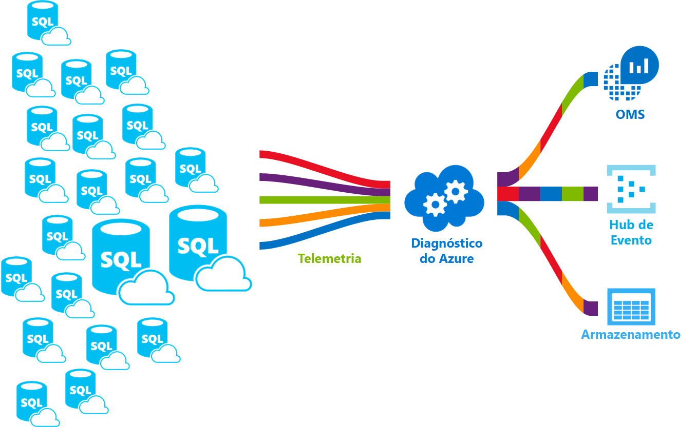

# <a name="azure-sql-database-metrics-and-diagnostics-logging"></a>Métricas de banco de dados SQL do Azure e o log de diagnóstico 
O Banco de Dados SQL do Azure pode emitir métrica e logs de diagnóstico para facilitar o monitoramento. Você pode configurar o Banco de Dados SQL para armazenar o uso de recursos, trabalhos, sessões e conectividade em um destes recursos do Azure:

* **Armazenamento do Azure**: para o arquivamento de grandes quantidades de telemetria por um pequeno preço.
* **Hubs de Eventos do Azure**: para a integração de telemetria do Banco de Dados SQL com a sua solução de monitoramento personalizada ou pipelines ativos.
* **Azure Log Analytics**: para uma solução de monitoramento pronta para uso com relatórios, alertas e recursos de mitigação.

    

## <a name="enable-logging"></a>Habilitar o registro em log

Métricas e log de diagnóstico não está habilitado por padrão. É possível habilitar e gerenciar as métricas e o log de diagnósticos usando um dos seguintes métodos:

- Portal do Azure
- PowerShell
- CLI do Azure
- API REST do Azure Monitor 
- Modelo do Azure Resource Manager

Quando você habilitar o log de diagnóstico e métricas, você precisa especificar os recursos do Azure, onde os dados selecionados são coletados. As opções disponíveis incluem:

- Log Analytics
- Hubs de Eventos
- Armazenamento 

Você pode provisionar um novo recurso do Azure ou selecionar um recurso existente. Depois de selecionar o recurso de armazenamento, você precisa especificar quais dados coletar. As opções disponíveis incluem:

- [Todas as métricas](sql-database-metrics-diag-logging.md#all-metrics): contém o percentual de DTU, o limite de DTU, o percentual de CPU, o percentual de leitura de dados físicos, o percentual de gravação em log, êxito/falha/bloqueio por conexões de firewall, o percentual de sessões, o percentual de funcionários, o armazenamento, o percentual de armazenamento e o percentual de armazenamento XTP.
- [QueryStoreRuntimeStatistics](sql-database-metrics-diag-logging.md#query-store-runtime-statistics): contém informações sobre as estatísticas de tempo de execução da consulta, como o uso de CPU e a duração da consulta.
- [QueryStoreWaitStatistics](sql-database-metrics-diag-logging.md#query-store-wait-statistics): contém informações sobre as estatísticas de espera da consulta, que informam sobre o que suas consultas aguardaram, como CPU, LOG e LOCKING.
- [Erros](sql-database-metrics-diag-logging.md#errors-dataset): contém informações sobre erros de SQL que ocorreram neste banco de dados.
- [DatabaseWaitStatistics](sql-database-metrics-diag-logging.md#database-waits-dataset): contém informações sobre a quantidade de tempo de espera de um banco de dados em diferentes tipos de espera.
- [Tempos limite](sql-database-metrics-diag-logging.md#timeouts-dataset): contêm informações sobre os tempos limite ocorridos em um banco de dados.
- [Bloqueios](sql-database-metrics-diag-logging.md#blockings-dataset): contém informações sobre eventos de bloqueio ocorridos em um banco de dados.
- [SQLInsights](sql-database-metrics-diag-logging.md#intelligent-insights-dataset): contém o recurso Insights Inteligentes. [Saiba mais sobre Insights Inteligentes](sql-database-intelligent-insights.md).

Ao selecionar os Hubs de Eventos ou uma conta de armazenamento, é possível especificar uma política de retenção. Essa política exclui dados mais antigos que um período de tempo selecionado. Se você especificar a análise de Log, a política de retenção depende do tipo de preço selecionado. Para saber mais, consulte [Preços do Log Analytics](https://azure.microsoft.com/pricing/details/log-analytics/). 

Para saber como habilitar o registro em log e entender as categorias de métrica e log com suporte dos vários serviços do Azure, recomendamos que leia: 

* [Visão geral das métricas no Microsoft Azure](../monitoring-and-diagnostics/monitoring-overview-metrics.md)
* [Visão geral do log de diagnóstico do Azure](../monitoring-and-diagnostics/monitoring-overview-of-diagnostic-logs.md) 

### <a name="azure-portal"></a>Portal do Azure

1. Para habilitar a coleta de métricas e logs de diagnóstico no portal, navegue até o banco de dados SQL ou a página de pool elástico e, em seguida, selecione **Configurações de diagnóstico**.

   

2. Crie uma nova configuração ou edite configurações de diagnóstico existentes selecionando o destino e a telemetria.

   

### <a name="powershell"></a>PowerShell

Para habilitar as métricas e o log de diagnósticos usando o PowerShell, use os seguintes comandos:

- Para habilitar o armazenamento do log de diagnóstico em uma conta de armazenamento, use este comando:

   ```powershell
   Set-AzureRmDiagnosticSetting -ResourceId [your resource id] -StorageAccountId [your storage account id] -Enabled $true
   ```

   A ID da conta de armazenamento é a ID de recurso da conta de armazenamento para a qual os logs serão enviados.

- Para habilitar o streaming dos logs de diagnóstico para um hub de eventos, use este comando:

   ```powershell
   Set-AzureRmDiagnosticSetting -ResourceId [your resource id] -ServiceBusRuleId [your service bus rule id] -Enabled $true
   ```

   A ID da regra do Barramento de Serviço do Azure é uma cadeia de caracteres com este formato:

   ```powershell
   {service bus resource ID}/authorizationrules/{key name}
   ``` 

- Para habilitar o envio de logs de diagnóstico para um espaço de trabalho do Log Analytics, use este comando:

   ```powershell
   Set-AzureRmDiagnosticSetting -ResourceId [your resource id] -WorkspaceId [resource id of the log analytics workspace] -Enabled $true
   ```

- É possível obter a ID de recurso do espaço de trabalho do Log Analytics usando o seguinte comando:

   ```powershell
   (Get-AzureRmOperationalInsightsWorkspace).ResourceId
   ```

Você pode combinar esses parâmetros para permitir várias opções de saída.

### <a name="to-configure-multiple-azure-resources"></a>Configurar vários recursos do Azure

Para dar suporte a várias assinaturas, use o script do PowerShell de [Habilitar log de métricas de recursos do Azure usando o PowerShell](https://blogs.technet.microsoft.com/msoms/2017/01/17/enable-azure-resource-metrics-logging-using-powershell/).

Insira a ID de recurso do espaço de trabalho &lt;$WSID&gt; como um parâmetro ao executar o script (Enable-AzureRMDiagnostics.ps1), a fim de enviar dados de diagnóstico de diversos recursos para o espaço de trabalho. Para obter a ID do espaço de trabalho &lt;$WSID&gt; ao qual os dados de diagnóstico serão enviados, substitua &lt;subID&gt; pela ID de assinatura, &lt;RG_NAME&gt; pelo nome do grupo de recursos e &lt;WS_NAME&gt; pelo nome do espaço de trabalho no script a seguir.

- Para configurar vários recursos do Azure, use os seguintes comandos:

    ```powershell
    PS C:\> $WSID = "/subscriptions/<subID>/resourcegroups/<RG_NAME>/providers/microsoft.operationalinsights/workspaces/<WS_NAME>"
    PS C:\> .\Enable-AzureRMDiagnostics.ps1 -WSID $WSID
    ```

### <a name="azure-cli"></a>CLI do Azure

Para habilitar as métricas e o log de diagnóstico usando a CLI do Azure, use os seguintes comandos:

- Para habilitar o armazenamento do log de diagnóstico em uma conta de armazenamento, use este comando:

   ```azurecli-interactive
   azure insights diagnostic set --resourceId <resourceId> --storageId <storageAccountId> --enabled true
   ```

   A ID da conta de armazenamento é a ID de recurso da conta de armazenamento para a qual os logs serão enviados.

- Para habilitar o streaming dos logs de diagnóstico para um hub de eventos, use este comando:

   ```azurecli-interactive
   azure insights diagnostic set --resourceId <resourceId> --serviceBusRuleId <serviceBusRuleId> --enabled true
   ```

   A ID da regra do Barramento de Serviço é uma cadeia de caracteres com este formato:

   ```azurecli-interactive
   {service bus resource ID}/authorizationrules/{key name}
   ```

- Para habilitar o envio de logs de diagnóstico para um espaço de trabalho do Log Analytics, use este comando:

   ```azurecli-interactive
   azure insights diagnostic set --resourceId <resourceId> --workspaceId <resource id of the log analytics workspace> --enabled true
   ```

Você pode combinar esses parâmetros para permitir várias opções de saída.

### <a name="rest-api"></a>API REST

Saiba como [alterar as configurações de diagnóstico usando a API REST do Azure Monitor](https://msdn.microsoft.com/library/azure/dn931931.aspx). 

### <a name="resource-manager-template"></a>Modelo do Resource Manager

Saiba como [habilitar as configurações de diagnóstico na criação de recursos usando um modelo do Resource Manager](../monitoring-and-diagnostics/monitoring-enable-diagnostic-logs-using-template.md). 

## <a name="stream-into-log-analytics"></a>Fluxo em Log Analytics 
As métricas e o log de diagnóstico do Banco de Dados SQL podem ser transmitidos para o Log Analytics usando a opção interna **Enviar para o Log Analytics** no portal. Também é possível habilitar o Log Analytics usando uma configuração de diagnóstico por meio dos cmdlets do PowerShell, da CLI do Azure ou da API REST do Azure Monitor.

### <a name="installation-overview"></a>Visão geral da instalação

Monitorar um fleet de Banco de Dados SQL é simples com Log Analytics. Três etapas são necessárias:

1. Crie um recurso do Log Analytics.

2. Configure bancos de dados para gravar logs de diagnóstico e métricas no recurso criado no Log Analytics.

3. Instale a solução de **Análise de SQL do Azure** da galeria no Log Analytics.

### <a name="create-a-log-analytics-resource"></a>Crie um recurso do Log Analytics

1. No menu à esquerda, clique em **Novo**.

2. Clique em **Monitoramento + Gerenciamento**.

3. Selecione **Log Analytics**.

4. Preencha o formulário do Log Analytics com as informações adicionais necessárias: nome do espaço de trabalho, assinatura, grupo de recursos, local e tipo de preço.

   

### <a name="configure-databases-to-record-metrics-and-diagnostics-logs"></a>Configurar bancos de dados para gravar logs de diagnóstico e métricas

A maneira mais fácil de configurar onde os bancos de dados registram suas métricas é por meio do portal do Azure. No portal, acesse o recurso de Banco de Dados SQL e selecione **Configurações de diagnóstico**. 

### <a name="install-the-sql-analytics-solution-from-the-gallery"></a>Instalar a solução de Análise de SQL da galeria

1. Depois que o recurso do Log Analytics é criado e seus dados estão fluindo nele, instale a solução de Análise de SQL do Azure. Na página inicial do Operations Management Suite, no menu lateral, selecione **Galeria de Soluções**. Na galeria, selecione a solução de **Análise de SQL do Azure** e clique em **Adicionar**.

   

2. Na página inicial do Operations Management Suite, o bloco **Análise de SQL do Azure** é exibido. Selecione esse bloco para abrir o painel da Análise de SQL.

### <a name="use-the-sql-analytics-solution"></a>Use a solução Análise de SQL

A Análise de SQL é um painel hierárquico que permite navegar pela hierarquia de recursos do Banco de Dados SQL. Para saber como usar a solução de Análise de SQL, consulte [Monitorar o Banco de Dados SQL usando a solução de Análise de SQL](../log-analytics/log-analytics-azure-sql.md).

## <a name="stream-into-event-hubs"></a>Transmitir para os Hubs de Eventos

As métricas e os logs de diagnóstico do Banco de Dados SQL podem ser transmitidos para os Hubs de Eventos usando a opção interna **Transmitir para um hub de eventos** no portal. Também é possível habilitar a ID de regra do Barramento de Serviço usando uma configuração de diagnóstico por meio dos cmdlets do PowerShell, da CLI do Azure ou da API REST do Azure Monitor. 

### <a name="what-to-do-with-metrics-and-diagnostics-logs-in-event-hubs"></a>O que fazer com as métricas e os logs de diagnóstico nos Hubs de Eventos
Depois que os dados selecionados são transmitidos para os Hubs de Eventos, os habilitar cenários de monitoramento avançado estarão mais próximos. Os Hubs de Eventos atuam como uma porta da frente para um pipeline de eventos. Depois de enviados para um hub de eventos, os dados podem ser transformados e armazenados usando qualquer provedor de análise em tempo real ou adaptadores de envio em lote/armazenamento. Os Hubs de Eventos separam a produção de um fluxo de eventos do consumo desses eventos. Dessa forma, os consumidores de evento podem acessá-los em suas próprias agendas. Para obter mais informações sobre os Hubs de Eventos, consulte:

- [O que são Hubs de Eventos do Azure?](../event-hubs/event-hubs-what-is-event-hubs.md)
- [Introdução aos Hubs de Evento](../event-hubs/event-hubs-csharp-ephcs-getstarted.md)


Veja algumas maneiras de usar a funcionalidade de streaming:

* **Exibir a integridade do serviço transmitindo dados de caminhos recorrentes ao Power BI**. Ao utilizar os Hubs de Eventos, o Stream Analytics e o Power BI, é fácil transformar suas métricas e dados de diagnóstico em informações quase em tempo real nos serviços do Azure. Para obter uma visão geral de como configurar um hub de eventos, processar dados com o Stream Analytics e usar o Power BI como uma saída, consulte [Stream Analytics e Power BI](../stream-analytics/stream-analytics-power-bi-dashboard.md).

* **Transmitir logs para registros de terceiros e fluxos de telemetria**. Ao utilizar a transmissão dos Hubs de Eventos, é possível obter métricas e logs de diagnóstico em diferentes soluções de monitoramento de terceiros e análise de logs. 

* **Crie uma plataforma personalizada de registro em log e telemetria**. Se você já tiver uma plataforma de telemetria personalizada ou estiver pensando em criar uma, a natureza altamente escalonável de publicação-assinatura dos Hubs de Eventos oferecerá flexibilidade na ingestão de logs de diagnóstico. Consulte [o guia de Dan Rosanova sobre como usar os Hubs de Eventos em uma plataforma de telemetria de escala global](https://azure.microsoft.com/documentation/videos/build-2015-designing-and-sizing-a-global-scale-telemetry-platform-on-azure-event-Hubs/).

## <a name="stream-into-storage"></a>Transmitir para o Armazenamento

As métricas e os logs de diagnóstico do Banco de Dados SQL podem ser armazenados no Armazenamento usando a opção interna **Arquivar em uma conta de armazenamento** no portal. Também é possível habilitar o Armazenamento usando uma configuração de diagnóstico por meio dos cmdlets do PowerShell, da CLI do Azure ou da API REST do Azure Monitor.

### <a name="schema-of-metrics-and-diagnostics-logs-in-the-storage-account"></a>Esquema de métricas e logs de diagnóstico na conta de armazenamento

Depois que você configurar a coleta de métricas e logs de diagnóstico, um contêiner de armazenamento é criado na conta de armazenamento selecionada quando as primeiras linhas de dados estão disponíveis. A estrutura desses blobs é:

```powershell
insights-{metrics|logs}-{category name}/resourceId=/SUBSCRIPTIONS/{subscription ID}/ RESOURCEGROUPS/{resource group name}/PROVIDERS/Microsoft.SQL/servers/{resource_server}/ databases/{database_name}/y={four-digit numeric year}/m={two-digit numeric month}/d={two-digit numeric day}/h={two-digit 24-hour clock hour}/m=00/PT1H.json
```
    
Ou, simplesmente:

```powershell
insights-{metrics|logs}-{category name}/resourceId=/{resource Id}/y={four-digit numeric year}/m={two-digit numeric month}/d={two-digit numeric day}/h={two-digit 24-hour clock hour}/m=00/PT1H.json
```

Por exemplo, um nome de blob para todas as métricas pode ser:

```powershell
insights-metrics-minute/resourceId=/SUBSCRIPTIONS/s1id1234-5679-0123-4567-890123456789/RESOURCEGROUPS/TESTRESOURCEGROUP/PROVIDERS/MICROSOFT.SQL/ servers/Server1/databases/database1/y=2016/m=08/d=22/h=18/m=00/PT1H.json
```

Caso você queira registrar os dados do pool elástico, o nome do blob é um pouco diferente:

```powershell
insights-{metrics|logs}-{category name}/resourceId=/SUBSCRIPTIONS/{subscription ID}/ RESOURCEGROUPS/{resource group name}/PROVIDERS/Microsoft.SQL/servers/{resource_server}/ elasticPools/{elastic_pool_name}/y={four-digit numeric year}/m={two-digit numeric month}/d={two-digit numeric day}/h={two-digit 24-hour clock hour}/m=00/PT1H.json
```

### <a name="download-metrics-and-logs-from-storage"></a>Fazer download de métricas e logs do Armazenamento

Saiba como [baixar métricas e logs de diagnóstico do Armazenamento](../storage/blobs/storage-dotnet-how-to-use-blobs.md#download-blobs).

## <a name="metrics-and-logs-available"></a>Métricas e logs disponíveis

### <a name="all-metrics"></a>Todas as métricas

|**Recurso**|**Métricas**|
|---|---|
|Banco de dados|O percentual de DTU, DTU usado, o limite de DTU, percentual de CPU, percentual de leitura de dados físicos, percentual de gravação de log, êxito/falha/bloqueio por conexões de firewall, percentual de sessões, percentual de funcionários, armazenamento, percentual de armazenamento, percentual de armazenamento XTP e deadlocks |
|Pool elástico|O percentual de eDTU, eDTU usado, limite de eDTU, percentual de CPU, percentual de leitura de dados físicos, percentual de gravação de log, percentual de sessões, percentual de funcionários, armazenamento, percentual de armazenamento, limite de armazenamento, percentual de armazenamento XTP |
|||

### <a name="query-store-runtime-statistics"></a>Estatísticas de tempo de execução do Repositório de consultas

|Propriedade|Descrição|
|---|---|
|TenantId|ID do locatário.|
|SourceSystem|Sempre: Azure|
|TimeGenerated [UTC]|Carimbo de data/hora de quando o log foi gravado.|
|Tipo|Sempre: AzureDiagnostics|
|ResourceProvider|Nome do provedor de recursos. Sempre: MICROSOFT.SQL|
|Categoria|Nome da categoria. Sempre: QueryStoreRuntimeStatistics|
|OperationName|Nome da operação. Sempre: QueryStoreRuntimeStatisticsEvent|
|Recurso|Nome do recurso.|
|ResourceType|Nome do tipo de recurso. Sempre: SERVIDORES/BANCOS DE DADOS|
|SubscriptionId|GUID de assinatura ao qual o banco de dados pertence.|
|ResourceGroup|Nome do grupo de recursos ao qual o banco de dados pertence.|
|LogicalServerName_s|Nome do servidor ao qual o banco de dados pertence.|
|ElasticPoolName_s|Nome do pool elástico ao qual o banco de dados pertence, se houver.|
|DatabaseName_s|Nome do banco de dados.|
|ResourceId|URI de recurso.|
|query_hash_s|Hash de consulta.|
|query_plan_hash_s|Hash do plano de consulta.|
|statement_sql_handle_s|Identificador de sql da instrução.|
|interval_start_time_d|Inicie o datetimeoffset do intervalo em número de tiques de 1900-1-1.|
|interval_end_time_d|Encerre o datetimeoffset do intervalo em número de tiques de 1900-1-1.|
|logical_io_writes_d|Número total de gravações lógicas de E/S.|
|max_logical_io_writes_d|Número máximo de gravações lógicas de E/S por execução.|
|physical_io_reads_d|Número total de leituras físicas de E/S.|
|max_physical_io_reads_d|Número máximo de leituras lógicas de E/S por execução.|
|logical_io_reads_d|Número total de leituras lógicas de E/S.|
|max_logical_io_reads_d|Número máximo de leituras lógicas de E/S por execução.|
|execution_type_d|Tipo de execução.|
|count_executions_d|Número de execuções da consulta.|
|cpu_time_d|Tempo total de CPU consumido pela consulta em microssegundos.|
|max_cpu_time_d|Tempo máximo de CPU do consumidor por uma execução única em microssegundos.|
|dop_d|Soma de graus de paralelismo.|
|max_dop_d|Grau máximo de paralelismo usado para execução única.|
|rowcount_d|Número total de linhas retornadas.|
|max_rowcount_d|Número máximo de linhas retornadas em uma única execução.|
|query_max_used_memory_d|Quantidade total de memória usada em KB.|
|max_query_max_used_memory_d|Quantidade máxima de memória usada por uma única execução em KB.|
|duration_d|Tempo total de execução em microssegundos.|
|max_duration_d|Tempo máximo de execução de uma única execução.|
|num_physical_io_reads_d|Número total de leituras físicas.|
|max_num_physical_io_reads_d|Número máximo de leituras físicas por execução.|
|log_bytes_used_d|Quantidade total de bytes de log usados.|
|max_log_bytes_used_d|Quantidade máxima de bytes de log usados por execução.|
|query_id_d|ID da consulta no Repositório de Consultas.|
|plan_id_d|ID do plano no Repositório de Consultas.|

Saiba mais sobre os [Dados de estatísticas de tempo de execução do Repositório de Consultas](https://docs.microsoft.com/sql/relational-databases/system-catalog-views/sys-query-store-runtime-stats-transact-sql).

### <a name="query-store-wait-statistics"></a>Estatísticas de espera do Repositório de consultas

|Propriedade|Descrição|
|---|---|
|TenantId|ID do locatário.|
|SourceSystem|Sempre: Azure|
|TimeGenerated [UTC]|Carimbo de data/hora de quando o log foi gravado.|
|Tipo|Sempre: AzureDiagnostics|
|ResourceProvider|Nome do provedor de recursos. Sempre: MICROSOFT.SQL|
|Categoria|Nome da categoria. Sempre: QueryStoreWaitStatistics|
|OperationName|Nome da operação. Sempre: QueryStoreWaitStatisticsEvent|
|Recurso|Nome do recurso|
|ResourceType|Nome do tipo de recurso. Sempre: SERVIDORES/BANCOS DE DADOS|
|SubscriptionId|GUID de assinatura ao qual o banco de dados pertence.|
|ResourceGroup|Nome do grupo de recursos ao qual o banco de dados pertence.|
|LogicalServerName_s|Nome do servidor ao qual o banco de dados pertence.|
|ElasticPoolName_s|Nome do pool elástico ao qual o banco de dados pertence, se houver.|
|DatabaseName_s|Nome do banco de dados.|
|ResourceId|URI de recurso.|
|wait_category_s|Categoria da espera.|
|is_parameterizable_s|É a consulta parametrizável.|
|statement_type_s|Tipo da instrução.|
|statement_key_hash_s|Hash de chave de instrução.|
|exec_type_d|Tipo de execução.|
|total_query_wait_time_ms_d|Tempo total de espera da consulta na categoria de espera específica.|
|max_query_wait_time_ms_d|Tempo máximo de espera da consulta em execução individual na categoria de espera específica.|
|query_param_type_d|0|
|query_hash_s|Hash de consulta no Repositório de consultas.|
|query_plan_hash_s|Hash de plano de consulta no Repositório de Consultas.|
|statement_sql_handle_s|Identificador de instrução no Repositório de Consultas.|
|interval_start_time_d|Inicie o datetimeoffset do intervalo em número de tiques de 1900-1-1.|
|interval_end_time_d|Encerre o datetimeoffset do intervalo em número de tiques de 1900-1-1.|
|count_executions_d|Contagem de execuções da consulta.|
|query_id_d|ID da consulta no Repositório de Consultas.|
|plan_id_d|ID do plano no Repositório de Consultas.|

Saiba mais sobre os [Dados de estatísticas de espera no Repositório de Consultas](https://docs.microsoft.com/sql/relational-databases/system-catalog-views/sys-query-store-wait-stats-transact-sql).

### <a name="errors-dataset"></a>Conjunto de dados de erros

|Propriedade|Descrição|
|---|---|
|TenantId|ID do locatário.|
|SourceSystem|Sempre: Azure|
|TimeGenerated [UTC]|Carimbo de data/hora de quando o log foi gravado.|
|Tipo|Sempre: AzureDiagnostics|
|ResourceProvider|Nome do provedor de recursos. Sempre: MICROSOFT.SQL|
|Categoria|Nome da categoria. Sempre: Erros|
|OperationName|Nome da operação. Sempre: ErrorEvent|
|Recurso|Nome do recurso|
|ResourceType|Nome do tipo de recurso. Sempre: SERVIDORES/BANCOS DE DADOS|
|SubscriptionId|GUID de assinatura ao qual o banco de dados pertence.|
|ResourceGroup|Nome do grupo de recursos ao qual o banco de dados pertence.|
|LogicalServerName_s|Nome do servidor ao qual o banco de dados pertence.|
|ElasticPoolName_s|Nome do pool elástico ao qual o banco de dados pertence, se houver.|
|DatabaseName_s|Nome do banco de dados.|
|ResourceId|URI de recurso.|
|Mensagem|Mensagem de erro em texto sem formatação.|
|user_defined_b|É o bit de erro definido pelo usuário.|
|error_number_d|Código do erro.|
|Severity|Gravidade do erro.|
|state_d|Estado do erro.|
|query_hash_s|Hash de consulta da consulta com falha, se disponível.|
|query_plan_hash_s|Hash do plano de consulta da consulta com falha, se disponível.|

Saiba mais sobre as [Mensagens de erro do SQL Server](https://msdn.microsoft.com/en-us/library/cc645603.aspx).

### <a name="database-wait-statistics-dataset"></a>Conjunto de dados das estatísticas de espera do banco de dados

|Propriedade|Descrição|
|---|---|
|TenantId|ID do locatário.|
|SourceSystem|Sempre: Azure|
|TimeGenerated [UTC]|Carimbo de data/hora de quando o log foi gravado.|
|Tipo|Sempre: AzureDiagnostics|
|ResourceProvider|Nome do provedor de recursos. Sempre: MICROSOFT.SQL|
|Categoria|Nome da categoria. Sempre: DatabaseWaitStatistics|
|OperationName|Nome da operação. Sempre: DatabaseWaitStatisticsEvent|
|Recurso|Nome do recurso|
|ResourceType|Nome do tipo de recurso. Sempre: SERVIDORES/BANCOS DE DADOS|
|SubscriptionId|GUID de assinatura ao qual o banco de dados pertence.|
|ResourceGroup|Nome do grupo de recursos ao qual o banco de dados pertence.|
|LogicalServerName_s|Nome do servidor ao qual o banco de dados pertence.|
|ElasticPoolName_s|Nome do pool elástico ao qual o banco de dados pertence, se houver.|
|DatabaseName_s|Nome do banco de dados.|
|ResourceId|URI de recurso.|
|wait_type_s|Nome do tipo de espera.|
|start_utc_date_t [UTC]|Hora de início do período de medida.|
|end_utc_date_t [UTC]|Hora de término do período de medida.|
|delta_max_wait_time_ms_d|Tempo máximo de espera por execução|
|delta_signal_wait_time_ms_d|Tempo total de espera do sinal.|
|delta_wait_time_ms_d|Tempo total de espera no período.|
|delta_waiting_tasks_count_d|Número de tarefas em espera.|

Saiba mais sobre as [estatísticas de espera no banco de dados](https://docs.microsoft.com/sql/relational-databases/system-dynamic-management-views/sys-dm-os-wait-stats-transact-sql).

### <a name="time-outs-dataset"></a>Conjunto de dados de tempos limite

|Propriedade|Descrição|
|---|---|
|TenantId|ID do locatário.|
|SourceSystem|Sempre: Azure|
|TimeGenerated [UTC]|Carimbo de data/hora de quando o log foi gravado.|
|Tipo|Sempre: AzureDiagnostics|
|ResourceProvider|Nome do provedor de recursos. Sempre: MICROSOFT.SQL|
|Categoria|Nome da categoria. Sempre: tempos limite|
|OperationName|Nome da operação. Sempre: TimeoutEvent|
|Recurso|Nome do recurso|
|ResourceType|Nome do tipo de recurso. Sempre: SERVIDORES/BANCOS DE DADOS|
|SubscriptionId|GUID de assinatura ao qual o banco de dados pertence.|
|ResourceGroup|Nome do grupo de recursos ao qual o banco de dados pertence.|
|LogicalServerName_s|Nome do servidor ao qual o banco de dados pertence.|
|ElasticPoolName_s|Nome do pool elástico ao qual o banco de dados pertence, se houver.|
|DatabaseName_s|Nome do banco de dados.|
|ResourceId|URI de recurso.|
|error_state_d|Código do estado de erro.|
|query_hash_s|Hash de consulta, se disponível.|
|query_plan_hash_s|Hash do plano de consulta, se disponível.|

### <a name="blockings-dataset"></a>Conjunto de dados de boqueios

|Propriedade|Descrição|
|---|---|
|TenantId|ID do locatário.|
|SourceSystem|Sempre: Azure|
|TimeGenerated [UTC]|Carimbo de data/hora de quando o log foi gravado.|
|Tipo|Sempre: AzureDiagnostics|
|ResourceProvider|Nome do provedor de recursos. Sempre: MICROSOFT.SQL|
|Categoria|Nome da categoria. Sempre: blocos|
|OperationName|Nome da operação. Sempre: BlockEvent|
|Recurso|Nome do recurso|
|ResourceType|Nome do tipo de recurso. Sempre: SERVIDORES/BANCOS DE DADOS|
|SubscriptionId|GUID de assinatura ao qual o banco de dados pertence.|
|ResourceGroup|Nome do grupo de recursos ao qual o banco de dados pertence.|
|LogicalServerName_s|Nome do servidor ao qual o banco de dados pertence.|
|ElasticPoolName_s|Nome do pool elástico ao qual o banco de dados pertence, se houver.|
|DatabaseName_s|Nome do banco de dados.|
|ResourceId|URI de recurso.|
|lock_mode_s|Modo de bloqueio usado pela consulta.|
|resource_owner_type_s|Proprietário do bloqueio.|
|blocked_process_filtered_s|XML de relatório de processo bloqueado.|
|duration_d|Duração do bloqueio em microssegundos.|

### <a name="intelligent-insights-dataset"></a>Conjunto de dados do Insights inteligentes
Saiba mais sobre o [formato de log do Insights Inteligentes](sql-database-intelligent-insights-use-diagnostics-log.md).

## <a name="next-steps"></a>Próximas etapas

Para saber como habilitar o registro em log e entender as categorias de métrica e log com suporte dos vários serviços do Azure, leia:

 * [Visão geral das métricas no Microsoft Azure](../monitoring-and-diagnostics/monitoring-overview-metrics.md)
 * [Visão geral do log de diagnóstico do Azure](../monitoring-and-diagnostics/monitoring-overview-of-diagnostic-logs.md)

Para saber mais sobre os Hubs de Evento, leia:

* [O que é Hub de Eventos do Azure?](../event-hubs/event-hubs-what-is-event-hubs.md)
* [Introdução aos Hubs de Evento](../event-hubs/event-hubs-csharp-ephcs-getstarted.md)

Para saber mais sobre o Armazenamento, veja como [baixar métricas e logs de diagnóstico do Armazenamento](../storage/blobs/storage-dotnet-how-to-use-blobs.md#download-blobs).
