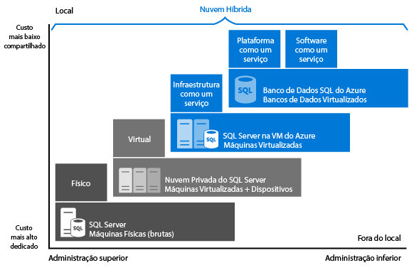

# Escolher uma opção do SQL Server de nuvem: Banco de Dados do SQL Azure (PaaS) ou SQL Server em VMs do Azure (IaaS)
O Azure tem duas opções para hospedar cargas de trabalho do SQL Server no Microsoft Azure:

* [Banco de Dados SQL do Azure](https://azure.microsoft.com/services/sql-database/): um banco de dados SQL nativo para a nuvem, também conhecido como um banco de dados de PaaS (plataforma como serviço) ou um DBaaS (banco de dados como serviço), que é otimizado para desenvolvimento de aplicativos de SaaS (software como serviço). Ele oferece compatibilidade com a maioria dos recursos do SQL Server. Para obter mais informações sobre o PaaS, consulte [O que é PaaS](https://azure.microsoft.com/overview/what-is-paas/).
* [SQL Server em Máquinas Virtuais do Azure](https://azure.microsoft.com/services/virtual-machines/sql-server/): SQL Server instalado e hospedado na nuvem em VMs (Máquinas Virtuais) do Windows Server em execução no Azure, também conhecido como IaaS (infraestrutura como serviço).
  O SQL Server nas máquinas virtuais do Azure é otimizado para migrar os aplicativos existentes do SQL Server. Todas as versões e edições do SQL Server estão disponíveis. Ele oferece 100% de compatibilidade com o SQL Server, permitindo que você hospede quantos bancos de dados forem necessários e execute transações entre os bancos de dados. Ele oferece total controle sobre o SQL Server e o Windows.

Saiba como cada opção se ajusta à plataforma de dados da Microsoft e obtenha ajuda para encontrar a opção certa para suas necessidades de negócios. Se você priorizar economia ou administração mínima à frente de tudo, este artigo pode ajudá-lo a decidir qual abordagem cumpre os requisitos de negócios com os quais você se preocupa mais.

## Plataforma de dados da Microsoft
Uma das primeiras coisas a compreender em qualquer discussão do Azure versus bancos de dados local do SQL Server é que você pode usá-lo. A Plataforma de Dados da Microsoft aproveita a tecnologia do SQL Server e o torna disponível em computadores locais físicos, ambientes de nuvem privada, ambientes de nuvem privada hospedados por terceiros e nuvem pública. O SQL Server nas máquinas virtuais do Azure permite atender a necessidades comerciais exclusivas e diversificadas por meio de uma combinação de implantações locais e hospedadas na nuvem, usando o mesmo conjunto de produtos de servidor, ferramentas de desenvolvimento e experiência nesses ambientes.

   

Como visto no diagrama, cada oferta pode ser caracterizada por nível de administração que você tem sobre a infraestrutura (no eixo X) e pelo grau de economia obtida com a consolidação de nível de banco de dados e automação (no eixo Y).

Ao criar um aplicativo, quatro opções básicas estão disponíveis para hospedar a parte do SQL Server do aplicativo:

* SQL Server em computadores físicos não virtualizados
* SQL Server em computadores virtualizados locais (nuvem privada)
* SQL Server na Máquina Virtual do Azure (nuvem pública da Microsoft)
* Banco de Dados SQL do Azure (nuvem pública da Microsoft)

Nas seções a seguir, você aprenderá sobre o SQL Server na nuvem pública da Microsoft: Banco de Dados SQL do Azure e SQL Server nas VMs do Azure. Além disso, irá explorar os motivadores comerciais comuns para determinar qual opção funciona melhor para seu aplicativo.

## Uma análise mais aprofundada do Banco de Dados SQL do Azure e do SQL Server em VMs do Azure
O **Banco de Dados SQL do Azure** é um DBaaS (banco de dados como serviço) relacional hospedado na nuvem do Azure que se encaixa nas categorias do setor de *SaaS (Software como Serviço)* e *PaaS (Plataforma como Serviço)*. [banco de dados SQL](sql-database-technical-overview.md) baseia-se no hardware e software padronizados da Microsoft, hospedados e mantidos por ela. Com o Banco de Dados SQL, você pode desenvolver diretamente no serviço usando a funcionalidade e recursos internos. Quando você usa o Banco de Dados SQL, ele é pré-pago, com opções para escalar verticalmente ou horizontalmente, de modo a ter maior capacidade, sem interrupção.

**O SQL Server em VMs (Máquinas Virtuais) do Azure** se enquadra na categoria do setor *IaaS (Infraestrutura como Serviço)* e permite executar o SQL Server em uma máquina virtual na nuvem. De forma semelhante ao Banco de Dados SQL, ele se baseia em hardware padronizado que é de propriedade da Microsoft e é hospedado e mantido por ela. Ao usar o SQL Server em uma VM, você pode pagar previamente por uma licença do SQL Server já incluída em uma imagem do SQL Server ou usar facilmente uma licença existente. Você pode aumentar/reduzir facilmente e pausar/retomar a VM quando necessário.

Em geral, essas duas opções de SQL são otimizadas para finalidades diferentes:

* **O Banco de Dados SQL do Azure** foi otimizado para reduzir os custos gerais ao mínimo no provisionamento e gerenciamentos de muitos bancos de dados. Ele reduz os custos de administração contínua porque você não precisa gerenciar máquinas virtuais, um sistema operacional nem um software de banco de dados. Você não precisa gerenciar as atualizações, a alta disponibilidade ou os [backups](sql-database-automated-backups.md). Em geral, o Banco de Dados SQL do Azure pode aumentar drasticamente o número de bancos de dados gerenciados por um único recurso de TI ou desenvolvimento.
* **SQL Server em execução nas VMs do Azure** é otimizado para migrar os aplicativos existentes para o Azure ou estender os aplicativos locais existentes para a nuvem em implantações híbridas. Além disso, você pode usar o SQL Server em uma máquina virtual para desenvolver e testar os aplicativos tradicionais do SQL Server. Com o SQL Server em VMs do Azure, você tem os direitos administrativos completos sobre uma instância dedicada do SQL Server e uma VM baseada em nuvem. É uma opção perfeita quando uma organização já tem recursos de TI disponíveis para manter as máquinas virtuais. Esses recursos permitem que você crie um sistema altamente personalizado para endereçar os requisitos específicos de desempenho e disponibilidade de seu aplicativo.

A seguinte tabela resume as principais características do Banco de Dados SQL e do SQL Server em VMs do Azure:

| **Mais adequado para:** | **Banco de Dados SQL do Azure** | **SQL Server em uma Máquina Virtual do Azure** |
| --- | --- | --- |
|  |Novos aplicativos baseados em nuvem que têm restrições de tempo no desenvolvimento e marketing. |Aplicativos existentes que requerem migração rápida para a nuvem com alterações mínimas. Cenários de rápido desenvolvimento e teste quando você não deseja comprar hardware do SQL Server local de não produção. |
|  | Equipes que precisam da atualização, recuperação de desastres e alta disponibilidade interna para o banco de dados. |Equipes que podem configurar e gerenciar a alta disponibilidade, recuperação de desastres e aplicação de patch para o SQL Server. Alguns recursos automatizados fornecidos simplificam muito isso. | |
|  | Equipes que não desejam gerenciar o sistema operacional subjacente e definições de configuração. |Você precisa de um ambiente personalizado com direitos administrativos completos. | |
|  | Bancos de dados de até 4 TB ou maiores que podem ser [particionados horizontal ou verticalmente](sql-database-elastic-scale-introduction.md#horizontal-and-vertical-scaling) usando um padrão expansão horizontal. |Instâncias do SQL Server com até 64 TB de armazenamento. A instância pode suportar quantos bancos de dados forem necessários. | |
|  | [Compilar aplicativos SaaS (Software como Serviço)](sql-database-design-patterns-multi-tenancy-saas-applications.md). |Migrar e compilar aplicativos híbridos e corporativos. | |
|  | | |
| **Recursos:** |Você não deseja empregar recursos de TI para a configuração e o gerenciamento da infraestrutura subjacente, mas deseja se concentrar na camada do aplicativo. |Você tem alguns recursos de TI para a configuração e o gerenciamento. Alguns recursos automatizados fornecidos simplificam muito isso. |
| **Custo total de propriedade:** |Elimina os custos de hardware e reduz os custos administrativos. |Elimina os custos de hardware. |
| **Continuidade dos negócios:** |Além dos recursos internos da infraestrutura de tolerância a falhas, o Banco de Dados SQL do Azure fornece recursos como [backups automatizados](sql-database-automated-backups.md), [Restauração pontual](sql-database-recovery-using-backups.md#point-in-time-restore), [restauração geográfica](sql-database-recovery-using-backups.md#geo-restore) e [replicação geográfica ativa](sql-database-geo-replication-overview.md) para aumentar a continuidade dos negócios. Para saber mais, confira a [Visão geral da continuidade de negócios do Banco de Dados SQL](sql-database-business-continuity.md). |O SQL Server nas VMs do Azure permite que você configure uma solução de alta disponibilidade e recuperação de desastres para as necessidades específicas de seu banco de dados. Portanto, você pode ter um sistema altamente otimizado para seu aplicativo. Você pode testar e executar failovers por conta própria, quando necessário. Para saber mais, consulte [Alta disponibilidade e recuperação de desastre para o SQL Server em máquinas virtuais do Azure](../virtual-machines/windows/sql/virtual-machines-windows-sql-high-availability-dr.md). |
| **Nuvem híbrida:** |Seu aplicativo local pode acessar dados no Banco de Dados SQL do Azure. |Com o SQL Server em VMs do Azure você pode ter aplicativos que são executados parcialmente na nuvem e parcialmente no local. Por exemplo, você pode estender sua rede local e o Domínio do Active Directory para a nuvem por meio da [Rede Virtual do Azure](../virtual-network/virtual-networks-overview.md). Além disso, você pode armazenar arquivos de dados locais no Armazenamento do Azure usando os [Arquivos de Dados do SQL Server no Azure](http://msdn.microsoft.com/library/dn385720.aspx). Para saber mais, confira [Introdução à nuvem híbrida do SQL Server 2014](http://msdn.microsoft.com/library/dn606154.aspx). |
|  | Oferece suporte à [replicação transacional do SQL Server](https://msdn.microsoft.com/library/mt589530.aspx) como um assinante para replicar os dados. |Dá suporte total para a [replicação transacional do SQL Server](https://msdn.microsoft.com/library/mt589530.aspx), [Grupos de Disponibilidade do AlwaysOn](../virtual-machines/windows/sql/virtual-machines-windows-sql-high-availability-dr.md), Serviços de Integração e Envio de Logs para replicar os dados. Além disso, os backups tradicionais do SQL Server são totalmente suportados | |
|  | | |

## Motivações de negócios para escolher o Banco de Dados SQL do Azure ou o SQL Server em VMs do Azure
### Custo
Seja você uma startup sem recursos financeiros ou uma equipe em uma empresa estabelecida que opera com restrições de orçamento apertado, financiamento limitado costuma ser o principal motivador ao decidir como hospedar os bancos de dados. Nesta seção, você aprenderá sobre as noções básicas de cobrança e licenciamento no Azure com relação a estas duas opções de banco de dados relacional: Banco de Dados SQL e SQL Server nas VMs do Azure. Você também aprenderá sobre como calcular o custo total do aplicativo.

#### Noções básicas de licenciamento e cobrança
**SQL Database** é vendido a clientes como um serviço, não com uma licença.  [SQL Server nas VMs do Azure](../virtual-machines/windows/sql/virtual-machines-windows-sql-server-iaas-overview.md) é vendido com uma licença incluída que você paga por minuto. Se você tiver uma licença existente, também poderá usá-la.  

Atualmente, o **Banco de Dados SQL** está disponível em várias camadas de serviço, todas as quais são cobradas por hora a uma taxa fixa com base na camada de serviço e no nível de desempenho que você escolher. Além disso, você será cobrado pelo tráfego de Internet de saída a [taxas de transferência de dados](https://azure.microsoft.com/pricing/details/data-transfers/)regulares. As camadas de serviço Básico, Standard, Premium e Premium RS são projetadas para oferecer um desempenho previsível com vários níveis de desempenho para atender às necessidades de pico do seu aplicativo. Você pode alterar entre as camadas de serviço e os níveis de desempenho para atender às necessidades de produtividade variadas do seu aplicativo. Se o banco de dados tem alto volume transacional e precisa oferecer suporte a muitos usuários simultaneamente, recomendamos a camada de serviço Premium. Para obter as últimas informações sobre as camadas de serviço atuais com suporte, consulte [Camadas de Serviço do Banco de Dados SQL do Azure](sql-database-service-tiers.md). Você também pode criar [pools elásticos](sql-database-elastic-pool.md) para compartilhar recursos de desemprenho entre instâncias de banco de dados.

Com o **Banco de Dados SQL**, o software de banco de dados é automaticamente configurado, corrigido e atualizado pela Microsoft, o que reduz os custos de administração. Além disso, seus recursos de [backup interno](sql-database-automated-backups.md) o ajudam a obter economia significativa, principalmente quando você tem um grande número de bancos de dados.

Com o **SQL Server nas VMs do Azure**, você pode usar qualquer imagem do SQL Server fornecida pela plataforma (que inclui uma licença) ou utilizar sua licença do SQL Server. Todas as versões com suporte do SQL Server (2008R2, 2012, 2014, 2016) e as edições (Developer, Express, Web, Standard e Enterprise) estão disponíveis. Além disso, as versões BYOL (Traga sua Própria Licença) das imagens estão disponíveis. Ao usar as imagens fornecidas pelo Azure, os custos operacionais dependem do tamanho da VM e da edição do SQL Server escolhida. Independentemente do tamanho da VM ou da edição do SQL Server, você paga o custo de licenciamento por minuto do SQL Server e do Windows Server, juntamente com o custo de Armazenamento do Azure para os discos de VM. A opção de cobrança por minuto permite que você use o SQL Server pelo tempo necessário, sem adquirir licenças adicionais do SQL Server. Se utilizar sua própria licença do SQL Server no Azure, você será cobrado apenas pelos custos de armazenamento e pelo Windows Server. Para obter mais informações sobre como utilizar seu próprio licenciamento, consulte [Mobilidade de Licenças por meio do Software Assurance no Azure](https://azure.microsoft.com/pricing/license-mobility/).

#### Calculando o custo total do aplicativo
Quando você começar a usar uma plataforma de nuvem, o custo de execução do seu aplicativo incluirá os custos de desenvolvimento e administração, mais os custos de serviço da plataforma de nuvem pública.

Veja o cálculo detalhado de custos para o aplicativo em execução no Banco de Dados SQL e no SQL Server em VMs do Azure:

**Ao usar o Banco de Dados SQL do Azure:**

*Custo total do aplicativo = custos administrativos altamente minimizados + custos de desenvolvimento de software + custos de serviço do Banco de Dados SQL*

**Ao usar o SQL Server em VMs do Azure:**

*Custo total do aplicativo = Custos altamente minimizados de desenvolvimento do software + custos de administração + custos de licenciamento do SQL Server e do Windows Server + custos do Armazenamento do Azure*

Para obter mais informações sobre preços, consulte os recursos a seguir:

* [Preços do Banco de Dados SQL](https://azure.microsoft.com/pricing/details/sql-database/)
* [Preços de Máquinas Virtuais](https://azure.microsoft.com/pricing/details/virtual-machines/) para [SQL](https://azure.microsoft.com/pricing/details/virtual-machines/#sql) e [Windows](https://azure.microsoft.com/pricing/details/virtual-machines/#windows)
* [Calculadora de preços do Azure](https://azure.microsoft.com/pricing/calculator/)

> [!NOTE]
> Há um pequeno subconjunto de recursos no SQL Server que não são aplicáveis ou não estão disponíveis com o Banco de Dados SQL. Consulte [Recursos do Banco de Dados SQL](sql-database-features.md) e [Informações de Transact-SQL do Banco de Dados SQL](sql-database-transact-sql-information.md) para obter mais informações. Se você estiver mudando uma solução existente do SQL Server para a nuvem, consulte [Migrar um banco de dados do SQL Server para o Banco de Dados SQL do Azure](sql-database-cloud-migrate.md). Ao migrar um aplicativo local existente do SQL Server para o Banco de Dados SQL, considere a atualização do aplicativo para aproveitar os recursos oferecidos pelos serviços de nuvem. Por exemplo, considere o uso do [Serviço de Aplicativo Web do Azure](https://azure.microsoft.com/services/app-service/web/) ou dos [Serviços de Nuvem do Azure](https://azure.microsoft.com/services/cloud-services/) para hospedar a camada de aplicativos de modo a aumentar os benefícios de custo.
> 
> 

### Administração
Para muitas empresas, a decisão de fazer a transição para um serviço de nuvem se refere à redução da complexidade de administração, além de seu custo. Com o **Banco de Dados SQL**, a Microsoft administra o hardware subjacente. A Microsoft replica automaticamente todos os dados para fornecer uma alta disponibilidade, configura e atualiza o software do banco de dados, gerencia o balanceamento de carga e faz um failover transparente caso haja uma falha do servidor. Você pode continuar a administrar o banco de dados, mas não precisa mais gerenciar o mecanismo do banco de dados, o sistema operacional do servidor nem o hardware.  Alguns exemplos de itens que você pode continuar a administrar são bancos de dados e logons, ajuste de índice e consulta e auditoria e segurança.

Com o **SQL Server nas VMs do Azure**, você tem controle total sobre o sistema operacional e a configuração da instância do SQL Server. Em uma VM, cabe a você decidir quando atualizar o sistema operacional e o software do banco de dados, e quando instalar qualquer software adicional, como um antivírus. Alguns recursos automatizados são fornecidos para simplificar muito a aplicação de patches, backup e alta disponibilidade. Além disso, você pode controlar o tamanho da VM, o número de discos e as configurações de armazenamento desses discos. O Azure permite mudar o tamanho de uma VM quando necessário. Para obter informações, consulte [Tamanhos de Máquinas Virtuais e Serviço de Nuvem do Azure](../virtual-machines/windows/sizes.md). 

### Contrato de nível de serviço (SLA)
Para vários departamentos de TI, atender às obrigações de tempo de atividade de um SLA (Contrato de Nível de Serviço) é uma grande prioridade. Nesta seção, vamos examinar qual SLA se aplica a cada opção de hospedagem de banco de dados.

Para as camadas de serviço Básico, Standard, Premium e Premium RS do **Banco de Dados SQL**, a Microsoft fornece um SLA com 99,99% de disponibilidade. Para obter as últimas informações, consulte [Contrato de Nível de Serviço](https://azure.microsoft.com/support/legal/sla/sql-database/). Para obter as últimas informações sobre as camadas de serviço do Banco de Dados SQL e os planos de continuidade de negócios com suporte, consulte [Camadas de Serviço](sql-database-service-tiers.md).

Para o **SQL Server em execução em VMs do Azure**, a Microsoft fornece um SLA de disponibilidade de 99,95% que abrange apenas a Máquina Virtual. Esse SLA não abrange os processos (como o SQL Server) em execução na VM e exige que você hospede pelo menos duas instâncias de VM em um conjunto de disponibilidade. Para obter as últimas informações, consulte o [SLA de VM](https://azure.microsoft.com/support/legal/sla/virtual-machines/). Para HA (alta disponibilidade) de banco de dados em VMs, você deve configurar uma das opções de alta disponibilidade com suporte no SQL Server, como [Grupos de Disponibilidade AlwaysOn](http://blogs.technet.com/b/dataplatforminsider/archive/2014/08/25/sql-server-alwayson-offering-in-microsoft-azure-portal-gallery.aspx). Usar uma opção de alta disponibilidade com suporte não fornece um SLA adicional, mas permite que você atinja > 99,99% de disponibilidade do banco de dados.

### Tempo para colocação no mercado
**SQL Database** é a solução ideal para aplicativos baseados em nuvem quando a produtividade do desenvolvedor e o tempo rápido de colocação no mercado são essenciais. Com a funcionalidade de programação como DBA, ele é perfeito para desenvolvedores e arquitetos de nuvem, pois reduz a necessidade de gerenciamento do sistema operacional e do banco de dados subjacentes. Por exemplo, você pode usar a [API REST](http://msdn.microsoft.com/library/azure/dn505719.aspx) e os [Cmdlets do PowerShell](http://msdn.microsoft.com/library/mt740629.aspx) para automatizar e gerenciar operações administrativas para milhares de bancos de dados. Recursos como [pools elásticos](sql-database-elastic-pool.md) permitem que você se concentre na camada de aplicativo e coloque a solução no mercado mais rapidamente.

**SQL Server em execução nas VMs do Azure** será perfeito se os aplicativos novos ou existentes exigirem grandes bancos de dados, bancos de dados inter-relacionados ou acesso a todos os recursos no SQL Server ou no Windows. Também é uma boa opção quando você deseja migrar bancos de dados e aplicativos locais existentes no Azure da maneira como estão. Já que você não precisa alterar a apresentação, o aplicativo e as camadas de dados, você economiza tempo e orçamento em rearquitetura da solução existente. Em vez disso, você pode se concentrar em migrar todas as soluções para o Azure e fazer algumas otimizações de desempenho que possam ser necessárias para a plataforma Microsoft Azure. Para obter mais informações, veja [Práticas Recomendadas de Desempenho para o SQL Server em Máquinas Virtuais do Azure](../virtual-machines/windows/sql/virtual-machines-windows-sql-performance.md).

## Resumo
Este artigo explorou o Banco de Dados SQL e o SQL Server em VMs (Máquinas Virtuais) do Azure e discutiu motivadores comerciais comuns que podem afetar sua decisão. Este é um resumo de sugestões a serem consideradas:

Escolha o **Banco de Dados SQL do Azure** se:

* Você está compilando novos aplicativos baseados em nuvem para aproveitar a economia de custos e a otimização do desempenho que os serviços de nuvem fornecem. Essa abordagem oferece os benefícios de um serviço de nuvem totalmente gerenciado, ajuda a diminuir o tempo de colocação no mercado e pode fornecer otimização de custos a longo prazo.
* Você deseja que a Microsoft execute operações de gerenciamento comuns em seus bancos de dados e exija SLAs de maior disponibilidade para bancos de dados.

Escolha **SQL Server em VMs do Azure** se:

* Você tem aplicativos locais existentes que deseja migrar ou estender para a nuvem ou se deseja compilar aplicativos empresariais maiores que 4 TB. Essa abordagem oferece o benefício de 100% compatibilidade do SQL, grande capacidade do banco de dados, controle total sobre o SQL Server e Windows, e um túnel seguro para o local. A abordagem reduz os custos de desenvolvimento e modificações dos aplicativos existentes.
* Você tem recursos de TI existentes e pode ter basicamente patches, backups e alta disponibilidade do banco de dados. Observe que alguns recursos automatizados simplificam muito essas operações. 

## Próximas etapas
* Consulte [Seu primeiro Banco de Dados SQL do Azure](sql-database-get-started-portal.md) para uma introdução ao Banco de Dados SQL.
* Confira [Preços do Banco de Dados SQL](https://azure.microsoft.com/pricing/details/sql-database/).
* Confira [Provisionar uma máquina virtual do SQL Server no Azure](../virtual-machines/windows/sql/virtual-machines-windows-portal-sql-server-provision.md) para obter uma introdução ao SQL Server em VMs do Azure.

