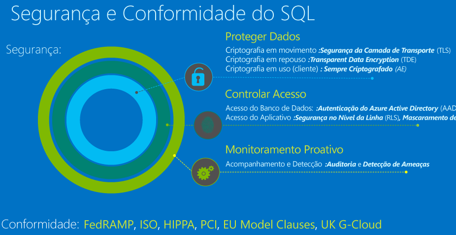

# Protegendo o Banco de Dados SQL

Este artigo apresenta os conceitos básicos da proteção da camada de dados de um aplicativo usando o Banco de Dados SQL do Azure. Em particular, este artigo mostrará uma introdução aos recursos de proteção de dados, de controle de acesso e de monitoramento proativo. O diagrama a seguir ilustra as camadas de segurança fornecidas pelo Banco de Dados SQL.

Para obter uma visão geral completa dos recursos de segurança disponíveis em todas as versões do SQL, confira a [Central de Segurança do mecanismo de banco de dados do SQL Server e Banco de Dados SQL do Azure](https://msdn.microsoft.com/library/bb510589). Outras informações também estão disponíveis no [White paper técnico sobre segurança e o Banco de Dados SQL do Azure](https://download.microsoft.com/download/A/C/3/AC305059-2B3F-4B08-9952-34CDCA8115A9/Security_and_Azure_SQL_Database_White_paper.pdf) (PDF).

## Proteger dados
O Banco de Dados SQL protege dados, fornecendo criptografia de dados em movimento usando o [protocolo TLS](https://support.microsoft.com/en-us/kb/3135244), para dados em repouso usando [Transparent Data Encryption](http://go.microsoft.com/fwlink/?LinkId=526242) e para dados em uso usando [Always Encrypted](https://msdn.microsoft.com/library/mt163865.aspx). Para uma discussão sobre o uso desses recursos de proteção de dados no Banco de Dados SQL, veja [Segurança e proteção de dados](sql-database-protect-data.md).

> [!IMPORTANT]
>Todas as conexões do Banco de Dados SQL do Azure exigem criptografia (SSL/TLS) todo o tempo que os dados estiverem "em trânsito", entrando e saindo do banco de dados. Na cadeia de conexão do seu aplicativo, você deve especificar os parâmetros para criptografar a conexão, e *não* para confiar no certificado do servidor (esse processo será automático se você copiar a cadeia de conexão fora do Portal Clássico do Azure); caso contrário, a conexão não verificará a identidade do servidor e estará sujeita a ataques "man-in-the-middle". Para o driver do ADO.NET, por exemplo, esses parâmetros da cadeia de conexão são **Encrypt=True** e **TrustServerCertificate=False**. 

Para outras maneiras de criptografar seus dados, considere:

* [Criptografia no nível de célula](https://msdn.microsoft.com/library/ms179331.aspx) para criptografar colunas específicas ou até mesmo células de dados com diferentes chaves de criptografia.
* Se você precisar de um Módulo de Segurança de Hardware ou do gerenciamento central de sua hierarquia de chaves de criptografia, considere o uso do [cofre da chave do Azure com o SQL Server em uma VM do Azure](http://blogs.technet.com/b/kv/archive/2015/01/12/using-the-key-vault-for-sql-server-encryption.aspx).

## Controlar o acesso
O Banco de Dados SQL protege seus dados limitando o acesso ao banco de dados usando regras de firewall, mecanismos de autenticação que exigem que os usuários comprovem sua identidade e autorização para dados por meio de permissões e associações de função, bem como por meio de segurança em nível de linha e mascaramento de dados dinâmicos. Para uma discussão sobre o uso de recursos de controle de acesso no Banco de Dados SQL, veja [Controlar o acesso](sql-database-control-access.md).

> [!IMPORTANT]
> O gerenciamento de bancos de dados e de servidores lógicos no Azure é controlado por atribuições de função da sua conta de usuário do portal. Para saber mais sobre esse tópico, confira [Controle de acesso baseado em função no portal do Azure](../active-directory/role-based-access-control-configure.md).
>

### Firewall e regras de firewall
Para ajudar a proteger seus dados, os firewalls impedem todo acesso ao seu servidor de banco de dados até que você especifique quais computadores têm permissão usando [regras de firewall](sql-database-firewall-configure.md). O firewall concede acesso aos bancos de dados com base no endereço IP de origem de cada solicitação.

### Autenticação
A autenticação do banco de dados SQL refere-se a como você comprova sua identidade durante a conexão com o banco de dados. O Banco de Dados SQL dá suporte a dois tipos de autenticação:

* **Autenticação do SQL**, que usa um nome de usuário e senha. Quando você criou o servidor lógico do banco de dados, especificou um logon de "administrador de servidor" com um nome de usuário e uma senha. Usando essas credenciais, é possível se autenticar em qualquer banco de dados nesse servidor como o proprietário do banco de dados, ou "dbo". 
* **Autenticação do Azure Active Directory**, que usa identidades gerenciadas pelo Azure Active Directory e que tem suporte para domínios gerenciados e integrados. Use autenticação do Active Directory (segurança integrada) [sempre que possível](https://msdn.microsoft.com/library/ms144284.aspx). Se desejar usar a Autenticação do Active Directory do Azure, você deve criar outro administrador de servidor chamado “admin do AD do Azure”, que tenha permissão para administrar usuários e grupos do AD do Azure. Este administrador também pode executar todas as operações executadas por um administrador de servidor comum. Veja [Conectando-se ao Banco de Dados SQL usando a Autenticação do Active Directory do Azure](sql-database-aad-authentication.md) para ver um passo a passo de como criar um administrador do Azure AD para habilitar a Autenticação do Active Directory do Azure.

### Autorização
A autorização refere-se ao que um usuário pode fazer em um Banco de Dados SQL do Azure, e isso é controlado pelas associações à função de banco de dados e pelas permissões no nível do objeto da sua conta de usuário. Como uma prática recomendada, você deve conceder aos usuários os privilégios mínimos necessários. A conta de administrador do servidor com a qual você está se conectando é um membro de db_owner, que tem autoridade para realizar qualquer tarefa no banco de dados. Salve essa conta para implantar atualizações de esquema e outras operações de gerenciamento. Use a conta "ApplicationUser" com permissões mais limitadas para se conectar do aplicativo ao banco de dados com os privilégios mínimos necessários para seu aplicativo.

### Segurança em nível de linha
A Segurança em Nível de Linha permite aos clientes controlar o acesso às linhas em uma tabela de banco de dados com base nas características do usuário que executa uma consulta (por exemplo, uma associação de grupo ou um contexto de execução). Para saber mais, confira [Segurança em nível de linha](https://msdn.microsoft.com/library/dn765131).

### Mascaramento de dados 
A Máscara de dados dinâmica no banco de dados SQL limita a exposição de dados confidenciais através do mascaramento dos dados para usuários sem privilégios. O Mascaramento de Dados Dinâmicos detecta de forma automática os dados potencialmente confidenciais no Banco de Dados SQL e fornece recomendações viáveis para mascarar esses campos, com impacto mínimo sobre a camada de aplicativo. Funciona ao ocultar os dados confidenciais no conjunto de resultados de uma consulta em relação aos campos do banco de dados designado, enquanto os dados no banco de dados não são alterados. Para saber mais, veja [Introdução ao Mascaramento de Dados Dinâmicos do Banco de Dados SQL](sql-database-dynamic-data-masking-get-started.md) pode ser usado para limitar a exposição de dados confidenciais.

## Monitoramento proativo
O Banco de Dados SQL protege seus dados, fornecendo a auditoria e recursos de detecção de ameaças. 

### Auditoria
A Auditoria do Banco de Dados SQL rastreia as atividades de banco de dados e ajuda a manter a conformidade normativa, registrando eventos de banco de dados em um log de auditoria em sua conta de Armazenamento do Azure. A auditoria permite que você compreenda as atividades do banco de dados em andamento, bem como analisar e investigar a atividade de histórico para identificar possíveis ameaças ou suspeitas de violações de segurança e de abuso. Para saber mais, confira [Introdução à Auditoria do Banco de Dados SQL](sql-database-auditing-get-started.md).  

### Auditoria e detecção de ameaças 
A Auditoria do Banco de Dados SQL rastreia as atividades de banco de dados e ajuda a manter a conformidade normativa, registrando eventos de banco de dados em um log de auditoria em sua conta de Armazenamento do Azure. A auditoria permite que você compreenda as atividades do banco de dados em andamento, bem como analisar e investigar a atividade de histórico para identificar possíveis ameaças ou suspeitas de violações de segurança e de abuso. Para saber mais, confira [Introdução à Auditoria do Banco de Dados SQL](sql-database-auditing-get-started.md).  
 
A Detecção de Ameaças complementa a auditoria, fornecendo uma camada adicional de inteligência de segurança criada para o serviço Banco de Dados SQL. Ela funciona ininterruptamente para aprender, perfilar e detectar atividades anormais de banco de dados. Você será alertado sobre atividades suspeitas, vulnerabilidades potenciais, ataques de injeção de SQL e padrões de acesso do banco de dados anormais. Você pode responder a alertas, seguindo as instruções informativas e acionáveis fornecidas. Para obter mais informações, confira [Introdução à Detecção de Ameaças do Banco de Dados SQL](sql-database-threat-detection-get-started.md).  
 
### Mascaramento de dados 
A Máscara de dados dinâmica no banco de dados SQL limita a exposição de dados confidenciais através do mascaramento dos dados para usuários sem privilégios. O Mascaramento de Dados Dinâmicos detecta de forma automática os dados potencialmente confidenciais no Banco de Dados SQL e fornece recomendações viáveis para mascarar esses campos, com impacto mínimo sobre a camada de aplicativo. Funciona ao ocultar os dados confidenciais no conjunto de resultados de uma consulta em relação aos campos do banco de dados designado, enquanto os dados no banco de dados não são alterados. Para saber mais, veja Introdução ao [mascaramento de dados dinâmicos do banco de dados SQL](sql-database-dynamic-data-masking-get-started.md)
 
## Conformidade
Além dos recursos e funcionalidades acima, que podem ajudar seu aplicativo a atender a vários requisitos de conformidade de segurança, o Banco de Dados SQL do Azure também participa de auditorias regulares e foi certificado em relação a vários padrões de conformidade. Para saber mais, confira a [Central de Confiabilidade do Microsoft Azure](https://azure.microsoft.com/support/trust-center/), onde é possível encontrar a lista mais atual de [certificações de conformidade do Banco de Dados SQL](https://azure.microsoft.com/support/trust-center/services/).

## Próximas etapas

- Para uma discussão sobre o uso de recursos de proteção de dados no Banco de Dados SQL, veja [Segurança e proteção de dados](sql-database-protect-data.md).
- Para uma discussão sobre o uso de recursos de controle de acesso no Banco de Dados SQL, veja [Controlar o acesso](sql-database-control-access.md).
- Para obter uma discussão sobre monitoramento proativo, veja [Introdução à Auditoria do Banco de Dados SQL](sql-database-auditing-get-started.md) e [Introdução à Detecção de Ameaças do Banco de Dados SQL](sql-database-threat-detection-get-started.md).

<!--HONumber=Jan17_HO2-->

