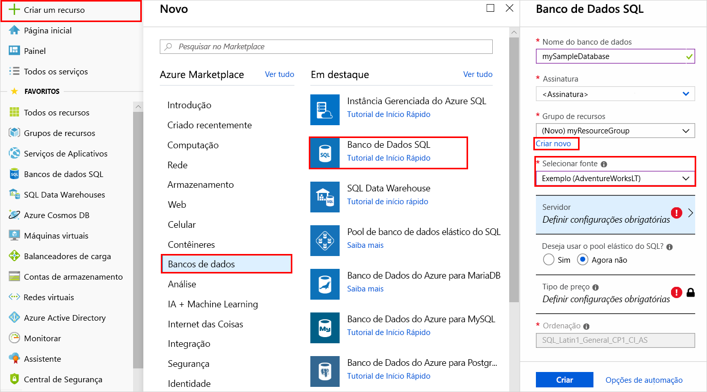
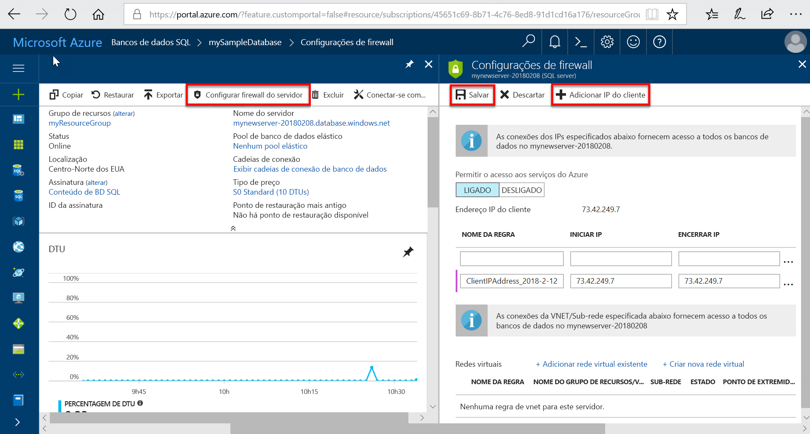

# Criar e gerenciar servidores e bancos de dados do Banco de Dados SQL

Um banco de dados SQL do Azure é um banco de dados gerenciado no Microsoft Azure criado em um [grupo de recursos do Azure](../azure-resource-manager/resource-group-overview.md) com um conjunto definido de [recursos de computação e armazenamento para cargas de trabalho diferentes](sql-database-service-tiers.md). Um banco de dados SQL do Azure está associado a um servidor lógico de Banco de Dados SQL, que é criado dentro de uma região do Azure específica. 

## Um banco de dados SQL do Azure pode ser um banco de dados único, em pool ou particionado

Um banco de dados SQL do Azure pode ser:

- Um [banco de dados individual](sql-database-single-database-resources.md) com seu próprio conjunto de recursos
- Parte de um [pool elástico](sql-database-elastic-pool.md) que compartilha um conjunto de recursos
- Parte de um [conjunto expandido de bancos de dados fragmentados](sql-database-elastic-scale-introduction.md#horizontal-and-vertical-scaling), que pode ser individual ou bancos de dados em pool
- Parte de um conjunto de bancos de dados que participa de um [padrão de design de SaaS multilocatário](sql-database-design-patterns-multi-tenancy-saas-applications.md), e cujos bancos de dados podem ser individuais ou bancos de dados em pool (ou ambos) 

> [!TIP]
> Para ver os nomes do banco de dados válidos, consulte [Identificadores do Banco de Dados](https://docs.microsoft.com/sql/relational-databases/databases/database-identifiers). 
>
 
- O agrupamento de banco de dados padrão usado pelo Banco de Dados SQL do Microsoft Azure é **SQL_LATIN1_GENERAL_CP1_CI_AS**, em que **LATIN1_GENERAL** é inglês (Estados Unidos), **CP1** é a página de código 1252, **CI** diferencia maiúsculas de minúsculas e **AS** diferencia acentos. Para obter mais informações sobre como definir o agrupamento, veja [COLLATE (Transact-SQL)](https://msdn.microsoft.com/library/ms184391.aspx).
- O Banco de Dados SQL do Microsoft Azure dá suporte ao cliente com protocolo TDS versão 7.3 ou posterior.
- São permitidas apenas conexões TCP/IP.

## O que é um servidor lógico do SQL Azure?

Um servidor lógico atua como um ponto administrativo central para vários bancos de dados, incluindo [pools elásticos](sql-database-elastic-pool.md) [logons](sql-database-manage-logins.md), [regras de firewall](sql-database-firewall-configure.md), [regras de auditoria](sql-database-auditing.md), [políticas de detecção de ameaças](sql-database-threat-detection.md) e [grupos de failover](sql-database-geo-replication-overview.md). Um servidor lógico pode estar em uma região diferente da de seu grupo de recursos. O servidor lógico deve existir antes de você poder criar o banco de dados SQL do Azure. Todos os bancos de dados em um servidor são criados na mesma região do servidor lógico. 

> [!IMPORTANT]
> No Banco de Dados SQL, um servidor é um constructo lógico diferente de uma instância do SQL Server com a qual você talvez esteja familiarizado no mundo local. Especificamente, o serviço do Banco de Dados SQL não faz garantias da localização dos bancos de dados em relação a seus servidores lógicos e não expõe nenhum acesso ou recursos no nível da instância.
> 

Quando você cria um servidor lógico, fornece uma conta e senha de logon de servidor que tem direitos administrativos para o banco de dados mestre nesse servidor e para todos os bancos de dados criados no servidor. Essa conta inicial é uma conta de logon do SQL. O Banco de Dados SQL do Azure dá suporte à autenticação do SQL e à autenticação do Azure Active Directory. Para obter informações sobre logons e autenticação, confira [Gerenciando bancos de dados e logons no Banco de Dados SQL do Azure](sql-database-manage-logins.md). A Autenticação do Windows não é suportada. 

> [!TIP]
> Para ver os nomes de servidor e de grupo de recursos válidos, consulte [Regras e restrições de nomenclatura](https://docs.microsoft.com/azure/architecture/best-practices/naming-conventions).
>

Um servidor lógico do Banco de Dados do Azure:

- É criado em uma assinatura do Azure, mas pode ser movido com seus recursos independentes para outra assinatura
- É o recurso pai de bancos de dados, pools elásticos e data warehouses
- Fornece um namespace para bancos de dados, pools elásticos e data warehouses
- É um contêiner lógico com semântica de tempo de vida forte – exclua um servidor e ele exclui os bancos de dados independentes, pools elásticos e data warehouses
- Participa do [RBAC (controle de acesso baseado em função) do Azure](/active-directory/role-based-access-control-what-is): os bancos de dados, pools elásticos e data warehouses em um servidor herdam direitos de acesso do servidor
- É um elemento de ordem superior da identidade de bancos de dados, pools elásticos e data warehouses para finalidades de gerenciamento de recursos do Azure (consulte o esquema de URL para pools e bancos de dados)
- Coloca recursos em uma região
- Fornece um ponto de extremidade de conexão para acesso ao banco de dados (<serverName>.database.windows.net)
- Fornece acesso aos metadados sobre os recursos independentes por meio de DMVs, conectando-se ao banco de dados mestre 
- Fornece o escopo para políticas de gerenciamento que se aplicam a seus bancos de dados: logons, firewall, auditoria, detecção de ameaças, etc. 
- É restrito por uma cota na assinatura pai (seis servidores por assinatura por padrão; [consulte os Limites da assinatura aqui](../azure-subscription-service-limits.md))
- Fornece o escopo da cota de banco de dados e da cota de DTU para os recursos que ele contém (como 45.000 DTUs)
- É o escopo de controle de versão para as funcionalidades habilitadas em recursos contidos 
- Os logons de entidade de segurança no nível do servidor podem gerenciar todos os bancos de dados em um servidor
- Pode conter logons semelhantes aos das instâncias do SQL Server locais que têm permissão para acessar um ou mais bancos de dados no servidor, além de poder receber direitos administrativos limitados. Para obter mais informações, consulte [Logons](sql-database-manage-logins.md).

## Bancos de dados SQL do Azure protegidos pelo firewall do Banco de Dados SQL

Para ajudar a proteger seus dados, um [firewall do Banco de Dados SQL](sql-database-firewall-configure.md) impede todo o acesso ao seu servidor de banco de dados ou a um de seus bancos de dados de fora da sua conexão ao servidor diretamente pela conexão da assinatura do Azure. Para habilitar mais conectividade, você deverá [criar uma ou mais regras de firewall](sql-database-firewall-configure.md#creating-and-managing-firewall-rules). Para criar e gerenciar pools elásticos, consulte [Pools elásticos](sql-database-elastic-pool.md).

## Gerenciar servidores, bancos de dados e firewalls do SQL Azure usando o portal do Azure

Você pode criar um grupo de recursos do banco de dados SQL do Azure antecipadamente ou ao criar o próprio servidor. Há vários métodos para obter um novo formulário de servidor SQL, seja criando um novo servidor SQL ou como parte da criação de um novo banco de dados. 

### Criar um SQL server (servidor lógico) em branco

Para criar um servidor de Banco de Dados SQL (sem um banco de dados) usando o [portal do Azure](https://portal.azure.com), navegue até um formulário em branco de servidor (servidor lógico) SQL.  

### Criar um banco de dados SQL em branco ou de exemplo

Para criar um banco de dados SQL do Azure usando o [portal do Azure](https://portal.azure.com), navegue até um formulário em branco do Banco de Dados SQL e forneça as informações solicitadas. Você pode criar um grupo de recursos e um servidor lógico do banco de dados SQL do Azure antecipadamente ou ao criar o próprio banco de dados. Você pode criar um banco de dados em branco ou um banco de dados de exemplo com base no Adventure Works LT. 

  

> [!IMPORTANT]
> Para saber mais sobre como selecionar o tipo de preço do banco de dados, confira [Camadas de serviço](sql-database-service-tiers.md).
>

### Gerenciar um SQL Server existente

Para gerenciar um servidor existente, navegue até o servidor usando vários métodos, por exemplo, na página do banco de dados SQL específica, na página dos **servidores SQL**ou na página **Todos os recursos**. 

Para gerenciar um banco de dados existente, navegue até a página **bancos de dados SQL** e clique no banco de dados que você deseja gerenciar. A captura de tela a seguir mostra como começar a configurar um firewall de nível de servidor para um banco de dados na página **Visão geral** de um banco de dados. 

    

> [!IMPORTANT]
> Para configurar propriedades de desempenho de um banco de dados, confira [Camadas de serviço](sql-database-service-tiers.md).
>

> [!TIP]
> Para obter um tutorial de início rápido do portal do Azure, confira [Criar um banco de dados SQL do Azure no portal do Azure](sql-database-get-started-portal.md).
>

## Gerenciar servidores, bancos de dados e firewalls do SQL Azure usando o PowerShell do Azure

Para criar e gerenciar servidores, bancos de dados e firewalls do Azure SQL com o Azure PowerShell, use os cmdlets do PowerShell a seguir. Se você precisa instalar ou atualizar o PowerShell, confira [Instalar o módulo do Azure PowerShell](/powershell/azure/install-azurerm-ps). Para criar e gerenciar pools elásticos, consulte [Pools elásticos](sql-database-elastic-pool.md).

| Cmdlet | Descrição |
| --- | --- |
|[New-AzureRmSqlDatabase](/powershell/module/azurerm.sql/new-azurermsqldatabase)|Cria um banco de dados |
|[Get-AzureRmSqlDatabase](/powershell/module/azurerm.sql/get-azurermsqldatabase)|Obtém um ou mais bancos de dados|
|[Set-AzureRmSqlDatabase](/powershell/module/azurerm.sql/set-azurermsqldatabase)|Define propriedades para um banco de dados ou move um banco de dados existente para um pool, elástico|
|[Remove-AzureRmSqlDatabase](/powershell/module/azurerm.sql/remove-azurermsqldatabase)|Remove um banco de dados|
|[New-AzureRmResourceGroup](/powershell/module/azurerm.resources/new-azurermresourcegroup)|Cria um grupos de recursos]
|[New-AzureRmSqlServer](/powershell/module/azurerm.sql/new-azurermsqlserver)|Cria um servidor|
|[Get-AzureRmSqlServer](/powershell/module/azurerm.sql/get-azurermsqlserver)|Retorna informações sobre servidores|
|[Set-AzureRmSqlServer](https://docs.microsoft.com/powershell/module/azurerm.sql/set-azurermsqlserver)|Modifica as propriedades de um servidor|
|[Remove-AzureRmSqlServer](/powershell/module/azurerm.sql/remove-azurermsqlserver)|Remove um servidor|
|[New-AzureRmSqlServerFirewallRule](/powershell/module/azurerm.sql/new-azurermsqlserverfirewallrule)|Cria uma regra de firewall no nível de servidor |
|[Get-AzureRmSqlServerFirewallRule](/powershell/module/azurerm.sql/get-azurermsqlserverfirewallrule)|Obtém as regras de firewall para um servidor|
|[Set-AzureRmSqlServerFirewallRule](/powershell/module/azurerm.sql/set-azurermsqlserverfirewallrule)|Modifica uma regra de firewall em um servidor|
|[Remove-AzureRmSqlServerFirewallRule](/powershell/module/azurerm.sql/remove-azurermsqlserverfirewallrule)|Exclui uma regra de firewall de um servidor.|
| New-AzureRmSqlServerVirtualNetworkRule | Cria um [*regra de rede virtual*](sql-database-vnet-service-endpoint-rule-overview.md), com base em uma sub-rede que é um ponto de extremidade de serviço de rede virtual. |

> [!TIP]
> Para obter um tutorial de início rápido do PowerShell, confira [Criar um único banco de dados SQL do Azure usando o PowerShell](sql-database-get-started-portal.md). Para scripts de exemplo do PowerShell, consulte [Usar o PowerShell para criar um único Banco de Dados SQL do Azure e configurar uma regra de firewall](scripts/sql-database-create-and-configure-database-powershell.md) e [Monitorar e escalar de um único Banco de Dados SQL usando o PowerShell](scripts/sql-database-monitor-and-scale-database-powershell.md).
>

## Gerenciar servidores, bancos de dados e firewalls do SQL Azure usando a CLI do Azure

Para criar e gerenciar servidores, bancos de dados e firewalls do SQL Azure com a [CLI do Azure](/cli/azure/overview), use os comandos do [Banco de Dados SQL da CLI do Azure](/cli/azure/sql/db). Use o [Cloud Shell](/azure/cloud-shell/overview) para executar a CLI no seu navegador ou [instale-o](/cli/azure/install-azure-cli) no macOS, Linux ou Windows. Para criar e gerenciar pools elásticos, consulte [Pools elásticos](sql-database-elastic-pool.md).

| Cmdlet | Descrição |
| --- | --- |
|[az sql db create](/cli/azure/sql/db#az_sql_db_create) |Cria um banco de dados|
|[az sql db list](/cli/azure/sql/db#az_sql_db_list)|Lista todos os bancos de dados e data warehouses em um servidor, ou todos os bancos de dados em um pool elástico|
|[az sql db list-editions](/cli/azure/sql/db#az_sql_db_list_editions)|Lista os objetivos de serviço disponíveis e os limites de armazenamento|
|[az sql db list-usages](/cli/azure/sql/db#az_sql_db_list_usages)|Retorna os usos do banco de dados|
|[az sql db show](/cli/azure/sql/db#az_sql_db_show)|Obtém um banco de dados ou data warehouse|
|[az sql db update](/cli/azure/sql/db#az_sql_db_update)|Atualiza um banco de dados|
|[az sql db delete](/cli/azure/sql/db#az_sql_db_delete)|Remove um banco de dados|
|[az group create](/cli/azure/group#az_group_create)|Cria um grupos de recursos|
|[az sql server create](/cli/azure/sql/server#az_sql_server_create)|Cria um servidor|
|[az sql server list](/cli/azure/sql/server#az_sql_server_list)|Lista servidores|
|[az sql server list-usages](/cli/azure/sql/server#az_sql_server_list-usages)|Retorna os usos do servidor|
|[az sql server show](/cli/azure/sql/server#az_sql_server_show)|Obtém um servidor|
|[az sql server update](/cli/azure/sql/server#az_sql_server_update)|Atualiza um servidor|
|[az sql server delete](/cli/azure/sql/server#az_sql_server_delete)|Exclui um servidor|
|[az sql server firewall-rule create](/cli/azure/sql/server/firewall-rule#az_sql_server_firewall_rule_create)|Cria uma regra de firewall de servidor|
|[az sql server firewall-rule list](/cli/azure/sql/server/firewall-rule#az_sql_server_firewall_rule_list)|Lista as regras de firewall em um servidor|
|[az sql server firewall-rule show](/cli/azure/sql/server/firewall-rule#az_sql_server_firewall_rule_show)|Mostra os detalhes de uma regra de firewall|
|[az sql server firewall-rule update](/cli/azure/sql/server/firewall-rule##az_sql_server_firewall_rule_update)|Atualiza uma regra de firewall|
|[az sql server firewall-rule delete](/cli/azure/sql/server/firewall-rule#az_sql_server_firewall_rule_delete)|Exclui uma regra de firewall|

> [!TIP]
> Para obter um tutorial de início rápido da CLI do Azure, confira [Criar um único banco de dados SQL do Azure usando a CLI do Azure](sql-database-get-started-cli.md). Para ver scripts de exemplo da CLI do Azure, consulte [Usar a CLI para criar um único Banco de Dados SQL do Azure e configurar uma regra de firewall](scripts/sql-database-create-and-configure-database-cli.md) e [Usar a CLI para monitorar e escalar um único Banco de Dados SQL](scripts/sql-database-monitor-and-scale-database-cli.md).
>

## Gerenciar servidores, bancos de dados e firewalls do SQL Azure usando o Transact-SQL

Para criar e gerenciar servidores, bancos de dados e firewalls do Azure SQL com o Transact-SQL, use os comandos T-SQL a seguir. Você pode emitir esses comandos usando o Portal do Azure, o [SQL Server Management Studio](/sql/ssms/use-sql-server-management-studio), o [Visual Studio Code](https://code.visualstudio.com/docs) ou qualquer outro programa que pode se conectar a um servidor de Banco de Dados SQL e passar comandos Transact-SQL. Para gerenciar pools elásticos, consulte [Pools elásticos](sql-database-elastic-pool.md).

> [!IMPORTANT]
> Não é possível criar ou excluir um servidor usando o Transact-SQL.
>

| Command | Descrição |
| --- | --- |
|[CREATE DATABASE (Banco de Dados SQL do Azure)](/sql/t-sql/statements/create-database-azure-sql-database)|Cria um novo banco de dados. Você deve estar conectado ao banco de dados mestre para criar um novo banco de dados.|
| [ALTER DATABASE (Banco de Dados SQL do Azure)](/sql/t-sql/statements/alter-database-azure-sql-database) |Modifica um Banco de Dados SQL do Azure. |
|[ALTER DATABASE (SQL Data Warehouse do Microsoft Azure)](/sql/t-sql/statements/alter-database-azure-sql-data-warehouse)|Modifica um SQL Data Warehouse do Azure.|
|[DROP DATABASE (Transact-SQL)](/sql/t-sql/statements/drop-database-transact-sql)|Exclui um banco de dados.|
|[sys.database_service_objectives (Banco de Dados SQL do Azure)](/sql/relational-databases/system-catalog-views/sys-database-service-objectives-azure-sql-database)|Retorna a edição (nível de serviço), o objetivo do serviço (tipo de preço) e o nome do pool elástico, se houver um, para um Banco de Dados SQL do Azure ou um SQL Data Warehouse do Azure. Se estiver conectado ao banco de dados mestre em um servidor de Banco de Dados SQL do Azure, retornará informações sobre todos os bancos de dados. Para o SQL Data Warehouse do Azure, você deve estar conectado ao banco de dados mestre.|
|[sys.dm_db_resource_stats (Banco de Dados SQL do Azure)](/sql/relational-databases/system-dynamic-management-views/sys-dm-db-resource-stats-azure-sql-database)| Retorna o consumo de CPU, E/S e memória para um banco de dados do Banco de Dados SQL do Azure. Existe uma linha para cada 15 segundos, mesmo se não houver nenhuma atividade no banco de dados.|
|[sys.resource_stats (Banco de Dados SQL do Azure)](/sql/relational-databases/system-catalog-views/sys-resource-stats-azure-sql-database)|Retorna o uso de CPU e dados de armazenamento para um Banco de Dados SQL do Azure. Os dados são coletados e agregados em intervalos de cinco minutos.|
|[sys.database_connection_stats (Banco de Dados SQL do Azure)](/sql/relational-databases/system-catalog-views/sys-database-connection-stats-azure-sql-database)|Contém estatísticas para eventos de conectividade de banco de dados do Banco de Dados SQL, fornecendo uma visão geral da conexão de banco de dados e das falhas. |
|[sys.event_log (Banco de Dados SQL do Azure)](/sql/relational-databases/system-catalog-views/sys-event-log-azure-sql-database)|Retorna as conexões de banco de dados do Banco de Dados SQL do Azure com êxito, as falhas de conexão e os deadlocks. Você pode usar essas informações para acompanhar ou solucionar problemas da atividade de banco de dados com o Banco de Dados SQL.|
|[sp_set_firewall_rule (Banco de Dados SQL do Azure)](/sql/relational-databases/system-stored-procedures/sp-set-firewall-rule-azure-sql-database)|Cria ou atualiza as configurações de firewall no nível do servidor para o servidor do Banco de Dados SQL. Esse procedimento armazenado só está disponível no banco de dados mestre para o logon principal no nível de servidor. Uma regra de firewall de nível de servidor só pode ser criada usando Transact-SQL depois que a primeira regra de firewall no nível do servidor foi criada por um usuário com permissões no nível do Azure|
|[sys.firewall_rules (Banco de Dados SQL do Azure)](/sql/relational-databases/system-catalog-views/sys-firewall-rules-azure-sql-database)|Retorna informações sobre as configurações de firewall no nível do servidor associadas ao seu Banco de Dados SQL do Microsoft Azure.|
|[sp_delete_firewall_rule (Banco de Dados SQL do Azure)](/sql/relational-databases/system-stored-procedures/sp-delete-firewall-rule-azure-sql-database)|Remove as configurações de firewall no nível do servidor do servidor do Banco de Dados SQL. Esse procedimento armazenado só está disponível no banco de dados mestre para o logon principal no nível de servidor.|
|[sp_set_database_firewall_rule (Banco de Dados SQL do Azure)](/sql/relational-databases/system-stored-procedures/sp-set-database-firewall-rule-azure-sql-database)|Cria ou atualiza as regras de firewall no nível do banco de dados para o Banco de Dados SQL do Azure ou o SQL Data Warehouse. As regras de firewall do banco de dados podem ser configuradas para o banco de dados mestre e para bancos de dados de usuário no Banco de Dados SQL. As regras de firewall do banco de dados são úteis quando você usa usuários de banco de dados independentes. |
|[sys.database_firewall_rules (Banco de Dados SQL do Azure)](/sql/relational-databases/system-catalog-views/sys-database-firewall-rules-azure-sql-database)|Retorna informações sobre as configurações de firewall no nível do banco de dados associadas ao seu Banco de Dados SQL do Microsoft Azure. |
|[sp_delete_database_firewall_rule (Banco de Dados SQL do Azure)](/sql/relational-databases/system-stored-procedures/sp-delete-database-firewall-rule-azure-sql-database)|Remove a configuração de firewall no nível do banco de dados para o Banco de Dados SQL do Azure ou o SQL Data Warehouse. |

> [!TIP]
> Tutorial de início rápido usando o SQL Server Management Studio no Microsoft Windows, confira [Banco de Dados SQL do Azure: usar o SQL Server Management Studio para se conectar e consultar dados](sql-database-connect-query-ssms.md). Para obter um tutorial de início rápido usando o Visual Studio Code em Windows, Linux ou macOS, confira [Banco de Dados SQL do Azure: usar o Visual Studio Code para se conectar e consultar dados](sql-database-connect-query-vscode.md).

## Gerenciar servidores, bancos de dados e firewalls do SQL Azure usando a API REST

Para criar e gerenciar servidores, bancos de dados e firewalls SQL do Azure, use estas solicitações de API REST.

| Command | Descrição |
| --- | --- |
|[Servidores - Criar ou Atualizar](/rest/api/sql/servers/createorupdate)|Cria ou atualiza um novo servidor.|
|[Servidores - Excluir](/rest/api/sql/servers/delete)|Exclui um servidor SQL.|
|[Servidores - Obter](/rest/api/sql/servers/get)|Obtém um servidor.|
|[Servidores - Listar](/rest/api/sql/servers/list)|Retorna uma lista de servidores.|
|[Servidores - Listar por Grupo de Recursos](/rest/api/sql/servers/listbyresourcegroup)|Retorna uma lista de servidores em um grupo de recursos.|
|[Servidores - Atualizar](/rest/api/sql/servers/update)|Atualiza um servidor existente.|
|[Servidores - SQL](/rest/api/sql/servers%20-%20sql)|Determina se um recurso pode ser criado com o nome especificado.|
|[Banco de Dados – Criar ou Atualizar](/rest/api/sql/databases/createorupdate)|Cria um novo banco de dados ou atualiza um banco de dados existente.|
|[Bancos de Dados – Obter](/rest/api/sql/databases/get)|Obtém um banco de dados.|
|[Bancos de Dados – Obter por Pool Elástico](/rest/api/sql/databases/getbyelasticpool)|Obtém um banco de dados dentro de um pool elástico.|
|[Bancos de Dados – Obter por Pool Elástico Recomendado](/rest/api/sql/databases/getbyrecommendedelasticpool)|Obtém um banco de dados dentro de um pool elástico recomendado.|
|[Bancos de Dados – Listar por Pool Elástico](/rest/api/sql/databases/listbyelasticpool)|Retorna uma lista de bancos de dados em um pool elástico.|
|[Bancos de Dados – Listar por Pool Elástico Recomendado](/rest/api/sql/databases/listbyrecommendedelasticpool)|Retorna uma lista de bancos de dados dentro de um pool elástico recomendado.|
|[Bancos de Dados – Listar por Servidor](/rest/api/sql/databases/listbyserver)|Retorna uma lista de bancos de dados em um servidor.|
|[Bancos de Dados – Atualizar](/rest/api/sql/databases/update)|Atualiza um banco de dados existente.|
|[Regras de Firewall - Criar ou Atualizar](/rest/api/sql/firewallrules/createorupdate)|Cria ou atualiza uma regra de firewall.|
|[Regras de firewall - Excluir](/rest/api/sql/firewallrules/delete)|Exclui uma regra de firewall.|
|[Regras de firewall - Obter](/rest/api/sql/firewallrules/get)|Obtêm uma regra de firewall.|
|[Regras de firewall - Listar pelo Servidor](/rest/api/sql/firewallrules/listbyserver)|Retorna uma lista de regras de firewall.|

## Próximas etapas

- Para saber mais sobre como fazer pool de bancos de dados usando pools elásticos, confira [Pools elásticos](sql-database-elastic-pool.md).
- Para obter informações sobre o serviço do Banco de Dados SQL do Azure, consulte [O que é o Banco de Dados SQL?](sql-database-technical-overview.md).
- Para saber mais sobre como migrar um banco de dados do SQL Server para o Azure, confira [Migrar para o Banco de Dados SQL do Azure](sql-database-cloud-migrate.md).
- Para obter informações sobre os recursos com suporte, consulte [Recursos](sql-database-features.md).
