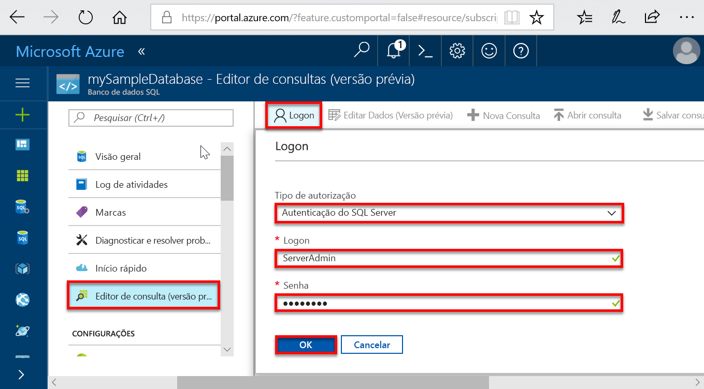

# <a name="quickstart-create-a-single-database-in-azure-sql-database-using-the-azure-portal"></a>Início Rápido: Criar um banco de dados individual no Banco de Dados SQL do Azure usando o portal do Azure

A criação de um [banco de dados individual](sql-database-single-database.md) é a opção de implantação mais rápida e simples para criação de um Banco de Dados SQL do Azure. Este Início Rápido mostra como criar e, em seguida, consultar um banco de dados individual usando o portal do Azure.

Se você não tiver uma assinatura do Azure, [crie uma conta gratuita](https://azure.microsoft.com/free/).

Para todas as etapas deste início rápido, entre no [portal do Azure](https://portal.azure.com/).

## <a name="create-a-single-database"></a>Criar um banco de dados individual

Um banco de dados individual tem um conjunto definido de recursos de computação, memória, E/S e armazenamento usando um dos dois [modelos de compra](sql-database-purchase-models.md). Quando você cria um banco de dados individual, você também define um [servidor do Banco de Dados SQL](sql-database-servers.md) para gerenciá-lo e colocá-lo no [grupo de recursos do Azure](../azure-resource-manager/resource-group-overview.md) em uma região especificada.

Para criar um banco de dados individual que contém os dados de exemplo AdventureWorksLT:

1. Selecione **Criar um recurso** no canto superior esquerdo do portal do Azure.
2. Selecione **Bancos de Dados** e, em seguida, selecione **Banco de Dados SQL**.
3. No formulário **Criar Banco de Dados SQL**, digite ou selecione os seguintes valores:

   - **Nome do banco de dados**: Insira *mySampleDatabase*.
   - **Assinatura**: Selecione a lista suspensa e escolha a assinatura correta, caso ela não seja exibida.
   - **Grupo de recursos**: Selecione **Criar**, digite *myResourceGroup* e selecione **OK**.
   - **Selecionar fonte**: Selecione a lista suspensa e escolha **Amostra (AdventureWorksLT)**.

    > [!IMPORTANT]
    > Selecione os dados da **Amostra (AdventureWorksLT)** para seguir com facilidade este e outros Guias de Início Rápido do Banco de Dados SQL do Azure que usam esses dados.
  
   

4. Em **Servidor**, selecione **Criar**.
5. No formulário **Novo servidor**, digite ou selecione os seguintes valores:

   - **Nome do servidor**: Insira *mysqlserver*.
   - **Logon de administrador do servidor**: digite *azureuser*.
   - **Senha**: Insira *Azure1234567*.
   - **Confirmar Senha**: Digite a senha novamente.
   - **Localização**: Selecione a lista suspensa e escolha qualquer localização válida.  

   > [!IMPORTANT]
   > Lembre-se de registrar o logon de administrador do servidor e a senha para fazer logon no servidor e nos bancos de dados deste e de outros inícios rápidos. Caso esqueça seu logon ou a senha, obtenha o nome de logon ou redefina a senha na página **SQL Server**. Para abrir a página **SQL Server**, selecione o nome do servidor na página **Visão Geral** do banco de dados após a criação do banco de dados.

    

6. Escolha **Selecionar**.
7. No formulário **Banco de Dados SQL**, selecione **Tipo de preço**. Explore a quantidade de DTUs e de armazenamento disponível para cada camada de serviço.

   > [!NOTE]
   > Este início rápido usa o [modelo de compra baseado em DTU](sql-database-service-tiers-dtu.md), mas o [modelo de compra baseado em vCore](sql-database-service-tiers-vcore.md) também está disponível.
   > [!IMPORTANT]
   > Mais de 1 TB de armazenamento na camada Premium está atualmente disponível em todas as regiões, exceto: Leste da China, Norte da China, Alemanha Central, Nordeste da Alemanha, Centro-oeste dos EUA, regiões US DoD e US Government Central. Nessas regiões, o armazenamento máximo na camada Premium é limitado a 1 TB.  Para obter mais informações, confira [Limitações atuais de P11-P15](sql-database-dtu-resource-limits-single-databases.md#single-database-limitations-of-p11-and-p15-when-the-maximum-size-greater-than-1-tb).  

8. Para este início rápido, selecione a camada de serviço **Standard** e, em seguida, use o controle deslizante para selecionar **10 DTUs (S0)** e **1** GB de armazenamento.
9. Escolha **Aplicar**.  

   

10. No formulário **Banco de Dados SQL**, selecione **Criar** para implantar e provisionar o grupo de recursos, o servidor e o banco de dados.

   A implantação leva alguns minutos. Você pode selecionar **Notificações** na barra de ferramentas para monitorar o progresso da implantação.

   

## <a name="query-the-database"></a>Consultar o banco de dados

Agora que você criou o banco de dados, use a ferramenta de consulta interna no portal do Azure para se conectar ao banco de dados e consultar os dados.

1. Na página **Banco de Dados SQL** do banco de dados, selecione **Editor de consulta (versão prévia)** no menu à esquerda.

   

2. Insira suas informações de logon e selecione **OK**.
3. Insira a consulta a seguir no painel **Editor de consultas**.

   ```sql
   SELECT TOP 20 pc.Name as CategoryName, p.name as ProductName
   FROM SalesLT.ProductCategory pc
   JOIN SalesLT.Product p
   ON pc.productcategoryid = p.productcategoryid;
   ```

4. Selecione **Executar** e, em seguida, examine os resultados da consulta no painel **Resultados**.

   

5. Feche a página **Editor de consultas** e selecione **OK** quando solicitado para descartar as edições não salvas.

## <a name="clean-up-resources"></a>Limpar recursos

Mantenha esse grupo de recursos, o servidor de banco de dados e o banco de dados individual caso deseje ir para as [Próximas etapas](#next-steps). As próximas etapas mostram como se conectar e consultar seu banco de dados usando diferentes métodos.

Quando terminar de usar esses recursos, você poderá excluí-los da seguinte maneira:

1. No menu à esquerda no portal do Azure, selecione **Grupos de recursos** e, em seguida, **myResourceGroup**.
2. Na página do grupo de recursos, selecione **Excluir grupo de recursos**.
3. Insira *myResourceGroup* no campo e, em seguida, selecione **Excluir**.

## <a name="next-steps"></a>Próximas etapas

- Crie uma regra de firewall no nível do servidor para se conectar ao banco de dados individual por meio de ferramentas locais ou remotas. Para obter mais informações, consulte [Criar uma regra de firewall no nível do servidor](sql-database-server-level-firewall-rule.md).
- Depois de criar uma regra de firewall no nível do servidor, [conecte-se e consulte](sql-database-connect-query.md) seu banco de dados usando várias ferramentas e linguagens diferentes.
  - [Conectar e consultar usando o SQL Server Management Studio](sql-database-connect-query-ssms.md)
  - [Conectar e consultar usando o Azure Data Studio](https://docs.microsoft.com/sql/azure-data-studio/quickstart-sql-database?toc=/azure/sql-database/toc.json)
- Para criar um banco de dados individual usando a CLI do Azure, confira [Amostras da CLI do Azure](sql-database-cli-samples.md).
- Para criar bancos de dados individuais usando o Azure PowerShell, confira [Amostras do Azure PowerShell](sql-database-powershell-samples.md).
