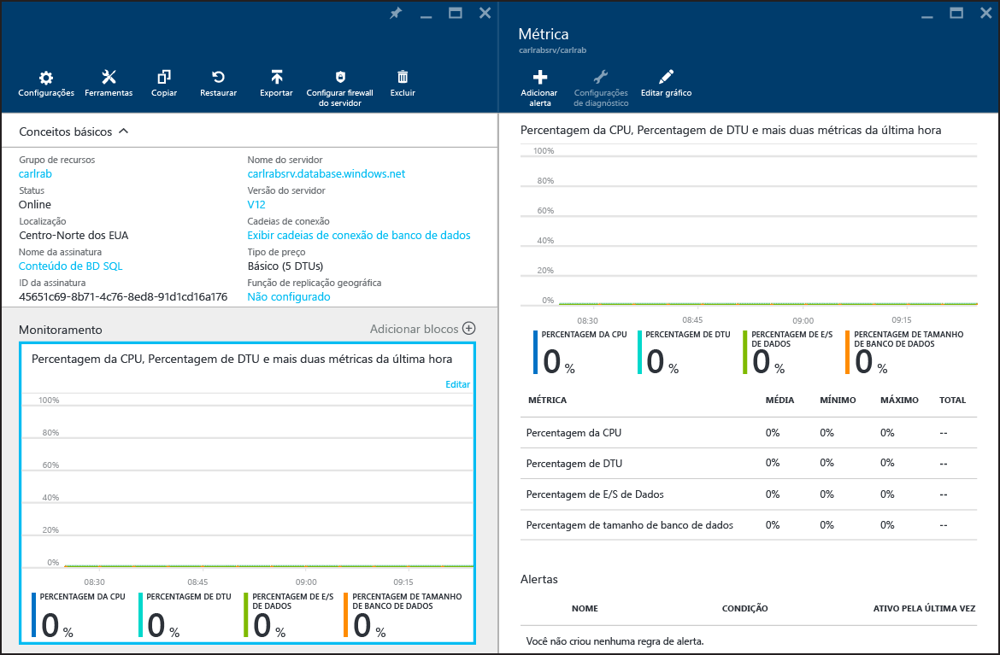

# Monitorar o desempenho do banco de dados no Banco de Dados SQL do Azure
O monitoramento do desempenho de um banco de dados SQL no Azure começa com o monitoramento da utilização de recursos em relação ao nível de desempenho de banco de dados escolhido. O monitoramento ajuda você a determinar se o seu banco de dados tem excesso de capacidade ou se está enfrentando problemas por ter atingido o máximo de recursos. Com essas informações, você pode decidir se é hora de ajustar o nível do desempenho e a [camada de serviço](sql-database-service-tiers.md) do banco de dados. Você pode monitorar o banco de dados usando ferramentas gráficas no [Portal do Azure](https://portal.azure.com) ou as [exibições de gerenciamento dinâmico](https://msdn.microsoft.com/library/ms188754.aspx) do SQL.

> [!TIP]
> Use [Insights inteligentes do SQL do Azure](sql-database-intelligent-insights.md) para monitoramento automático do desempenho do banco de dados. Quando um problema de desempenho é detectado, um log de diagnóstico é gerado com detalhes e RCA (Análise da Causa Raiz) do problema. Recomendação de melhoria de desempenho é fornecida quando possível.
>

## Monitorar bancos de dados usando o Portal do Azure
No [Portal do Azure](https://portal.azure.com/), é possível monitorar a utilização de um banco de dados individual selecionando-o e clicando no gráfico **Monitoramento** . Isso abre uma janela **Métrica** que pode ser alterada clicando no botão **Editar gráfico**. Adicione as seguintes métricas:

* Percentual de CPU
* Porcentagem de DTU
* Porcentagem de E/S de dados
* Percentual de tamanho do banco de dados

Depois de adicionar essas métricas, você pode continuar a exibi-las no gráfico **Monitoramento** com mais detalhes na janela **Métrica**. Todas as quatro métricas mostram o percentual médio de utilização relativo à **DTU** do seu banco de dados. Confira o artigo [camadas de serviço](sql-database-service-tiers.md) para obter detalhes sobre DTUs.

Você também pode configurar alertas nas métricas de desempenho. Clique no botão **Adicionar alerta** na janela **Métrica**. Siga o Assistente para configurar o alerta. Você tem a opção de alerta se a métrica exceder um limite determinado ou se ficar abaixo de um limite determinado.

Por exemplo, se você espera que a carga de trabalho em seu banco de dados cresça, você poderá configurar um alerta por email sempre que seu banco de dados atinge 80% em qualquer uma das métricas de desempenho. Você pode usar isso como um aviso antecipado para decidir quando precisará alternar para o próximo nível mais alto de desempenho.

As métricas de desempenho podem ajudá-lo a determinar se você pode fazer downgrade para um nível de desempenho inferior. Suponha que você está usando um banco de dados Standard S2 e todas as métricas de desempenho mostram que o banco de dados em média não usa mais de 10% a qualquer momento. É provável que o banco de dados funcione bem em Standard S1. No entanto, tome cuidado com cargas de trabalho que apresentam picos ou oscilam antes de tomar a decisão de migrar para um nível de desempenho inferior.

## Monitorar bancos de dados usando DMVs
As mesmas métricas que são expostas no portal também estão disponíveis por meio de exibições do sistema: [sys.resource_stats](https://msdn.microsoft.com/library/dn269979.aspx) no banco de dados **mestre** lógico do seu servidor e [sys.dm_db_resource_stats](https://msdn.microsoft.com/library/dn800981.aspx) no banco de dados do usuário. Use **sys.resource_stats** se precisar monitorar dados menos granulares em um período de tempo mais longo. Use **sys.dm_db_resource_stats** se precisar monitorar dados mais granulares em um período mais curto. Para obter mais informações, veja [Orientação sobre o desempenho do Banco de Dados SQL do Azure](sql-database-single-database-monitor.md#monitor-resource-use).

> [!NOTE]
> **sys.dm_db_resource_stats** retorna um conjunto de resultados vazio quando usado em bancos de dados Web e Business Edition, que estão desativados.
>
>

### Monitorar o uso de recursos

Você pode monitorar o uso de recursos usando a [Análise de Desempenho de Consultas de Banco de Dados SQL](sql-database-query-performance.md) e [Repositório de Consultas](https://msdn.microsoft.com/library/dn817826.aspx).

Você também pode monitorar o uso com estes dois modos de exibição:

* [sys.dm_db_resource_stats](https://msdn.microsoft.com/library/dn800981.aspx)
* [sys.resource_stats](https://msdn.microsoft.com/library/dn269979.aspx)

#### sys.dm_db_resource_stats
Você pode usar a exibição [sys.dm_db_resource_stats](https://msdn.microsoft.com/library/dn800981.aspx) em cada banco de dados SQL. A exibição **sys.dm_db_resource_stats** mostra dados de uso de recursos recentes em relação à camada de serviço. A porcentagem média de CPU, E/S de dados, gravações de log e memória é registrada a cada 15 segundos e armazenada por 1 hora.

Como essa exibição oferece uma visão mais granular do uso de recursos, use **sys.dm_db_resource_stats** primeiro para qualquer análise de estado atual ou para solução de problemas. Por exemplo, esta consulta mostra o uso médio e máximo dos recursos do banco de dados atual durante a última hora:

    SELECT  
        AVG(avg_cpu_percent) AS 'Average CPU use in percent',
        MAX(avg_cpu_percent) AS 'Maximum CPU use in percent',
        AVG(avg_data_io_percent) AS 'Average data I/O in percent',
        MAX(avg_data_io_percent) AS 'Maximum data I/O in percent',
        AVG(avg_log_write_percent) AS 'Average log write use in percent',
        MAX(avg_log_write_percent) AS 'Maximum log write use in percent',
        AVG(avg_memory_usage_percent) AS 'Average memory use in percent',
        MAX(avg_memory_usage_percent) AS 'Maximum memory use in percent'
    FROM sys.dm_db_resource_stats;  

Para outras consultas, consulte os exemplos em [sys.dm_db_resource_stats](https://msdn.microsoft.com/library/dn800981.aspx).

#### sys.resource_stats
A exibição [sys.resource_stats](https://msdn.microsoft.com/library/dn269979.aspx) no banco de dados **mestre** tem mais informações que podem ajudá-lo a monitorar o desempenho do banco de dados SQL em sua camada de serviço e nível de desempenho específicos. Os dados são coletados a cada 5 minutos e são mantidos por aproximadamente 35 dias. Essa exibição é útil para uma análise de histórico de longo prazo de como seu banco de dados SQL usa recursos.

O gráfico a seguir mostra o uso de recursos da CPU para um banco de dados Premium com o nível de desempenho P2 para cada hora em uma semana. Esse gráfico começa em uma segunda-feira, mostra 5 dias úteis e, depois, um fim de semana, em que ocorrem muito menos atividades no aplicativo.

Segundo os dados, atualmente esse banco de dados tem um pico de carga de CPU de pouco mais de 50% de uso da CPU em relação ao nível de desempenho P2 (meio-dia de terça-feira). Se a CPU for o fator dominante no perfil de recursos do aplicativo, talvez você decida que P2 é o nível de desempenho certo para garantir que a carga de trabalho sempre seja adequada. Se você espera que um aplicativo cresça com o passar do tempo, é uma boa ideia ter um buffer de recursos adicional para que o aplicativo nunca atinja o limite do nível de desempenho. Aumentando o nível de desempenho, você pode ajudar a evitar erros visíveis para os clientes, que podem ocorrer quando um banco de dados não tem capacidade suficiente para processar solicitações de modo eficaz, especialmente em ambientes sensíveis à latência. Um exemplo é um banco de dados que dá suporte a um aplicativo que pinta páginas da Web com base nos resultados de chamadas de banco de dados.

Outros tipos de aplicativos podem interpretar o mesmo gráfico de forma diferente. Por exemplo, se um aplicativo tentar processar dados de folha de pagamento por dia e incluir o mesmo gráfico, esse tipo de modelo de "trabalho em lotes" poderá funcionar bem em um nível de desempenho P1. O nível de desempenho P1 tem 100 DTUs, comparadas a 200 DTUs do nível de desempenho P2. O nível de desempenho P1 fornece metade do desempenho do nível de desempenho P2. Portanto, 50% de uso da CPU em P2 equivale a 100% de uso da CPU em P1. Se o aplicativo não tiver tempo limite, talvez não faça diferença se um trabalho demora 2 horas ou 2,5 horas para ser concluído, desde que seja concluído hoje. Um aplicativo dessa categoria provavelmente pode usar um nível de desempenho P1. Você pode tirar proveito do fato de que há períodos do dia em que o uso de recursos é menor, o que significa que um "pico grande" pode ser extrapolado para um dos ciclos mais tarde. O nível de desempenho P1 pode ser bom para esse tipo de aplicativo (e economiza dinheiro), desde que os trabalhos possam ser concluídos no horário todos os dias.

O Banco de Dados SQL do Azure expõe informações de recurso consumido para cada banco de dados ativo na exibição **sys.resource_stats** do banco de dados **mestre** em cada servidor. Os dados na tabela são agregados em intervalos de cinco minutos. Com as camadas de serviço Básica, Standard e Premium, os dados podem demorar mais de 5 minutos para aparecer na tabela, o que significa que esses dados são mais úteis para análise histórica do que para análise em tempo real. Consulte a exibição **sys.resource_stats** para ver o histórico recente de um banco de dados e validar se a reserva escolhida ofereceu o desempenho desejado quando necessário.

> [!NOTE]
> Você precisa estar conectado ao banco de dados **mestre** de seu servidor lógico do banco de dados SQL para consultar **sys.resource_stats** nos exemplos a seguir.
> 
> 

Este exemplo mostra como os dados nesse modo de exibição são expostos:

    SELECT TOP 10 *
    FROM sys.resource_stats
    WHERE database_name = 'resource1'
    ORDER BY start_time DESC

O exemplo seguinte mostra diferentes maneiras de usar o modo de exibição de catálogo **sys.resource_stats** para obter informações sobre como o banco de dados SQL usa recursos:

1. Para examinar o uso de recursos da última semana para o banco de dados userdb1, você pode executar esta consulta:
   
        SELECT *
        FROM sys.resource_stats
        WHERE database_name = 'userdb1' AND
              start_time > DATEADD(day, -7, GETDATE())
        ORDER BY start_time DESC;
2. Para avaliar como sua carga de trabalho se ajusta ao nível de desempenho, você precisa fazer uma pesquisa detalhada de cada aspecto das métricas de recursos: CPU, leituras, gravações, número de trabalhadores e número de sessões. Veja uma consulta revisada usando **sys.resource_stats** para relatar os valores médio e máximo dessas métricas de recursos:
   
        SELECT
            avg(avg_cpu_percent) AS 'Average CPU use in percent',
            max(avg_cpu_percent) AS 'Maximum CPU use in percent',
            avg(avg_data_io_percent) AS 'Average physical data I/O use in percent',
            max(avg_data_io_percent) AS 'Maximum physical data I/O use in percent',
            avg(avg_log_write_percent) AS 'Average log write use in percent',
            max(avg_log_write_percent) AS 'Maximum log write use in percent',
            avg(max_session_percent) AS 'Average % of sessions',
            max(max_session_percent) AS 'Maximum % of sessions',
            avg(max_worker_percent) AS 'Average % of workers',
            max(max_worker_percent) AS 'Maximum % of workers'
        FROM sys.resource_stats
        WHERE database_name = 'userdb1' AND start_time > DATEADD(day, -7, GETDATE());
3. Com essas informações sobre os valores médio e máximo de cada métrica de recurso, você pode avaliar como sua carga de trabalho se ajusta ao nível de desempenho escolhido. Normalmente, os valores médios de **sys.resource_stats** oferecem uma boa linha de base a ser usada em comparação ao tamanho de destino. Deve ser seu cartão de medida principal. Por exemplo, você pode estar usando a camada de serviço Standard com o nível de desempenho S2. Os percentuais médios de uso da CPU e leituras e gravações de E/S estão abaixo de 40%, o número médio de trabalhadores está abaixo de 50 e o número médio de sessões é inferior a 200. Talvez a carga de trabalho se enquadre no nível de desempenho S1. É fácil ver se o banco de dados se encaixa nos limites de sessão e de trabalho. Para ver se um banco de dados se enquadra em um nível de desempenho inferior em termos de CPU, leituras e gravações, divida o número de DTUs do nível de desempenho inferior pelo número de DTUs do nível de desempenho atual e multiplique o resultado por 100:
   
    **S1 DTU / S2 DTU * 100 = 20 / 50 * 100 = 40**
   
    O resultado é a diferença de desempenho relativa entre os dois níveis de desempenho em percentual. Se seu uso de recursos não ultrapassar esse valor, sua carga de trabalho poderá se enquadrar no nível de desempenho inferior. No entanto, você precisa examinar todos os intervalos de valores de uso de recursos e determinar, pelo percentual, com que frequência a carga de trabalho do banco de dados se enquadraria no nível de desempenho inferior. A consulta a seguir produz o percentual de ajuste por dimensão de recurso, com base no limite de 40% que calculamos neste exemplo:
   
        SELECT
            (COUNT(database_name) - SUM(CASE WHEN avg_cpu_percent >= 40 THEN 1 ELSE 0 END) * 1.0) / COUNT(database_name) AS 'CPU Fit Percent'
            ,(COUNT(database_name) - SUM(CASE WHEN avg_log_write_percent >= 40 THEN 1 ELSE 0 END) * 1.0) / COUNT(database_name) AS 'Log Write Fit Percent'
            ,(COUNT(database_name) - SUM(CASE WHEN avg_data_io_percent >= 40 THEN 1 ELSE 0 END) * 1.0) / COUNT(database_name) AS 'Physical Data IO Fit Percent'
        FROM sys.resource_stats
        WHERE database_name = 'userdb1' AND start_time > DATEADD(day, -7, GETDATE());
   
    Com base no SLO (objetivo do nível de serviço) do banco de dados, você pode decidir se sua carga de trabalho se enquadra no nível de desempenho inferior. Se o SLO da carga de trabalho do banco de dados é de 99,9% e a consulta anterior retorna valores superiores a 99,9% para as três dimensões de recursos, é provável que sua carga de trabalho se enquadre no nível de desempenho inferior.
   
    A avaliação do percentual de ajuste também traz informações que indicam se você deve ir ao próximo nível de desempenho para atender ao seu SLO. Por exemplo, userdb1 mostra o seguinte uso da CPU para a semana passada:
   
   | Percentual médio da CPU | Percentual máximo da CPU |
   | --- | --- |
   | 24,5 |100,00 |
   
    A média da CPU é de aproximadamente um quarto do limite do nível de desempenho, o que se ajustaria bem ao nível de desempenho do banco de dados. No entanto, o valor máximo mostra que o banco de dados atinge o limite do nível de desempenho. Você precisa ir para o próximo nível mais alto de desempenho? Avalie quantas vezes sua carga de trabalho atinge 100% e compará-la ao SLO da carga de trabalho de seu banco de dados.
   
        SELECT
        (COUNT(database_name) - SUM(CASE WHEN avg_cpu_percent >= 100 THEN 1 ELSE 0 END) * 1.0) / COUNT(database_name) AS 'CPU fit percent'
        ,(COUNT(database_name) - SUM(CASE WHEN avg_log_write_percent >= 100 THEN 1 ELSE 0 END) * 1.0) / COUNT(database_name) AS 'Log write fit percent'
        ,(COUNT(database_name) - SUM(CASE WHEN avg_data_io_percent >= 100 THEN 1 ELSE 0 END) * 1.0) / COUNT(database_name) AS 'Physical data I/O fit percent'
        FROM sys.resource_stats
        WHERE database_name = 'userdb1' AND start_time > DATEADD(day, -7, GETDATE());
   
    Se essa consulta retornar um valor inferior a 99,9% para qualquer uma das três dimensões de recursos, considere passar para o nível de desempenho superior ou use técnicas de ajuste de aplicativo para reduzir a carga no banco de dados SQL.
4. Este exercício também leva em consideração o aumento projetado da carga de trabalho no futuro.

Para pools elásticos, você pode monitorar bancos de dados autônomos no pool com as técnicas descritas nesta seção. Mas você também pode monitorar o pool como um todo. Para saber mais, veja [Monitorar e gerenciar um pool elásticos](sql-database-elastic-pool-manage-portal.md).

### Máximo de solicitações simultâneas
Para ver o número de solicitações simultâneas, execute esta consulta Transact-SQL em seu banco de dados SQL:

    SELECT COUNT(*) AS [Concurrent_Requests]
    FROM sys.dm_exec_requests R

Para analisar a carga de trabalho de um banco de dados local do SQL Server, modifique a consulta a fim de filtrar o banco de dados específico que você deseja analisar. Por exemplo, se você tiver um banco de dados local chamado MyDatabase, esta consulta Transact-SQL retornará a contagem de solicitações simultâneas nesse banco de dados:

    SELECT COUNT(*) AS [Concurrent_Requests]
    FROM sys.dm_exec_requests R
    INNER JOIN sys.databases D ON D.database_id = R.database_id
    AND D.name = 'MyDatabase'

Isso é apenas um instantâneo em um único ponto no tempo. Para entender melhor sua carga de trabalho e seus requisitos de solicitações simultâneas, você precisará coletar muitas amostras durante algum tempo.

### Máximo de logons simultâneos
Você pode analisar seus padrões de usuário e de aplicativo para ter uma ideia da frequência de logons. Você também pode executar cargas reais em um ambiente de teste para ter certeza de que não está atingindo esse ou outros limites mencionados neste artigo. Não há uma única consulta ou DMV (exibição de gerenciamento dinâmico) que mostre a contagem de logons simultâneos ou o histórico.

Se vários clientes usarem a mesma cadeia de conexão, o serviço autenticará cada logon. Se 10 usuários se conectassem simultaneamente a um banco de dados usando o mesmo nome de usuário e senha, existiriam 10 logons simultâneos. Esse limite é aplicado apenas durante o logon e a autenticação. Se os mesmos 10 usuários se conectassem ao banco de dados sequencialmente, o número de logons simultâneos nunca seria maior do que 1.

> [!NOTE]
> Atualmente, esse limite não se aplica a bancos de dados em pools elásticos.
> 
> 

### Máximo de sessões
Para ver o número de sessões ativas atuais, execute esta consulta Transact-SQL em seu banco de dados SQL:

    SELECT COUNT(*) AS [Sessions]
    FROM sys.dm_exec_connections

Se você estiver analisando uma carga de trabalho local do SQL Server, modifique a consulta para se concentrar em um banco de dados específico. Essa consulta ajuda a determinar possíveis necessidades de sessão do banco de dados, caso você esteja considerando movê-lo para o Banco de Dados SQL do Azure.

    SELECT COUNT(*)  AS [Sessions]
    FROM sys.dm_exec_connections C
    INNER JOIN sys.dm_exec_sessions S ON (S.session_id = C.session_id)
    INNER JOIN sys.databases D ON (D.database_id = S.database_id)
    WHERE D.name = 'MyDatabase'

Novamente, essas consultas retornam uma contagem pontual. Se coletar várias amostras ao longo do tempo, você terá a melhor compreensão do uso de sua sessão.

Para a análise do Banco de Dados SQL, é possível obter estatísticas históricas sobre sessões consultando a visualização [sys.resource_stats](https://msdn.microsoft.com/library/dn269979.aspx) e revisando a coluna **active_session_count**. 

## Próximas etapas

- Ajuste automaticamente índices e planos de execução de consulta do banco de dados usando o [ajuste automático de Banco de dados SQL do Azure](sql-database-automatic-tuning.md).
- Monitore automaticamente o desempenho do banco de dados usando [Insights inteligentes de SQL do Azure](sql-database-intelligent-insights.md). Esse recurso fornece informações de diagnóstico e análise da causa raiz de problemas de desempenho.
