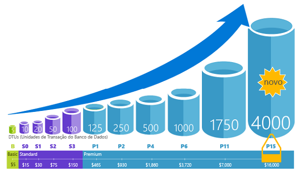
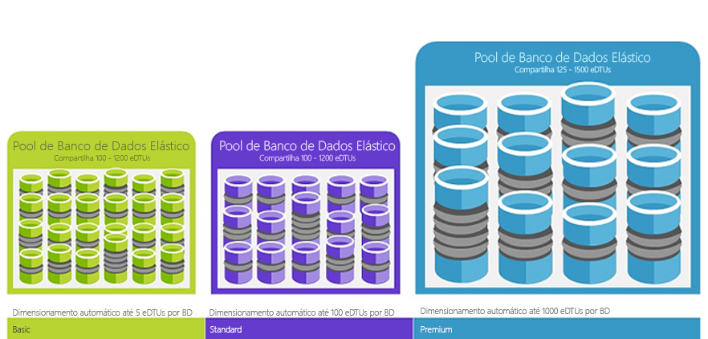

# O que é o serviço do Banco de Dados SQL do Azure? 

O Banco de Dados SQL é um serviço de banco de dados relacional de uso geral no Microsoft Azure que dá suporte a estruturas como XML, JSON, espacial e dados relacionais. Ele oferece [desempenho dinamicamente escalonável](sql-database-service-tiers.md) e fornece opções como [índices columnstore](https://docs.microsoft.com/sql/relational-databases/indexes/columnstore-indexes-overview) para análise e geração de relatórios extremas e [OLTP in-memory](sql-database-in-memory.md) para processamento transacional extremo. A Microsoft trata todos os patches e a atualização da base de código SQL sem interrupções e abstrai todo o gerenciamento da infraestrutura subjacente. 

O Banco de Dados SQL compartilha seu código-base com o [mecanismo de banco de dados do Microsoft SQL Server](https://docs.microsoft.com/sql/sql-server/sql-server-technical-documentation). Com a estratégia de prioridade de nuvem da Microsoft, os recursos mais recentes do SQL Server são liberados primeiro no Banco de Dados SQL e, em seguida, no próprio SQL Server. Essa abordagem fornece a você os recursos mais recentes do SQL Server sem sobrecarga para aplicação de patch ou atualização, e com esses novos recursos testados em milhões de bancos de dados. Para obter informações sobre novos recursos conforme vão são anunciados, consulte:

- **[Roteiro do Azure para o Banco de Dados SQL](https://azure.microsoft.com/roadmap/?category=databases)**: um local para saber quais são as novidades e os próximos passos. 
- **[Blog do Banco de Dados SQL do Azure](https://azure.microsoft.com/blog/topics/database)**: um local onde membros da equipe de produto do SQL Server postam sobre notícias e recursos do Banco de Dados SQL. 

O Banco de Dados SQL oferece um desempenho previsível em vários níveis de serviço que fornece escalabilidade dinâmica sem tempo de inatividade, otimização inteligente interna, escalabilidade e disponibilidade globais e opções avançadas de segurança, tudo com quase nenhuma administração. Esses recursos permitem que você se concentre no desenvolvimento rápido de aplicativos e acelere seu tempo de colocação no mercado, em vez de alocar tempo e recursos preciosos para gerenciamento de máquinas virtuais e infraestrutura. O serviço Banco de Dados SQL está atualmente 38 data centers ao redor do mundo, e mais data centers ficam online regularmente, o que permite a execução do banco de dados em um data center próximo.

> [!NOTE]
> Confira a [Central de Confiabilidade do Azure](https://azure.microsoft.com/support/trust-center/security/) para saber mais sobre a segurança da plataforma do Azure.
>

## Pools e desempenho dimensionável

Com o Banco de Dados SQL, cada banco de dados é isolado de outro e é portátil, cada um com sua própria [camada de serviço](sql-database-service-tiers.md) com um nível de desempenho garantido. O Banco de Dados SQL fornece diferentes níveis de desempenho para diferentes necessidades e permite que bancos de dados sejam colocados em pool para maximizar o uso de recursos e economizar dinheiro.

### Ajuste de desempenho e dimensionamento sem tempo de inatividade

O Banco de Dados SQL oferece quatro camadas de serviço para dar suporte a cargas de trabalho de banco de dados leves ou pesadas: Básico, Standard, Premium e RS Premium. Você pode criar seu primeiro aplicativo em um único banco de dados pequeno por um valor baixo por mês e alterar sua camada de serviço manualmente ou por meio de programação a qualquer momento para atender às necessidades de sua solução. Você pode ajustar o desempenho sem tempo de inatividade para seu aplicativo ou para seus clientes. A escalabilidade dinâmica permite que o banco de dados responda de forma transparente às mudanças rápidas de requisitos de recursos e que você pague apenas pelos recursos de que precisa, quando precisar deles.

   

### Pools elásticos para maximizar a utilização de recursos

Para muitas empresas e aplicativos, ser capaz de criar bancos de dados únicos e ajustar o desempenho sob demanda é o suficiente, especialmente se os padrões de uso forem relativamente previsíveis. Mas se você tiver os padrões de uso imprevisíveis, pode ser difícil de gerenciar os custos e o seu modelo de negócios. [Pools elásticos](sql-database-elastic-pool.md) são projetados para resolver esse problema. O conceito é simples. Você aloca recursos de desempenho para um pool em vez de um banco de dados individual e paga pelos recursos de desempenho coletivo do pool em vez do desempenho do banco de dados único. 

   

Com os pools elásticos, você não precisa se concentrar em expandir ou reduzir o desempenho do banco de dados conforme a demanda de recursos flutua. Os bancos de dados em pool consomem os recursos de desempenho do pool elástico conforme necessário. Os bancos de dados em pool consomem, mas não excedem os limites do pool. Portanto, o custo permanece previsível, mesmo que o uso do banco de dados individual não permaneça. Além disso, é possível [adicionar e remover bancos de dados do pool](sql-database-elastic-pool-manage-portal.md), escalar seu aplicativo por meio de alguns bancos de dados para milhares, tudo dentro de um orçamento que você pode controlar. Você também pode controlar os recursos mínimos e máximos disponíveis para bancos de dados no pool, para garantir que nenhum deles use todos os recursos do pool e que todos tenham um mínimo de recursos garantido. Para saber mais sobre os padrões de design para aplicativos SaaS usando pools Elásticos, confira [Padrões de Design para aplicativos de SaaS multilocatários com o Banco de Dados SQL](sql-database-design-patterns-multi-tenancy-saas-applications.md).

### Combinar bancos de dados individuais a bancos de dados agrupados

Seja qual for a sua escolha (bancos de dados únicos ou pools elásticos), você não está limitado. Você pode misturar bancos de dados individuais a pools elásticos e alterar as camadas de serviço dos bancos de dados individuais e pools elásticos de forma rápida e fácil para se adaptar à sua situação. Com a potência e o alcance do Azure, você pode combinar e corresponder outros serviços do Azure com o Banco de Dados SQL para atender às suas necessidades exclusivas de design de aplicativo, direcionar as eficiências de recursos e custo, bem como descobrir novas oportunidades de negócios.

### Monitoramento abrangente e recursos de alerta

Mas como você pode comparar o desempenho relativo de bancos de dados únicos e pools elásticos? Como você sabe o momento certo de parar ao fazer o ajuste? Você usa as ferramentas de [monitoramento de desempenho interno](sql-database-performance.md) e [alerta](sql-database-insights-alerts-portal.md), combinadas às classificações de desempenho com base em [DTUs (unidades de transação de banco de dados) para bancos de dados único e eDTUs (DTUs elásticos) para pools elásticos](sql-database-what-is-a-dtu.md). Usando essas ferramentas, você pode avaliar rapidamente o impacto da expansão ou redução com base nas suas necessidades de desempenho atuais ou de projeto. Confira [Opções e desempenho de Banco de Dados SQL: saiba o que está disponível em cada camada de serviço](sql-database-service-tiers.md) para obter detalhes.

Além disso, o Banco de Dados SQL pode [emitir métrica e logs de diagnóstico](sql-database-metrics-diag-logging.md) para facilitar o monitoramento. Você pode configurar o Banco de Dados SQL para armazenar o uso de recursos, trabalhos, sessões e conectividade em um destes recursos do Azure:

- **Armazenamento do Azure**: para o arquivamento de grandes quantidades de telemetria por um pequeno baixo
- **Hub de Eventos do Azure**: para a integração de telemetria de Banco de Dados SQL com a sua solução de monitoramento personalizada ou pipelines ativos
- **Azure Log Analytics**: para solução de monitoramento interna com relatórios, alertas e recursos de mitigação

    

## Recursos de disponibilidade

Os acordos de nível de serviço [(SLA)](http://azure.microsoft.com/support/legal/sla/)de disponibilidade de 99,99% de líderes do setor do Azure, alimentados por uma rede global de datacenters gerenciados pela Microsoft, ajuda a manter seu aplicativo em execução 24/7. Além disso, o Banco de Dados SQL fornece recursos internos de [continuidade dos negócios e a escalabilidade global](sql-database-business-continuity.md), incluindo:

- **[Backups automáticos](sql-database-automated-backups.md)**: o Banco de Dados SQL executa backups de log de transações, completos e diferenciais.
- **[Restaurações point-in-time](sql-database-recovery-using-backups.md)**: o Banco de Dados SQL dá suporte à recuperação para qualquer ponto no tempo dentro do período de retenção do backup automático.
- **[Replicação geográfica ativa](sql-database-geo-replication-overview.md)**: o Banco de Dados SQL permite que você configure até quatro bancos de dados secundários legíveis no mesmo data center do Azure ou em outros distribuídos globalmente.  Por exemplo, se você tiver um aplicativo SaaS com um banco de dados de catálogo que tem um alto volume de transações simultâneas somente leitura, use a replicação geográfica ativa para habilitar a escala global de leitura e remover afunilamentos no primário devido a cargas de trabalho de leitura. 
- **[Grupos de failover](sql-database-geo-replication-overview.md)**: o Banco de Dados SQL permite que você habilite a alta disponibilidade e o balanceamento de carga em escala global, incluindo a replicação geográfica transparente e o failover de grandes conjuntos de bancos de dados e de pools elásticos. Grupos de failover e replicação geográfica permitem a criação de aplicativos SaaS globalmente distribuídos com sobrecarga de administração mínima, deixando todos o monitoramento complexos, roteamento e coordenação de failover para o Banco de Dados SQL.

## Inteligência interna

Com o Banco de Dados SQL, você obtém inteligência interna que ajuda a reduzir significativamente os custos de execução e gerenciamento de bancos de dados e maximiza o desempenho e a segurança de seu aplicativo. Executando milhões de cargas de trabalho de clientes sem parar, o Banco de Dados SQL coleta e processa uma grande quantidade de dados telemétricos enquanto respeita a privacidade dos clientes nos bastidores. Vários algoritmos estão avaliando os dados telemétricos continuamente para que o serviço possa aprender e se adaptar ao seu aplicativo. Com base nesta análise, o serviço surge com recomendações personalizadas de melhoria de desempenho para sua carga de trabalho específica. 

### Monitoramento e ajuste de desempenho automáticos

O Banco de Dados SQL fornece informações detalhadas sobre as consultas que você precisa monitorar. O Banco de Dados SQL aprende seus padrões de banco de dados e permite adaptar seu esquema de banco de dados à carga de trabalho. O Banco de Dados SQL fornece [recomendações de ajuste de desempenho](sql-database-advisor.md) em que você pode examinar as ações de ajuste e aplicá-las. 

No entanto, monitorar o banco de dados é uma tarefa difícil e entediante, especialmente ao lidar com muitos bancos de dados. [Insights inteligentes](sql-database-intelligent-insights.md) faz esse trabalho para você automaticamente monitorando o desempenho do banco de dados SQL em grande escala e informa você sobre problemas de degradação de desempenho, identifica a causa raiz do problema e fornece recomendações de melhoria de desempenho quando possível.

Gerenciar um grande número de bancos de dados pode ser impossível de se fazer com eficiência, mesmo com todas as ferramentas e relatórios disponíveis fornecidos pelo Banco de Dados SQL e pelo portal do Azure. Em vez de monitorar e ajustar o banco de dados manualmente, você pode considerar delegar algumas das ações de monitoramento e ajustes ao Banco de Dados SQL usando o [ajuste automático](sql-database-automatic-tuning.md). O Banco de Dados SQL aplica recomendações, testa e verifica cada uma das suas ações de ajustes automaticamente para garantir a melhoria do desempenho. Dessa forma, o Banco de Dados SQL se adapta à sua carga de trabalho de maneira segura e controlada automaticamente. O ajuste automático significa que o desempenho do banco de dados é monitorado cuidadosamente e comparado antes e depois de cada ação de ajuste, e se o desempenho não melhora, a ação de ajuste é revertida.

Hoje, muitos dos nossos parceiros executando [aplicativos SaaS multilocatários](sql-database-design-patterns-multi-tenancy-saas-applications.md) baseados no Banco de Dados SQL dependem de ajuste automático de desempenho para garantir que seus aplicativos sempre tenham desempenho estável e previsível. Para eles, esse recurso reduz o risco de ter um incidente de desempenho no meio da noite. Além disso, como parte de sua base de clientes também usa o SQL Server, eles estão usando as mesmas recomendações de indexação fornecidas pelo Banco de Dados SQL para ajudar seus clientes do SQL Server.

Há dois aspectos de ajuste automático [disponíveis no Banco de Dados SQL](sql-database-automatic-tuning.md):

- **Gerenciamento automático de índice**: identifica os índices que devem ser adicionados ao seu banco de dados e os que devem ser removidos.
- **Correção automática do plano**: identifica planos problemáticos e corrige problemas de desempenho do plano SQL (em breve. Já disponível no SQL Server 2017).

### Processamento de consulta adaptável

Também estamos adicionando a família de recursos de [processamento de consulta adaptável](/sql/relational-databases/performance/adaptive-query-processing) de recursos ao Banco de Dados SQL, incluindo execução intercalada de funções com valor de tabela com várias instruções, comentários de concessão de memória de modo em lotes e junções adaptáveis do modo de lote. Cada um desses recursos de processamento de consulta adaptável aplica técnicas "aprender e adaptar" semelhantes, ajudando a solucionar problemas de otimização de consulta relacionados a problemas de otimização de consultas historicamente problemáticos.

### Detecção de ameaças inteligente

 A [Detecção de ameaças SQL](sql-database-threat-detection.md) aproveita a [auditoria do Banco de Dados SQL](sql-database-auditing.md) para monitorar continuamente os Bancos de Dados SQL do Azure em relação a tentativas potencialmente prejudiciais de acesso a dados confidenciais. A detecção de ameaças do SQL fornece uma nova camada de segurança, que permite que os clientes detectem e respondam às ameaças potenciais conforme elas ocorrem, fornecendo alertas de segurança sobre atividades anômalas. Os usuários recebem alertas em caso de atividades suspeitas em bancos de dados, possíveis vulnerabilidades e ataques de injeção de SQL, bem como padrões anômalos de acesso ao banco de dados. Os alertas da detecção de ameaças do SQL fornecem detalhes de atividades suspeitas e recomendam ação de como investigar e atenuar a ameaça. Os usuários podem explorar os eventos suspeitos para determinar se eles resultam de uma tentativa de acesso, violação ou exploração dos dados no banco de dados. A detecção de ameaças torna simples tratar as possíveis ameaças no banco de dados sem a necessidade de ser um especialista em segurança ou gerenciar os sistemas de monitoramento de segurança avançados.

## Segurança e conformidade avançadas

O Banco de Dados SQL fornece uma variedade de [recursos internos de segurança e conformidade](sql-database-security-overview.md) para ajudar seu aplicativo a atender a vários requisitos de conformidade e segurança. 

### Auditoria de segurança e conformidade

A [Auditoria do Banco de Dados SQL](sql-database-auditing.md) rastreia eventos do banco de dados e os grava em um log de auditoria em sua conta de armazenamento do Azure. A auditoria pode ajudar você a manter uma conformidade regulatória, a entender a atividade do banco de dados e a obter informações sobre discrepâncias e anomalias que poderiam indicar preocupações de negócios ou suspeitas de violações de segurança.

### Criptografia de dados em repouso

O [Transparent Data Encryption](/sql/relational-databases/security/encryption/transparent-data-encryption-azure-sql) do Banco de Dados SQL ajuda a proteger contra atividades mal-intencionadas por meio da execução de criptografia e descriptografia em tempo real do banco de dados, de backups associados e de arquivos de log de transações em repouso, sem exigir mudanças no aplicativo. A partir de maio de 2017, todos os Bancos de Dados SQL do Azure são protegidos automaticamente com TDE (Transparent Data Encryption). A TDE é a tecnologia de criptografia ociosa comprovada da SQL exigida por vários padrões de conformidade para proteger contra roubo de mídia de armazenamento. Os clientes podem gerenciar as chaves de criptografia da TDE e outros segredos de forma segura e em conformidade usando o Azure Key Vault.

### Criptografia dos dados em trânsito

O Banco de Dados SQL é o único sistema de banco de dados a oferecer proteção de dados confidenciais em trânsito, ociosos e durante a consulta de processamento com [Always Encrypted](https://docs.microsoft.com/sql/relational-databases/security/encryption/always-encrypted-database-engine). Always Encrypted é pioneiro na indústria, oferecendo segurança de dados incomparável contra violações envolvendo o roubo de dados críticos. Por exemplo, com o Always Encrypted, números de cartão de crédito dos clientes são armazenados sempre criptografados no banco de dados, mesmo durante a consulta de processamento, permitindo a descriptografia no ponto de uso por pessoal autorizado ou aplicativos que precisem processar os dados.

### Mascaramento de dados dinâmicos

A [máscara de dados dinâmicos no Banco de Dados SQL](sql-database-dynamic-data-masking-get-started.md) limita a exposição de dados confidenciais através do mascaramento dos dados para usuários sem privilégios. A Máscara de dados dinâmica ajuda a impedir o acesso não autorizado a dados confidenciais, permitindo que os clientes especifiquem qual a quantidade de dados confidenciais revelar, com impacto mínimo sobre a camada de aplicativo. É um recurso de segurança baseado em políticas que oculta os dados confidenciais no conjunto de resultados de uma consulta em relação aos campos do banco de dados designado, enquanto os dados no banco de dados não são alterados.

### Segurança em nível de linha

A [segurança em nível de linha](https://docs.microsoft.com/sql/relational-databases/security/row-level-security) permite aos clientes controlar o acesso às linhas em uma tabela de banco de dados com base nas características do usuário que executa uma consulta (por exemplo, uma associação de grupo ou um contexto de execução). A RLS (Segurança em Nível de Linha) simplifica o design e codificação de segurança em seu aplicativo. Ela permite implementar restrições de acesso à linha de dados. Por exemplo, garantindo que os funcionários tenham acesso somente às linhas de dados relevantes aos seus respectivos departamento ou restringindo o acesso de um cliente apenas aos dados pertinentes à sua empresa.

### Integração do Azure Active Directory e autenticação multifator

O Banco de Dados SQL permite gerenciar centralmente as identidades de usuário do banco de dados e de outros serviços da Microsoft com a [integração do Azure Active Directory](sql-database-aad-authentication.md). Esse recurso simplifica o gerenciamento de permissão e aprimora a segurança. O Azure Active Directory dá suporte a [MFA](sql-database-ssms-mfa-authentication.md) (autenticação multifator) para aumentar a segurança de aplicativos e dados e dar suporte a um único processo de entrada.

### Certificação de conformidade

O Banco de Dados SQL participa de auditorias regulares e foi certificado por vários padrões de conformidade. Para saber mais, confira a [Central de Confiabilidade do Microsoft Azure](https://azure.microsoft.com/support/trust-center/), onde é possível encontrar a lista mais atual de [certificações de conformidade do Banco de Dados SQL](https://azure.microsoft.com/support/trust-center/services/).

## Ferramentas fáceis de usar

O Banco de Dados SQL torna a compilação e o gerenciamento de aplicativos mais fáceis e produtivos. O Banco de Dados SQL permite a você focar no que há de melhor: compilar aplicativos ótimos. Você pode gerenciar e desenvolver no Banco de Dados SQL usando ferramentas e técnicas já existentes.

- **[O portal do Azure](https://portal.azure.com/)**: um aplicativo baseado na Web para gerenciar todos os serviços do Azure 
- **[SQL Server Management Studio](https://docs.microsoft.com/sql/ssms/download-sql-server-management-studio-ssms)**: um aplicativo cliente livre e que pode ser baixado para gerenciar qualquer infraestrutura SQL, do SQL Server ao Banco de Dados SQL
- **[SQL Server Data Tools no Visual Studio](https://docs.microsoft.com/sql/ssdt/download-sql-server-data-tools-ssdt)**: um aplicativo cliente livre que pode ser baixado para o desenvolvimento de bancos de dados relacionais do SQL Server, bancos de dados SQL do Azure, pacotes do Integration Services, modelos de dados do Analysis Services e relatórios do Reporting Services.
- **[Visual Studio Code](https://code.visualstudio.com/docs)**: um editor de código gratuito, de software livre e que pode ser baixado para Linux, macOS e Windows, com suporte a extensões, incluindo a [extensão mssql](https://aka.ms/mssql-marketplace) para consultar o Microsoft SQL Server, Banco de Dados SQL do Azure e SQL Data Warehouse.

O Banco de Dados SQL dá suporte à criação de aplicativos com Python, Java, Node.js, PHP, Ruby e .NET no MacOS, Linux e Windows. O Banco de Dados SQL dá suporte às mesmas [bibliotecas de conexão](sql-database-libraries.md) do SQL Server.

## Envolver-se com a equipe de engenharia do SQL Server

- [DBA Stack Exchange](https://dba.stackexchange.com/questions/tagged/sql-server): faça perguntas sobre administração de banco de dados
- [Stack Overflow](http://stackoverflow.com/questions/tagged/sql-server): faça perguntas sobre desenvolvimento
- [Fóruns do MSDN](https://social.msdn.microsoft.com/Forums/en-US/home?category=sqlserver): Faça perguntas técnicas
- [Microsoft Connect](https://connect.microsoft.com/SQLServer/Feedback): relate bugs e solicite recursos
- [Reddit](https://www.reddit.com/r/SQLServer/): debata sobre o SQL Server

## Próximas etapas

- Confira a [página de preços](https://azure.microsoft.com/pricing/details/sql-database/) para ver comparações de custos entre o banco de dados único e pools elásticos e calculadoras.

- Consulte estes inícios rápidos para começar:

  - [Criar um banco de dados SQL no portal do Azure](sql-database-get-started-portal.md)  
  - [Criar um banco de dados SQL com a CLI do Azure](sql-database-get-started-cli.md)
  - [Criar um banco de dados SQL usando o PowerShell](sql-database-get-started-powershell.md)

- Para ver vários exemplos da CLI do Azure e do PowerShell, consulte:
  - [Exemplos da CLI do Azure para o Banco de Dados SQL do Azure](sql-database-cli-samples.md)
  - [Exemplos do Azure PowerShell para o Banco de Dados SQL do Azure](sql-database-powershell-samples.md)
