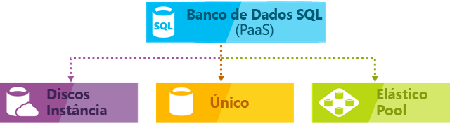

# O serviço de banco de dados SQL

O Banco de Dados SQL é um serviço gerenciado de banco de dados relacional de uso geral no Microsoft Azure que dá suporte a estruturas como XML, JSON, espacial e dados relacionais. O Banco de Dados SQL oferece desempenho dinamicamente escalonável em dois modelos de compra diferentes: um [modelo de compra baseado em vCore](sql-database-service-tiers-vcore.md) e um [modelo de compra baseado em DTU](sql-database-service-tiers-dtu.md). O Banco de Dados SQL também fornece opções como [índices columnstore](https://docs.microsoft.com/sql/relational-databases/indexes/columnstore-indexes-overview) para análise extrema e relatórios e [OLTP in-memory](sql-database-in-memory.md) para processamento transacional extremo. A Microsoft trata todos os patches e a atualização da base de código SQL sem interrupções e abstrai todo o gerenciamento da infraestrutura subjacente.

O banco de dados SQL do Azure fornece as seguintes opções de implantação para um banco de dados SQL do Azure:

- Como um banco de dados individual com seu próprio conjunto de recursos gerenciado por um servidor lógico
- Como um banco de dados em pool em um [pool elástico](sql-database-elastic-pool.md) com um conjunto compartilhado de recursos gerenciados por meio de um servidor lógico
- Como parte de uma coleção de bancos de dados conhecida como [instância gerenciada](sql-database-managed-instance.md) que contém os bancos de dados de usuário e sistema e compartilha um conjunto de recursos

A ilustração a seguir mostra essas opções de implantação:

O Banco de Dados SQL compartilha a sua base de código com o [mecanismo de banco de dados do Microsoft SQL Server](https://docs.microsoft.com/sql/sql-server/sql-server-technical-documentation). Com a estratégia de prioridade de nuvem da Microsoft, os recursos mais recentes do SQL Server são liberados primeiro no Banco de Dados SQL e, em seguida, no próprio SQL Server. Essa abordagem fornece a você os recursos mais recentes do SQL Server sem sobrecarga para aplicação de patch ou atualização, e com esses novos recursos testados em milhões de bancos de dados. Para obter informações sobre novos recursos conforme vão são anunciados, consulte:

- **[Mapa do Azure para o Banco de Dados SQL](https://azure.microsoft.com/roadmap/?category=databases)**:

  Um lugar para descobrir quais são as novidades e o que está por vir.

- **[Blog do banco de dados SQL do Azure](https://azure.microsoft.com/blog/topics/database)**:

  Um lugar onde os membros da equipe de produto do SQL Server escrevem sobre novidades e recursos do Banco de Dados SQL.

> [!IMPORTANT]
> Para entender as diferenças de recursos entre o Banco de Dados SQL e o SQL Server, consulte os [recursos do SQL](sql-database-features.md).

O Banco de Dados SQL oferece desempenho previsível com vários tipos de recursos, níveis de serviço e tamanhos de computação, o que fornece escalabilidade dinâmica sem tempo de inatividade, otimização inteligente interna, escalabilidade e disponibilidade globais e opções avançadas de segurança, tudo com quase nenhuma administração. Esses recursos permitem que você se concentre no desenvolvimento rápido de aplicativos e acelere seu tempo de colocação no mercado, em vez de alocar tempo e recursos preciosos para gerenciamento de máquinas virtuais e infraestrutura. O serviço Banco de Dados SQL está atualmente 38 data centers ao redor do mundo, e mais data centers ficam online regularmente, o que permite a execução do banco de dados em um data center próximo.

## Pools e desempenho dimensionável

Com o Banco de Dados SQL, cada banco de dados é portátil e isolado entre si, cada qual com sua própria camada de serviço dentro do [modelo de compra baseado em DTU](sql-database-service-tiers-dtu.md) ou [modelo de compra baseado em vCore](sql-database-service-tiers-vcore.md) e uma garantia de tamanho de computação. O Banco de Dados SQL fornece diferentes tamanhos de computação para diferentes necessidades e permite que bancos de dados sejam colocados em pool para maximizar o uso de recursos e economizar dinheiro.

- Com a [Instância Gerenciada do Banco de Dados SQL](sql-database-managed-instance.md), cada instância é isolada de outras instâncias com recursos garantidos. Para saber mais, confira [Instância Gerenciada do Banco de Dados SQL](sql-database-managed-instance.md).
- Com a [Camada de serviço em hiperescala](sql-database-service-tier-hyperscale.md) (versão prévia) no modelo de compra de vCore, é possível dimensionar até 100 TB com funcionalidades rápidas de backup e restauração.

### Ajuste de desempenho e dimensionamento sem tempo de inatividade

O Banco de Dados SQL oferece um [modelo de compra baseado em DTU](sql-database-service-tiers-dtu.md) ou o [modelo de compra baseado em vCore](sql-database-service-tiers-vcore.md).

- O modelo de compra baseado em DTU oferece uma mistura de computação, memória e recursos de E/S em três camadas de serviço para dar suporte a cargas de trabalho de banco de dados leves e pesadas: Basic, Standard e Premium. Os tamanhos de computação dentro de cada camada fornecem uma mistura diferente desses recursos, aos quais você pode adicionar recursos de armazenamento.
- O modelo de compra baseado em vCore permite que você escolha o número de vCores, a quantidade ou memória e a quantidade e velocidade de armazenamento.

Você pode criar seu primeiro aplicativo em um banco de dados individual pequeno com um baixo custo mensal na camada de serviço de Uso Geral e, depois, alterar a camada de serviço manualmente ou de forma programática a qualquer momento para a camada de serviço Comercialmente Crítico para atender às necessidades da solução. Você pode ajustar o desempenho sem tempo de inatividade para seu aplicativo ou para seus clientes. A escalabilidade dinâmica permite que o banco de dados responda de forma transparente às mudanças rápidas de requisitos de recursos e que você pague apenas pelos recursos de que precisa, quando precisar deles.

> [!IMPORTANT]
> A [camada de serviço Hyperscale](sql-database-service-tier-hyperscale.md) está atualmente em pré-visualização pública. Não recomendamos executar nenhuma carga de trabalho de produção em bancos de dados do Hyperscale ainda. Você não pode atualizar um banco de dados Hyperscale para outras camadas de serviço. Para fins de teste, é recomendável fazer uma cópia do banco de dados atual e atualize a cópia para a camada de serviço em hiperescala.

A escalabilidade dinâmica é diferente do dimensionamento automático. O dimensionamento automático é quando um serviço pode ser dimensionado automaticamente com base em critérios, enquanto a escalabilidade dinâmico permite o redimensionamento manual sem tempo de inatividade. O Banco de Dados SQL do Azure Individual oferece suporte à escalabilidade dinâmica manual, mas não ao dimensionamento automático. Para uma experiência mais *automática*, considere o uso de pools elásticos, que permitem que os bancos de dados compartilhem recursos em um pool com base nas necessidades individuais do banco de dados. No entanto, há scripts que podem ajudar a automatizar a escalabilidade de um Banco de Dados individual SQL do Azure. Para ver um exemplo, consulte [Usar o PowerShell para monitorar e dimensionar um Banco de Dados SQL individual](scripts/sql-database-monitor-and-scale-database-powershell.md).

### Pools elásticos para maximizar a utilização de recursos

Para muitas empresas e aplicativos, ser capaz de criar bancos de dados únicos e ajustar o desempenho sob demanda é o suficiente, especialmente se os padrões de uso forem relativamente previsíveis. Mas se você tiver os padrões de uso imprevisíveis, pode ser difícil de gerenciar os custos e o seu modelo de negócios. [Pools elásticos](sql-database-elastic-pool.md) são projetados para resolver esse problema. O conceito é simples. Você aloca recursos de desempenho a um pool em vez de a um banco de dados individual e paga pelos recursos de desempenho coletivo do pool, em vez de pelo desempenho de banco de dados único.

   

Com os pools elásticos, você não precisa se concentrar em expandir ou reduzir o desempenho do banco de dados conforme a demanda de recursos flutua. Os bancos de dados em pool consomem os recursos de desempenho do pool elástico conforme necessário. Os bancos de dados em pool consomem, mas não excedem os limites do pool. Portanto, o custo permanece previsível, mesmo que o uso do banco de dados individual não permaneça. Além disso, é possível [adicionar e remover bancos de dados do pool](sql-database-elastic-pool-manage-portal.md), escalar seu aplicativo por meio de alguns bancos de dados para milhares, tudo dentro de um orçamento que você pode controlar. Você também pode controlar os recursos mínimos e máximos disponíveis para bancos de dados no pool, para garantir que nenhum deles use todos os recursos do pool e que todos tenham um mínimo de recursos garantido. Para saber mais sobre os padrões de design para aplicativos SaaS usando pools Elásticos, confira [Padrões de Design para aplicativos de SaaS multilocatários com o Banco de Dados SQL](sql-database-design-patterns-multi-tenancy-saas-applications.md).

Scripts podem ajudar com o monitoramento e dimensionamento pools elásticos. Para ver um exemplo, consulte [Usar o PowerShell para monitorar e dimensionar um pool elástico do SQL no Banco de Dados SQL do Azure](scripts/sql-database-monitor-and-scale-pool-powershell.md)

> [!IMPORTANT]
> A Instância Gerenciada do Banco de Dados SQL não dá suporte a pools elásticos.

### Combinar bancos de dados individuais a bancos de dados agrupados

Seja qual for a sua escolha (bancos de dados únicos ou pools elásticos), você não está limitado. Você pode mesclar bancos de dados individuais com pools elásticos e alterar as camadas de serviço de bancos de dados individuais e pools elásticos de maneira rápida e fácil para se adaptar à sua situação. Com a potência e o alcance do Azure, você pode combinar e corresponder outros serviços do Azure com o Banco de Dados SQL para atender às suas necessidades exclusivas de design de aplicativo, direcionar as eficiências de recursos e custo, bem como descobrir novas oportunidades de negócios.

### Monitoramento abrangente e recursos de alerta

Mas como você pode comparar o desempenho relativo de bancos de dados únicos e pools elásticos? Como você sabe o momento certo de parar ao fazer o ajuste? Use as ferramentas de [monitoramento de desempenho interno](sql-database-performance.md) e [alerta](sql-database-insights-alerts-portal.md) em conjunto com as classificações de desempenho baseadas nos vCores. Usando essas ferramentas, você pode avaliar rapidamente o impacto da expansão ou redução com base nas suas necessidades de desempenho atuais ou de projeto. Ver [modelo de compra baseado em DTU](sql-database-service-tiers-dtu.md) e [o modelo de compra baseado em vCore](sql-database-service-tiers-vcore.md) para obter detalhes.

Além disso, o Banco de Dados SQL pode [emitir métrica e logs de diagnóstico](sql-database-metrics-diag-logging.md) para facilitar o monitoramento. Você pode configurar o Banco de Dados SQL para armazenar o uso de recursos, trabalhos, sessões e conectividade em um destes recursos do Azure:

- **Armazenamento do Azure**: para o arquivamento de grandes volumes de telemetria por um pequeno custo
- **Hub de Eventos do Azure**: para a integração de telemetria de Banco de Dados SQL com a sua solução de monitoramento personalizada ou pipelines ativos
- **Azure Log Analytics**: para solução de monitoramento interna com relatórios, alertas e recursos de mitigação. O Azure Log Analytics é um recurso do [Operations Management Suite (OMS)](../operations-management-suite/operations-management-suite-overview.md)

    

## Recursos de disponibilidade

Os acordos de nível de serviço [(SLA)](http://azure.microsoft.com/support/legal/sla/)de disponibilidade de 99,99% de líderes do setor do Azure, alimentados por uma rede global de datacenters gerenciados pela Microsoft, ajuda a manter seu aplicativo em execução 24/7. A plataforma do Azure gerencia completamente cada banco de dados SQL do Azure e garante alta porcentagem de disponibilidade de dados sem perda de dados. O Azure controla automaticamente a aplicação de patches, potenciais falhas subjacentes de hardware, software ou rede, a implantação de correções de bug, failovers, upgrades de banco de dados e outras tarefas de manutenção. A disponibilidade padrão é obtida por uma separação de camadas de computação e armazenamento. A disponibilidade premium é obtida integrando computação e armazenamento em um único nó para desempenho e, em seguida, implementando uma tecnologia semelhante a Always On Availability Groups nas capas. Para conferir uma discussão completa sobre os recursos de alta disponibilidade do Banco de Dados SQL do Azure, veja [Disponibilidade do Banco de Dados SQL](sql-database-high-availability.md). Além disso, o Banco de Dados SQL fornece recursos internos de [continuidade dos negócios e a escalabilidade global](sql-database-business-continuity.md), incluindo:

- **[Backups automáticos](sql-database-automated-backups.md)**:

  Banco de dados SQL executa automaticamente completo, diferencial e backups de log de transações.
- **[Restaurações point-in-time](sql-database-recovery-using-backups.md)**:

  O Banco de Dados SQL suporta a recuperação a qualquer momento no período de retenção de backup automático.
- **[Replicação geográfica ativa](sql-database-geo-replication-overview.md)**:

  O Banco de Dados SQL permite que você configure até quatro bancos de dados secundários legíveis nos datacenters do Azure iguais ou distribuídos globalmente.  Por exemplo, se você tiver um aplicativo SaaS com um banco de dados de catálogo que tem um alto volume de transações simultâneas somente leitura, use a replicação geográfica ativa para habilitar a escala global de leitura e remover gargalos no primário devido a cargas de trabalho de leitura.
- **[Grupos de failover](sql-database-geo-replication-overview.md)**:

  O Banco de Dados SQL permite que você ative a alta disponibilidade e o balanceamento de carga em escala global, incluindo a replicação geográfica transparente e o failover de grandes conjuntos de bancos de dados e pools elásticos. Grupos de failover e replicação geográfica permitem a criação de aplicativos SaaS globalmente distribuídos com sobrecarga de administração mínima, deixando todos o monitoramento complexos, roteamento e coordenação de failover para o Banco de Dados SQL.
- **[Bancos de dados com redundância de zona](sql-database-high-availability.md)**:

  O Banco de Dados SQL permite provisionar bancos de dados Premium ou Business Critical ou pools elásticos em várias zonas de disponibilidade. Como esses bancos de dados e pools elásticos têm várias réplicas de redundância para alta disponibilidade, colocar essas réplicas em várias zonas de disponibilidade fornece maior resiliência, incluindo a capacidade de recuperar automaticamente de falhas de escala do datacenter sem perda de dados.  

## Inteligência interna

Com o Banco de Dados SQL, você obtém inteligência interna que ajuda a reduzir significativamente os custos de execução e gerenciamento de bancos de dados e maximiza o desempenho e a segurança de seu aplicativo. Executando milhões de cargas de trabalho de clientes sem parar, o Banco de Dados SQL coleta e processa uma grande quantidade de dados telemétricos enquanto respeita a privacidade dos clientes nos bastidores. Vários algoritmos estão avaliando os dados telemétricos continuamente para que o serviço possa aprender e se adaptar ao seu aplicativo. Com base nesta análise, o serviço surge com recomendações personalizadas de melhoria de desempenho para sua carga de trabalho específica.

### Monitoramento e ajuste de desempenho automáticos

O Banco de Dados SQL fornece informações detalhadas sobre as consultas que você precisa monitorar. O Banco de Dados SQL aprende seus padrões de banco de dados e permite adaptar seu esquema de banco de dados à carga de trabalho. O Banco de Dados SQL fornece [recomendações de ajuste de desempenho](sql-database-advisor.md) em que você pode examinar as ações de ajuste e aplicá-las.

No entanto, monitorar o banco de dados é uma tarefa difícil e entediante, especialmente ao lidar com muitos bancos de dados. [Insights inteligentes](sql-database-intelligent-insights.md) faz esse trabalho para você automaticamente monitorando o desempenho do banco de dados SQL em grande escala e informa você sobre problemas de degradação de desempenho, identifica a causa raiz do problema e fornece recomendações de melhoria de desempenho quando possível.

Gerenciar um grande número de bancos de dados pode ser impossível de se fazer com eficiência, mesmo com todas as ferramentas e relatórios disponíveis fornecidos pelo Banco de Dados SQL e pelo portal do Azure. Em vez de monitorar e ajustar o banco de dados manualmente, você pode considerar delegar algumas das ações de monitoramento e ajustes ao Banco de Dados SQL usando o [ajuste automático](sql-database-automatic-tuning.md). O Banco de Dados SQL aplica recomendações, testa e verifica cada uma das suas ações de ajustes automaticamente para garantir a melhoria do desempenho. Dessa forma, o Banco de Dados SQL se adapta à sua carga de trabalho de maneira segura e controlada automaticamente. O ajuste automático significa que o desempenho do banco de dados é monitorado cuidadosamente e comparado antes e depois de cada ação de ajuste, e se o desempenho não melhora, a ação de ajuste é revertida.

Hoje, muitos dos nossos parceiros executando [aplicativos SaaS multilocatários](sql-database-design-patterns-multi-tenancy-saas-applications.md) baseados no Banco de Dados SQL dependem de ajuste automático de desempenho para garantir que seus aplicativos sempre tenham desempenho estável e previsível. Para eles, esse recurso reduz o risco de ter um incidente de desempenho no meio da noite. Além disso, como parte de sua base de clientes também usa o SQL Server, eles estão usando as mesmas recomendações de indexação fornecidas pelo Banco de Dados SQL para ajudar seus clientes do SQL Server.

Há dois aspectos de ajuste automático [disponíveis no Banco de Dados SQL](sql-database-automatic-tuning.md):

- **Gerenciamento automático de índice**: identifica os índices que devem ser adicionados ao seu banco de dados e os que devem ser removidos.
- **Correção automática do plano**: identifica planos problemáticos e corrige problemas de desempenho do plano SQL (em breve. Já disponível no SQL Server 2017).

### Processamento de consulta adaptável

Também estamos adicionando a família de recursos de [processamento de consulta adaptável](/sql/relational-databases/performance/adaptive-query-processing) de recursos ao Banco de Dados SQL, incluindo execução intercalada de funções com valor de tabela com várias instruções, comentários de concessão de memória de modo em lotes e junções adaptáveis do modo de lote. Cada um desses recursos de processamento de consulta adaptável aplica técnicas "aprender e adaptar" semelhantes, ajudando a solucionar problemas de otimização de consulta relacionados a problemas de otimização de consultas historicamente problemáticos.

## Segurança e conformidade avançadas

O Banco de Dados SQL fornece uma variedade de [recursos internos de segurança e conformidade](sql-database-security-overview.md) para ajudar seu aplicativo a atender a vários requisitos de conformidade e segurança.

### Proteção Avançada contra Ameaças

Proteção Avançada contra Ameaças SQL é um pacote unificado para recursos de segurança avançados do SQL. Ela inclui funcionalidades para descobrir e classificar dados confidenciais, gerenciar vulnerabilidades de seu banco de dados e detectar atividades irregulares que possam indicar uma ameaça ao seu banco de dados. Fornece um local único para habilitar e gerenciar esses recursos.

- [Descoberta e classificação de dados](sql-database-data-discovery-and-classification.md):

  Esse recurso (atualmente em pré-visualização) fornece recursos incorporados no Banco de Dados SQL do Azure para descobrir, classificar, rotular e proteger os dados confidenciais em seus bancos de dados. Pode ser usada para fornecer visibilidade em seu estado de classificação do banco de dados e para controlar o acesso a dados confidenciais no banco de dados e, além de suas bordas.
- [Avaliação de vulnerabilidade](sql-vulnerability-assessment.md):

  Esse serviço pode descobrir, controlar e ajudá-lo a corrigir possíveis vulnerabilidades de banco de dados. Fornece visibilidade sobre o estado de segurança e inclui etapas acionáveis para resolver problemas de segurança e aperfeiçoar as fprtificações do banco de dados.
- [Detecção de ameaças](sql-database-threat-detection.md):

  Esse recurso detecta atividades anômalas que indicam tentativas incomuns e potencialmente prejudiciais de acessar ou explorar seu banco de dados. Monitora continuamente o banco de dados com relação a atividades suspeitas e fornece alertas de segurança imediata sobre vulnerabilidades potenciais, ataques de injeção de SQL e padrões de acesso anormal do banco de dados. Os alertas da detecção de ameaças fornecem detalhes de atividades suspeitas e recomendam ação de como investigar e atenuar a ameaça.

### Auditoria de segurança e conformidade

A [Auditoria do Banco de Dados SQL](sql-database-auditing.md) rastreia eventos do banco de dados e os grava em um log de auditoria em sua conta de armazenamento do Azure. A auditoria pode ajudar você a manter uma conformidade regulatória, a entender a atividade do banco de dados e a obter informações sobre discrepâncias e anomalias que poderiam indicar preocupações de negócios ou suspeitas de violações de segurança.

### Criptografia de dados

O Banco de Dados SQL protege seus dados fornecendo criptografia para os dados em movimento com o [protocolo TLS](https://support.microsoft.com/kb/3135244), para os dados em repouso com a [Transparent Data Encryption](https://docs.microsoft.com/sql/relational-databases/security/encryption/transparent-data-encryption-azure-sql) e para os dados em uso com o [Always Encrypted](https://docs.microsoft.com/sql/relational-databases/security/encryption/always-encrypted-database-engine).

### Integração do Azure Active Directory e autenticação multifator

O Banco de Dados SQL permite gerenciar centralmente as identidades de usuário do banco de dados e de outros serviços da Microsoft com a [integração do Azure Active Directory](sql-database-aad-authentication.md). Esse recurso simplifica o gerenciamento de permissão e aprimora a segurança. O Azure Active Directory é compatível com [MFA](sql-database-ssms-mfa-authentication.md) (autenticação multifator) para aumentar a segurança de aplicativos e dados enquanto dá suporte a um processo de logon único.

### Certificação de conformidade

O Banco de Dados SQL participa de auditorias regulares e foi certificado por vários padrões de conformidade. Para saber mais, confira a [Central de Confiabilidade do Microsoft Azure](https://azure.microsoft.com/support/trust-center/), onde é possível encontrar a lista mais atual de [certificações de conformidade do Banco de Dados SQL](https://azure.microsoft.com/support/trust-center/services/).

## Ferramentas fáceis de usar

O Banco de Dados SQL torna a compilação e o gerenciamento de aplicativos mais fáceis e produtivos. O Banco de Dados SQL permite a você focar no que há de melhor: compilar aplicativos ótimos. Você pode gerenciar e desenvolver no Banco de Dados SQL usando ferramentas e técnicas já existentes.

- **[O portal do Azure](https://portal.azure.com/)**:

  Um aplicativo baseado na Web para gerenciar todos os serviços do Azure
- **[SQL Server Management Studio](https://docs.microsoft.com/sql/ssms/download-sql-server-management-studio-ssms)**:

  Um aplicativo cliente gratuito e transferível para gerenciar qualquer infraestrutura SQL, do SQL Server ao Banco de Dados SQL
- **[SQL Server Data Tools no Visual Studio](https://docs.microsoft.com/sql/ssdt/download-sql-server-data-tools-ssdt)**:

  Um aplicativo cliente gratuito que pode ser baixado para desenvolver bancos de dados relacionais do SQL Server, bancos de dados SQL do Azure, pacotes do Integration Services, modelos de dados do Analysis Services e relatórios do Reporting Services.
- **[Visual Studio Code](https://code.visualstudio.com/docs)**:

  Um editor de código gratuito, baixável e de código aberto para Windows, macOS e Linux que suporta extensões, incluindo a [extensão mssql](https://aka.ms/mssql-marketplace) para consultar o Microsoft SQL Server, o Banco de Dados SQL do Azure e o SQL Data Warehouse.

O Banco de Dados SQL dá suporte à criação de aplicativos com Python, Java, Node.js, PHP, Ruby e .NET no MacOS, Linux e Windows. O Banco de Dados SQL dá suporte às mesmas [bibliotecas de conexão](sql-database-libraries.md) do SQL Server.

## Envolver-se com a equipe de engenharia do SQL Server

- [DBA Stack Exchange](https://dba.stackexchange.com/questions/tagged/sql-server): faça perguntas sobre administração de banco de dados
- [Stack Overflow](http://stackoverflow.com/questions/tagged/sql-server): faça perguntas sobre desenvolvimento
- [Fóruns do MSDN](https://social.msdn.microsoft.com/Forums/home?category=sqlserver): Faça perguntas técnicas
- [Comentários](http://aka.ms/sqlfeedback): relate bugs e solicite recursos
- [Reddit](https://www.reddit.com/r/SQLServer/): debata sobre o SQL Server

## Próximas etapas

- Confira a [página de preços](https://azure.microsoft.com/pricing/details/sql-database/) para ver comparações de custos entre o banco de dados único e pools elásticos e calculadoras.
- Veja estes inícios rápidos para começar:

  - [Criar um banco de dados SQL no portal do Azure](sql-database-get-started-portal.md)  
  - [Criar um banco de dados SQL com a CLI do Azure](sql-database-get-started-cli.md)
  - [Criar um banco de dados SQL usando o PowerShell](sql-database-get-started-powershell.md)

- Para ver vários exemplos da CLI do Azure e do PowerShell, consulte:
  - [Exemplos da CLI do Azure para o Banco de Dados SQL do Azure](sql-database-cli-samples.md)
  - [Exemplos do Azure PowerShell para o Banco de Dados SQL do Azure](sql-database-powershell-samples.md)
