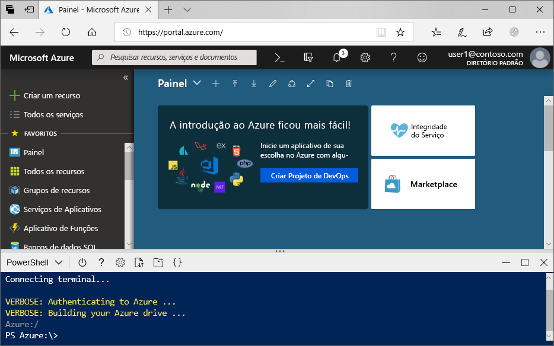
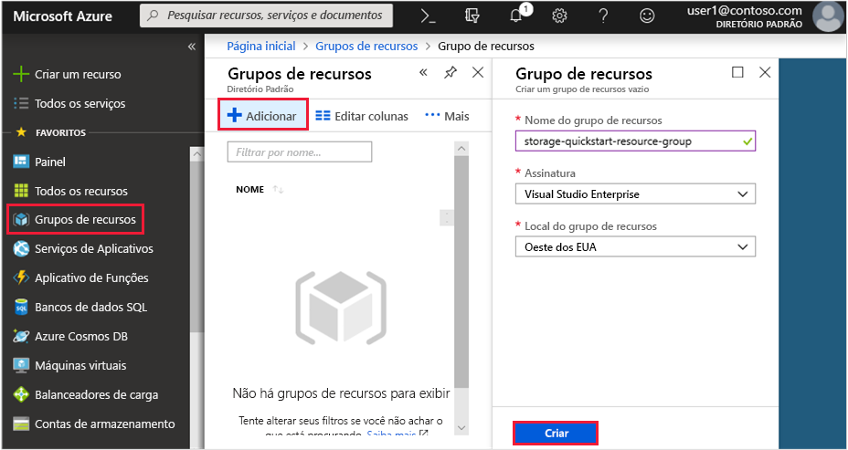
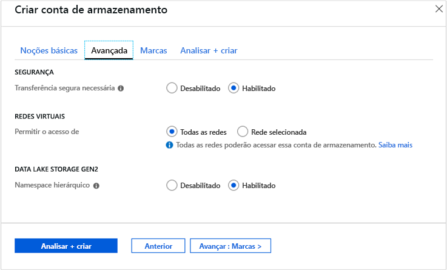

# <a name="quickstart-create-an-azure-data-lake-storage-gen2-storage-account"></a>Início Rápido: Criar uma conta de armazenamento do Azure Data Lake Storage Gen2

O Azure Data Lake Storage Gen2 [dá suporte a um serviço de namespace hierárquico](data-lake-storage-introduction.md) que fornece um sistema de arquivos baseado em diretórios nativo sob medida para funcionar com o HDFS (Sistema de Arquivos Distribuído Hadoop). O acesso aos dados do Armazenamento do Data Lake Gen2 pelo HDFS está disponível por meio do [driver ABFS](data-lake-storage-abfs-driver.md).

Este guia de início rápido demonstra como criar uma conta com o [portal do Azure](https://portal.azure.com/), o [Azure PowerShell](https://docs.microsoft.com/powershell/azure/overview) ou a [CLI do Azure](https://docs.microsoft.com/cli/azure?view=azure-cli-latest).

## <a name="prerequisites"></a>Pré-requisitos

Se você não tiver uma assinatura do Azure, crie uma [conta gratuita](https://azure.microsoft.com/free/) antes de começar. 

|           | Pré-requisito |
|-----------|--------------|
|Portal     | Nenhum         |
|PowerShell | Este início rápido requer o módulo PowerShell Az.Storage versão **0.7** ou posterior. Para localizar a versão atual, execute o comando `Get-Module -ListAvailable Az.Storage`. Se, após executar esse comando, nenhum resultado for exibido ou se uma versão diferente da **0.7** for exibida, será necessário atualizar seu módulo PowerShell. Confira a seção [Atualizar seu módulo PowerShell](#upgrade-your-powershell-module) deste guia.
|CLI        | Você pode fazer logon no Azure e executar comandos da CLI do Azure de uma das duas formas a seguir: <ul><li>Você pode executar comandos da CLI de dentro do portal do Azure, no Azure Cloud Shell </li><li>Você pode instalar a CLI e executar comandos da CLI localmente</li></ul>|

Ao trabalhar na linha de comando, você tem a opção de executar o Azure Cloud Shell ou instalar a CLI localmente.

### <a name="use-azure-cloud-shell"></a>Usar o Azure Cloud Shell

O Azure Cloud Shell é um shell Bash gratuito que pode ser executado diretamente no portal do Azure. Ele tem a CLI do Azure instalada e configurada para usar com sua conta. Clique no botão **Cloud Shell** no menu no canto superior direito do portal do Azure:

[](https://portal.azure.com)

O botão inicia um shell interativo que você pode usar para executar as etapas neste guia de início rápido:

[](https://portal.azure.com)

### <a name="install-the-cli-locally"></a>Instalar a CLI localmente

Você também pode instalar e usar a CLI do Azure localmente. Este início rápido exige que você esteja executando a versão 2.0.38 ou posterior da CLI do Azure. Execute `az --version` para encontrar a versão. Se você precisar instalar ou atualizar, confira [Instalar a CLI do Azure](/cli/azure/install-azure-cli).

## <a name="create-a-storage-account-with-azure-data-lake-storage-gen2-enabled"></a>Criar uma conta de armazenamento com o Azure Data Lake Storage Gen2 habilitado

Antes de criar uma conta, primeiro crie um grupo de recursos que atue como um contêiner lógico para contas de armazenamento ou outros recursos do Azure que você criar. Caso queira limpar os recursos criados por este guia de início rápido, você pode simplesmente excluir o grupo de recursos. A exclusão do grupo de recursos também exclui a conta de armazenamento associada e todos os outros recursos associados ao grupo de recursos. Para saber mais sobre grupos de recursos, confira [Visão geral do Azure Resource Manager](../../azure-resource-manager/resource-group-overview.md).

> [!NOTE]
> Você deve criar novas contas de armazenamento com o tipo **StorageV2 (uso geral V2)** para tirar proveito dos recursos de Armazenamento do Data Lake Gen2.  

Para saber mais sobre as contas de armazenamento, confira [Visão geral da conta de Armazenamento do Azure](../common/storage-account-overview.md).

Ao nomear sua conta de armazenamento, lembre-se dessas regras:

- Os nomes da conta de armazenamento devem ter entre 3 e 24 caracteres e podem conter apenas números e letras minúsculas.
- O nome da sua conta de armazenamento deve ser exclusivo no Azure. Duas contas de armazenamento não podem ter o mesmo nome.

## <a name="create-an-account-using-the-azure-portal"></a>Criar uma conta usando o portal do Azure

Faça logon no [Portal do Azure](https://portal.azure.com).

### <a name="create-a-resource-group"></a>Criar um grupo de recursos

Para criar um grupo de recursos no portal do Azure, siga estas etapas:

1. No portal do Azure, expanda o menu à esquerda para abrir o menu de serviços e escolha **Grupo de Recursos**.
2. Clique no botão **Adicionar** para adicionar um novo grupo de recursos.
3. Insira um nome para o novo grupo de recursos.
4. Selecione a assinatura na qual criar o novo grupo de recursos.
5. Escolha o local para o grupo de recursos.
6. Selecione o botão **Criar**.  

   

### <a name="create-a-general-purpose-v2-storage-account"></a>Criar uma conta de armazenamento de uso geral v2

Para criar uma conta de armazenamento de uso geral v2 no portal do Azure, siga estas etapas:

> [!NOTE]
> O namespace hierárquico está disponível atualmente em todas as regiões públicas. No momento, ele não está disponível em nuvens soberanas.

1. No portal do Azure, expanda o menu à esquerda para abrir o menu de serviços e escolha **Todos os serviços**. Em seguida, role para baixo até **Armazenamento** e escolha **Contas de armazenamento**. Na janela **Contas de Armazenamento** que aparece, escolha **Adicionar**.
2. Selecione sua **Assinatura** e o **Grupo de recursos** criado anteriormente.
3. Insira um nome para a conta de armazenamento.
4. Defina **Local** como **Oeste dos EUA 2**
5. Deixe esses campos definidos como seus valores padrão: **Desempenho**, **Tipo de conta**, **Replicação**, **Camada de acesso**.
6. Escolha a assinatura na qual você deseja criar a conta de armazenamento.
7. Selecione **Avançar: Avançado >**
8. Deixe os valores nos campos **SEGURANÇA** e **REDES VIRTUAIS** definidos como seus padrões.
9. Na seção **Armazenamento do Data Lake Gen2 (versão prévia)**, defina **namespace hierárquico** como **Habilitado**.
10. Clique em **Revisar + Criar** para criar a conta de armazenamento.

    

Sua conta de armazenamento é criada por meio do portal.

### <a name="clean-up-resources"></a>Limpar recursos

Para remover um grupo de recursos usando o portal do Azure:

1. No portal do Azure, expanda o menu à esquerda para abrir o menu de serviços e escolha **Grupo de Recursos** para exibir a lista dos seus grupos de recursos.
2. Localize o grupo de recursos a ser excluído e clique com o botão direito do mouse no botão **Mais** (**...**) do lado direito da lista.
3. Selecione **Excluir grupo de recursos** e confirme.

## <a name="create-an-account-using-powershell"></a>Criar uma conta usando o PowerShell

Primeiro, instale a última versão do módulo [PowerShellGet](https://docs.microsoft.com/powershell/gallery/installing-psget) do PowerShell.

Em seguida, atualize seu módulo PowerShell, faça logon em sua assinatura do Azure, crie um grupo de recursos e, em seguida, crie uma conta de armazenamento.

### <a name="upgrade-your-powershell-module"></a>Atualizar seu módulo do powershell

[!INCLUDE [updated-for-az](../../../includes/updated-for-az.md)]

Para interagir com o Data Lake Storage Gen2 usando o PowerShell, será necessário instalar o módulo Az.Storage versão **0.7** ou posterior.

Comece abrindo uma sessão do PowerShell com permissões elevadas.

Instalar o módulo Az.Storage

```powershell
Install-Module Az.Storage -Repository PSGallery -RequiredVersion 0.7.0 -AllowPrerelease -AllowClobber -Force
```

> [!NOTE]
> Os módulos Az do Azure PowerShell são os módulos preferidos para trabalhar com serviços do Azure no PowerShell. Para saber mais, confira [Apresentação do novo módulo Az do Azure PowerShell](https://docs.microsoft.com/powershell/azure/new-azureps-module-az).

### <a name="log-in-to-your-azure-subscription"></a>Fazer logon na Assinatura do Azure

Use o comando `Login-AzAccount` e siga as instruções na tela para fazer a autenticação.

```powershell
Login-AzAccount
```

### <a name="create-a-resource-group"></a>Criar um grupo de recursos

Para criar um novo grupo de recursos com o PowerShell, use o comando [New-AzResourceGroup](/powershell/module/az.resources/new-azresourcegroup): 

> [!NOTE]
> O namespace hierárquico está disponível atualmente em todas as regiões públicas. No momento, ele não está disponível em nuvens soberanas.

```powershell
# put resource group in a variable so you can use the same group name going forward,
# without hardcoding it repeatedly
$resourceGroup = "storage-quickstart-resource-group"
$location = "westus2"
New-AzResourceGroup -Name $resourceGroup -Location $location
```

### <a name="create-a-general-purpose-v2-storage-account"></a>Criar uma conta de armazenamento de uso geral v2

Para criar uma conta de armazenamento de uso geral v2 do PowerShell com armazenamento com redundância local (LRS), use o comando [New-AzStorageAccount](/powershell/module/az.storage/New-azStorageAccount):

```powershell
$location = "westus2"

New-AzStorageAccount -ResourceGroupName $resourceGroup `
  -Name "storagequickstart" `
  -Location $location `
  -SkuName Standard_LRS `
  -Kind StorageV2 `
  -EnableHierarchicalNamespace $True
```

### <a name="clean-up-resources"></a>Limpar recursos

Para remover o grupo de recursos e seus recursos associados, incluindo a nova conta de armazenamento, use o comando [Remove-AzResourceGroup](/powershell/module/az.resources/remove-azresourcegroup): 

```powershell
Remove-AzResourceGroup -Name $resourceGroup
```

## <a name="create-an-account-using-azure-cli"></a>Criar uma conta usando a CLI do Azure

Para iniciar o Azure Cloud Shell, faça logon no [portal do Azure](https://portal.azure.com).

Se desejar fazer logon na instalação local da CLI, execute o comando de logon:

```cli
az login
```

### <a name="add-the-cli-extension-for-azure-data-lake-gen-2"></a>Adicionar a extensão da CLI para o Azure Data Lake Gen 2

Para interagir com o Data Lake Storage Gen2 usando a CLI, será necessário adicionar uma extensão ao seu shell.

Para fazer isso, insira o seguinte comando usando o Cloud Shell ou um shell local: `az extension add --name storage-preview`

### <a name="create-a-resource-group"></a>Criar um grupo de recursos

Para criar um novo grupo de recursos com a CLI do Azure, use o comando [az group create](/cli/azure/group#az_group_create).

```azurecli-interactive
az group create `
    --name storage-quickstart-resource-group `
    --location westus2
```

> [!NOTE]
> > O namespace hierárquico está disponível atualmente em todas as regiões públicas. No momento, ele não está disponível em nuvens soberanas.

### <a name="create-a-general-purpose-v2-storage-account"></a>Criar uma conta de armazenamento de uso geral v2

Para criar uma conta de armazenamento de uso geral v2 a partir da CLI do Azure com armazenamento com redundância local, use o comando [az storage account create](/cli/azure/storage/account).

```azurecli-interactive
az storage account create `
    --name storagequickstart `
    --resource-group storage-quickstart-resource-group `
    --location westus2 `
    --sku Standard_LRS `
    --kind StorageV2 `
    --hierarchical-namespace true
```

### <a name="clean-up-resources"></a>Limpar recursos

Para remover o grupo de recursos e seus recursos associados, incluindo a nova conta de armazenamento, use o comando [az group delete](/cli/azure/group#az_group_delete).

```azurecli-interactive
az group delete --name myResourceGroup
```

## <a name="next-steps"></a>Próximas etapas

Neste início rápido, você criou uma conta de armazenamento com recursos do Data Lake Storage Gen2. Para saber como carregar e baixar blobs para e da sua conta de armazenamento, confira o tópico a seguir.

* [AzCopy V10](https://docs.microsoft.com/azure/storage/common/storage-use-azcopy-v10?toc=%2fazure%2fstorage%2fblobs%2ftoc.json)
