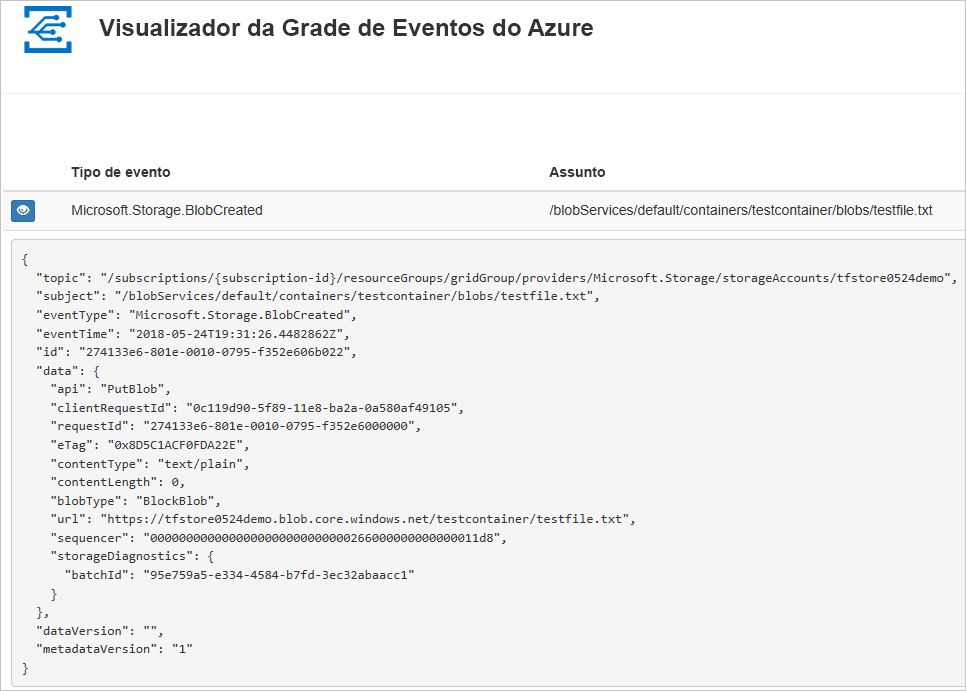
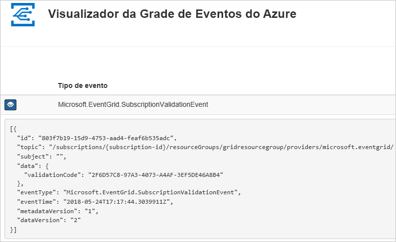

# <a name="route-blob-storage-events-to-a-custom-web-endpoint-with-azure-cli"></a>Encaminhar eventos de armazenamento de Blobs para um ponto de extremidade da Web personalizado com CLI do Azure

A Grade de Eventos do Azure é um serviço de eventos para a nuvem. Neste artigo, você usa a CLI do Azure para assinar eventos de Armazenamento de Blobs e acionar o evento a fim de exibir o resultado.

Normalmente, você envia eventos para um ponto de extremidade que processa os dados de evento e realiza ações. No entanto, para simplificar este artigo, você enviará os eventos para um aplicativo Web que coleta e exibe as mensagens.

Quando você concluir as etapas descritas neste artigo, verá que os dados do evento foi enviados para o aplicativo Web.




[!INCLUDE [quickstarts-free-trial-note.md](../../../includes/quickstarts-free-trial-note.md)]

[!INCLUDE [cloud-shell-try-it.md](../../../includes/cloud-shell-try-it.md)]

Se você optar por instalar e usar a CLI localmente, este artigo exigirá que você esteja executando a versão da CLI do Azure mais recente (2.0.24 ou posterior). Para saber qual é a versão, execute `az --version`. Se você precisa instalar ou atualizar, consulte [Instalar a CLI do Azure](/cli/azure/install-azure-cli).

Se você não estiver usando o Cloud Shell, primeiro você deve entrar usando `az login`.

## <a name="create-a-resource-group"></a>Criar um grupo de recursos

Os tópicos de Grade de Eventos são recursos do Azure e devem ser colocados em um grupo de recursos do Azure. O grupo de recursos do Azure é uma coleção lógica na qual os recursos do Azure são implantados e gerenciados.

Crie um grupo de recursos com o comando [az group create](/cli/azure/group#az_group_create). 

O exemplo a seguir cria um grupo de recursos chamado `<resource_group_name>` na localização *westcentralus*.  Substitua `<resource_group_name>` por um nome exclusivo para o grupo de recursos.

```azurecli-interactive
az group create --name <resource_group_name> --location westcentralus
```

## <a name="create-a-storage-account"></a>Criar uma conta de armazenamento

Para usar eventos de armazenamento de Blobs, você precisa de uma [conta de armazenamento Blob](../common/storage-create-storage-account.md?toc=%2fazure%2fstorage%2fblobs%2ftoc.json#blob-storage-accounts) ou uma [conta de armazenamento de uso geral v2](../common/storage-account-options.md#general-purpose-v2-accounts). As contas de **uso geral v2 (GPv2)** são contas de armazenamento que fornecem suporte a todos os recursos de todos os serviços de armazenamento, incluindo Blobs, Arquivos, Filas e Tabelas. Uma **conta de armazenamento Blob** é uma conta de armazenamento especializada para armazenar dados não estruturados como blobs (objetos) no Armazenamento do Microsoft Azure. As contas de armazenamento de Blobs são como contas de armazenamento de finalidade geral existentes e compartilham todos os excelentes recursos de durabilidade, disponibilidade, escalabilidade e desempenho que você usa atualmente, incluindo 100% de consistência de API para blobs de bloco e blobs de acréscimo. Para aplicativos que exigem apenas o armazenamento de blobs em bloco ou acréscimo, recomendamos o uso de contas de Armazenamento de Blobs. 

Substitua `<storage_account_name>` por um nome exclusivo para sua conta de armazenamento e `<resource_group_name>` pelo grupo de recursos criado anteriormente.

```azurecli-interactive
az storage account create \
  --name <storage_account_name> \
  --location westcentralus \
  --resource-group <resource_group_name> \
  --sku Standard_LRS \
  --kind BlobStorage \
  --access-tier Hot
```

## <a name="create-a-message-endpoint"></a>Criar um ponto de extremidade de mensagem

Antes de assinar o tópico, vamos criar o ponto de extremidade para a mensagem do evento. Normalmente, o ponto de extremidade executa ações com base nos dados de evento. Para simplificar este início rápido, você implanta um [aplicativo Web criado previamente](https://github.com/Azure-Samples/azure-event-grid-viewer) que exibe as mensagens de eventos. A solução implantada inclui um plano do Serviço de Aplicativo, um aplicativo Web do Aplicativo do Serviço de e o código-fonte do GitHub.

Substitua `<your-site-name>` por um nome exclusivo para o aplicativo Web. O nome do aplicativo Web deve ser exclusivo, pois é parte de uma entrada DNS.

```azurecli-interactive
sitename=<your-site-name>

az group deployment create \
  --resource-group <resource_group_name> \
  --template-uri "https://raw.githubusercontent.com/Azure-Samples/azure-event-grid-viewer/master/azuredeploy.json" \
  --parameters siteName=$sitename hostingPlanName=viewerhost
```

A implantação pode levar alguns minutos para ser concluída. Depois que a implantação for bem-sucedida, exiba seu aplicativo Web para garantir que ele esteja em execução. Em um navegador da Web, navegue até: `https://<your-site-name>.azurewebsites.net`

Você deve ver o site sem mensagens exibidas no momento.

[!INCLUDE [event-grid-register-provider-cli.md](../../../includes/event-grid-register-provider-cli.md)]

## <a name="subscribe-to-your-storage-account"></a>Assinar a sua conta de armazenamento

Assine um tópico para indicar à Grade de Eventos quais eventos você deseja acompanhar e para onde enviar esses eventos. O exemplo a seguir assina a conta de armazenamento que você criou e transmite a URL do aplicativo Web como o ponto de extremidade para a notificação de eventos. Substitua `<event_subscription_name>` por um nome para a assinatura de evento. Em `<resource_group_name>` e `<storage_account_name>`, use os valores criados anteriormente.

O ponto de extremidade para seu aplicativo Web deve incluir o sufixo `/api/updates/`.

```azurecli-interactive
storageid=$(az storage account show --name <storage_account_name> --resource-group <resource_group_name> --query id --output tsv)
endpoint=https://$sitename.azurewebsites.net/api/updates

az eventgrid event-subscription create \
  --resource-id $storageid \
  --name <event_subscription_name> \
  --endpoint $endpoint
```

Exiba novamente o seu aplicativo Web e observe que um evento de validação de assinatura foi enviado a ele. Selecione o ícone de olho para expandir os dados de evento. A Grade de Eventos envia o evento de validação de modo que o ponto de extremidade possa verificar se ele deseja receber os dados de evento. O aplicativo Web inclui o código para validar a assinatura.



## <a name="trigger-an-event-from-blob-storage"></a>Acionar um evento do Armazenamento de Blobs

Agora, vamos disparar um evento para ver como a Grade de Eventos distribui a mensagem para o ponto de extremidade. Primeiro, vamos configurar o nome e a chave da conta de armazenamento e, em seguida, nós criamos um contêiner para depois criar e carregar um arquivo. Novamente, use os valores de `<storage_account_name>` e `<resource_group_name>` criados anteriormente.

```azurecli-interactive
export AZURE_STORAGE_ACCOUNT=<storage_account_name>
export AZURE_STORAGE_ACCESS_KEY="$(az storage account keys list --account-name <storage_account_name> --resource-group <resource_group_name> --query "[0].value" --output tsv)"

az storage container create --name testcontainer

touch testfile.txt
az storage blob upload --file testfile.txt --container-name testcontainer --name testfile.txt
```

Você disparou o evento e a Grade de Eventos enviou a mensagem para o ponto de extremidade configurado durante a assinatura. Exiba seu aplicativo Web para ver o evento que você acabou de enviar.


```json
[{
  "topic": "/subscriptions/xxxxxxxx-xxxx-xxxx-xxxx-xxxxxxxxxxxx/resourceGroups/myrg/providers/Microsoft.Storage/storageAccounts/myblobstorageaccount",
  "subject": "/blobServices/default/containers/testcontainer/blobs/testfile.txt",
  "eventType": "Microsoft.Storage.BlobCreated",
  "eventTime": "2017-08-16T20:33:51.0595757Z",
  "id": "4d96b1d4-0001-00b3-58ce-16568c064fab",
  "data": {
    "api": "PutBlockList",
    "clientRequestId": "d65ca2e2-a168-4155-b7a4-2c925c18902f",
    "requestId": "4d96b1d4-0001-00b3-58ce-16568c000000",
    "eTag": "0x8D4E4E61AE038AD",
    "contentType": "text/plain",
    "contentLength": 0,
    "blobType": "BlockBlob",
    "url": "https://myblobstorageaccount.blob.core.windows.net/testcontainer/testblob1.txt",
    "sequencer": "00000000000000EB0000000000046199",
    "storageDiagnostics": {
      "batchId": "dffea416-b46e-4613-ac19-0371c0c5e352"
    }
  },
  "dataVersion": "",
  "metadataVersion": "1"
}]

```

## <a name="clean-up-resources"></a>Limpar recursos
Se você planeja continuar a trabalhar com essa assinatura de evento e conta de armazenamento, não limpe os recursos criados neste artigo. Caso contrário, use os comandos a seguir para excluir os recursos criados por você neste artigo.

Substitua `<resource_group_name>` pelo recurso de grupo criado acima.

```azurecli-interactive
az group delete --name <resource_group_name>
```

## <a name="next-steps"></a>Próximas etapas

Agora que sabe como criar tópicos e assinaturas de evento, saiba mais sobre os Eventos de Armazenamento de Blobs e o que a Grade de Eventos pode fazer por você:

- [Reagindo a eventos de Armazenamento de Blobs](storage-blob-event-overview.md)
- [Sobre a Grade de Eventos](../../event-grid/overview.md)
