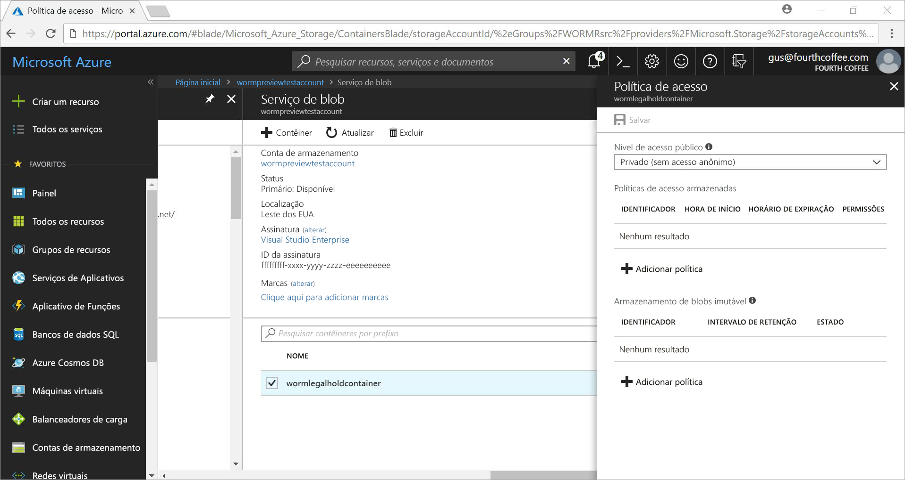
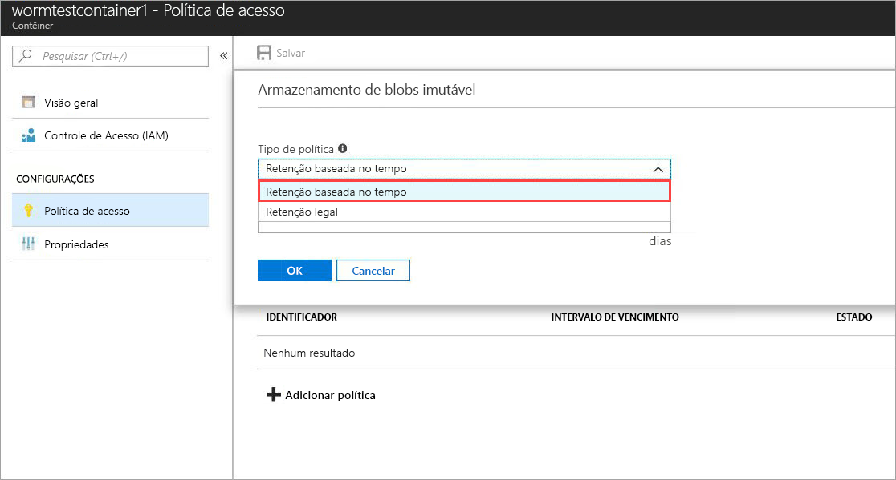
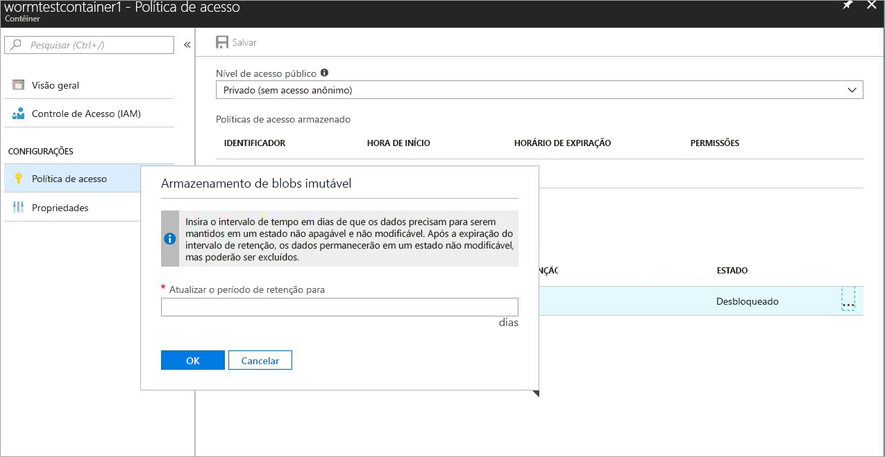
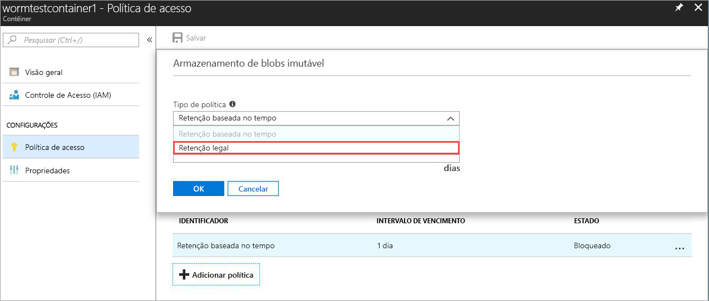
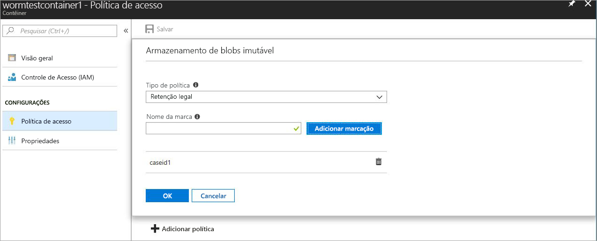

# <a name="store-business-critical-data-in-azure-blob-storage"></a>Armazenar dados comercialmente críticos no Armazenamento de Blobs do Azure

O armazenamento imutável do armazenamento de objetos Azure Blob (objetos) permite que os usuários armazenem dados essenciais aos negócios em um estado WORM (escrever uma vez, ler muitos). Esse estado torna os dados não apagáveis e não modificáveis para um intervalo especificado pelo usuário. Os blobs podem ser criados e lidos, mas não modificados ou excluídos, durante o intervalo de retenção.

## <a name="overview"></a>Visão geral

O armazenamento imutável ajuda instituições financeiras e indústrias relacionadas - especialmente organizações de corretoras - a armazenar dados com segurança. Ele também pode ser utilizado em qualquer cenário para proteger dados críticos contra exclusão.  

Os aplicativos típicos incluem:

- **Conformidade regulatória**: armazenamento imutável para armazenamento de Blobs do Azure ajuda as organizações a atender às regulamentações SEC 17a-4 (f), CFTC 1.31 (d), FINRA e outras.

- **Retenção segura de documentos**: o armazenamento de Blob garante que os dados não possam ser modificados ou excluídos por nenhum usuário, incluindo usuários com privilégios administrativos de conta.

- **Retenção legal**: o armazenamento imutável do armazenamento de Blobs do Azure permite que os usuários armazenem informações confidenciais que são essenciais para litígios ou investigações criminais em um estado à prova de falsificação pela duração desejada.

Armazenamento imutável permite:

- **Suporte à política de retenção baseada em tempo**: os usuários definem políticas para armazenar dados em um intervalo especificado.

- **Suporte à política de retenção legal**: quando o intervalo de retenção não é conhecido, os usuários podem definir retenções legais para armazenar dados imutáveis até que a retenção legal seja removida.  Quando uma retenção legal é definida, blobs podem ser criados e lidos, mas não modificados ou excluídos. Cada retenção legal é associada a uma marca alfanumérica, definida pelo usuário, que é usada como uma cadeia de caracteres do identificador (como uma ID do caso).

- **Suporte para todos os níveis de blob**: as políticas do WORM são independentes da camada de armazenamento do Azure Blob e se aplicam a todas as camadas: quente, legal e arquivamento. Os usuários podem fazer a transição dos dados de suas cargas de trabalho para a camada de custo mais otimizado, mantendo a imutabilidade dos dados.

- **Configuração no nível do contêiner**: os usuários podem configurar políticas de retenção com base no tempo e marcas de retenção legal no nível do contêiner. Ao usar configurações simples no nível do contêiner, os usuários podem criar e bloquear políticas de retenção baseadas em tempo, estender intervalos de retenção, definir e limpar retenção legal, entre outros. Essas políticas se aplicam a todos os blobs no contêiner, existentes e novos.

- **Suporte ao registro de auditoria**: cada contêiner inclui um registro de auditoria. Ele mostra até cinco comandos de retenção baseados em tempo para políticas de retenção com base em tempo bloqueado, com um máximo de três logs para extensões de intervalo de retenção. Para retenção baseada em tempo, o log contém o ID do usuário, o tipo de comando, os registros de data e hora e o intervalo de retenção. Para retenções legais, o log contém as identificações de ID do usuário, tipo de comando, carimbos de tempo e retenção legal. Este registro é retido durante a vida útil do contêiner, de acordo com as diretrizes regulamentares da SEC 17a-4 (f). O [Log de Atividades do Azure](https://docs.microsoft.com/azure/monitoring-and-diagnostics/monitoring-overview-activity-logs) mostra um log mais abrangente de todas as atividades do plano de controle. É responsabilidade do usuário armazenar esses logs de forma persistente, conforme o necessário para regulamentações ou outros fins.

O armazenamento imutável está ativado em todas as regiões públicas do Azure.

## <a name="how-it-works"></a>Como ele funciona

O armazenamento imutável para armazenamento de Blobs do Azure oferece suporte a dois tipos de políticas WORM ou imutáveis: retenção baseada em tempo e retenções legais. Para obter detalhes sobre como criar essas políticas imutáveis, consulte a seção [Introdução](#Getting-started).

Quando uma política de retenção baseada em tempo ou retenção legal é aplicada em um contêiner, todos os blobs existentes são movidos para o estado imutável (gravação e exclusão protegida). Todos os novos blobs carregados no contêiner também serão movidos para o estado imutável.

> [!IMPORTANT]
> Uma política de retenção baseada em tempo deve ser *bloqueada* para que o blob esteja em um estado imutável (gravar e excluir protegido) para a SEC 17a-4 (f) e outras normas de conformidade. Recomendamos que você bloqueie a política em um período de tempo razoável, geralmente dentro de 24 horas. Não recomendamos usar o *desbloqueada* estado para qualquer finalidade que não seja de avaliações de recurso de curto prazo.

Quando uma política de retenção baseada em tempo é aplicada em um contêiner, todos os blobs no contêiner ficará no estado imutável durante o *efetivo* período de retenção. O período efetivo de retenção de blobs existentes é igual à diferença entre a hora de criação do blob e o intervalo de retenção especificado pelo usuário.

Para novos blobs, o período efetivo de retenção é igual ao intervalo de retenção especificado pelo usuário. Como os usuários podem estender o intervalo de retenção, o armazenamento imutável usa o valor mais recente do intervalo de retenção especificado pelo usuário para calcular o período de retenção efetivo.

> [!TIP]
> Exemplo:
>
> Um usuário cria uma política de retenção baseada em tempo com um intervalo de retenção de cinco anos.
>
> O blob existente nesse contêiner, testblob1, foi criado um ano atrás. O período de retenção em vigor para testblob1 é quatro anos.
>
> Um novo blob, testblob2, agora é carregado no contêiner. O período de retenção em vigor para esse novo blob é de cinco anos.

### <a name="legal-holds"></a>Retenções legais

Quando você define uma retenção legal, todos os blobs novos e existentes permanecem em um estado imutável até que a retenção legal é limpo. Para obter mais informações sobre como definir e retenções legais clara, consulte a seção [guia de Introdução](#Getting-started).

Um contêiner pode ter uma retenção legal e uma política de retenção baseada no tempo ao mesmo tempo. Todos os blobs nesse contêiner permanecem no estado imutável até que todas as retenções legais sejam apagadas, mesmo que o período de retenção efetivo tenha expirado. Por outro lado, um blob permanece em um estado imutável até que o período de retenção efetivo expire, mesmo que todas as retenções legais tenham sido compensadas.

A tabela a seguir mostra os tipos de operações de blob desativadas para os diferentes cenários imutáveis. Para obter mais informações, consulte a documentação da [API do Serviço de Blob do Azure](https://docs.microsoft.com/rest/api/storageservices/blob-service-rest-api).

|Cenário  |Estado do blob  |Operações de blob não permitidas  |
|---------|---------|---------|
|O intervalo efetivo de retenção no blob ainda não expirou e/ou a retenção legal está definida     |Imutável: protegido contra exclusão e gravação         |Excluir contêiner, excluir blob, inserir blob<sup>1</sup>, inserir bloco<sup>1</sup>, inserir lista de blocos<sup>1</sup>, definir metadados de blob, inserir página, definir propriedades de blob, obter instantâneo de blob, fazer cópia incremental de blob, acrescentar bloco         |
|O intervalo efetivo de retenção no blob expirou     |Protegido apenas contra gravação  (operações de exclusão são permitidas)         |Inserir blob<sup>1</sup>, inserir bloco<sup>1</sup>, inserir lista de blocos<sup>1</sup>, definir metadados de blob, inserir página, definir propriedades de blob, obter instantâneo de blob, fazer cópia incremental de blob, acrescentar bloco         |
|Todas as retenções legais são liberadas e nenhuma política de retenção baseada em tempo é definida no contêiner     |Mutável         |Nenhum         |
|Nenhuma política WORM é criada (retenção baseada em tempo ou retenção legal)     |Mutável         |Nenhum         |

<sup>1</sup> O aplicativo pode chamar essa operação para criar um blob de uma vez. As próximas operações no blob não serão permitidas.

> [!NOTE]
>
> O armazenamento imutável está disponível apenas nas contas de Armazenamento de Blobs e de Uso Geral V2. A conta precisa ser criada por meio do [Azure Resource Manager](https://docs.microsoft.com/azure/azure-resource-manager/resource-group-overview).

## <a name="pricing"></a>Preços

Não há nenhum custo adicional para usar esse recurso. Dados imutáveis são cobrados da mesma forma como dados regulares, mutáveis. Para obter detalhes de preço do Armazenamento de Blobs do Azure, confira a [Página de preços do Armazenamento do Azure](https://azure.microsoft.com/pricing/details/storage/blobs/).


## <a name="getting-started"></a>Introdução

As versões mais recentes do [portal do Azure](http://portal.azure.com) e da [CLI do Azure](https://docs.microsoft.com/cli/azure/install-azure-cli?view=azure-cli-latest), bem como a versão prévia do [Azure PowerShell](https://github.com/Azure/azure-powershell/releases/tag/Azure.Storage.v4.4.0-preview-May2018) dão suporte ao armazenamento imutável para o Armazenamento de Blobs do Azure.

### <a name="azure-portal"></a>Portal do Azure

1. Crie um novo contêiner ou selecione um existente para armazenar os blobs que precisam ser mantidos no estado imutável.
 O contêiner precisa estar em uma conta de Armazenamento de Blobs ou GPv2.
2. Selecione **Política de acesso** no menu de contexto. Em seguida, selecione **+ Adicionar política** em **Armazenamento de blobs imutável**.

    

3. Para habilitar a retenção baseada em tempo, selecione **baseada em tempo de retenção** no menu suspenso.

    

4. Digite o intervalo de retenção em dias (mínimo é de um dia).

    

    Como você pode ver na captura de tela, o estado inicial da política é desbloqueado. Você pode testar o recurso com um intervalo de retenção menor e fazer alterações à política antes de você bloqueá-lo. O bloqueio é essencial para a conformidade com as normas, como SEC 17a-4.

5. A política de bloqueio. Clique no botão de reticências (**...**), e o seguinte menu será exibido:

    

    Selecione **Lock Policy**, e o estado da política agora aparece como bloqueado. Depois que a política é bloqueada, ela não pode ser excluída e somente as extensões do intervalo de retenção serão permitidas.

6. Para ativar retenções legais, selecione **+ Adicionar Política**. Selecione **Retenção legal** no menu suspenso.

    

7. Crie uma retenção legal com uma ou mais tags.

    

8. Para limpar uma retenção legal, basta remover a marca.

### <a name="azure-cli"></a>CLI do Azure

O recurso está incluído nos seguintes grupos de comandos: `az storage container immutability-policy`e`az storage container legal-hold`. Execute `-h` neles para ver os comandos.

### <a name="powershell"></a>PowerShell

[PowerShell versão 4.4.0-preview](https://github.com/Azure/azure-powershell/releases/tag/Azure.Storage.v4.4.0-preview-May20180) dá suporte ao armazenamento imutável.
Para habilitar o recurso, siga estas etapas:

1. Certifique-se de que você tenha a versão mais recente do PowerShellGet instalado: `Install-Module PowerShellGet –Repository PSGallery –Force`.
2. Remova qualquer instalação anterior do PowerShell do Azure.
3. Instalação do AzureRM: `Install-Module AzureRM –Repository PSGallery –AllowClobber`. Azure pode ser instalado da mesma forma deste repositório.
4. Instale a versão de visualização dos cmdlets do plano de gerenciamento de armazenamento: `Install-Module -Name AzureRM.Storage -AllowPrerelease -Repository PSGallery -AllowClobber`.

O [código do PowerShell de exemplo](#sample-powershell-code) seção mais adiante neste artigo ilustra o uso de recurso.

## <a name="client-libraries"></a>Bibliotecas de cliente

As seguintes bibliotecas de cliente dão suporte a armazenamento imutável para o armazenamento de BLOBs do Azure:

- [Biblioteca de cliente .NET versão 7.2.0-preview e posterior](https://www.nuget.org/packages/Microsoft.Azure.Management.Storage/7.2.0-preview)
- [Biblioteca do cliente Node.js versão 4.0.0 e posterior](https://www.npmjs.com/package/azure-arm-storage)
- [Biblioteca de cliente do Python versão 2.0.0 versão Release Candidate 2 e posterior](https://pypi.org/project/azure-mgmt-storage/2.0.0rc2/)
- [Biblioteca de clientes Java](https://github.com/Azure/azure-rest-api-specs/tree/master/specification/storage/resource-manager/Microsoft.Storage/preview/2018-03-01-preview)

## <a name="supported-values"></a>Valores com suporte

- O intervalo de retenção mínimo é um dia. O máximo é de 400 anos.
- Para uma conta de armazenamento, o número máximo de contêineres com políticas imutáveis bloqueados é 1.000.
- Para uma conta de armazenamento, o número máximo de contêineres com uma configuração de retenção legal é 1.000.
- Para um contêiner, o número máximo de tags de retenção legal é 10.
- O comprimento máximo de uma tag de retenção legal é de 23 caracteres alfanuméricos. O comprimento mínimo é de três caracteres.
- Para um contêiner, o número máximo de extensões de intervalo de retenção permitido para políticas imutáveis bloqueadas é três.
- Para um contêiner com uma política imutável bloqueado, um máximo de cinco logs da política de retenção baseada em tempo e um máximo de 10 legal mantenha os logs são mantidos para a duração do contêiner de política.

## <a name="faq"></a>Perguntas frequentes

**O recurso se aplica apenas a blobs de bloco ou a páginas e acréscimos de blobs também?**

O armazenamento imutável pode ser usado com qualquer tipo de blob, mas é mais recomendado usá-lo para blobs de blocos. Ao contrário dos blobs de bloco, os blobs de página e os blobs de acréscimo precisam ser criados fora de um contêiner WORM e depois copiados. Depois de copiar esses blobs em um contêiner WORM, nenhum outro *anexa* a um blob de acréscimo ou alterações a um blob de página são permitidos.

**Sempre preciso criar uma nova conta de armazenamento para esse recurso?**

Você pode usar o armazenamento imutável com qualquer conta de Armazenamento de Blobs ou de Uso Geral V2 existente. Esse recurso está disponível somente para o Armazenamento de Blobs.

**O que acontece se eu tentar excluir um contêiner com uma política de retenção baseada em tempo ou retenção legal *bloqueada*?**

A operação Excluir contêiner falhará se houver pelo menos um blob com uma política de retenção baseada em tempo ou uma retenção legal bloqueada. A operação Excluir contêiner será bem-sucedida somente se não houver nenhum blob com um intervalo de retenção ativo e não houver nenhuma retenção legal. Você deve excluir os blobs antes de excluir o contêiner.

**O que acontece se eu tentar excluir uma conta de armazenamento com um contêiner WORM que tem uma política de retenção baseada em tempo ou retenção legal *bloqueada*?**

A exclusão da conta de armazenamento falhará se houver pelo menos um contêiner WORM com retenção legal ou um blob com um intervalo de retenção ativa.  Você deve excluir todos os contêineres do WORM antes de excluir a conta de armazenamento. Para obter informações sobre exclusão de contêiner, consulte a pergunta anterior.

**Posso mover os dados entre níveis diferentes de blob (frequente, esporádico, passivo) quando o blob estiver no estado imutável?**

Sim, você pode usar o comando Definir nível de Blob para mover dados entre as camadas de blob, mantendo os dados no estado imutável. O armazenamento imutável tem suporte nas camadas de blob frequente, esporádica e de arquivos.

**O que acontece se eu não conseguir pagar e meu intervalo de retenção não expirou?**

No caso de não pagamento, as políticas normais de retenção de dados serão aplicadas conforme estipulado nos termos e condições do seu contrato com a Microsoft.

**Há oferta de um período de avaliação ou de cortesia para apenas experimentar o recurso?**

Sim. Quando uma política de retenção baseada em tempo é criada pela primeira vez, ela está em um estado *desbloqueado*. Nesse estado, você pode fazer qualquer alteração desejada no intervalo de retenção, como aumentar ou diminuir e até excluir a política. Depois que a política é bloqueada, ela permanece bloqueada até que o intervalo de retenção expire. Isso evita a exclusão e modificação do intervalo de retenção. É altamente recomendável que você use o *desbloqueada* apenas para fins de avaliação de estado e a política de bloqueio dentro de um período de 24 horas. Essas práticas ajudarão-lo a cumprir 17a-4(f) s e outros regulamentos.

**O recurso está disponível nas nuvens nacionais e governamentais?**

Armazenamento imutável está atualmente disponível somente em regiões públicas do Azure. Se você estiver interessado em uma nuvem nacional específica, envie um e-mail azurestoragefeedback@microsoft.com.

## <a name="sample-powershell-code"></a>Exemplos de código do PowerShell

O exemplo de script do PowerShell a seguir é para referência. Este script cria uma nova conta e contêiner de armazenamento. Em seguida, ele mostra como definir e limpar detenções legais, criar e bloquear uma política de retenção baseada em tempo (também conhecida como política de imutabilidade) e estender o intervalo de retenção.

Configurar e testar a conta de Armazenamento do Azure:

```powershell
$ResourceGroup = "<Enter your resource group>”
$StorageAccount = "<Enter your storage account name>"
$container = "<Enter your container name>"
$container2 = "<Enter another container name>”
$location = "<Enter the storage account location>"

# Log in to the Azure Resource Manager account
Login-AzureRMAccount
Register-AzureRmResourceProvider -ProviderNamespace "Microsoft.Storage"

# Create your Azure resource group
New-AzureRmResourceGroup -Name $ResourceGroup -Location $location

# Create your Azure storage account
New-AzureRmStorageAccount -ResourceGroupName $ResourceGroup -StorageAccountName `
    $StorageAccount -SkuName Standard_LRS -Location $location -Kind StorageV2

# Create a new container
New-AzureRmStorageContainer -ResourceGroupName $ResourceGroup `
    -StorageAccountName $StorageAccount -Name $container

# Create Container 2 with a storage account object
$accountObject = Get-AzureRmStorageAccount -ResourceGroupName $ResourceGroup `
    -StorageAccountName $StorageAccount
New-AzureRmStorageContainer -StorageAccount $accountObject -Name $container2

# Get a container
Get-AzureRmStorageContainer -ResourceGroupName $ResourceGroup `
    -StorageAccountName $StorageAccount -Name $container

# Get a container with an account object
$containerObject = Get-AzureRmStorageContainer -StorageAccount $accountObject -Name $container

# List containers
Get-AzureRmStorageContainer -ResourceGroupName $ResourceGroup `
    -StorageAccountName $StorageAccount

# Remove a container (add -Force to dismiss the prompt)
Remove-AzureRmStorageContainer -ResourceGroupName $ResourceGroup `
    -StorageAccountName $StorageAccount -Name $container2

# Remove a container with an account object
Remove-AzureRmStorageContainer -StorageAccount $accountObject -Name $container2

# Remove a container with a container object
$containerObject2 = Get-AzureRmStorageContainer -StorageAccount $accountObject -Name $container2
Remove-AzureRmStorageContainer -InputObject $containerObject2
```

Definir e limpar retenções legais:

```powershell
# Set a legal hold
Add-AzureRmStorageContainerLegalHold -ResourceGroupName $ResourceGroup `
    -StorageAccountName $StorageAccount -Name $container -Tag <tag1>,<tag2>,...

# with an account object
Add-AzureRmStorageContainerLegalHold -StorageAccount $accountObject -Name $container -Tag <tag3>

# with a container object
Add-AzureRmStorageContainerLegalHold -Container $containerObject -Tag <tag4>,<tag5>,...

# Clear a legal hold
Remove-AzureRmStorageContainerLegalHold -ResourceGroupName $ResourceGroup `
    -StorageAccountName $StorageAccount -Name $container -Tag <tag2>

# with an account object
Remove-AzureRmStorageContainerLegalHold -StorageAccount $accountObject -Name $container -Tag <tag3>,<tag5>

# with a container object
Remove-AzureRmStorageContainerLegalHold -Container $containerObject -Tag <tag4>
```

Criar ou atualizar políticas de imutabilidade:
```powershell
# with an account name or container name
Set-AzureRmStorageContainerImmutabilityPolicy -ResourceGroupName $ResourceGroup `
    -StorageAccountName $StorageAccount -ContainerName $container -ImmutabilityPeriod 10

# with an account object
Set-AzureRmStorageContainerImmutabilityPolicy -StorageAccount $accountObject `
    -ContainerName $container -ImmutabilityPeriod 1 -Etag $policy.Etag

# with a container object
$policy = Set-AzureRmStorageContainerImmutabilityPolicy -Container `
    $containerObject -ImmutabilityPeriod 7

# with an immutability policy object
Set-AzureRmStorageContainerImmutabilityPolicy -ImmutabilityPolicy $policy -ImmutabilityPeriod 5
```

Recuperar políticas de imutabilidade:
```powershell
# Get an immutability policy
Get-AzureRmStorageContainerImmutabilityPolicy -ResourceGroupName $ResourceGroup `
    -StorageAccountName $StorageAccount -ContainerName $container

# with an account object
Get-AzureRmStorageContainerImmutabilityPolicy -StorageAccount $accountObject `
    -ContainerName $container

# with a container object
Get-AzureRmStorageContainerImmutabilityPolicy -Container $containerObject
```

Bloquear políticas de imutabilidade (adicione -Force para ignorar o prompt):
```powershell
# with an immutability policy object
$policy = Get-AzureRmStorageContainerImmutabilityPolicy -ResourceGroupName `
    $ResourceGroup -StorageAccountName $StorageAccount -ContainerName $container
$policy = Lock-AzureRmStorageContainerImmutabilityPolicy -ImmutabilityPolicy $policy -force

# with an account name or container name
$policy = Lock-AzureRmStorageContainerImmutabilityPolicy -ResourceGroupName `
    $ResourceGroup -StorageAccountName $StorageAccount -ContainerName $container `
    -Etag $policy.Etag

# with an account object
$policy = Lock-AzureRmStorageContainerImmutabilityPolicy -StorageAccount `
    $accountObject -ContainerName $container -Etag $policy.Etag

# with a container object
$policy = Lock-AzureRmStorageContainerImmutabilityPolicy -Container `
    $containerObject -Etag $policy.Etag -force
```

Estender as políticas de imutabilidade:
```powershell

# with an immutability policy object
$policy = Get-AzureRmStorageContainerImmutabilityPolicy -ResourceGroupName `
    $ResourceGroup -StorageAccountName $StorageAccount -ContainerName $container

$policy = Set-AzureRmStorageContainerImmutabilityPolicy -ImmutabilityPolicy `
    $policy -ImmutabilityPeriod 11 -ExtendPolicy

# with an account name or container name
$policy = Set-AzureRmStorageContainerImmutabilityPolicy -ResourceGroupName `
    $ResourceGroup -StorageAccountName $StorageAccount -ContainerName $container `
    -ImmutabilityPeriod 11 -Etag $policy.Etag -ExtendPolicy

# with an account object
$policy = Set-AzureRmStorageContainerImmutabilityPolicy -StorageAccount `
    $accountObject -ContainerName $container -ImmutabilityPeriod 12 -Etag `
    $policy.Etag -ExtendPolicy

# with a container object
$policy = Set-AzureRmStorageContainerImmutabilityPolicy -Container `
    $containerObject -ImmutabilityPeriod 13 -Etag $policy.Etag -ExtendPolicy
```

Remover uma política de imutabilidade (adicione -Force para ignorar o prompt):
```powershell
# with an immutability policy object
$policy = Get-AzureRmStorageContainerImmutabilityPolicy -ResourceGroupName `
    $ResourceGroup -StorageAccountName $StorageAccount -ContainerName $container
Remove-AzureRmStorageContainerImmutabilityPolicy -ImmutabilityPolicy $policy

# with an account name or container name
Remove-AzureRmStorageContainerImmutabilityPolicy -ResourceGroupName `
    $ResourceGroup -StorageAccountName $StorageAccount -ContainerName $container `
    -Etag $policy.Etag

# with an account object
Remove-AzureRmStorageContainerImmutabilityPolicy -StorageAccount $accountObject `
    -ContainerName $container -Etag $policy.Etag

# with a container object
Remove-AzureRmStorageContainerImmutabilityPolicy -Container $containerObject `
    -Etag $policy.Etag

```
