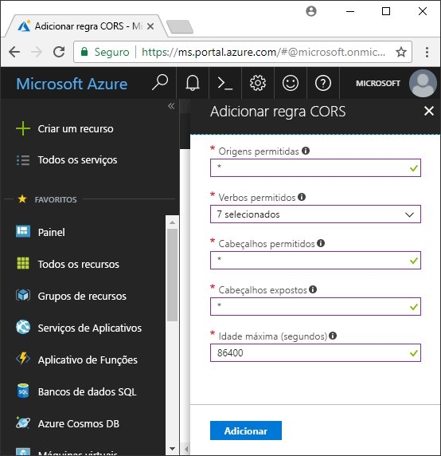

<!-- Customer intent: As a web application developer I want to interface with Azure Blob storage entirely on the client so that I can build a SPA application that is able to upload and delete files on blob storage. -->

# <a name="quickstart-upload-list-and-delete-blobs-using-javascripthtml-in-the-browser"></a>Início Rápido: carregar, listar e excluir blobs usando JavaScript/HTML no navegador
Este guia de início rápido demonstra como gerenciar blobs a partir do código executado totalmente no navegador. A abordagem usada aqui mostra como usar medidas de segurança necessárias para garantir o acesso protegido à sua conta de Armazenamento de blob. Para concluir este início rápido, você precisa de uma [assinatura do Azure](https://azure.microsoft.com/free/?WT.mc_id=A261C142F).

[!INCLUDE [storage-create-account-portal-include](../../../includes/storage-create-account-portal-include.md)]

## <a name="setting-up-storage-account-cors-rules"></a>Configurando regras de CORS para a conta de armazenamento 
Antes de seu aplicativo Web poder acessar um armazenamento de blobs do cliente, a conta precisará ser configurada para habilitar [CORS](https://docs.microsoft.com/rest/api/storageservices/cross-origin-resource-sharing--cors--support-for-the-azure-storage-services), ou Compartilhamento de recursos entre origens. 

Retorne ao portal do Azure e selecione a conta de armazenamento. Para definir uma nova regra de CORS, retorne para a seção **Configurações** e clique no link **CORS**. Em seguida, clique no botão **Adicionar** para abrir a janela **Adicionar regra de CORS**. Para este início rápido, crie uma regra de CORS aberta:



A tabela a seguir descreve cada configuração de CORS e explica os valores usados para definir a regra.

|Configuração  |Valor  | DESCRIÇÃO |
|---------|---------|---------|
| Origens permitidas | * | Aceita uma lista de domínios definidos como origens aceitáveis delimitada por vírgulas. Definir o valor como `*` permite o acesso de todos os domínios à conta de armazenamento. |
| Verbos permitidos     | delete, get, head, merge, post, options e put | Lista os verbos HTTP que podem ser executados na conta de armazenamento. Para este início rápido, selecione todas as opções disponíveis. |
| Cabeçalhos permitidos | * | Define uma lista de cabeçalhos de solicitação (inclusive cabeçalhos prefixados) permitidos pela conta de armazenamento. Definir o valor como `*` permite o acesso de todos os cabeçalhos. |
| Cabeçalhos expostos | * | Lista os cabeçalhos de resposta permitidos pela conta. Definir o valor como `*` permite que a conta envie qualquer cabeçalho.  |
| Idade máxima (segundos) | 86.400 | A quantidade máxima de tempo que o navegador armazena em cache a solicitação OPTIONS de simulação. Um valor de *86.400* permite que o cache permaneça um dia inteiro. |

> [!IMPORTANT]
> Verifique se as configurações que você usa na produção expõem o mínimo de acesso à conta de armazenamento necessário a fim de manter o acesso seguro. As configurações de CORS descritas aqui são mais adequadas para um início rápido, já que elas definem uma política de segurança branda. No entanto, essas configurações não são recomendadas para um contexto no mundo real.

Em seguida, use Azure Cloud Shell para criar um token de segurança.

[!INCLUDE [Open the Azure cloud shell](../../../includes/cloud-shell-try-it.md)]

## <a name="create-a-shared-access-signature"></a>Criar uma Assinatura de Acesso Compartilhado
A assinatura de acesso compartilhado (SAS) é usada pelo código em execução no navegador para autorizar solicitações para o Armazenamento de Blobs. Ao usar a SAS, o cliente pode autorizar o acesso a recursos de armazenamento sem a cadeia de conexão ou chave de acesso da conta. Para saber mais, confira [Usando SAS (Assinaturas de Acesso Compartilhado)](../common/storage-dotnet-shared-access-signature-part-1.md).

Você pode criar uma SAS usando a CLI do Azure por meio do Azure Cloud Shell ou com o Gerenciador de Armazenamento do Azure. A tabela a seguir descreve os parâmetros para os quais você precisa fornecer valores a fim de gerar uma SAS com a CLI.

| Parâmetro      |DESCRIÇÃO  | Placeholder |
|----------------|-------------|-------------|
| *expiry*       | A data de validade do token de acesso no formato AAAA-MM-DD. Insira a data do dia seguinte ao usar este guia de início rápido. | *FUTURE_DATE* |
| *account-name* | O nome da conta de armazenamento. Use o nome separado em uma etapa anterior. | *YOUR_STORAGE_ACCOUNT_NAME* |
| *account-key*  | A chave da conta de armazenamento. Use a chave separada em uma etapa anterior. | *YOUR_STORAGE_ACCOUNT_KEY* |

O script a seguir usou a CLI do Azure para criar uma SAS que você pode passar para um serviço Blob JavaScript.

> [!NOTE]
> Para obter melhlores resultados remova o excesso de espaços entre os parâmetros antes de colar o comando no Azure Cloud Shell.

```bash
az storage account generate-sas
                    --permissions racwdl
                    --resource-types sco
                    --services b
                    --expiry FUTURE_DATE
                    --account-name YOUR_STORAGE_ACCOUNT_NAME
                    --account-key YOUR_STORAGE_ACCOUNT_KEY
```
A série de valores depois de cada parâmetro pode parecer um pouco confusa. Esses valores de parâmetro são tirados da primeira letra de suas respectivas permissões. A tabela abaixo explica de onde vêm os valores: 

| Parâmetro        | Valor   | DESCRIÇÃO  |
|------------------|---------|---------|
| *permissions*    | racwdl  | Essa SAS permite *ler*, *acrescentar*, *criar*, *gravar*, *excluir* e *listar* recursos. |
| *resource-types* | sco     | Os recursos afetados pela SAS são *serviço*, *contêiner* e *objeto*. |
| *services*       | b       | O serviço afetado pela SAS é o serviço *Blob*. |

Agora que a SAS foi gerada, copie o valor retornado para o console em seu editor de texto. Esse valor será usado em uma etapa posterior.

> [!IMPORTANT]
> Na produção, sempre passe os tokens SAS usando SSL. Além disso, os tokens SAS devem ser gerados no servidor e enviados para a página HTML na ordem inversa de passagem para o Armazenamento de Blobs do Azure. Uma abordagem possível é usar uma função sem servidor para gerar tokens SAS. O Portal do Azure inclui modelos de função que possuem a capacidade de gerar uma SAS com uma função do JavaScript.

## <a name="implement-the-html-page"></a>Implementar a página HTML

### <a name="set-up-the-web-application"></a>Configurar o aplicativo Web
As bibliotecas de clientes JavaScript do Armazenamento do Azure não funcionarão diretamente a partir do sistema de arquivos e deverão ser fornecidas por um servidor Web. Portanto, as etapas a seguir detalham como usar um servidor Web local simples com Node.js.

> [!NOTE]
> Esta seção mostra como criar um servidor Web local e, para isso, o Node.js precisa estar instalado em seu computador. Se você não quiser instalar o Node.js, use algum outro meio de execução de um servidor Web local.

Primeiro, crie uma nova pasta para o seu projeto e nomeie-a *azure-blobs-javascript*. Em seguida, abra um prompt de comando na pasta *azure-blobs-javascript* e prepare o aplicativo para instalar o módulo do servidor Web digitando o seguinte comando:

```bash
npm init -y
```
A execução de *init* adiciona arquivos necessários à instalação de um módulo de servidor Web. Para instalar o módulo, insira o seguinte comando:

```bash
npm i http-server
```
Em seguida, edite o arquivo *Package.jsON* e substitua a definição *scripts* pelo seguinte snippet de código:

```javascript
"scripts": {
    "start": "http-server"
}
```
Por fim, no prompt de comando, digite `npm start` para iniciar o servidor Web:

```bash
npm start
```

### <a name="get-the-blob-storage-client-library"></a>Obter a biblioteca de cliente de armazenamento de blobs
[Baixe as bibliotecas de clientes JavaScript](https://aka.ms/downloadazurestoragejs), extraia o conteúdo do arquivo zip e coloque os arquivos de script da pasta *pacote* em uma pasta chamada *scripts*.

### <a name="add-the-client-script-reference-to-the-page"></a>Adicionar a referência de script do cliente à página
Crie uma página HTML na raiz da pasta *azure-blobs-javascript* e nomeie-a *index.html*. Depois de criar a página, adicione a marcação abaixo à página.

```html
<!DOCTYPE html>
<html>
    <body>
        <button id="create-button">Create Container</button>

        <input type="file" id="fileinput" />
        <button id="upload-button">Upload</button>

        <button id="list-button">List</button>
        
        <button id="delete-button">Delete</button>
    </body>
    <script src="scripts/azure-storage.blob.min.js" charset="utf-8"></script>
    <script>
        // Blob-related code goes here
    </script>
</html>
```
Essa marcação adiciona o seguinte à página:

- uma referência a *scripts/azure-storage.blob.js*
- botões usados para criar um contêiner, carregar, listar e excluir blobs
- um elemento *INPUT* usado para carregar um arquivo
- um espaço reservado para código específico do armazenamento

### <a name="create-an-instance-of-blobservice"></a>Crie uma instância do serviço BlobService 
O [BlobService](https://azure.github.io/azure-storage-node/BlobService.html) fornece uma interface para o Armazenamento de Blobs do Azure. Para criar uma instância do serviço, forneça o nome da conta de armazenamento e a SAS gerada em uma etapa anterior.

```javascript
const account = {
    name: YOUR_STORAGE_ACCOUNT_NAME,
    sas:  YOUR_SAS
};

const blobUri = 'https://' + account.name + '.blob.core.windows.net';
const blobService = AzureStorage.Blob.createBlobServiceWithSas(blobUri, account.sas);
```

### <a name="create-a-blob-container"></a>Criar um contêiner de blob
Com o serviço Blob criado, você agora pode criar um novo contêiner para armazenar um blob carregado. O método [createContainerIfNotExists](https://azure.github.io/azure-storage-node/BlobService.html#createContainerIfNotExists__anchor) cria um novo contêiner e não retorna um erro caso o contêiner já exista.

```javascript
document.getElementById('create-button').addEventListener('click', () => {

    blobService.createContainerIfNotExists('mycontainer',  (error, container) => {
        if (error) {
            // Handle create container error
        } else {
            console.log(container.name);
        }
    });

});
```

### <a name="upload-a-blob"></a>Carregar um blob
Para carregar um blob de um formulário HTML, você obtém uma referência para o arquivo selecionado de um elemento *INPUT*. O arquivo selecionado está disponível por meio da matriz `files` quando o *tipo* do elemento é definido como *arquivo*.

Do script, você pode referenciar o elemento HTML e passar o arquivo selecionado para o serviço Blob.

```javascript
document.getElementById('upload-button').addEventListener('click', () => {

    const file = document.getElementById('fileinput').files[0];

    blobService.createBlockBlobFromBrowserFile('mycontainer', 
                                                file.name, 
                                                file, 
                                                (error, result) => {
                                                    if(error) {
                                                        // Handle blob error
                                                    } else {
                                                        console.log('Upload is successful');
                                                    }
                                                });

});
```

O método [createBlockBlobFromBrowserFile](https://azure.github.io/azure-storage-node/BlobService.html#createBlockBlobFromBrowserFile__anchor) usa o arquivo de navegador diretamente para fazer o upload em um contêiner de blob.

### <a name="list-blobs"></a>Listar blobs
Depois de carregar um arquivo para o contêiner de blobs, acesse uma lista de blobs no contêiner usando o método [listBlobsSegmented](https://azure.github.io/azure-storage-node/BlobService.html#listBlobsSegmented__anchor).

```javascript
document.getElementById('list-button').addEventListener('click', () => {

    blobService.listBlobsSegmented('mycontainer', null, (error, results) => {
        if (error) {
            // Handle list blobs error
        } else {
            results.entries.forEach(blob => {
                console.log(blob.name);
            });
        }
    });
    
});
```

O método *listBlobsSegmented* retorna uma coleção de blobs. Por padrão, a quantidade da coleção é de 5.000 blobs, mas você pode ajustar esse valor para atender às suas necessidades. O [exemplo de continuação](https://github.com/Azure/azure-storage-node/blob/master/examples/samples/continuationsample.js#L132) demonstra como trabalhar com uma grande quantidade de blobs e como a biblioteca de clientes oferece suporte à paginação. 


### <a name="delete-blobs"></a>Excluir blobs
Exclua o blob carregado chamando [deleteBlobIfExists](https://azure.github.io/azure-storage-node/BlobService.html#deleteBlobIfExists__anchor).

```javascript
document.getElementById('delete-button').addEventListener('click', () => {

    var blobName = YOUR_BLOB_NAME;
    blobService.deleteBlobIfExists('mycontainer', blobName, (error, result) => {
        if (error) {
            // Handle delete blob error
        } else {
            console.log('Blob deleted successfully');
        }
    });
    
});
```
> [!WARNING]
> Para que esse exemplo de código funcione, forneça um valor de cadeia de caracteres para *blobName*.

## <a name="clean-up-resources"></a>Limpar recursos
Para limpar os recursos criados durante este início rápido, volte para o [portal do Azure](https://portal.azure.com) e selecione sua conta de armazenamento. Depois de selecionada, você poderá excluir a conta de armazenamento acessando: **Visão Geral > Excluir conta de armazenamento**.

## <a name="next-steps"></a>Próximas etapas
Explore os exemplos para saber como baixar blobs e relatar o andamento durante as transferências de arquivos.

> [!div class="nextstepaction"]
> [Bibliotecas de clientes de Armazenamento de Blobs](https://github.com/Azure/azure-storage-node/tree/master/browser)
