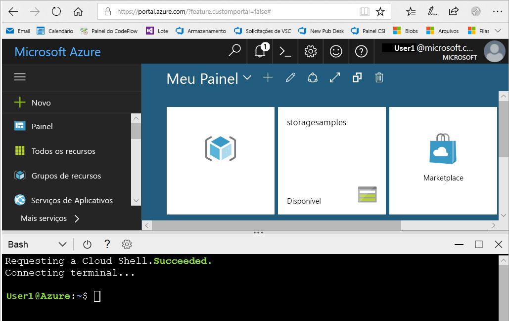
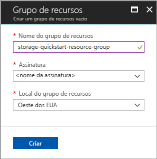
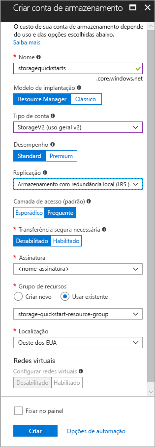

# <a name="create-a-storage-account"></a>Criar uma conta de armazenamento

Uma conta de armazenamento do Azure fornece um namespace exclusivo na nuvem para armazenar e acessar os objetos de dados no Armazenamento do Azure. Uma conta de armazenamento contém todos os blobs, arquivos, filas, tabelas e discos que você criar nessa conta. 

Para começar a usar o Armazenamento do Azure, primeiro você precisa criar uma nova conta de armazenamento. Você pode criar uma conta de armazenamento do Azure usando o [portal do Azure](https://portal.azure.com/), [Azure PowerShell](https://docs.microsoft.com/powershell/azure/overview) ou a [CLI do Azure](https://docs.microsoft.com/cli/azure/overview?view=azure-cli-latest). Este guia de início rápido mostra como usar cada uma dessas opções para criar sua nova conta de armazenamento. 


## <a name="prerequisites"></a>pré-requisitos

Se você não tiver uma assinatura do Azure, crie uma [conta gratuita](https://azure.microsoft.com/free/) antes de começar.

# <a name="portaltabportal"></a>[Portal](#tab/portal)

Nenhuma.

# <a name="powershelltabpowershell"></a>[PowerShell](#tab/powershell)

Este início rápido requer o módulo Azure PowerShell versão 3.6 ou posterior. Execute `Get-Module -ListAvailable AzureRM` para localizar a versão atual. Se você precisa instalar ou atualizar, confira [Instalar o módulo do Azure PowerShell](/powershell/azure/install-azurerm-ps).

# <a name="azure-clitabazure-cli"></a>[CLI do Azure](#tab/azure-cli)

Você pode fazer logon no Azure e executar comandos da CLI do Azure de uma das duas formas a seguir:

- Você pode executar comandos da CLI de dentro do portal do Azure, no Azure Cloud Shell 
- Você pode instalar a CLI e executar comandos da CLI localmente  

### <a name="use-azure-cloud-shell"></a>Usar o Azure Cloud Shell

O Azure Cloud Shell é um shell Bash gratuito que pode ser executado diretamente no portal do Azure. Ele tem a CLI do Azure instalada e configurada para usar com sua conta. Clique no botão **Cloud Shell** no menu no canto superior direito do portal do Azure:

[](https://portal.azure.com)

O botão inicia um shell interativo que você pode usar para executar as etapas neste guia de início rápido:

[](https://portal.azure.com)

### <a name="install-the-cli-locally"></a>Instalar a CLI localmente

Você também pode instalar e usar a CLI do Azure localmente. Este guia de início rápido exige que você esteja executando a CLI do Azure versão 2.0.4 ou posterior. Execute `az --version` para encontrar a versão. Se você precisa instalar ou atualizar, consulte [Instalar a CLI 2.0 do Azure](/cli/azure/install-azure-cli). 

---

## <a name="log-in-to-azure"></a>Fazer logon no Azure

# <a name="portaltabportal"></a>[Portal](#tab/portal)

Faça logon no [Portal do Azure](https://portal.azure.com).

# <a name="powershelltabpowershell"></a>[PowerShell](#tab/powershell)

Faça logon na sua assinatura do Azure com o comando `Login-AzureRmAccount` e siga as instruções na tela para fazer a autenticação.

```powershell
Login-AzureRmAccount
```

# <a name="azure-clitabazure-cli"></a>[CLI do Azure](#tab/azure-cli)

Para iniciar o Azure Cloud Shell, faça logon no [portal do Azure](https://portal.azure.com).

Para fazer logon em sua instalação local da CLI, execute o comando de logon:

```cli
az login
```

---

## <a name="create-a-resource-group"></a>Criar um grupo de recursos

Um grupo de recursos do Azure é um contêiner lógico no qual os recursos do Azure são implantados e gerenciados. Para saber mais sobre grupos de recursos, confira [Visão geral do Azure Resource Manager](../../azure-resource-manager/resource-group-overview.md).

# <a name="portaltabportal"></a>[Portal](#tab/portal)

Para criar um grupo de recursos no portal do Azure, siga estas etapas:

1. No portal do Azure, expanda o menu à esquerda para abrir o menu de serviços e escolha **Grupo de Recursos**.
2. Clique no botão **Adicionar** para adicionar um novo grupo de recursos.
3. Insira um nome para o novo grupo de recursos.
4. Selecione a assinatura na qual criar o novo grupo de recursos.
5. Escolha o local para o grupo de recursos.
6. Selecione o botão **Criar** .  



# <a name="powershelltabpowershell"></a>[PowerShell](#tab/powershell)

Para criar um novo grupo de recursos com o PowerShell, use o comando [New-AzureRmResourceGroup](/powershell/module/azurerm.resources/new-azurermresourcegroup): 

```powershell
# put resource group in a variable so you can use the same group name going forward,
# without hardcoding it repeatedly
$resourceGroup = "storage-quickstart-resource-group"
New-AzureRmResourceGroup -Name $resourceGroup -Location $location 
```

Se não tiver certeza de qual região especificar para o parâmetro `-Location`, é possível recuperar uma lista de regiões com suporte para sua assinatura com o comando [Get-AzureRmLocation](/powershell/module/azurerm.resources/get-azurermlocation):

```powershell
Get-AzureRmLocation | select Location 
$location = "westus"
```

# <a name="azure-clitabazure-cli"></a>[CLI do Azure](#tab/azure-cli)

Para criar um novo grupo de recursos com a CLI do Azure, use o comando [az group create](/cli/azure/group#az_group_create). 

```azurecli-interactive
az group create \
    --name storage-quickstart-resource-group \
    --location westus
```

Se não tiver certeza de qual região especificar para o parâmetro `--location`, recupere uma lista de regiões com suporte para a assinatura com o comando [az account list-locations](/cli/azure/account#az_account_list).

```azurecli-interactive
az account list-locations \
    --query "[].{Region:name}" \
    --out table
```

---

## <a name="create-a-general-purpose-storage-account"></a>Criar uma conta de armazenamento de uso geral

Uma conta de armazenamento de uso geral fornece acesso a todos os serviços de Armazenamento do Azure: blobs, arquivos, filas e tabelas. Uma conta de armazenamento de uso geral pode ser criada tanto em uma camada padrão quanto premium. Os exemplos neste artigo mostram como criar uma conta de armazenamento de uso geral na camada padrão (o padrão).

O Armazenamento do Azure oferece dois tipos de contas de armazenamento para fins gerais:

- Contas para uso geral v2 
- Contas para uso geral v1 

> [!NOTE]
> É recomendável que você crie novas contas de armazenamento como **contas para fins gerais v2** para tirar proveito dos novos recursos disponíveis para essas contas.  

Para saber mais sobre os tipos de contas de armazenamento, consulte [Opções de conta de Armazenamento do Azure](storage-account-options.md).

Ao nomear sua conta de armazenamento, lembre-se dessas regras:

- Os nomes da conta de armazenamento devem ter entre 3 e 24 caracteres e podem conter apenas números e letras minúsculas.
- O nome da sua conta de armazenamento deve ser exclusivo no Azure. Duas contas de armazenamento não podem ter o mesmo nome.

# <a name="portaltabportal"></a>[Portal](#tab/portal)

Para criar uma conta de armazenamento de uso geral v2 no portal do Azure, siga estas etapas:

1. No portal do Azure, expanda o menu à esquerda para abrir o menu de serviços e escolha **Mais Serviços**. Em seguida, role para baixo até **Armazenamento** e escolha **Contas de armazenamento**. Na janela **Contas de Armazenamento** que aparece, escolha **Adicionar**.
2. Insira um nome para a conta de armazenamento.
3. Definir o campo **Tipo de conta** para **StorageV2 (uso geral v2)**.
4. Deixe o campo **Replicação** definido como **Armazenamento com redundância local (LRS)**. Como alternativa, você pode escolher **Armazenamento com redundância de zona (ZRS Versão prévia)**, **Armazenamento com redundância geográfica (GRS)**, ou **Armazenamento com redundância geográfica com acesso de leitura (RA-GRS)**.
5. Deixe esses campos definidos com seus padrões: **Modelo de implantação**, **Desempenho**, **Transferência segura necessária**.
6. Escolha a assinatura na qual você deseja criar a conta de armazenamento.
7. Na seção **Grupo de recursos**, selecione **Usar existente**, depois escolha o grupo de recursos criado na seção anterior.
8. Escolha o local da nova conta de armazenamento.
9. Clique em **Criar** para criar a conta de armazenamento.      



# <a name="powershelltabpowershell"></a>[PowerShell](#tab/powershell)

Para criar uma conta de armazenamento de uso geral v2 a partir do PowerShell com armazenamento com redundância local (LRS), use o comando [New-AzureRmStorageAccount](/powershell/module/azurerm.storage/New-AzureRmStorageAccount): 

```powershell
New-AzureRmStorageAccount -ResourceGroupName $resourceGroup `
  -Name "storagequickstart" `
  -Location $location `
  -SkuName Standard_LRS `
  -Kind StorageV2 
```

Para criar uma conta de armazenamento de uso geral v2 com armazenamento com redundância de zona (ZRS Versão prévia), armazenamento com redundância geográfica (GRS) ou armazenamento com redundância geográfica com acesso de leitura (RA-GRS), substitua o valor desejado na tabela a seguir pelo parâmetro **SkuName**. 

|Opção de replicação  |Parâmetro SkuName  |
|---------|---------|
|Armazenamento com redundância local (LRS)     |Standard_LRS         |
|Armazenamento com redundância de zona (ZRS)     |Standard_ZRS         |
|Armazenamento com redundância geográfica (GRS)     |Standard_GRS         |
|Armazenamento com redundância geográfica com acesso de leitura (GRS)     |Standard_RAGRS         |

# <a name="azure-clitabazure-cli"></a>[CLI do Azure](#tab/azure-cli)

Para criar uma conta de armazenamento de uso geral a partir da CLI do Azure com armazenamento com redundância local, use o comando [az storage account create](/cli/azure/storage/account#az_storage_account_create).

```azurecli-interactive
az storage account create \
    --name storagequickstart \
    --resource-group storage-quickstart-resource-group \
    --location westus \
    --sku Standard_LRS \
    --kind StorageV2
```

Para criar uma conta de armazenamento de uso geral v2 com armazenamento com redundância de zona (ZRS Versão prévia), armazenamento com redundância geográfica (GRS) ou armazenamento com redundância geográfica com acesso de leitura (RA-GRS), substitua o valor desejado na tabela a seguir pelo parâmetro **sku**. 

|Opção de replicação  |Parâmetro sku  |
|---------|---------|
|Armazenamento com redundância local (LRS)     |Standard_LRS         |
|Armazenamento com redundância de zona (ZRS)     |Standard_ZRS         |
|Armazenamento com redundância geográfica (GRS)     |Standard_GRS         |
|Armazenamento com redundância geográfica com acesso de leitura (GRS)     |Standard_RAGRS         |

---

> [!NOTE]
> [Armazenamento com redundância de zona](https://azure.microsoft.com/blog/announcing-public-preview-of-azure-zone-redundant-storage/preview/) está atualmente em versão prévia e está disponível apenas nos seguintes locais:
>    - Leste dos EUA 2
>    - Centro dos EUA
>    - França Central (atualmente, essa região está em versão prévia. Consulte [A versão prévia do Microsoft Azure com zonas de disponibilidade do Azure agora está aberta na França](https://azure.microsoft.com/blog/microsoft-azure-preview-with-azure-availability-zones-now-open-in-france) para solicitar o acesso.)
    
Para obter mais informações sobre os diferentes tipos de replicação disponíveis, consulte [Opções de replicação de armazenamento](storage-redundancy.md).

## <a name="clean-up-resources"></a>Limpar recursos

Caso queira limpar os recursos criados por este guia de início rápido, você pode simplesmente excluir o grupo de recursos. A exclusão do grupo de recursos também exclui a conta de armazenamento associada e todos os outros recursos associados ao grupo de recursos.

# <a name="portaltabportal"></a>[Portal](#tab/portal)

Para remover um grupo de recursos usando o portal do Azure:

1. No portal do Azure, expanda o menu à esquerda para abrir o menu de serviços e escolha **Grupo de Recursos** para exibir a lista dos seus grupos de recursos.
2. Localize o grupo de recursos a ser excluído e clique com o botão direito do mouse no botão **Mais** (**...**) do lado direito da lista.
3. Selecione **Excluir grupo de recursos** e confirme.

# <a name="powershelltabpowershell"></a>[PowerShell](#tab/powershell)

Para remover o grupo de recursos e seus recursos associados, incluindo a nova conta de armazenamento, use o comando [Remove-AzureRmResourceGroup](/powershell/module/azurerm.resources/remove-azurermresourcegroup): 

```powershell
Remove-AzureRmResourceGroup -Name $resourceGroup
```

# <a name="azure-clitabazure-cli"></a>[CLI do Azure](#tab/azure-cli)

Para remover o grupo de recursos e seus recursos associados, incluindo a nova conta de armazenamento, use o comando [az group delete](/cli/azure/group#az_group_delete).

```azurecli-interactive
az group delete --name myResourceGroup
```

---

## <a name="next-steps"></a>Próximas etapas

Neste guia de início rápido, você criou uma conta de armazenamento padrão de uso geral. Para saber como carregar e baixar blobs para e da sua conta de armazenamento, prossiga para o guia de início rápido do Armazenamento de blobs.

# <a name="portaltabportal"></a>[Portal](#tab/portal)

> [!div class="nextstepaction"]
> [Transferir objetos de/para o Armazenamento de blobs do Azure usando o portal do Azure](../blobs/storage-quickstart-blobs-portal.md)

# <a name="powershelltabpowershell"></a>[PowerShell](#tab/powershell)

> [!div class="nextstepaction"]
> [Transferir objetos de/para o Armazenamento de Blobs do Azure usando o PowerShell](../blobs/storage-quickstart-blobs-powershell.md)

# <a name="azure-clitabazure-cli"></a>[CLI do Azure](#tab/azure-cli)

> [!div class="nextstepaction"]
> [Transferir objetos de e para o Armazenamento de Blobs do Azure usando a CLI do Azure](../blobs/storage-quickstart-blobs-cli.md)

---
