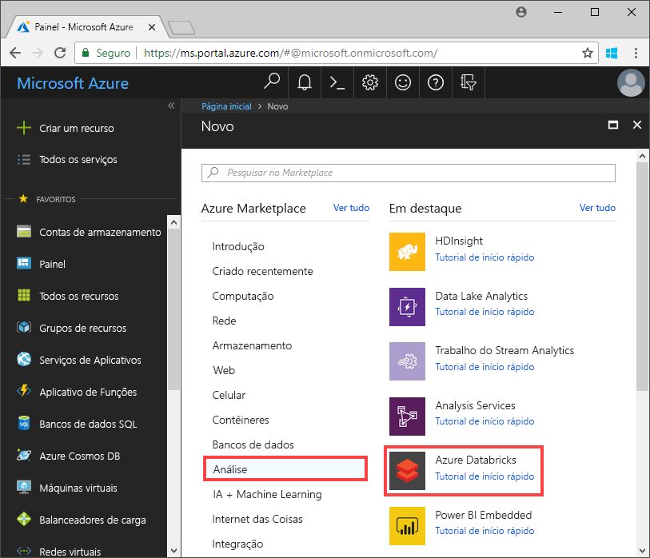
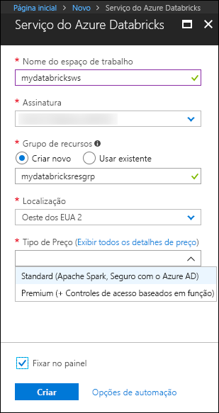
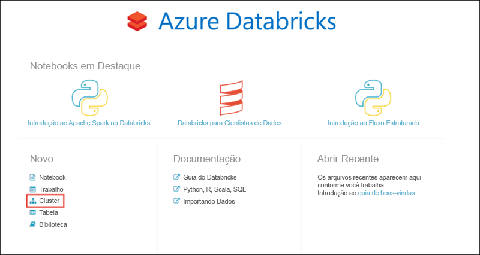
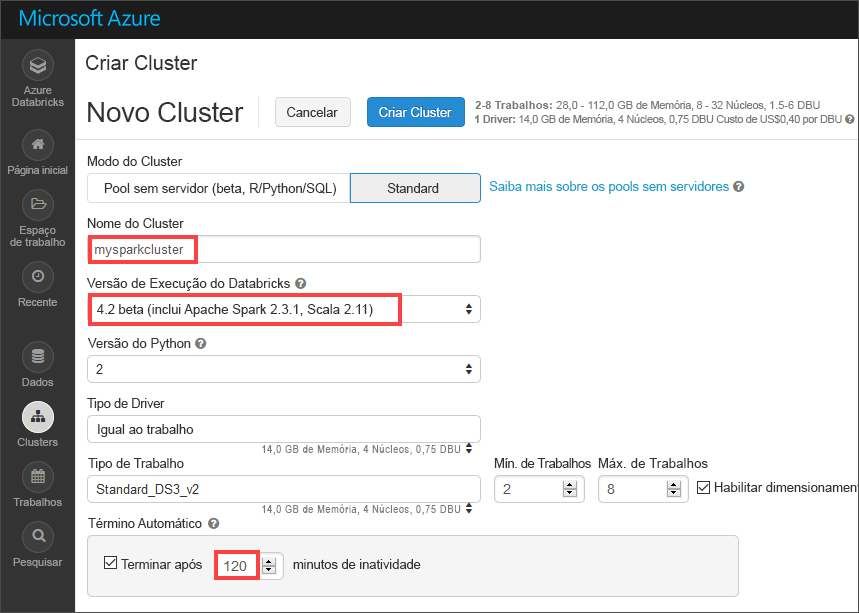
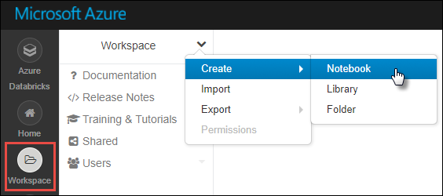
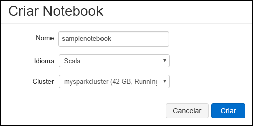
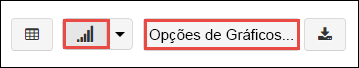
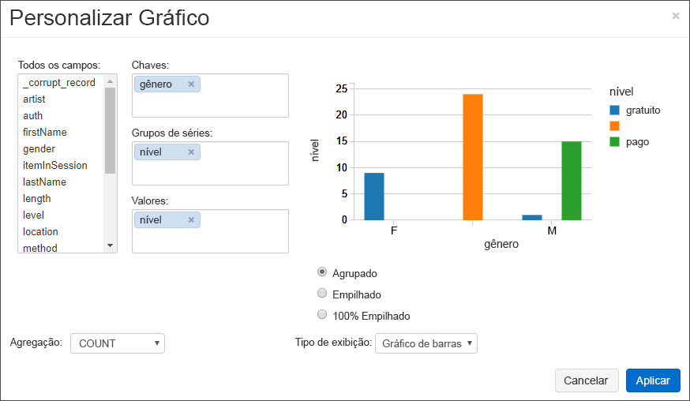
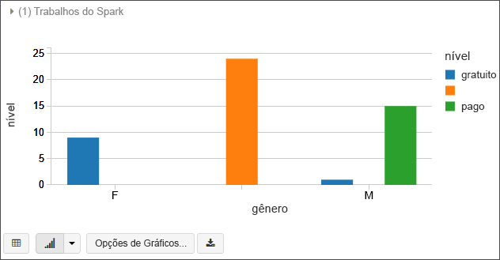
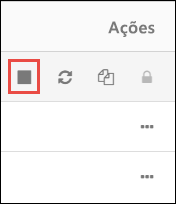

# <a name="quickstart-run-a-spark-job-on-azure-databricks-using-the-azure-portal"></a>Início rápido: executar um trabalho de Spark no Azure Databricks usando o portal do Azure

Este guia de início rápido mostra como executar um trabalho do Apache Spark usando o Azure Databricks para executar uma análise de dados armazenados no Azure Data Lake Storage Gen2 Versão prévia.

Como parte do trabalho do Spark, você analisa dados de uma assinatura de canal de rádio para obter ideias sobre uso gratuito/pago com base em dados demográficos.

Se você não tiver uma assinatura do Azure, [crie uma conta gratuita](https://azure.microsoft.com/free/) antes de começar.

## <a name="prerequisites"></a>Pré-requisitos

- [Criar uma conta do Azure Data Lake Storage Gen2](quickstart-create-account.md)

## <a name="set-aside-storage-account-configuration"></a>Por enquanto deixe de lado a configuração da conta de armazenamento

> [!IMPORTANT]
> Durante este tutorial você precisa ter acesso ao nome da conta do armazenamento e à chave de acesso. Entre no portal do Azure, selecione **Todos os serviços** e filtre pelo *armazenamento*. Selecione **Contas de armazenamento** e localize a conta criada para este tutorial.
>
> Na **Visão geral**, copie o **nome** da conta de armazenamento para um editor de texto. Em seguida, selecione **Chaves de acesso** e copie o valor de **key1** no seu editor de texto, já que ambos os valores serão necessários para comandos posteriormente.

## <a name="create-an-azure-databricks-workspace"></a>Criar um espaço de trabalho do Azure Databricks

Nesta seção, você deve cria um espaço de trabalho do Azure Databricks usando o Portal do Azure.

1. No Portal do Azure, selecione **Criar um recurso** > **Análise** > **Azure Databricks**. 

    

2. Em **Serviço do Azure Databricks**, forneça os valores para criar um espaço de trabalho do Databricks.

    

    Forneça os seguintes valores:
     
    |Propriedade  |DESCRIÇÃO  |
    |---------|---------|
    |**Nome do espaço de trabalho**     | Forneça um nome para seu espaço de trabalho do Databricks        |
    |**Assinatura**     | Na lista suspensa, selecione sua assinatura do Azure.        |
    |**Grupo de recursos**     | Especifique se deseja criar um novo grupo de recursos ou usar um existente. Um grupo de recursos é um contêiner que mantém os recursos relacionados a uma solução do Azure. Para obter mais informações, consulte [Visão geral do Grupo de Recursos do Azure](../../azure-resource-manager/resource-group-overview.md). |
    |**Localidade**     | Selecione **Oeste dos EUA 2**. Para outras regiões disponíveis, consulte [serviços do Azure por região](https://azure.microsoft.com/regions/services/).        |
    |**Tipo de preço**     |  Escolha entre o cluster **Standard** e o **Premium**. Para saber mais sobre essas camadas, confira [Página de preços do Databricks](https://azure.microsoft.com/pricing/details/databricks/).       |

    Selecione **Fixar no painel** e clique em **Criar**.

3. A criação do espaço de trabalho leva alguns minutos. Durante a criação do espaço de trabalho, o portal exibe o bloco **Enviando a implantação para o Azure Databricks** no lado direito. Talvez seja necessário rolar diretamente no painel para ver o bloco. Também é exibida na parte superior da tela de uma barra de progresso. Você pode assistir a área de andamento.

    

## <a name="create-a-spark-cluster-in-databricks"></a>Criar um cluster Spark no Databricks

1. No portal do Azure, vá para o espaço de trabalho do Databricks que você criou e selecione **Inicializar Espaço de Trabalho**.

2. Você é redirecionado para o portal do Azure Databricks. No portal, selecione **Novo** > **Cluster**.

    

3. Na página **Novo cluster**, forneça os valores para criar um cluster.

    

    Aceite todos os outros valores padrão que não sejam o seguinte:

    * Insira um nome para o cluster.
    * Crie um cluster com o tempo de execução **4.2 beta**.
    * Verifique se você marcou a caixa de seleção **Terminar depois de 120 minutos de inatividade**. Forneça uma duração (em minutos) para encerrar o cluster caso ele não esteja sendo usado.

4. Selecione **Criar cluster**. Quando o cluster está em execução, você pode anexar blocos de notas a ele e executar trabalhos do Spark.

Para obter mais informações sobre como criar clusters, consulte [Criar um cluster Spark no Azure Databricks](https://docs.azuredatabricks.net/user-guide/clusters/create.html).

## <a name="create-storage-account-file-system"></a>Criar sistema de arquivos da conta de armazenamento

Nesta seção, você cria um bloco de anotações no espaço de trabalho do Azure Databricks e executa trechos de código para configurar a conta de armazenamento.

1. No [Portal do Azure](https://portal.azure.com), vá para o espaço de trabalho do Azure Databricks que você criou e selecione **Inicializar Espaço de Trabalho**.

2. No painel esquerdo, escolha **Espaço de Trabalho**. Na lista suspensa **Espaço de trabalho**, selecione **Criar** > **Bloco de notas**.

    

3. Na caixa de diálogo **Criar Bloco de Anotações**, digite um nome para o bloco de anotações. Selecione **Scala** como linguagem e selecione o cluster Spark criado anteriormente.

    

    Selecione **Criar**.

4. No código a seguir, substitua os textos **ACCOUNT_NAME** e **ACCOUNT_KEY** pelos valores que você anotou no início deste início rápido. Além disso, substitua o texto **FILE_SYSTEM_NAME** pelo nome que você gostaria que seu sistema de arquivos tivesse. Em seguida, insira o código na primeira célula.

    ```scala
    spark.conf.set("fs.azure.account.key.<ACCOUNT_NAME>.dfs.core.windows.net", "<ACCOUNT_KEY>") 
    spark.conf.set("fs.azure.createRemoteFileSystemDuringInitialization", "true")
    dbutils.fs.ls("abfs://<FILE_SYSTEM_NAME>@<ACCOUNT_NAME>.dfs.core.windows.net/")
    spark.conf.set("fs.azure.createRemoteFileSystemDuringInitialization", "false") 
    ```

    Pressione **SHIFT + ENTER** para executar a célula de código.

    Agora o sistema de arquivos foi criado para a conta de armazenamento.

## <a name="ingest-sample-data"></a>Ingerir dados de exemplo

Antes de iniciar esta seção, você deve concluir os pré-requisitos a seguir:

Insira o código a seguir em uma célula do bloco de anotações:

    %sh wget -P /tmp https://github.com/Azure/usql/blob/master/Examples/Samples/Data/json/radiowebsite/small_radio_json.json

Na célula, pressione `Shift` + `Enter` para executar o código.

Agora, em uma nova célula abaixo dessa, insira o código a seguir (substitua **FILE_SYSTEM** e **ACCOUNT_NAME** pelos mesmos valores que você usou anteriormente:

    dbutils.fs.cp("file:///tmp/small_radio_json.json", "abfs://<FILE_SYSTEM>@<ACCOUNT_NAME>.dfs.core.windows.net/")

Na célula, pressione `Shift` + `Enter` para executar o código.

## <a name="run-a-spark-sql-job"></a>Executar um trabalho SQL do Spark

Execute as seguintes tarefas para executar um trabalho SQL do Spark nos dados.

1. Execute uma instrução SQL para criar uma tabela temporária usando dados do arquivo de dados JSON de exemplo, **small_radio_json.json**. No trecho de código a seguir, substitua os valores de espaço reservado pelo nome do seu sistema de arquivos e o nome da conta de armazenamento. Usando o bloco de notas criando anteriormente, cole o trecho de código em uma célula de código no bloco de notas e pressione SHIFT + ENTER.

    ```sql
    %sql
    DROP TABLE IF EXISTS radio_sample_data;
    CREATE TABLE radio_sample_data
    USING json
    OPTIONS (
     path  "abfs://<FILE_SYSTEM_NAME>@<ACCOUNT_NAME>.dfs.core.windows.net/<PATH>/small_radio_json.json"
    )
    ```

    Assim que o comando for concluído com êxito, você terá todos os dados do arquivo JSON como uma tabela no cluster do Databricks.

    O comando mágico de linguagem `%sql` permite que você execute um código SQL do bloco de notas, mesmo que o bloco seja de outro tipo. Para obter mais informações, consulte [Combinar linguagens em um bloco de notas](https://docs.azuredatabricks.net/user-guide/notebooks/index.html#mixing-languages-in-a-notebook).

2. Vamos examinar um instantâneo dos dados do JSON de exemplo para entender melhor a consulta que você executou. Cole o trecho de código a seguir em uma célula de código e pressione **SHIFT+ENTER**.

    ```sql
    %sql 
    SELECT * from radio_sample_data
    ```

3. Você verá uma saída tabular como mostrado na seguinte captura de tela (somente algumas colunas são mostradas):

    

    Entre outros detalhes, os dados de exemplo capturam o gênero do público de um canal de rádio (nome da coluna: **gênero**) e se a sua assinatura é gratuita ou paga (nome da coluna: **nível**).

4. Agora crie uma representação visual dos dados para mostrar quantos usuários têm contas gratuitas e quantos são assinantes pagantes para cada gênero. Na parte inferior da saída tabular, clique no ícone de **Gráfico de barras** e depois em **Opções de plotagem**.

    

5. Em **Personalizar plotagem**, arraste e solte valores conforme mostrado na captura de tela.

    

    - Definir **Chaves** como **gênero**.
    - Definir **Agrupamentos de série** como **nível**.
    - Definir **Valores** como **nível**.
    - Definir **Agregação** como **CONTAGEM**.

6. Clique em **Aplicar**.

7. A saída mostra a representação visual, conforme ilustrado na seguinte captura de tela:

     

## <a name="clean-up-resources"></a>Limpar recursos

Depois de terminar o artigo, você poderá encerrar o cluster. No espaço de trabalho do Azure Databricks, selecione **Clusters** e localize o cluster que você deseja encerrar. Passe o cursor do mouse sobre o botão de reticências na coluna **Ações** e selecione o ícone **Terminar**.



Se você não encerrar o cluster manualmente, ele é interrompido automaticamente, desde que você tenha selecionado a caixa de seleção **Terminar depois de __ minutos de inatividade** ao criar o cluster. Se você definir essa opção, o cluster será interrompido depois de ficar inativo durante o período de tempo designado.

## <a name="next-steps"></a>Próximas etapas

Neste artigo, você criou um cluster Spark no Azure Databricks e executou um trabalho do Spark usando os dados no Data Lake Storage Gen2. Você também pode examinar [Fontes de dados do Spark](https://docs.azuredatabricks.net/spark/latest/data-sources/index.html) para saber como importar dados de outras fontes de dados para o Azure Databricks. Siga até o próximo artigo para saber como executar uma operação de ETL (extração, transformação e carregamento de dados) usando o Azure Databricks.

> [!div class="nextstepaction"]
>[Extrair, transformar e carregar dados usando o Azure Databricks](../../azure-databricks/databricks-extract-load-sql-data-warehouse.md)
