# Início Rápido: criar e usar um compartilhamento de arquivo do Azure para Windows
O artigo demonstra as etapas básicas para criar e usar um compartilhamento de arquivo do Azure. Neste início rápido, a ênfase é como configurar rapidamente um compartilhamento de arquivo do Azure para que você possa experimentar o funcionamento do serviço. Se precisar de instruções mais detalhadas para criar e usar compartilhamentos de arquivo do Azure em seu próprio ambiente, consulte [Usar um compartilhamento de arquivos do Azure com o Windows](storage-how-to-use-files-windows.md).

Se você não tiver uma assinatura do Azure, crie uma [conta gratuita](https://azure.microsoft.com/free/?WT.mc_id=A261C142F) antes de começar.

## Entrar no Azure
Entre no [Portal do Azure](https://portal.azure.com).

## Prepare o seu ambiente
Antes de criar um compartilhamento de arquivo do Azure, você precisa configurar os itens a seguir para este início rápido:

- Uma conta de armazenamento e um compartilhamento de arquivo do Azure
- Uma VM do Windows Server 2016 Datacenter

### Criar uma conta de armazenamento

Antes de poder trabalhar com um compartilhamento de arquivo do Azure, você precisa criar uma conta de armazenamento do Azure. Uma conta de armazenamento é um pool compartilhado de armazenamento no qual você pode implantar um compartilhamento de arquivos do Azure ou outros recursos de armazenamento como blobs ou filas. Uma conta de armazenamento pode conter uma quantidade ilimitada de compartilhamentos. Um compartilhamento pode conter uma quantidade ilimitada de arquivos, até os limites de capacidade da conta de armazenamento.

[!INCLUDE [storage-create-account-portal-include](../../../includes/storage-create-account-portal-include.md)]

### Criar um compartilhamento de arquivos do Azure
Em seguida, crie um compartilhamento de arquivos.

1. Quando a implantação da conta de armazenamento do Azure for concluída, selecione **Ir para o recurso**.
1. Selecione **Arquivos** no painel da conta de armazenamento.

    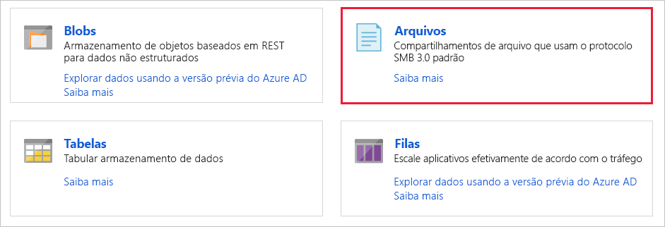

1. Selecione **+ Compartilhamento de Arquivo**.

    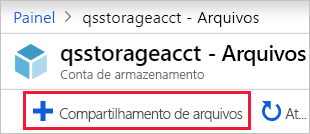

1. Nomeie o novo compartilhamento de arquivo *qsfileshare* > digite "1" para a **Cota** > selecione **Criar**. A cota pode ter um máximo de 5 TiB, mas você só precisa de 1 GiB para este início rápido.
1. Crie um novo arquivo txt chamado *qsTestFile* no computador local.
1. Selecione o novo compartilhamento de arquivo e, no local do compartilhamento de arquivo, selecione **Carregar**.

    

1. Navegue até o local onde você criou o arquivo .txt > selecione *qsTestFile.txt* > selecione **Carregar**.

Até agora, você criou uma conta de armazenamento do Azure e um compartilhamento de arquivo contendo um arquivo no Azure. Em seguida, você criará a VM do Azure com o Windows Server 2016 Datacenter para representar o servidor local neste início rápido.

### Implantar uma máquina virtual
1. Em seguida, expanda o menu no lado esquerdo do portal e escolha **Criar um recurso** no canto superior esquerdo do portal do Azure.
1. Na caixa de pesquisa acima da lista de recursos do **Azure Marketplace**, procure e selecione **Windows Server 2016 Datacenter**, em seguida, escolha **Criar**.
1. Na guia **Básico**, em **Detalhes do projeto**, selecione o grupo de recursos que você criou para este início rápido.

   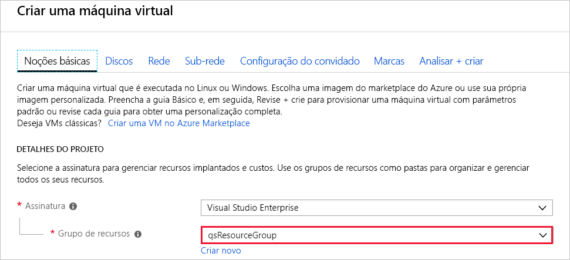

1. Em **Detalhes da instância**, nomeie a VM *qsVM*.
1. Deixe as configurações padrão para **Região**, **Opções de disponibilidade**, **Imagem** e **Tamanho**.
1. Em **Conta de administrador**, adicione *VMadmin* como **Nome de usuário** e insira uma **Senha** para a VM.
1. Em **Regras de porta de entrada**, escolha **Permitir portas selecionadas** e, em seguida, selecione **RDP (3389)** e **HTTP** na lista suspensa.
1. Selecione **Examinar + criar**.
1. Selecione **Criar**. A criação de uma nova VM levará alguns minutos para ser concluída.

1. Após a conclusão da implantação da VM, selecione **Ir para o recurso**.

Nesta altura, você já criou uma nova máquina virtual e anexou um disco de dados. Agora, você precisa se conectar à VM.

### Conectar-se à sua VM

1. Selecione **Conectar** na página de propriedades da máquina virtual.

   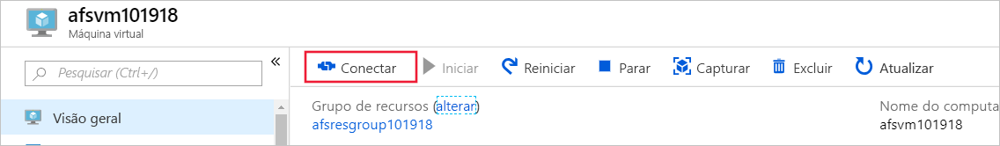

1. Na página **Conectar-se à máquina virtual**, mantenha as opções padrão para se conectar por **endereço IP** pela **porta número** *3389* e clique em **Baixar arquivo RDP**.
1. Abra o arquivo RDP baixado e selecione **Conectar** quando solicitado.
1. Na janela **Segurança do Windows**, selecione **Mais opções** e **Usar uma conta diferente**. Digite o nome de usuário como *localhost\nome de usuário*,em que &lt;nome de usuário&gt; é o nome do usuário administrador da VM que você criou para a máquina virtual. Insira a senha que você criou para a máquina virtual e selecione **OK**.

   

1. Você pode receber um aviso do certificado durante o processo de logon. Selecione **Sim** ou **Continuar** para criar a conexão.

## Mapeie o compartilhamento de arquivo do Azure para uma unidade do Windows

1. No portal do Azure, navegue até o compartilhamento de arquivo *qsfileshare* e selecione **Conectar**.
1. Copie o conteúdo da segunda caixa e cole-o no **Bloco de notas**.

   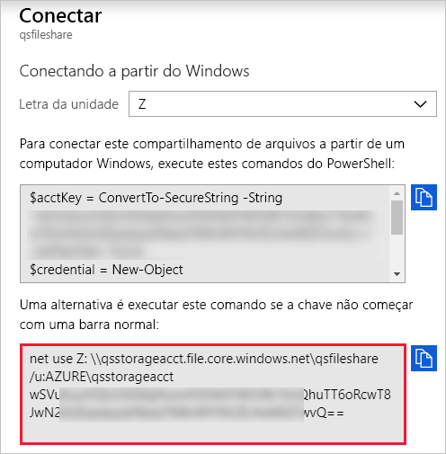

1. Na VM, abra **Explorador de Arquivos** e selecione **Este PC** na janela. Esta seleção alterará os menus disponíveis na faixa de opções. No menu **Computador**, selecione **Mapear unidade de rede**.
1. Selecione a letra da unidade e digite o caminho UNC. Se você seguiu as sugestões de nomenclatura deste início rápido, copie *\\qsstorageacct.file.core.windows.net\qsfileshare* do **Bloco de notas**.

   Verifique se as duas caixas de seleção estão marcadas.

   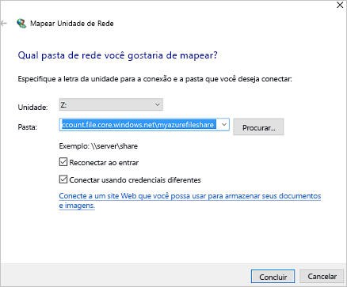

1. Selecione **Concluir**.
1. Na caixa de diálogo **Segurança do Windows**:

   - No Bloco de notas, copie o nome da conta de armazenamento iniciada por AZURE\ e cole-o na caixa de diálogo **Segurança do Windows** como o nome de usuário. Se você seguiu as sugestões de nomenclatura neste início rápido, copie *AZURE\qsstorageacct*.
   - No Bloco de notas, copie a chave da conta de armazenamento e cole-a na caixa de diálogo **Segurança do Windows** como a senha.

      

## Criar um instantâneo de compartilhamento
Agora que mapeou a unidade, você pode criar um instantâneo.

1. No portal, navegue até o compartilhamento de arquivo e selecione **Criar instantâneo**.

   

1. Na VM, abra *qstestfile.txt* e digite "Este arquivo foi modificado" > salve e feche o arquivo.
1. Crie outro instantâneo.

## Procurar um instantâneo de compartilhamento

1. Em seu compartilhamento de arquivo, selecione **Exibir instantâneos**.
1. No painel **Instantâneos de compartilhamento de arquivo**, selecione o primeiro instantâneo da lista.

   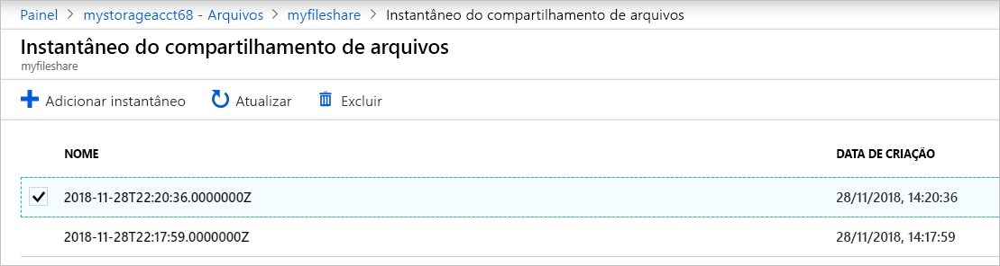

1. No painel do instantâneo, selecione *qsTestFile.txt*.

## Restaurar de um instantâneo

1. No portal, selecione *qsTestFile* > selecione o botão **Restaurar**.
1. Selecione **Substituir arquivo original**.

   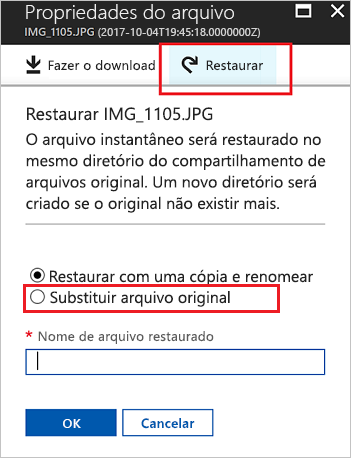

1. Na VM, abra o arquivo. A versão não modificada foi restaurada.

## Excluir um instantâneo de compartilhamento

1. Em seu compartilhamento de arquivo, selecione **Exibir instantâneos**.
1. No painel **Instantâneos de compartilhamento de arquivo**, selecione o último instantâneo da lista e clique em **Excluir**.

   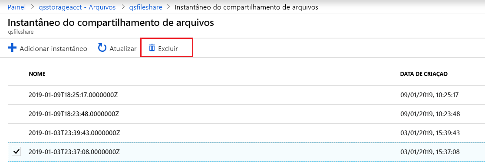

## Usar um instantâneo de compartilhamento no Windows
Assim como acontece com instantâneos locais do VSS, você pode exibir os instantâneos de seu compartilhamento de arquivo do Azure montado usando a guia Versões Anteriores.

1. No Explorador de Arquivos, localize o compartilhamento montado.

   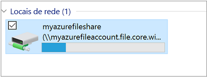

1. Selecione *qsTestFile.txt* e > clique com o botão direito do mouse e selecione **Propriedades** no menu.

   

1. Selecione **Versões Anteriores** para ver a lista de instantâneos de compartilhamento para esse diretório.

1. Selecione **Abrir** para abrir o instantâneo.

   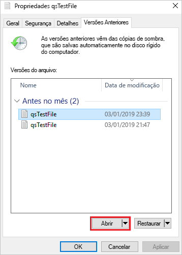

## Restaurar de uma versão anterior

1. Selecione **Restaurar**. Esta ação copia o conteúdo de todo o diretório recursivamente para o local original no momento da criação do instantâneo.

   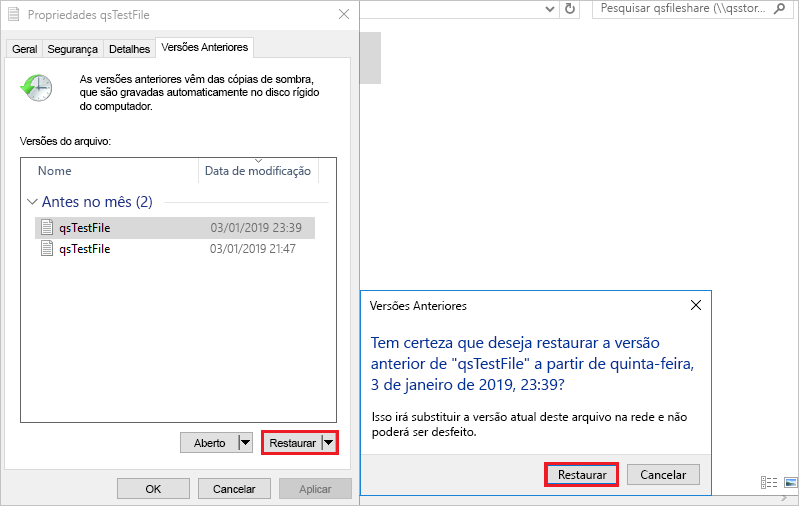

## Limpar recursos

[!INCLUDE [storage-files-clean-up-portal](../../../includes/storage-files-clean-up-portal.md)]

## Próximas etapas

> [!div class="nextstepaction"]
> [Usar um compartilhamento de arquivos do Azure com o Windows](storage-how-to-use-files-windows.md)