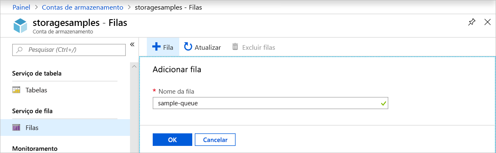
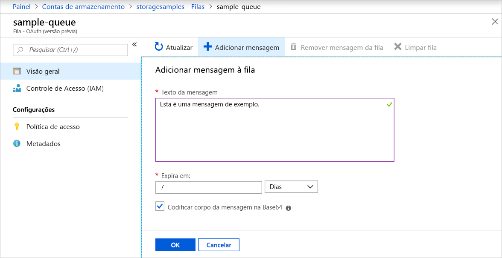
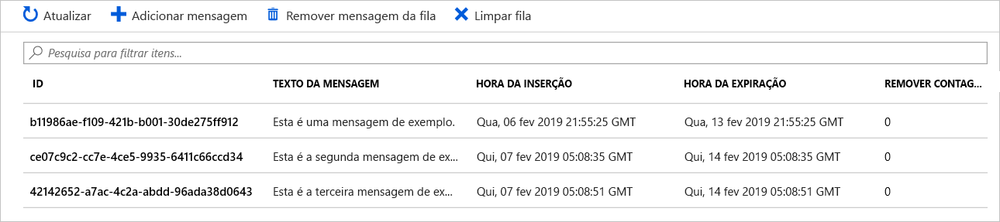
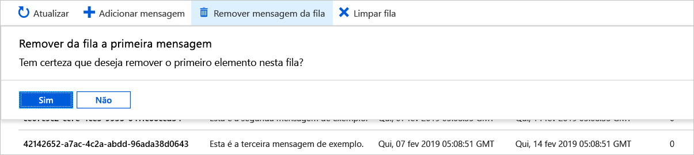

# Início Rápido: Criar uma fila e adicionar uma mensagem com o portal do Azure

Neste início rápido, você aprenderá como usar o [portal do Azure](https://portal.azure.com/) para criar uma fila no Armazenamento do Azure e para adicionar mensagens removidas da fila.

## Pré-requisitos

[!INCLUDE [storage-quickstart-prereq-include](../../../includes/storage-quickstart-prereq-include.md)]

## Criar uma fila

Para criar uma fila no portal do Azure, siga estas etapas:

1. Navegue até sua nova conta de armazenamento no portal do Azure.
2. No menu à esquerda da conta de armazenamento, role até a seção **Serviço Fila** e selecione **Filas**.
3. Selecione o botão **+ Fila**.
4. Digite um nome para a nova fila. O nome da fila deve estar com letras minúsculas, começar com uma letra ou número e pode incluir apenas letras, números e o caractere traço (-).
6. Selecione **OK** para criar a fila.

    

## Adicionar uma mensagem

Em seguida, adicione uma mensagem à nova fila. Uma mensagem pode ter tamanho de até 64 KB.

1. Selecione a nova fila na lista de filas na conta de armazenamento.
1. Selecione o botão **+ Adicionar mensagem** para adicionar uma mensagem à fila. Insira uma mensagem no campo **Texto da mensagem**. 
1. Especifique quando a mensagem expira. O tempo máximo que uma mensagem pode permanecer na fila é 7 dias.
1. Indique se você deseja codificar a mensagem como Base64. A codificação de dados binários é recomendada.
1. Selecione o botão **OK** para adicionar a mensagem.

    

## Exibir propriedades da mensagem

Após adicionar a mensagem, o portal do Azure exibirá uma lista de todas as mensagens na fila. É possível exibir a ID, o conteúdo, a hora de inserção e a hora de expiração da mensagem. Também é possível ver quantas vezes esta mensagem foi removida da fila.

## Remover uma mensagem da fila

É possível remover uma mensagem da frente da fila no portal do Azure. Quando você remove uma mensagem da frente da fila, ela é excluída. 

A remoção da fila sempre remove a mensagem mais antiga na fila. 

## Próximas etapas

Neste início rápido, você aprendeu a criar uma fila, adicionar uma mensagem, exibir as propriedades da mensagem e remover uma mensagem da fila no portal do Azure.

> [!div class="nextstepaction"]
> [O que são as Filas do Azure?](storage-queues-introduction.md)
