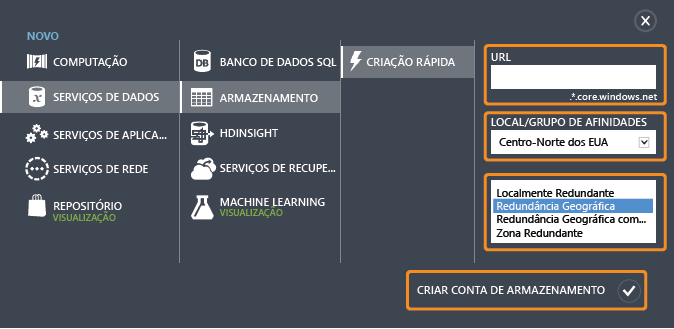
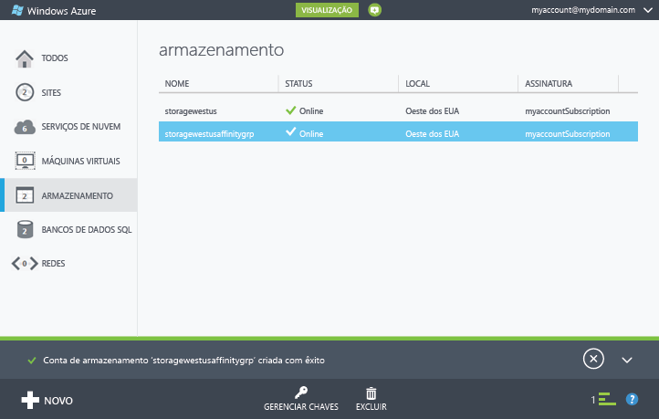
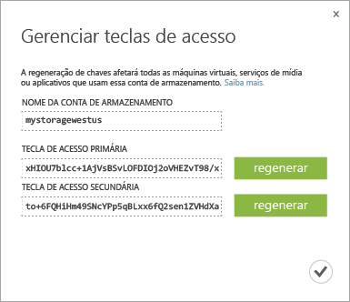

# Sobre as contas de armazenamento do Azure
[!INCLUDE [storage-selector-portal-create-storage-account](../../includes/storage-selector-portal-create-storage-account.md)]

[!INCLUDE [storage-try-azure-tools](../../includes/storage-try-azure-tools.md)]

## Visão geral
Uma conta de armazenamento do Azure fornece acesso aos serviços de Blob, Fila, Tabela e Arquivo no Armazenamento do Azure. Sua conta de armazenamento fornece um namespace exclusivo para os objetos de dados de Armazenamento do Azure. Por padrão, os dados em sua conta estão disponíveis somente para você, o proprietário da conta.

Existem dois tipos de contas de armazenamento:

* Uma conta de armazenamento padrão inclui armazenamento de Blob, Tabela e Fila.
* Atualmente, uma conta de armazenamento premium dá suporte apenas aos discos de máquina virtual do Azure. Confira [Armazenamento Premium: Armazenamento de Alto Desempenho para as Cargas de Trabalho da Máquina Virtual do Azure](storage-premium-storage.md) para ter uma visão geral detalhada do Armazenamento Premium.

## Cobrança de conta de armazenamento
Você é cobrado pelo uso do Armazenamento do Azure com base na sua conta de armazenamento. Os custos de armazenamento baseiam-se em quatro fatores: capacidade de armazenamento, esquema de replicação, transações de armazenamento e saída de dados.

* A capacidade do armazenamento refere-se a quanto de sua alocação de conta de armazenamento você está usando para armazenar dados. O custo de simplesmente armazenar seus dados é determinado pela quantidade de dados que você está armazenando e como eles são replicados.
* A replicação determina quantas cópias dos seus dados são mantidas de uma só vez e em quais locais.
* As transações referem-se a todas as operações de leitura e gravação no Armazenamento do Azure.
* A saída de dados refere-se a dados transferidos para fora de uma região do Azure. Quando os dados de sua conta de armazenamento são acessados por um aplicativo que não está sendo executado na mesma região, quer esse aplicativo seja um serviço de nuvem ou algum outro tipo de aplicativo, você é cobrado pela saída de dados. (Nos serviços do Azure, você pode tomar medidas para agrupar seus dados e serviços nos mesmos data centers para reduzir ou eliminar encargos de saída de dados.)  

A página [Preços de Armazenamento do Azure](https://azure.microsoft.com/pricing/details/storage) fornece informações detalhadas de preços para a capacidade de armazenamento, replicação e transações. A página [Detalhes dos Preços das Transferências de Dados](https://azure.microsoft.com/pricing/details/data-transfers/) fornece informações detalhadas dos preços para a saída de dados.

Para obter detalhes sobre a capacidade e produtividade da conta de armazenamento, confira [Metas de desempenho e escalabilidade do Armazenamento do Azure](storage-scalability-targets.md).

> [!NOTE]
> Ao criar uma máquina virtual do Azure, uma conta de armazenamento será criada automaticamente no local da implantação se você ainda não tiver uma conta de armazenamento nesse local. Assim, não é necessário seguir as etapas abaixo para criar uma conta de armazenamento para seus discos da máquina virtual. O nome da conta de armazenamento será baseado no nome da máquina virtual. Confira a [Documentação de máquinas virtuais do Azure](https://azure.microsoft.com/documentation/services/virtual-machines/) para obter mais detalhes.
> 
> 

## Criar uma conta de armazenamento
1. Entre no [Portal Clássico do Azure](https://manage.windowsazure.com).
2. Clique em **Novo** na barra de tarefas na parte inferior da página. Escolha **Serviços de Dados** | **Armazenamento** e clique em **Criação Rápida**.
   
    
3. Em **URL**, insira um nome para a conta de armazenamento.
   
   > [!NOTE]
   > Os nomes da conta de armazenamento devem ter entre 3 e 24 caracteres e podem conter apenas números e letras minúsculas.
   > 
   > O nome da sua conta de armazenamento deve ser exclusivo no Azure. O Portal Clássico do Azure indicará se o nome de conta de armazenamento que você selecionar já é usado.
   > 
   > 
   
    Confira [Pontos de extremidade da conta de armazenamento](#storage-account-endpoints) abaixo para obter detalhes sobre como o nome da conta de armazenamento será usado em seus objetos no Armazenamento do Azure.
4. Em **Local/Grupo de afinidade**, selecione um local para a conta de armazenamento que esteja perto de você ou seus clientes. Se os dados na conta de armazenamento forem ser acessados de outro serviço do Azure, como uma máquina virtual ou serviço de nuvem do Azure, você pode desejar selecionar um grupo de afinidade na lista para agrupar sua conta no mesmo data center que outros serviços do Azure que você está usando para melhorar o desempenho e reduzir os custos.
   
    Vale lembrar que você deve selecionar um grupo de afinidades durante a criação de sua conta de armazenamento. Não é possível mover uma conta existente para um grupo de afinidades. Para saber mais sobre grupos de afinidade, confira [Colocalização de serviços com um grupo de afinidade](#service-co-location-with-an-affinity-group) abaixo.
   
   > [!IMPORTANT]
   > Para determinar quais locais estão disponíveis para sua assinatura, você poderá chamar a operação [Listar todos os provedores de recursos](https://msdn.microsoft.com/library/azure/dn790524.aspx) . Para listar provedores do PowerShell, chame [Get-AzureLocation](https://msdn.microsoft.com/library/azure/dn757693.aspx). No .NET, use o método [List](https://msdn.microsoft.com/library/azure/microsoft.azure.management.resources.provideroperationsextensions.list.aspx) da classe ProviderOperationsExtensions.
   > 
   > Além disso, veja [Regiões do Azure](https://azure.microsoft.com/regions/#services) para obter mais informações sobre quais serviços estão disponíveis em uma região específica.
   > 
   > 
5. Se você tiver mais de uma assinatura do Azure, o campo **Assinatura** será exibido. Em **Assinatura**, digite a assinatura do Azure com a qual você deseja usar a conta de armazenamento.
6. Em **Replicação**, selecione o nível desejado de replicação para sua conta de armazenamento. A opção de replicação recomendada é a replicação com redundância geográfica, que fornece a máxima durabilidade para seus dados. Para obter mais detalhes sobre as opções de replicação do Armazenamento do Azure, confira [Replicação do Armazenamento do Azure](storage-redundancy.md).
7. Clique em **Criar Conta de Armazenamento**.
   
    Pode levar alguns minutos para criar sua conta de armazenamento. Para verificar o status, você pode monitorar as notificações na parte inferior do Portal Clássico do Azure. Depois que a conta de armazenamento for criada, sua nova conta de armazenamento terá o status **Online** e estará pronta para uso.

### Pontos de extremidade da conta de armazenamento
Cada objeto armazenado no Armazenamento do Azure tem um endereço de URL exclusivo. O nome da conta de armazenamento forma o subdomínio desse endereço. A combinação do nome do subdomínio e do domínio, que é específico a cada serviço, forma um *ponto de extremidade* para a sua conta de armazenamento.

Por exemplo, se a sua conta de armazenamento se chamar *mystorageaccount*, os pontos de extremidade padrão para a conta de armazenamento serão:

* Serviço Blob: http://*mystorageaccount*.blob.core.windows.net
* Serviço Tabela: http://*mystorageaccount*.table.core.windows.net
* Serviço Fila: http://*mystorageaccount*.queue.core.windows.net
* Serviço Arquivo: http://*mystorageaccount*.file.core.windows.net

É possível ver os pontos de extremidade da sua conta de armazenamento no painel de armazenamento do [Portal Clássico do Azure](https://manage.windowsazure.com) depois que a conta for criada.

A URL para acessar um objeto em uma conta de armazenamento é compilada acrescentando o local do objeto na conta de armazenamento ao ponto de extremidade. Por exemplo, um endereço de blob pode ter este formato: http://*mystorageaccount*.blob.core.windows.net/*mycontainer*/*myblob*.

Também é possível configurar um nome de domínio para usar com a conta de armazenamento. Confira [Configurar um nome de domínio personalizado para seu ponto de extremidade do armazenamento de blobs](storage-custom-domain-name.md) para obter detalhes.

### Colocalização de serviços com um grupo de afinidade
Um *grupo de afinidades* é um agrupamento geográfico de seus serviços Azure e VMs na conta de armazenamento do Azure. Um grupo de afinidade pode melhorar o desempenho do serviço localizando cargas de trabalho do computador no mesmo data center ou próximo do público-alvo de usuários. Além disso, não há encargos de cobrança incorridos para saída quando os dados em uma conta de armazenamento são acessados por um serviço em execução do mesmo grupo de afinidade.

> [!NOTE]
> Para criar um grupo de afinidades, abra a área <b>Configurações</b> do [Portal Clássico do Azure](https://manage.windowsazure.com), clique em <b>Grupos de Afinidade</b> e em <b>Adicionar um grupo de afinidade</b> ou no botão <b>Adicionar</b>. Você também pode criar e gerenciar os grupos de afinidades usando a API de Gerenciamento de Serviços do Azure. Veja <a href="http://msdn.microsoft.com/library/azure/ee460798.aspx">Operações em grupo de afinidades</a> para saber mais.
> 
> 

## exibir, copiar e regenerar chaves de acesso de armazenamento
Quando você cria uma conta de armazenamento, o Azure gera duas chaves de acesso de armazenamento de 512 bits, que são usadas para autenticação quando a conta de armazenamento é acessada. Ao fornecer as duas chaves de acesso de armazenamento, o Azure permite que você regenere as chaves sem interrupção para o serviço de armazenamento ou o acesso a esse serviço.

> [!NOTE]
> Recomendamos que você evite compartilhar suas chaves de acesso de armazenamento com outras pessoas. Para permitir o acesso a recursos de armazenamento sem dar as suas chaves de acesso, você pode usar uma *assinatura de acesso compartilhado*. Uma assinatura de acesso compartilhado fornece acesso a um recurso na sua conta para um intervalo que você definir e com as permissões que você especificar. Confira [Usando Assinaturas de Acesso Compartilhado (SAS)](storage-dotnet-shared-access-signature-part-1.md) para saber mais.
> 
> 

No [Portal Clássico do Azure](https://manage.windowsazure.com), use **Gerenciar Chaves** no painel ou a página **Armazenamento** para exibir, copiar e regenerar as chaves de acesso de armazenamento usadas para acessar os serviços Blob, Tabela e Fila.

### Copiar uma chave de acesso de armazenamento
Você pode usar **Gerenciar Chaves** para copiar uma chave de acesso de armazenamento para uso em uma cadeia de conexão. A cadeia de conexão requer o nome da conta de armazenamento e uma chave a ser usada na autenticação. Para saber mais sobre como configurar as cadeias de conexão para acessar os serviços de armazenamento do Azure, confira [Configurar Cadeias de Conexão de Armazenamento do Azure](storage-configure-connection-string.md).

1. No [Portal Clássico do Azure](https://manage.windowsazure.com), clique em **Armazenamento**e no nome da conta de armazenamento para abrir o painel.
2. Clique em **Gerenciar Chaves**.
   
     **Gerenciar Chaves de Acesso** é aberta.
   
    
3. Para copiar uma chave de acesso de armazenamento, selecione o texto da chave. Em seguida, clique com o botão direito do mouse e clique em **Copiar**.

### Regenerar chaves de acesso de armazenamento
Você deve alterar as chaves de acesso de sua conta de armazenamento periodicamente para ajudar a manter as conexões de armazenamento seguras. Duas chaves de acesso são atribuídas para que você possa manter conexões com a conta de armazenamento usando uma chave de acesso enquanto regenera a outra.

> [!WARNING]
> A regeneração das chaves de acesso pode afetar os serviços no Azure, bem como seus próprios aplicativos que dependem da conta de armazenamento. Todos os clientes que usam a chave de acesso para acessar a conta de armazenamento precisam ser atualizados para usar a nova chave.
> 
> 

**Serviços de mídia** - se algum serviço de mídia depender de sua conta de armazenamento, você deverá ressincronizar as chaves de acesso com o serviço de mídia depois de regenerá-las.

**Aplicativos** - se você tiver algum aplicativo Web ou serviços de nuvem que usam a conta de armazenamento, perderá as conexões se regenerar as chaves, a menos que você as reverta. 

**Gerenciadores de Armazenamento** - se você estiver usando qualquer [aplicativo do gerenciador de armazenamento](storage-explorers.md), provavelmente precisará atualizar a chave de armazenamento usada por esses aplicativos.

Veja o processo para trocar suas chaves de acesso de armazenamento:

1. Atualize as cadeias de conexão no código do aplicativo para fazer referência à chave de acesso secundária da conta de armazenamento.
2. Regenere a chave de acesso primária de sua conta de armazenamento. No [Portal Clássico do Azure](https://manage.windowsazure.com), no painel ou na página **Configurar**, clique em **Gerenciar Chaves**. Clique em **Regenerar** na chave de acesso primária e em **Sim** para confirmar que deseja gerar uma nova chave.
3. Atualize as cadeias de conexão em seu código para fazer referência à nova chave de acesso primária.
4. Regenere a chave de acesso secundária.

## Excluir uma conta de armazenamento
Para remover uma conta de armazenamento que você não esteja mais usando, use **Excluir** no painel ou na página **Configurar**. **Excluir** exclui a conta de armazenamento inteira, incluindo todos os blobs, tabelas e filas da conta.

> [!WARNING]
> Não é possível restaurar uma conta de armazenamento excluída nem recuperar nenhuma parte de seu conteúdo antes da exclusão. Não se esqueça de fazer backup de todas as informações que você deseja salvar antes de excluir a conta. Isso também é verdadeiro para todos os recursos na conta – depois que você excluir um blob, tabela, fila ou arquivo, ele será excluído permanentemente.
> 
> Se a sua conta de armazenamento contiver arquivos VHD para uma máquina virtual do Azure, você deve excluir as imagens e os discos que estão usando esses arquivos VHD antes de excluir a conta de armazenamento. Em primeiro lugar, pare a máquina virtual se ela estiver em execução e exclua-a. Para excluir discos, navegue até a guia **Discos** e exclua todos os discos nela. Para excluir imagens, navegue até a guia **Imagens** e exclua todas as imagens armazenadas na conta.
> 
> 

1. No [Portal Clássico do Azure](https://manage.windowsazure.com), clique em **Armazenamento**.
2. Clique em qualquer lugar na entrada da conta de armazenamento, exceto no nome, e em **Excluir**.
   
     -Ou-
   
    Clique no nome da conta de armazenamento para abrir o painel e, em seguida, clique em **Excluir**.
3. Clique em **Sim** para confirmar que deseja excluir a conta de armazenamento.

## Próximas etapas
* Para saber mais sobre o Armazenamento do Azure, confira a [documentação do Armazenamento do Azure](https://azure.microsoft.com/documentation/services/storage/).
* Visite o [Blog da equipe do Armazenamento do Azure](http://blogs.msdn.com/b/windowsazurestorage/).
* [Transferir dados com o Utilitário de Linha de Comando AzCopy](storage-use-azcopy.md)

<!--HONumber=Dec16_HO2-->

