<properties
			pageTitle="Introdução ao Armazenamento de Arquivos do Azure no Windows | Microsoft Azure"
    		description="Armazene dados de arquivos na nuvem com o armazenamento de Arquivos do Azure e monte seu compartilhamento de arquivos na nuvem de uma VM (máquina virtual) do Azure ou de um aplicativo local que executa o Windows."
            services="storage"
            documentationCenter=".net"
            authors="mine-msft"
            manager="aungoo"
            editor="tysonn" />

<tags ms.service="storage"
      ms.workload="storage"
      ms.tgt_pltfrm="na"
      ms.devlang="dotnet"
      ms.topic="hero-article"
      ms.date="03/03/2016"
      ms.author="minet" />

# Introdução ao Armazenamento de Arquivos do Azure no Windows

[AZURE.INCLUDE [storage-selector-file-include](../../includes/storage-selector-file-include.md)]

## Visão geral

O armazenamento de Arquivos do Azure é um serviço que oferece compartilhamentos de arquivos na nuvem usando o [Protocolo SMB](https://msdn.microsoft.com/library/windows/desktop/aa365233.aspx) padrão. Há suporte ao SMB 2.1 e ao 3.0 SMB. Com o armazenamento de Arquivos do Azure, você pode migrar aplicativos herdados que dependem de compartilhamentos de arquivos para o Azure rapidamente e sem regravações caras. Os aplicativos executados em máquinas virtuais do Azure ou serviços de nuvem ou em clientes locais podem montar um compartilhamento de arquivos na nuvem, exatamente como um aplicativo de desktop monta um compartilhamento SMB típico. Qualquer quantidade de componentes de aplicativos pode montar e acessar o compartilhamento de armazenamento de arquivos simultaneamente.

Já que um compartilhamento do Armazenamento de arquivos é um compartilhamento de arquivos SMB padrão, os aplicativos executados no Azure podem acessar dados no compartilhamento por meio de APIs de E/S do sistema de arquivos. Os desenvolvedores podem, portanto, utilizar seus códigos e habilidades existentes para migrar aplicativos existentes. Profissionais de TI podem usar cmdlets do PowerShell para criar, montar e gerenciar compartilhamentos de armazenamento de Arquivo como parte da administração de aplicativos Azure.

Você pode criar compartilhamentos de arquivos do Azure usando o [Portal do Azure](https://portal.azure.com), os cmdlets do PowerShell do Armazenamento do Azure, as bibliotecas de cliente do Armazenamento do Azure ou a API REST do Armazenamento do Azure. Além disso, como esses compartilhamentos de arquivos são compartilhamentos do SMB, você pode acessá-los por meio de APIs padrão e familiares do sistema de arquivos.

Para saber mais sobre como usar o Armazenamento de Arquivos com o Linux, confira [Como usar o Armazenamento de Arquivos do Azure com o Linux](storage-how-to-use-files-linux.md).

Para saber mais sobre as metas de escalabilidade e desempenho do Armazenamento de arquivos, veja [Metas de escalabilidade e desempenho do Armazenamento do Azure](storage-scalability-targets.md#scalability-targets-for-blobs-queues-tables-and-files).

[AZURE.INCLUDE [storage-dotnet-client-library-version-include](../../includes/storage-dotnet-client-library-version-include.md)]

[AZURE.INCLUDE [storage-file-concepts-include](../../includes/storage-file-concepts-include.md)]

## Vídeo: Usando o armazenamento de arquivos do Azure com o Windows

Veja um vídeo que demonstra como criar e usar compartilhamentos de arquivos do Azure no Windows.

> [AZURE.VIDEO azure-file-storage-with-windows]

## Sobre este tutorial

Este guia de introdução mostra os fundamentos sobre como utilizar o armazenamento de Arquivos do Microsoft Azure. Neste tutorial, nós iremos:

- Utilizar o Portal do Azure ou o PowerShell para mostrar como criar um novo compartilhamento de Arquivos do Azure, adicionar um diretório, carregar um arquivo local para o compartilhamento e listar os arquivos no diretório.
- Montar o compartilhamento de arquivos da mesma forma que você montaria qualquer compartilhamento SMB.
- Use a Biblioteca de Cliente do Armazenamento do Azure para .NET para acessar o compartilhamento de arquivos de um aplicativo local. Crie um aplicativo de console e execute estas ações com o compartilhamento de arquivos:
	- Grave o conteúdo de um arquivo no compartilhamento na janela do console.
	- Defina a cota (tamanho máximo) para o compartilhamento de arquivos.
	- Crie uma assinatura de acesso compartilhado para um arquivo que usa uma política de acesso compartilhado definida no compartilhamento.
	- Copie um arquivo em outro arquivo na mesma conta de armazenamento.
	- Copie um arquivo em um blob na mesma conta de armazenamento.
- Usar métricas de armazenamento do Azure para solucionar problemas

Agora há suporte de armazenamento de arquivos para todas as contas de armazenamento; assim, você pode usar uma conta de armazenamento existente ou criar uma nova conta de armazenamento. Confira [Como criar uma conta de armazenamento](storage-create-storage-account.md#create-a-storage-account) para obter informações sobre como criar uma nova conta de armazenamento.

## Usar o Portal do Azure para gerenciar um compartilhamento de arquivos

O [Portal do Azure](https://portal.azure.com) fornece uma interface do usuário para que os clientes gerenciem compartilhamentos de arquivos. No portal, você pode:

- Criar o compartilhamento de arquivos
- Carregar e baixar arquivos de e para o compartilhamento de arquivos
- Monitorar o uso real de cada compartilhamento de arquivos
- Ajustar a cota de tamanho de compartilhamento
- Obtenha o comando `net use` a ser usado para montar o compartilhamento de arquivos de um Windows Client 

### Criar o compartilhamento de arquivos

1. Entre no Portal do Azure.

2. No menu de navegação, clique em **Contas de armazenamento** ou em **Contas de armazenamento (clássico)**.

	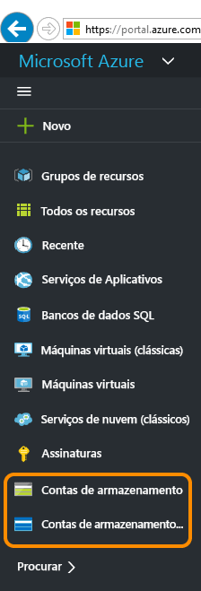

3. Escolha sua conta de armazenamento.

	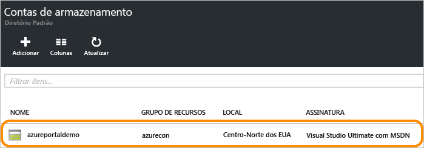

4. Escolha o serviço "Arquivos".

	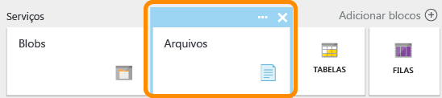

5. Clique em "Compartilhamentos de arquivos" e siga o link para criar o primeiro compartilhamento de arquivos.

	

6. Preencha o nome e o tamanho do compartilhamento de arquivos (até 5120 GB) para criar o primeiro compartilhamento de arquivos. Quando o compartilhamento de arquivos tiver sido criado, você poderá montá-lo em qualquer sistema de arquivos que dê suporte a SMB 2.1 ou SMB 3.0.

	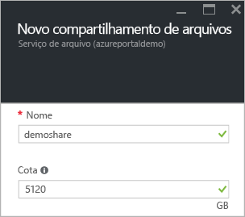

### Carregar e baixar arquivos

1. Escolha um compartilhamento de arquivos que você já criou.

	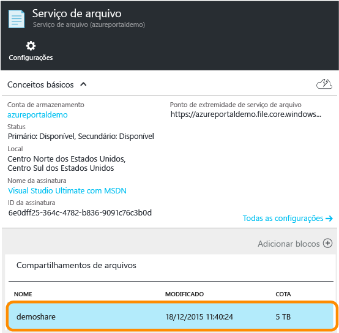

2. Clique em **Carregar** para abrir a interface do usuário para o carregamento de arquivos.

	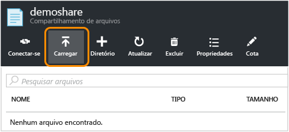

3. Clique com o botão direito do mouse em um arquivo e escolha **Baixar** para baixá-lo no local.

	

### Gerenciar o compartilhamento de arquivos

1. Clique em **Cota** para alterar o tamanho do compartilhamento de arquivos (até 5120 GB).

	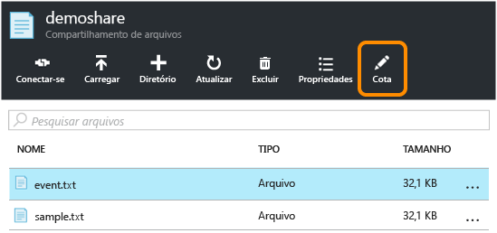

2. Clique em **Conectar** para obter a linha de comando para montar o compartilhamento de arquivos do Windows.

	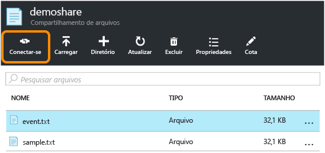

	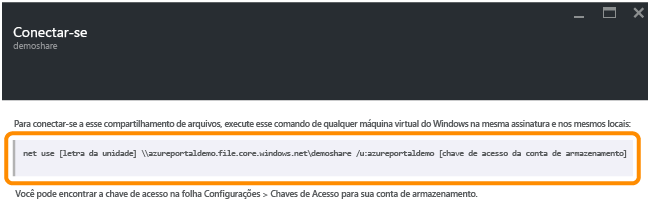

	>[AZURE.TIP] Para localizar a chave de acesso da conta de armazenamento para a montagem, clique em **Configurações** de sua conta de armazenamento e clique em **Chaves de acesso**.

	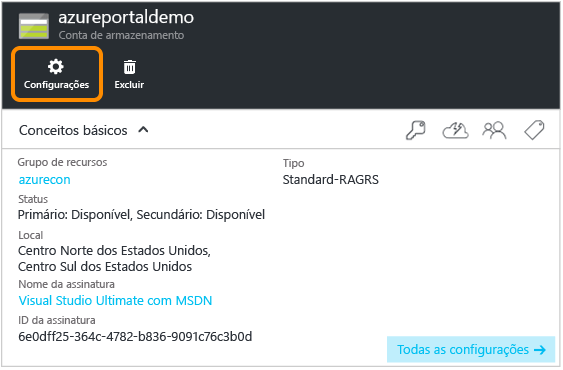

	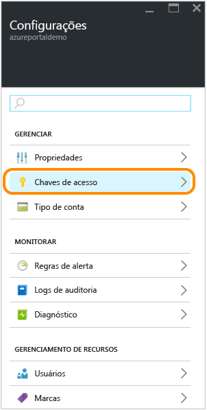

## Usar o PowerShell para gerenciar um compartilhamento de arquivos

Como alternativa, você pode usar o Azure PowerShell para criar e gerenciar compartilhamentos de arquivos.

### Instalar os cmdlets do PowerShell para Armazenamento do Azure

Para se preparar para usar o PowerShell, baixe e instale os cmdlets do PowerShell do Azure. Consulte [Como instalar e configurar o PowerShell do Azure](../powershell-install-configure.md) para obter o ponto e as instruções de instalação.

> [AZURE.NOTE] É recomendável baixar e instalar ou atualizar para o módulo mais recente do PowerShell do Azure.

Abra uma janela do Azure PowerShell clicando em **Iniciar** e digitando **Windows PowerShell**. A janela do PowerShell carregará o módulo do Azure PowerShell para você.

### Criar um contexto para sua conta e chave de armazenamento

Agora, crie o contexto da conta de armazenamento. O contexto encapsula a conta de armazenamento e a chave da conta. Para obter instruções sobre como copiar a chave da conta no [Portal do Azure](https://portal.azure.com), veja [Exibir e copiar chaves de acesso de armazenamento](storage-create-storage-account.md#view-and-copy-storage-access-keys).

Substitua `storage-account-name` e `storage-account-key` pelo nome e chave da sua conta de armazenamento no exemplo a seguir.

	# create a context for account and key
	$ctx=New-AzureStorageContext storage-account-name storage-account-key

### Criar um novo compartilhamento de arquivo

Em seguida, crie o novo compartilhamento, denominado `logs`.

	# create a new share
	$s = New-AzureStorageShare logs -Context $ctx

Agora você tem um compartilhamento de arquivo no armazenamento de arquivos. Em seguida, adicionaremos um diretório e um arquivo.

> [AZURE.IMPORTANT] O nome do seu compartilhamento de arquivo deve estar em minúsculas. Para obter detalhes completos sobre como nomear arquivos e compartilhamentos de arquivos, confira [Nomenclatura e referência de compartilhamentos, diretórios, arquivos e metadados](https://msdn.microsoft.com/library/azure/dn167011.aspx).

### Criar um diretório no compartilhamento de arquivos

Em seguida, crie um diretório no compartilhamento. No exemplo a seguir, o diretório é denominado `CustomLogs`:

    # create a directory in the share
    New-AzureStorageDirectory -Share $s -Path CustomLogs

### Carregar um arquivo local no diretório

Agora, carregue um arquivo local no diretório. O exemplo a seguir carrega um arquivo de `C:\temp\Log1.txt`. Edite o caminho do arquivo para que ele aponte para um arquivo válido em seu computador local.

    # upload a local file to the new directory
    Set-AzureStorageFileContent -Share $s -Source C:\temp\Log1.txt -Path CustomLogs

### Listar os arquivos no diretório

Para ver o arquivo no diretório, você pode listar os arquivos do diretório. Esse comando também listará os subdiretórios, mas como não há um subdiretório neste exemplo, somente o arquivo será listado.

	# list files in the new directory
	Get-AzureStorageFile -Share $s -Path CustomLogs

### Copiar arquivos

A partir da versão 0.9.7 do Azure PowerShell, você pode copiar um arquivo em outro arquivo, um arquivo em um blob ou um blob em um arquivo. A seguir, demonstramos como executar essas operações de cópia usando cmdlets do PowerShell.

	# copy a file to the new directory
    Start-AzureStorageFileCopy -SrcShareName srcshare -SrcFilePath srcdir/hello.txt -DestShareName destshare -DestFilePath destdir/hellocopy.txt -Context $srcCtx -DestContext $destCtx

    # copy a blob to a file directory
    Start-AzureStorageFileCopy -SrcContainerName srcctn -SrcBlobName hello2.txt -DestShareName hello -DestFilePath hellodir/hello2copy.txt -DestContext $ctx -Context $ctx

## Montar o compartilhamento de arquivos 

Com suporte para SMB 3.0, o armazenamento de arquivos agora dá suporte a criptografia e identificadores persistentes de clientes SMB 3.0. O suporte a criptografia significa que os clientes SMB 3.0 podem montar um compartilhamento de arquivos de qualquer lugar, inclusive de:

- Uma máquina virtual do Azure na mesma região (também com suporte de SMB 2.1)
- Uma máquina virtual do Azure em uma região diferente (somente SMB 3.0)
- Um aplicativo cliente local (somente para o SMB 3.0) 

Quando um cliente acessa o armazenamento de arquivos, a versão SMB usada depende da versão SMB com suporte do sistema operacional. A tabela a seguir fornece um resumo de suporte para Windows Clients. Consulte este blog para obter mais detalhes sobre [versões do SMB](http://blogs.technet.com/b/josebda/archive/2013/10/02/windows-server-2012-r2-which-version-of-the-smb-protocol-smb-1-0-smb-2-0-smb-2-1-smb-3-0-or-smb-3-02-you-are-using.aspx).

| Windows Client | Com suporte à versão do SMB |
|------------------------|----------------------|
| Windows 7 | SMB 2.1 |
| Windows Server 2008 R2 | SMB 2.1 |
| Windows 8 | SMB 3.0 |
| Windows Server 2012 | SMB 3.0 |
| Windows Server 2012 R2 | SMB 3.0 |
| Windows 10 | SMB 3.0 |

### Montar o compartilhamento de arquivos de uma máquina virtual do Azure com o Windows em execução

Para demonstrar como montar um compartilhamento de arquivos do Azure, criaremos agora uma máquina virtual do Azure que executa o Windows e estabeleceremos comunicação remota nela para montar o compartilhamento.

1. Primeiramente, crie uma nova máquina virtual do Azure seguindo as instruções em [Criar uma máquina virtual do Windows no Portal do Azure](../virtual-machines/virtual-machines-windows-tutorial.md).
2. Em seguida, acesse remotamente a máquina virtual seguindo as instruções em [Fazer logon em uma máquina virtual do Windows usando o Portal do Azure](../virtual-machines/virtual-machines-arm-log-on-windows-vm.md).
3. Abra uma janela do PowerShell na máquina virtual.

### Persistir as credenciais da sua conta de armazenamento para a máquina virtual

Antes de montar o compartilhamento de arquivos, primeiro é preciso persistir as credenciais da sua conta de armazenamento na máquina virtual. Essa etapa permite ao Windows reconectar automaticamente ao compartilhamento de arquivos quando a máquina virtual é reinicializada. Para persistir as credenciais da sua conta, execute o comando `cmdkey` na janela do PowerShell na máquina virtual. Substitua `<storage-account-name>` pelo nome da conta de armazenamento e `<storage-account-key>` pela chave da conta de armazenamento.

	cmdkey /add:<storage-account-name>.file.core.windows.net /user:<storage-account-name> /pass:<storage-account-key>

O Windows reconectará ao compartilhamento de arquivo quando a máquina virtual for reinicializada. Você pode verificar se o compartilhamento foi reconectado executando o comando `net use` em uma janela do PowerShell.

Observe que as credenciais são mantidas somente no contexto no qual `cmdkey` é executado. Se você estiver desenvolvendo um aplicativo que é executado como um serviço, precisará manter suas credenciais nesse contexto também.

### Montar o compartilhamento de arquivos usando as credenciais persistidas

Após ter uma conexão remota com a máquina virtual, você poderá executar o comando `net use` para montar o compartilhamento de arquivos usando a sintaxe a seguir. Substitua `<storage-account-name>` pelo nome da sua conta de armazenamento e `<share-name>` pelo nome do compartilhamento de armazenamento de arquivos.

    net use <drive-letter>: \<storage-account-name>.file.core.windows.net<share-name>

	example :
	net use z: \\samples.file.core.windows.net\logs

Como você persistiu as credenciais da conta de armazenamento na etapa anterior, não será preciso fornecê-las com o comando `net use`. Se ainda não tiver persistido suas credenciais, inclua-as como um parâmetro passado para o comando `net use`, conforme exibido no exemplo a seguir.

    net use <drive-letter>: \<storage-account-name>.file.core.windows.net<share-name> /u:<storage-account-name> <storage-account-key>

	example :
	net use z: \\samples.file.core.windows.net\logs /u:samples <storage-account-key>

Você agora pode trabalhar com o compartilhamento de armazenamento de arquivos na máquina virtual como faria com qualquer outra unidade. Você pode emitir comandos de arquivo padrão do prompt de comando ou exibir o compartilhamento montado e seu conteúdo no Explorador de Arquivos. Você também pode executar código na máquina virtual que avalia o compartilhamento de arquivos usando as APIs de E/S de arquivos padrão do Windows, como as fornecidas pelos [namespaces do System.IO](http://msdn.microsoft.com/library/gg145019.aspx) no .NET Framework.

Você também pode montar o compartilhamento de arquivos por meio de uma função executada em um serviço de nuvem do Azure ao estabelecer comunicação remota à função.

### Montar o compartilhamento de arquivos a partir de um cliente local que executa o Windows 

Para montar o compartilhamento de arquivos de um cliente local, siga estas etapas:

- Instale uma versão do Windows que dê suporte a SMB 3.0. O Windows aproveitará a criptografia SMB 3.0 para transferir dados com segurança entre o cliente local e o compartilhamento de arquivo do Azure na nuvem. 
- Abra o acesso à Internet para a porta 445 (TCP de saída) em sua rede local, conforme exigido pelo protocolo SMB. 

> [AZURE.NOTE] Alguns provedores de serviços de Internet podem bloquear a porta 445; portanto, é necessário verificar com seu provedor de serviços.

## Desenvolver com o armazenamento de arquivo

Para trabalhar com o armazenamento de arquivos programaticamente, você pode usar as bibliotecas de cliente de armazenamento para .NET e Java ou APIs REST de armazenamento do Azure. O exemplo nesta seção demonstra como trabalhar com um compartilhamento de arquivos usando a [Biblioteca de Cliente do Armazenamento do Azure para .NET](https://msdn.microsoft.com/library/mt347887.aspx) de um aplicativo de console simples em execução na área de trabalho.

[AZURE.INCLUDE [storage-dotnet-install-library-include](../../includes/storage-dotnet-install-library-include.md)]

[AZURE.INCLUDE [storage-dotnet-save-connection-string-include](../../includes/storage-dotnet-save-connection-string-include.md)]

> [AZURE.NOTE] A versão mais recente do emulador de armazenamento do Azure não dá suporte ao armazenamento de arquivos. Sua cadeia de conexão deve ter como destino uma conta de armazenamento do Azure na nuvem para funcionar com o Armazenamento de arquivo.

### Adicionar declarações do namespace

Abra o arquivo program.cs no Gerenciador de Soluções e adicione as seguintes declarações de namespace à parte superior do arquivo.

	using Microsoft.Azure; // Namespace for Azure Configuration Manager
	using Microsoft.WindowsAzure.Storage; // Namespaces for Storage Client Library
	using Microsoft.WindowsAzure.Storage.Blob;
	using Microsoft.WindowsAzure.Storage.File;

### Recuperar sua cadeia de conexão programaticamente

Você pode recuperar suas credenciais salvas por meio do arquivo app.config usando a classe `Microsoft.WindowsAzure.CloudConfigurationManager` ou a classe `System.Configuration.ConfigurationManager `. O pacote do Gerenciador de Configuração do Microsoft Azure, que inclui a classe `Microsoft.WindowsAzure.CloudConfigurationManager`, está disponível no [Nuget](https://www.nuget.org/packages/Microsoft.WindowsAzure.ConfigurationManager).

O exemplo aqui mostra como recuperar suas credenciais usando a classe `CloudConfigurationManager` e encapsulá-las com a classe `CloudStorageAccount`. Adicione o código a seguir ao método `Main()` em program.cs.

    CloudStorageAccount storageAccount = CloudStorageAccount.Parse(
    	CloudConfigurationManager.GetSetting("StorageConnectionString")); 

### Acessar o compartilhamento de arquivos programaticamente

Em seguida, adicione o código a seguir ao método `Main()` (após o código mostrado acima) para recuperar a cadeia de conexão. Esse código obtém uma referência para o arquivo que criamos anteriormente e exporta seu conteúdo para a janela do console.

	// Create a CloudFileClient object for credentialed access to File storage.
	CloudFileClient fileClient = storageAccount.CreateCloudFileClient();

	// Get a reference to the file share we created previously.
	CloudFileShare share = fileClient.GetShareReference("logs");

	// Ensure that the share exists.
	if (share.Exists())
	{
	    // Get a reference to the root directory for the share.
	    CloudFileDirectory rootDir = share.GetRootDirectoryReference();

	    // Get a reference to the directory we created previously.
	    CloudFileDirectory sampleDir = rootDir.GetDirectoryReference("CustomLogs");

	    // Ensure that the directory exists.
	    if (sampleDir.Exists())
	    {
	        // Get a reference to the file we created previously.
	        CloudFile file = sampleDir.GetFileReference("Log1.txt");

	        // Ensure that the file exists.
	        if (file.Exists())
	        {
	            // Write the contents of the file to the console window.
	            Console.WriteLine(file.DownloadTextAsync().Result);
	        }
	    }
	}

Execute o aplicativo de console para ver a saída.

### Definir o tamanho máximo de um compartilhamento de arquivos

A partir da versão 5.x da Biblioteca de Cliente do Armazenamento do Azure, você pode definir a cota (ou tamanho máximo) de um compartilhamento de arquivos, em gigabytes. Você também pode verificar a quantidade de dados atualmente armazenada no compartilhamento.

Ao definir a cota para um compartilhamento, você pode limitar o tamanho total dos arquivos armazenados no compartilhamento. Se o tamanho total dos arquivos no compartilhamento ultrapassar a cota definida no compartilhamento, os clientes não poderão aumentar o tamanho dos arquivos existentes ou criar novos arquivos, a menos que eles estejam vazios.

O exemplo a seguir mostra como verificar o uso atual de um compartilhamento e como definir a cota para o compartilhamento.

    // Parse the connection string for the storage account.
    CloudStorageAccount storageAccount = CloudStorageAccount.Parse(
        Microsoft.Azure.CloudConfigurationManager.GetSetting("StorageConnectionString"));

    // Create a CloudFileClient object for credentialed access to File storage.
    CloudFileClient fileClient = storageAccount.CreateCloudFileClient();

    // Get a reference to the file share we created previously.
    CloudFileShare share = fileClient.GetShareReference("logs");

    // Ensure that the share exists.
    if (share.Exists())
    {
        // Check current usage stats for the share.
		// Note that the ShareStats object is part of the protocol layer for the File service.
        Microsoft.WindowsAzure.Storage.File.Protocol.ShareStats stats = share.GetStats();
        Console.WriteLine("Current share usage: {0} GB", stats.Usage.ToString());

        // Specify the maximum size of the share, in GB.
        // This line sets the quota to be 10 GB greater than the current usage of the share.
        share.Properties.Quota = 10 + stats.Usage;
        share.SetProperties();

        // Now check the quota for the share. Call FetchAttributes() to populate the share's properties.
        share.FetchAttributes();
        Console.WriteLine("Current share quota: {0} GB", share.Properties.Quota);
    }

### Gerar uma assinatura de acesso compartilhado para um arquivo ou compartilhamento de arquivos

A partir da versão 5.x da Biblioteca de Cliente do Armazenamento do Azure, você pode gerar uma SAS (assinatura de acesso compartilhado) para um compartilhamento de arquivos ou para um arquivo individual. Você também pode criar uma política de acesso compartilhado em um compartilhamento de arquivos para gerenciar assinaturas de acesso compartilhado. Recomendamos a criação de uma política de acesso compartilhado, pois ela fornece um meio de revogar o SAS se ele for comprometido.

O exemplo a seguir cria uma política de acesso compartilhado em um compartilhamento e, em seguida, usa essa política para fornecer as restrições a um SAS em um arquivo no compartilhamento.

    // Parse the connection string for the storage account.
    CloudStorageAccount storageAccount = CloudStorageAccount.Parse(
        Microsoft.Azure.CloudConfigurationManager.GetSetting("StorageConnectionString"));

    // Create a CloudFileClient object for credentialed access to File storage.
    CloudFileClient fileClient = storageAccount.CreateCloudFileClient();

    // Get a reference to the file share we created previously.
    CloudFileShare share = fileClient.GetShareReference("logs");

    // Ensure that the share exists.
    if (share.Exists())
    {
        string policyName = "sampleSharePolicy" + DateTime.UtcNow.Ticks;

        // Create a new shared access policy and define its constraints.
        SharedAccessFilePolicy sharedPolicy = new SharedAccessFilePolicy()
            {
                SharedAccessExpiryTime = DateTime.UtcNow.AddHours(24),
                Permissions = SharedAccessFilePermissions.Read | SharedAccessFilePermissions.Write
            };

        // Get existing permissions for the share.
        FileSharePermissions permissions = share.GetPermissions();

        // Add the shared access policy to the share's policies. Note that each policy must have a unique name.
        permissions.SharedAccessPolicies.Add(policyName, sharedPolicy);
        share.SetPermissions(permissions);

        // Generate a SAS for a file in the share and associate this access policy with it.
        CloudFileDirectory rootDir = share.GetRootDirectoryReference();
        CloudFileDirectory sampleDir = rootDir.GetDirectoryReference("CustomLogs");
        CloudFile file = sampleDir.GetFileReference("Log1.txt");
        string sasToken = file.GetSharedAccessSignature(null, policyName);
        Uri fileSasUri = new Uri(file.StorageUri.PrimaryUri.ToString() + sasToken);

        // Create a new CloudFile object from the SAS, and write some text to the file.
        CloudFile fileSas = new CloudFile(fileSasUri);
        fileSas.UploadText("This write operation is authenticated via SAS.");
        Console.WriteLine(fileSas.DownloadText());
    }

Para saber mais sobre como criar e usar as assinaturas de acesso compartilhado, confira [Assinaturas de Acesso Compartilhado: compreender o modelo SAS](storage-dotnet-shared-access-signature-part-1.md) e [Criar e usar uma SAS com o Armazenamento de Blobs](storage-dotnet-shared-access-signature-part-2.md).

### Copiar arquivos

A partir da versão 5.x da Biblioteca de Cliente do Armazenamento do Azure, você pode copiar um arquivo em outro arquivo, um arquivo em um blob ou um blob em um arquivo. Nas próximas seções, demonstramos como executar essas operações de cópia de modo programático.

Você também pode usar o AzCopy para copiar um arquivo para outro, ou para copiar um blob em um arquivo ou vice-versa. Consulte [Transferir dados com o utilitário de linha de comando AzCopy](storage-use-azcopy.md).

> [AZURE.NOTE] Se você estiver copiando um blob em um arquivo, ou um arquivo em um blob, use uma assinatura de acesso compartilhado (SAS) para autenticar o objeto de origem, mesmo se você estiver copiando dentro da mesma conta de armazenamento.

**Copiar um arquivo para outro arquivo**

O exemplo a seguir copia um arquivo em outro arquivo no mesmo compartilhamento. Como essa operação de cópia realiza a cópia entre arquivos na mesma conta de armazenamento, você pode usar a autenticação de Chave compartilhada para executar a cópia.

    // Parse the connection string for the storage account.
    CloudStorageAccount storageAccount = CloudStorageAccount.Parse(
        Microsoft.Azure.CloudConfigurationManager.GetSetting("StorageConnectionString"));

    // Create a CloudFileClient object for credentialed access to File storage.
    CloudFileClient fileClient = storageAccount.CreateCloudFileClient();

    // Get a reference to the file share we created previously.
    CloudFileShare share = fileClient.GetShareReference("logs");

    // Ensure that the share exists.
    if (share.Exists())
    {
        // Get a reference to the root directory for the share.
        CloudFileDirectory rootDir = share.GetRootDirectoryReference();

        // Get a reference to the directory we created previously.
        CloudFileDirectory sampleDir = rootDir.GetDirectoryReference("CustomLogs");

        // Ensure that the directory exists.
        if (sampleDir.Exists())
        {
            // Get a reference to the file we created previously.
            CloudFile sourceFile = sampleDir.GetFileReference("Log1.txt");

            // Ensure that the source file exists.
            if (sourceFile.Exists())
            {
                // Get a reference to the destination file.
                CloudFile destFile = sampleDir.GetFileReference("Log1Copy.txt");

                // Start the copy operation.
                destFile.StartCopy(sourceFile);

                // Write the contents of the destination file to the console window.
                Console.WriteLine(destFile.DownloadText());
            }
        }
    }

**Copiar um arquivo em um blob**

O exemplo a seguir cria um arquivo e o copia em um blob dentro da mesma conta de armazenamento. O exemplo cria uma SAS para o arquivo de origem, que o serviço usa para autenticar o acesso ao arquivo de origem durante a operação de cópia.

    // Parse the connection string for the storage account.
    CloudStorageAccount storageAccount = CloudStorageAccount.Parse(
        Microsoft.Azure.CloudConfigurationManager.GetSetting("StorageConnectionString"));

    // Create a CloudFileClient object for credentialed access to File storage.
    CloudFileClient fileClient = storageAccount.CreateCloudFileClient();

    // Create a new file share, if it does not already exist.
    CloudFileShare share = fileClient.GetShareReference("sample-share");
    share.CreateIfNotExists();

    // Create a new file in the root directory.
    CloudFile sourceFile = share.GetRootDirectoryReference().GetFileReference("sample-file.txt");
    sourceFile.UploadText("A sample file in the root directory.");

    // Get a reference to the blob to which the file will be copied.
    CloudBlobClient blobClient = storageAccount.CreateCloudBlobClient();
    CloudBlobContainer container = blobClient.GetContainerReference("sample-container");
    container.CreateIfNotExists();
    CloudBlockBlob destBlob = container.GetBlockBlobReference("sample-blob.txt");

    // Create a SAS for the file that's valid for 24 hours.
    // Note that when you are copying a file to a blob, or a blob to a file, you must use a SAS
    // to authenticate access to the source object, even if you are copying within the same
    // storage account.
    string fileSas = sourceFile.GetSharedAccessSignature(new SharedAccessFilePolicy()
    {
        // Only read permissions are required for the source file.
        Permissions = SharedAccessFilePermissions.Read,
        SharedAccessExpiryTime = DateTime.UtcNow.AddHours(24)
    });

    // Construct the URI to the source file, including the SAS token.
    Uri fileSasUri = new Uri(sourceFile.StorageUri.PrimaryUri.ToString() + fileSas);

    // Copy the file to the blob.
    destBlob.StartCopy(fileSasUri);

    // Write the contents of the file to the console window.
    Console.WriteLine("Source file contents: {0}", sourceFile.DownloadText());
    Console.WriteLine("Destination blob contents: {0}", destBlob.DownloadText());

Você pode copiar um blob em um arquivo da mesma maneira. Se o objeto de origem for um blob, crie uma SAS para autenticar o acesso ao blob durante a operação de cópia.

## Solucionando problemas de armazenamento de arquivos usando métricas

A análise de armazenamento do Azure agora dá suporte a métricas para armazenamento de arquivos. Com dados de métricas, você pode rastrear solicitações e diagnosticar problemas.

Você pode habilitar métricas para o Armazenamento de Arquivos no [Portal do Azure](https://portal.azure.com). Você também pode habilitar métricas programaticamente ao chamar a operação Definir Propriedades de Serviço do Arquivo pela API REST ou uma operação semelhante na biblioteca de cliente de armazenamento.

O exemplo de código a seguir mostra como usar a Biblioteca de Cliente de Armazenamento para .NET para habilitar as métricas para o Armazenamento de Arquivos.

Primeiro, adicione as seguintes instruções `using` ao arquivo program.cs, além daquelas adicionadas acima:

	using Microsoft.WindowsAzure.Storage.File.Protocol;
	using Microsoft.WindowsAzure.Storage.Shared.Protocol;

Observe que, enquanto o armazenamento de Blobs, Tabelas e Filas usam o tipo `ServiceProperties` compartilhado no namespace `Microsoft.WindowsAzure.Storage.Shared.Protocol`, o armazenamento de Arquivos usa seu próprio tipo, o `FileServiceProperties`, no namespace `Microsoft.WindowsAzure.Storage.File.Protocol`. Os namespaces devem ser referenciados no seu código, no entanto, para que o código a seguir seja compilado.

    // Parse your storage connection string from your application's configuration file.
    CloudStorageAccount storageAccount = CloudStorageAccount.Parse(
            Microsoft.Azure.CloudConfigurationManager.GetSetting("StorageConnectionString"));
    // Create the File service client.
    CloudFileClient fileClient = storageAccount.CreateCloudFileClient();

    // Set metrics properties for File service.
    // Note that the File service currently uses its own service properties type,
    // available in the Microsoft.WindowsAzure.Storage.File.Protocol namespace.
    fileClient.SetServiceProperties(new FileServiceProperties()
    {
        // Set hour metrics
        HourMetrics = new MetricsProperties()
        {
            MetricsLevel = MetricsLevel.ServiceAndApi,
            RetentionDays = 14,
            Version = "1.0"
        },
        // Set minute metrics
        MinuteMetrics = new MetricsProperties()
        {
            MetricsLevel = MetricsLevel.ServiceAndApi,
            RetentionDays = 7,
            Version = "1.0"
        }
    });

    // Read the metrics properties we just set.
    FileServiceProperties serviceProperties = fileClient.GetServiceProperties();
    Console.WriteLine("Hour metrics:");
    Console.WriteLine(serviceProperties.HourMetrics.MetricsLevel);
    Console.WriteLine(serviceProperties.HourMetrics.RetentionDays);
    Console.WriteLine(serviceProperties.HourMetrics.Version);
    Console.WriteLine();
    Console.WriteLine("Minute metrics:");
    Console.WriteLine(serviceProperties.MinuteMetrics.MetricsLevel);
    Console.WriteLine(serviceProperties.MinuteMetrics.RetentionDays);
    Console.WriteLine(serviceProperties.MinuteMetrics.Version);

## Perguntas frequentes sobre armazenamento de arquivo

1. **A autenticação baseada no Active Directory tem suporte do armazenamento de arquivos?** 

	Atualmente não damos suporte a autenticação baseada no AD ou em ACLs, mas a temos em nossa lista de solicitações de recursos. Por enquanto, as chaves de conta de armazenamento do Azure são usadas para permitir a autenticação de compartilhamento de arquivos. Oferecemos uma solução alternativa usando SAS (assinaturas de acesso compartilhado) pela API REST ou pelas bibliotecas de cliente. Com a SAS, você pode gerar tokens com permissões específicas que são válidas em um intervalo de tempo especificado. Por exemplo, você pode gerar um token de acesso somente leitura a um determinado arquivo. Qualquer pessoa que possua esse token enquanto for válido terá acesso somente leitura ao arquivo.

	A SAS tem suporte somente via API REST ou bibliotecas de cliente. Quando você monta o compartilhamento de arquivos por meio do protocolo SMB, não pode usar uma SAS para delegar acesso a seu conteúdo.

2. **Os compartilhamentos de arquivo do Azure são visíveis publicamente na Internet ou somente podem ser acessados do Azure?**
 
	Desde que a porta 445 (TCP de saída) esteja aberta e o cliente dê suporte ao protocolo SMB 3.0 (*por exemplo,*, o Windows 8 ou o Windows Server 2012), o compartilhamento de arquivos está disponível por meio da Internet.

3. **O tráfego de rede entre uma máquina virtual do Azure e uma contagem de compartilhamento de arquivo conta como largura de banda externa cobrada na assinatura?**

	Se o compartilhamento de arquivos e a máquina virtual estiverem em regiões diferentes, o tráfego entre elas será cobrado como largura de banda externa.
 
4. **Se o tráfego de rede estiver entre uma máquina virtual e um compartilhamento de arquivos na mesma região, ele será gratuito?**

	Sim. Será gratuito se o tráfego estiver na mesma região.

5. **A conexão de máquinas virtuais locais ao armazenamento de arquivo do Azure depende da Rota Expressa do Azure?**

	Não. Se você não tiver a Rota Expressa, ainda poderá acessar o compartilhamento de arquivos do local, desde que a porta 445 (TCP de saída) esteja aberta para acesso à Internet. No entanto, se desejar, você pode usar a Rota Expressa com o armazenamento de arquivos.

6. **Uma “testemunha de compartilhamento de arquivo” de um cluster de failover é um dos casos de uso para armazenamento de arquivo do Azure?**

	Não há suporte para isso no momento.
 
7. **O armazenamento de arquivos é replicado somente via LRS ou GRS agora, certo?**

	Planejamos dar suporte a RA-GRS, mas ainda não há nenhum cronograma para compartilhar.

8. **Quando posso usar contas de armazenamento existentes no armazenamento de arquivo do Azure?**

	O armazenamento de arquivos do Azure agora está habilitado para todas as contas de armazenamento.

9. **Uma operação de renomeação também será adicionada à API REST?**

	Ainda não há suporte para Renomear na nossa API REST.

10. **Pode-se ter compartilhamentos aninhados, ou seja, um compartilhamento em outro compartilhamento?**

	Não. O compartilhamento de arquivos é o driver virtual que você pode montar; portanto, não há suporte para compartilhamentos aninhados.

11. **É possível especificar permissões somente leitura ou somente gravação em pastas no compartilhamento?**

	Você não tem esse nível de controle sobre as permissões se montar o compartilhamento de arquivos via SMB. No entanto, você pode conseguir isso criando uma SAS (assinatura de acesso compartilhado) por meio de bibliotecas de API REST ou de cliente.

12. **O desempenho era lento durante a tentativa de descompactar arquivos no Armazenamento de Arquivos. O que devo fazer?**

	Para transferir grandes quantidades de arquivos para o armazenamento de arquivos, recomendamos que você use o AzCopy, o Azure Powershell (Windows) ou a CLI do Azure (Unix/Linux), já que essas ferramentas foram otimizadas para transferência de rede.

13. **Patch lançado para corrigir o problema de desempenho lento com arquivos do Azure**

	A equipe do Windows lançou recentemente um patch para corrigir um problema de lentidão no desempenho quando o cliente acessa o Armazenamento de Arquivos do Azure no Windows 8.1 ou no Windows Server 2012 R2. Para obter mais informações, confira o artigo da base de dados associado, [Desempenho lento ao acessar o Armazenamento de Arquivos do Azure no Windows 8.1 ou Server 2012 R2](https://support.microsoft.com/pt-BR/kb/3114025).

14. **Como usar o Armazenamento de Arquivos do Azure com o IBM MQ**

	A IBM lançou um documento para orientar os clientes do IBM MQ durante a configuração do Armazenamento de Arquivos do Azure com seu serviço. Para obter mais informações, confira [Como configurar o gerenciador de fila de várias instâncias do IBM MQ com o Serviço de Arquivos do Microsoft Azure](https://github.com/ibm-messaging/mq-azure/wiki/How-to-setup-IBM-MQ-Multi-instance-queue-manager-with-Microsoft-Azure-File-Service).

## Próximas etapas

Consulte estes links para obter mais informações sobre o armazenamento de arquivo do Azure.

### Artigos e vídeos conceituais

- [Armazenamento de Arquivos do Azure: um sistema de arquivos SMB de nuvem ininterrupto SMB para Windows e Linux](https://azure.microsoft.com/documentation/videos/azurecon-2015-azure-files-storage-a-frictionless-cloud-smb-file-system-for-windows-and-linux/)
- [Como utilizar o armazenamento de arquivos do Azure com Linux](storage-how-to-use-files-linux.md)

### Suporte de ferramentas para o armazenamento de arquivos

- [Usando o PowerShell do Azure com o Armazenamento do Azure](storage-powershell-guide-full.md)
- [Como usar o AzCopy com o Armazenamento do Microsoft Azure](storage-use-azcopy.md)
- [Usando a CLI do Azure com o Armazenamento do Azure](storage-azure-cli.md#create-and-manage-file-shares)

### Referência

- [Referência à Biblioteca de Cliente de Armazenamento para .NET](https://msdn.microsoft.com/library/azure/dn261237.aspx)
- [Referência à API REST do serviço de arquivos](http://msdn.microsoft.com/library/azure/dn167006.aspx)

### Postagens no blog

- [O Armazenamento de arquivos do Azure agora está disponível ao público geral](https://azure.microsoft.com/blog/azure-file-storage-now-generally-available/)
- [Por dentro do Armazenamento de arquivos do Azure](https://azure.microsoft.com/blog/inside-azure-file-storage/) 
- [Apresentando o serviço de arquivo do Microsoft Azure](http://blogs.msdn.com/b/windowsazurestorage/archive/2014/05/12/introducing-microsoft-azure-file-service.aspx)
- [Persistindo conexões para arquivos do Microsoft Azure](http://blogs.msdn.com/b/windowsazurestorage/archive/2014/05/27/persisting-connections-to-microsoft-azure-files.aspx)

<!---HONumber=AcomDC_0309_2016-->