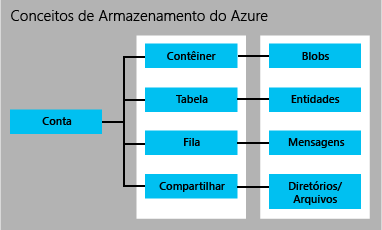

# Introdução ao Armazenamento do Microsoft Azure

## Visão geral
O Armazenamento do Azure é a solução de armazenamento em nuvem para aplicativos modernos que dependem de durabilidade, disponibilidade e escalabilidade para atender às necessidades dos clientes. Lendo este artigo, os desenvolvedores, profissionais de TI e responsáveis por decisões de negócios podem aprender sobre:

* O que é o Armazenamento do Azure e como você pode tirar proveito dele em aplicativos de nuvem, móveis, de servidor e de área de trabalho
* Quais tipos de dados você pode armazenar com os serviços de armazenamento do Azure: dados de blob (objeto), dados da tabela NoSQL, mensagens da fila e compartilhamentos de arquivos.
* Como o acesso aos seus dados no Armazenamento do Azure é gerenciado
* Como os dados do armazenamento do Azure tornam-se duráveis por meio de redundância e replicação
* Onde ir em seguida para criar seu primeiro aplicativo de Armazenamento do Azure

<!-- after our quick starts are available, replace this link with a link to one of those. 
Had to remove this article, it refers to the VS quickstarts, and they've stopped publishing them. Robin --> 
<!-- To get up and running with Azure Storage quickly, see [Get started with Azure Storage in five minutes](storage-getting-started-guide.md). -->

Para obter detalhes sobre ferramentas, bibliotecas e outros recursos para trabalhar com o armazenamento do Azure, confira as [Próximas etapas](#next-steps) abaixo.

## O que é o armazenamento do Azure?
A computação na nuvem habilita novos cenários para aplicativos, que exigem armazenamento escalonável, durável e altamente disponível para seus dados - que é exatamente o motivo pelo qual a Microsoft desenvolveu o Armazenamento do Azure. Além de permitir que os desenvolvedores criem aplicativos de grande escala para dar suporte a novos cenários, o Armazenamento do Azure também fornece a base do armazenamento das Máquinas Virtuais do Azure, uma prova adicional de sua robustez.

O Armazenamento do Azure é extremamente escalonável para que você possa armazenar e processar centenas de terabytes de dados para oferecer suporte a cenários de big data, necessários para análise científica e financeira e aplicativos de mídia. Ou você pode armazenar pequenas quantidades de dados necessários para um site de pequena empresa. Quaisquer que sejam suas necessidades, você paga apenas pelos dados que está armazenando. O Armazenamento do Azure atualmente armazena dezenas de trilhões de objetos exclusivos de clientes e manipula milhões de solicitações por segundo em média.

O Armazenamento do Azure é elástico, portanto, você pode criar aplicativos para um grande público global e dimensionar esses aplicativos conforme necessário - tanto a quantidade de dados armazenados e o número de solicitações realizadas. Você paga apenas pelo que usa e apenas quando usa.

O Armazenamento do Azure usa um sistema de particionamento automático que faz o balanço automático da carga de seus dados com base no tráfego. Isso significa que conforme crescem as demandas por seu aplicativo, o Armazenamento do Azure aloca automaticamente os recursos apropriados para atendê-las.

O Armazenamento do Azure é acessível a partir de qualquer lugar no mundo, de qualquer tipo de aplicativo, estando ele em execução na nuvem, na área de trabalho, em um servidor local, celular ou tablet. Você pode usar o Armazenamento do Azure em cenários móveis, onde o aplicativo armazena um subconjunto dos dados no dispositivo e os sincroniza com um conjunto completo de dados armazenados na nuvem.

O Armazenamento do Azure dá suporte a clientes que usam um conjunto variado de sistemas operacionais (inclusive o Windows e o Linux) e uma variedade de linguagens de programação (incluindo .NET, Java, Node.js, Python, Ruby, PHP e C++ e linguagens de programação móveis) para tornar o desenvolvimento conveniente. O Armazenamento do Azure também expõe recursos de dados por meio de APIs REST simples, que estão disponíveis para qualquer cliente capaz de enviar e receber dados via HTTP/HTTPS.

O Armazenamento premium do Azure dá suporte a disco de alto desempenho e baixa latência para cargas de trabalho com uso intenso de entrada e saída em execução em máquinas virtuais do Azure. Com o Armazenamento premium do Azure, é possível anexar vários discos de dados persistentes a uma máquina virtual e configurá-los para atender suas necessidades de desempenho. Cada disco de dados é apoiado por um disco SSD no Armazenamento premium do Azure para máximo desempenho de entrada e saída. Para obter mais detalhes, confira [Armazenamento Premium: armazenamento de alto desempenho para as cargas de trabalho das máquinas virtuais do Azure](storage-premium-storage.md) .

## Introdução aos serviços de Armazenamento do Azure
O Armazenamento do Azure fornece os quatro seguintes serviços: Armazenamento de Blobs, Armazenamento de Tabelas, Armazenamento de Filas e Armazenamento de Arquivos.

* O Armazenamento de Blobs armazena dados de objeto não estruturados. Um blob pode ser qualquer tipo de texto ou dados binários, como um documento, um arquivo de mídia ou um instalador do aplicativo. O Armazenamento de Blobs também é chamado de armazenamento de Objeto.
* O Armazenamento de Tabelas armazena conjuntos de dados estruturados. O Armazenamento de Tabela é um repositório de dados de atributo de chave NoSQL, que permite desenvolvimento rápido e acesso rápido a grandes quantidades de dados.
* O Armazenamento de Filas fornece um sistema confiável de mensagens para processamento de fluxo de trabalho e para comunicação entre componentes dos serviços de nuvem.
* O Armazenamento de Arquivos oferece o armazenamento compartilhado para aplicativos herdados com o protocolo SMB Standard. As máquinas virtuais e os serviços de nuvem do Azure podem compartilhar dados de arquivos entre componentes de aplicativos por meio de compartilhamentos montados, e os aplicativos locais podem acessar dados de arquivos em um compartilhamento por meio da API REST do serviço de Arquivo.

Uma conta de armazenamento do Azure é uma conta segura que fornece acesso a serviços no Armazenamento do Azure. Sua conta de armazenamento fornece um namespace único para seus recursos de armazenamento. A imagem abaixo mostra as relações entre os recursos de armazenamento do Azure em uma conta de armazenamento:

[!INCLUDE [storage-account-types-include](../../includes/storage-account-types-include.md)]

[!INCLUDE [storage-versions-include](../../includes/storage-versions-include.md)]

## Armazenamento de blob
Para usuários com grandes quantidades de dados de objetos não estruturados para armazenamento na nuvem, o armazenamento de Blobs oferece uma solução econômica e escalonável. Você pode usar o armazenamento de Blob para armazenar conteúdo, como:

* Documentos
* Dados sociais, como fotos, vídeos, música e blogs
* Backups de arquivos, computadores, bancos de dados e dispositivos
* Imagens e texto para aplicativos web
* Dados de configuração de aplicativos de nuvem
* Big data, como logs e outros grandes conjuntos de dados

Cada blob é organizado em um contêiner. Os contêineres também fornecem uma maneira útil para atribuir políticas de segurança para grupos de objetos. Uma conta de armazenamento pode conter qualquer número de contêineres e um contêiner pode conter qualquer número de blobs, até o limite de 500 TB de capacidade da conta de armazenamento.

O armazenamento de blobs oferece três tipos de blobs: blob de blocos, blob de anexo e blob de páginas (discos).

* Os blobs de blocos são otimizados para streaming e armazenamento de objetos de nuvem e são uma boa opção para armazenar documentos, arquivos de mídia, backups etc.
* Blobs de anexo são semelhantes aos blobs de blocos, mas são otimizados para operações de anexo. Um blob de anexo pode ser atualizado apenas com a adição de um novo bloco no final. Acrescentar blobs é uma boa opção para cenários como registro em log, em que novos dados precisam ser gravados apenas até o fim do blob.
* Os blobs de página são otimizados para representar discos de IaaS e gravações aleatórias de suporte e podem ter até 1 TB de tamanho. Um disco de IaaS anexado a uma rede de máquinas virtuais do Azure é um VHD armazenado como um blob de página.

Para conjuntos de dados muito grandes em que as restrições de rede impossibilitam o carregamento e o download de dados por Armazenamento de Blobs por transferência eletrônica, você pode enviar uma unidade de disco rígido para a Microsoft para importar ou exportar dados diretamente do datacenter. Confira [Usar o serviço de Importação/Exportação do Microsoft Azure para transferir dados para o Armazenamento de Blobs](storage-import-export-service.md).

## Armazenamento de tabela
[!INCLUDE [storage-table-cosmos-db-tip-include](../../includes/storage-table-cosmos-db-tip-include.md)] Os aplicativos modernos geralmente demandam armazenamento de dados com maior escalabilidade e flexibilidade que as gerações anteriores de software exigiam. O armazenamento de tabela oferece armazenamento altamente disponível e altamente escalonável, para que seu aplicativo possa ser dimensionado automaticamente para atender à demanda dos usuários. O armazenamento de tabelas é um armazenamento de chaves/atributos NoSQL da Microsoft - tem um design sem esquema, o que o torna diferente dos bancos de dados relacionais tradicionais. Com um repositório de dados sem esquema, é fácil adaptar seus dados conforme as necessidades de seu aplicativo evoluem. O armazenamento de tabela é fácil de usar para que os desenvolvedores possam criar aplicativos rapidamente. O acesso aos dados é rápido e econômico para todos os tipos de aplicativos.  O armazenamento de tabela normalmente tem um custo significativamente mais baixo do que o SQL tradicional para volumes de dados semelhantes.

O armazenamento de tabela é um repositório de chave-atributo, o que significa que cada valor em uma tabela é armazenado com um nome de propriedade. Esse nome de propriedade pode ser usado para filtrar e especificar os critérios de seleção. Um conjunto de propriedades e seus valores compõem uma entidade. Como o Armazenamento de tabela é sem esquema, duas entidades na mesma tabela podem conter diferentes coleções de propriedades, e essas propriedades podem ser de tipos diferentes.

Você pode usar o armazenamento de tabela para armazenar conjuntos de dados flexíveis, como dados de usuário para aplicativos web, catálogos de endereços, informações sobre dispositivos e qualquer outro tipo de metadados que o serviço requeira.  Você pode armazenar qualquer número de entidades em uma tabela e uma conta de armazenamento pode conter um número ilimitado de tabelas, até o limite de capacidade da conta de armazenamento.

Semelhantemente aos Blobs e Filas, os desenvolvedores podem gerenciar e acessar o Armazenamento de Tabelas usando protocolos REST padrão. No entanto, o Armazenamento de Tabelas também dá suporte a um subconjunto do protocolo OData, simplificando recursos de consulta avançados e permitindo formatos JSON e AtomPub (baseados em XML).

Para os aplicativos baseados na Internet atuais, os bancos de dados NoSQL como o Armazenamento de tabela, oferecem uma alternativa popular aos bancos de dados relacionais tradicionais.

## Armazenamento de filas
Na criação de aplicativos para escala, os componentes do aplicativo geralmente são desassociados, para que possam ser redimensionados independentemente. O Armazenamento de fila fornece uma solução de mensagens confiáveis para comunicação assíncrona entre os componentes do aplicativo, quer estejam em execução na nuvem, na área de trabalho, em um servidor local ou em um dispositivo móvel. O Armazenamento de fila também oferece suporte ao gerenciamento de tarefas assíncronas e à criação de fluxos de trabalho do processo.

Uma conta de armazenamento pode conter qualquer número de filas. Uma fila pode conter um número ilimitado de mensagens, até o limite de capacidade da conta de armazenamento. Mensagens individuais podem ter até 64 KB de tamanho.

## Armazenamento de arquivos
O Armazenamento de arquivos do Azure oferece compartilhamentos de arquivos do SMB baseados em nuvem, para que você possa migrar aplicativos herdados que recorrem aos compartilhamentos de arquivos para o Azure rapidamente e sem regravações caras. Com o armazenamento de arquivos do Azure, os aplicativos executados em máquinas virtuais do Azure ou serviços de nuvem podem montar um compartilhamento de arquivos na nuvem, exatamente como um aplicativo de desktop monta um compartilhamento SMB típico. Qualquer quantidade de componentes de aplicativos pode montar e acessar o compartilhamento de armazenamento de arquivos simultaneamente.

Já que um compartilhamento do Armazenamento de arquivos é um compartilhamento de arquivos SMB padrão, os aplicativos executados no Azure podem acessar dados no compartilhamento por meio de APIs de E/S do sistema de arquivos. Os desenvolvedores podem, portanto, utilizar seus códigos e habilidades existentes para migrar aplicativos existentes. Profissionais de TI podem usar cmdlets do PowerShell para criar, montar e gerenciar compartilhamentos de armazenamento de Arquivo como parte da administração de aplicativos Azure.

Assim como os outros serviços de armazenamento do Azure, o armazenamento de Arquivo expõe a API REST para acessar dados em um compartilhamento. Os aplicativos locais podem chamar a API REST do Armazenamento de arquivos para acessar os dados em um armazenamento de arquivos. Dessa forma, uma empresa pode optar por migrar alguns aplicativos herdados para o Azure e continuar executando outros de dentro de sua própria organização. É importante observar que montar um compartilhamento de arquivos é possível apenas para aplicativos executados no Azure. Um aplicativo local pode acessar o compartilhamento de arquivos apenas pela API REST.

Aplicativos distribuídos também podem usar o armazenamento de arquivo para armazenar e compartilhar dados de aplicativos úteis e ferramentas de desenvolvimento e testes. Por exemplo, um aplicativo pode armazenar arquivos de configuração e dados de diagnósticos como logs, métricas e despejos de falha para que estejam disponíveis para diversas funções ou máquinas virtuais. Desenvolvedores e administradores podem armazenar utilitários de que precisam para compilar ou gerenciar um aplicativo em um armazenamento de arquivo que esteja disponível para todos os componentes, em vez de instalá-los em todas as máquinas virtuais ou instâncias de função.

## Acesso a recursos de Blob, Tabela, Fila e Arquivo
Por padrão, somente o proprietário da conta de armazenamento pode acessar recursos na conta de armazenamento. Para a segurança de seus dados, todas as solicitações feitas para recursos em sua conta devem ser autenticadas. A autenticação conta com um modelo de Chave Compartilhada. Os Blobs também podem ser configurados para oferecer suporte à autenticação anônima.

Sua conta de armazenamento recebe duas chaves de acesso privadas na criação, que são usadas para autenticação. Ter duas chaves garante que seu aplicativo permaneça disponível quando você regenerar regularmente as chaves como uma prática comum de gerenciamento de chaves de segurança.

Se você precisar permitir acesso controlado aos usuários a seus recursos de armazenamento, poderá criar uma assinatura de acesso compartilhado. Uma SAS (assinatura de acesso compartilhado) é um token que pode ser acrescentado a uma URL que permite acesso delegado a um recurso de armazenamento. Qualquer pessoa que possua o token pode acessar o recurso para o qual ele aponta com as permissões que ele especifica, pelo período de tempo da validade. A partir da versão de 5/4/2015, o Armazenamento do Azure dá suporte a dois tipos de assinaturas de acesso compartilhado: SAS de serviço e SAS de conta.

A SAS de serviço delega acesso a um recurso em apenas um dos serviços de armazenamento: o serviço Blob, Fila, Tabela ou Arquivo.

Uma SAS de conta delega acesso a recursos em um ou mais dos serviços de armazenamento. É possível delegar acesso a operações de nível de serviço que não estão disponíveis com uma SAS de serviço. Você também pode delegar acesso a operações de leitura, gravação e exclusão em contêineres de blob, tabelas, filas e compartilhamentos de arquivos que não são permitidos com um SAS de serviço.

Finalmente, você pode especificar que um contêiner e seus blobs ou um blob específico estão disponíveis para acesso público. Quando você indica que um contêiner ou blob é público, qualquer pessoa pode lê-lo anonimamente. Nenhuma autenticação é necessária.  Os contêineres e blobs públicos são úteis para expor recursos, como mídia e documentos, que são hospedados em sites.  Para reduzir a latência de rede para um público global, você pode armazenar em cache os dados de blob usados por sites com a CDN do Azure.

Confira [Usando Assinaturas de Acesso Compartilhado (SAS)](storage-dotnet-shared-access-signature-part-1.md) para saber mais sobre as assinaturas de acesso compartilhado. Confira [Gerenciar acesso anônimo de leitura aos contêineres e blobs](storage-manage-access-to-resources.md) e [Autenticação para os serviços de armazenamento do Azure](https://msdn.microsoft.com/library/azure/dd179428.aspx) para saber mais sobre o acesso seguro à sua conta de armazenamento.

## Replicação para durabilidade e alta disponibilidade
Os dados na sua conta de armazenamento do Microsoft Azure sempre são replicados para garantir durabilidade e alta disponibilidade. A replicação copia os dados no mesmo data center ou em um segundo data center, dependendo de qual opção de replicação você escolher. A replicação protege seus dados e preserva o tempo de atividade do aplicativo no caso de falhas transitórias de hardware. Se os seus dados forem replicados para um segundo data center, isso também protegerá os dados contra uma falha catastrófica no local principal.

A replicação garante que sua conta de armazenamento atenda ao [SLA (Contrato de Nível de Serviço) do Armazenamento](https://azure.microsoft.com/support/legal/sla/storage/) mesmo diante de falhas. Consulte o SLA para obter informações sobre as garantias do Armazenamento do Azure para disponibilidade e durabilidade.

Quando você cria uma conta de armazenamento, deve selecionar uma das seguintes opções de replicação:

* **Armazenamento com redundância local (LRS).** O armazenamento com redundância local mantém três cópias dos seus dados. O LRS é replicado três vezes em um único data center, em uma única região. O LRS protege os dados contra falhas normais de hardware, mas não contra falha de um único data center.

    O LRS é oferecido com desconto. Para durabilidade máxima, recomendamos que você utilize o armazenamento com redundância geográfica, descrito abaixo.
* **Armazenamento com redundância de zona (ZRS).** O armazenamento com redundância de zona mantém três cópias dos seus dados. O ZRS é replicado três vezes por dois ou três instalações, em uma única região ou em duas regiões, proporcionando maior durabilidade que o LRS. O ZRS assegura que seus dados irão durar em uma única região.

    O ZRS proporciona maior durabilidade que o LRS, todavia, para durabilidade máxima recomendamos que você utilize o armazenamento com redundância geográfica, descrito abaixo.

  > [!NOTE]
  > O ZRS está atualmente disponível apenas para blobs de blocos e tem suporte apenas nas versões de 14/02/2014 e posteriores.
  >
  > Depois que tiver criado sua conta de armazenamento e selecionado ZRS, você não poderá convertê-la para utilizar nenhum outro tipo de replicação, ou vice-versa.
  >
  >
* **Armazenamento com redundância geográfica (GRS)**. O GRS mantém seis cópias de seus dados. Com o GRS, seus dados são replicados três vezes na região primária e também são replicados três vezes para uma região secundária a centenas de quilômetros de distância da região primária, oferecendo o nível mais alto de durabilidade. Em caso de falha na região primária, o Armazenamento do Azure realizará failover para a região secundária. O GRS assegura que seus dados serão duráveis em duas regiões separadas.

    Para obter informações sobre os pares primários e secundários por região, consulte [Regiões do Azure](https://azure.microsoft.com/regions/).
* **Armazenamento com redundância geográfica com acesso de leitura (RA-GRS)**. O armazenamento com redundância geográfica com acesso de leitura replica seus dados para uma localização geográfica secundária e também fornece acesso de leitura aos dados no local secundário. O armazenamento com redundância geográfica com acesso de leitura permite acessar os dados no local primário ou secundário caso um local fique indisponível. O acesso de leitura ao armazenamento com redundância geográfica é a opção padrão para sua conta de armazenamento quando ela é criada.

  > [!IMPORTANT]
  > Você pode alterar como seus dados são replicados depois que sua conta de armazenamento tiver sido criada, a menos que tenha especificado ZRS quando criou a conta. No entanto, observe que você pode incorrer em custo por uma transferência de dados adicional e ocasional se alternar de LRS para GRS ou RA-GRS.
  >
  >

Consulte [Replicação de armazenamento do Azure](storage-redundancy.md) para obter mais detalhes sobre as opções de replicação de armazenamento.

Para informações sobre preços de replicação da conta de armazenamento, consulte [Preços de Armazenamento do Azure](https://azure.microsoft.com/pricing/details/storage/). Consulte [Regiões do Azure](https://azure.microsoft.com/regions/#services) para obter mais informações sobre quais serviços estão disponíveis em cada região.

Para obter detalhes arquitetônicos sobre a durabilidade com o armazenamento do Azure, consulte [SOSP Paper - Azure Storage: A Highly Available Cloud Storage Service with Strong](http://blogs.msdn.com/b/windowsazurestorage/archive/2011/11/20/windows-azure-storage-a-highly-available-cloud-storage-service-with-strong-consistency.aspx).

## Transferência de dados do Armazenamento do Azure e para ele
Você pode usar o utilitário de linha de comando AzCopy para copiar dados de blobs, arquivos e tabelas dentro de sua conta de armazenamento ou entre contas de armazenamento. Consulte [Transferir dados com o Utilitário da Linha de Comando AzCopy](storage-use-azcopy.md) para obter mais informações.

O AzCopy se baseia na [Biblioteca de Movimentação de Dados do Azure](https://www.nuget.org/packages/Microsoft.Azure.Storage.DataMovement/), que atualmente está disponível na visualização.

O serviço de Importação/Exportação do Azure fornece uma maneira de importar dados ou exportar dados de blob da sua conta de armazenamento por meio de um disco rígido enviado para o data center do Azure. Para obter mais informações sobre o serviço de Importação/Exportação, consulte [Usar o Serviço de Importação/Exportação do Microsoft Azure para Transferir Dados para o Armazenamento de Blobs](storage-import-export-service.md).

## Preços
[!INCLUDE [storage-account-billing-include](../../includes/storage-account-billing-include.md)]

## APIs, bibliotecas e ferramentas de armazenamento
Os recursos do Armazenamento do Azure podem ser acessados por qualquer linguagem que possa fazer solicitações HTTP/HTTPS. Além disso, o Armazenamento do Azure oferece bibliotecas de programação para várias linguagens populares. Essas bibliotecas simplificam muitos aspectos do trabalho com o Armazenamento do Azure manipulando detalhes, como invocação síncrona e assíncrona, processamento em lotes de operações, gerenciamento de exceções, novas tentativas automáticas, comportamento operacional e assim por diante. Atualmente, as bibliotecas estão disponíveis para as seguintes linguagens e plataformas, com outras no pipeline:

### Serviços de dados do Armazenamento do Azure
* [API REST dos Serviços de Armazenamento](http://msdn.microsoft.com/library/azure/dd179355.aspx)
* [Biblioteca do Cliente de Armazenamento para .NET, Windows Phone e Windows Runtime](https://www.nuget.org/packages/WindowsAzure.Storage/)
* [Biblioteca do Cliente de Armazenamento para C++](https://github.com/Azure/azure-storage-cpp)
* [Biblioteca do Cliente de Armazenamento para Java/Android](https://azure.microsoft.com/develop/java/)
* [Biblioteca do Cliente de Armazenamento para Node.js](http://dl.windowsazure.com/nodestoragedocs/index.html)
* [Biblioteca do Cliente de Armazenamento para PHP](https://azure.microsoft.com/develop/php/)
* [Biblioteca do Cliente de Armazenamento para Ruby](https://azure.microsoft.com/develop/ruby/)
* [Biblioteca do Cliente de Armazenamento para Python](https://azure.microsoft.com/develop/python/)
* [Cmdlets de armazenamento para PowerShell 1.0](/powershell/module/azurerm.storage/#storage)

### Serviços de gerenciamento de Armazenamento do Azure
* [Referência da API REST do Provedor de Recursos de Armazenamento](/rest/api/storagerp/)
* [Biblioteca do Cliente do Provedor de Recursos de Armazenamento para .NET](/dotnet/api/microsoft.azure.management.storage)
* [Cmdlets do Provedor de Recursos de Armazenamento para PowerShell 1.0](/powershell/module/azure.storage)
* [API REST do Gerenciamento de Serviços de Armazenamento (clássico)](https://msdn.microsoft.com/library/azure/ee460790.aspx)

### Serviços de movimentação de dados do Armazenamento do Azure
* [API REST do Serviço de Importação/Exportação do Armazenamento](storage-import-export-service.md)
* [Biblioteca do Cliente de Movimentação de Dados do Armazenamento para .NET](https://www.nuget.org/packages/Microsoft.Azure.Storage.DataMovement/)

### Ferramentas e utilitários
* [O Gerenciador de Armazenamento do Microsoft Azure](../vs-azure-tools-storage-manage-with-storage-explorer.md) é um aplicativo autônomo e gratuito da Microsoft que possibilita o trabalho visual com os dados do Armazenamento do Azure no Windows, MacOS e Linux.
* [Ferramentas de Cliente do Armazenamento do Azure](storage-explorers.md)
* [SDKs e Ferramentas do Azure](https://azure.microsoft.com/tools/)
* [Emulador de Armazenamento do Azure](http://www.microsoft.com/download/details.aspx?id=43709)
* [PowerShell do Azure](/powershell/azure/overview)
* [Utilitário de linha de comando AzCopy](http://aka.ms/downloadazcopy)

## Próximas etapas
Para saber mais sobre o Armazenamento do Azure, explore estes recursos:

### Documentação
* [Documentação do Armazenamento do Azure](https://azure.microsoft.com/documentation/services/storage/)
* [Criar uma conta de armazenamento](storage-create-storage-account.md)

<!-- after our quick starts are available, replace this link with a link to one of those. 
Had to remove this article, it refers to the VS quickstarts, and they've stopped publishing them. Robin --> 
<!--* [Get started with Azure Storage in five minutes](storage-getting-started-guide.md)
-->

### Para administradores
* [Usando o PowerShell do Azure com o Armazenamento do Azure](storage-powershell-guide-full.md)
* [Uso da CLI do Azure com o Armazenamento do Azure](storage-azure-cli.md)

### Para desenvolvedores do .NET
* [Introdução ao armazenamento de Blobs do Azure usando o .NET](storage-dotnet-how-to-use-blobs.md)
* [Introdução ao armazenamento de Tabelas do Azure usando o .NET](storage-dotnet-how-to-use-tables.md)
* [Introdução ao armazenamento de Fila do Azure usando o .NET](storage-dotnet-how-to-use-queues.md)
* [Introdução ao Armazenamento de Arquivos do Azure no Windows](storage-dotnet-how-to-use-files.md)

### Para desenvolvedores de Java/Android
* [Como usar o Armazenamento de Blob do Java](storage-java-how-to-use-blob-storage.md)
* [Como usar o Armazenamento de Tabela do Java](storage-java-how-to-use-table-storage.md)
* [Como usar o Armazenamento de Fila no Java](storage-java-how-to-use-queue-storage.md)
* [Como usar o Armazenamento de Filas no Java](storage-java-how-to-use-file-storage.md)

### Para desenvolvedores do Node.js
* [Como usar o armazenamento de Blob do Node.js](storage-nodejs-how-to-use-blob-storage.md)
* [Como usar o Armazenamento de Tabela do Node.js](storage-nodejs-how-to-use-table-storage.md)
* [Como usar o Armazenamento de Fila do Node.js](storage-nodejs-how-to-use-queues.md)

### Para desenvolvedores do PHP
* [Como usar o Armazenamento de Blob do PHP](storage-php-how-to-use-blobs.md)
* [Como usar o Armazenamento de Tabela do PHP](storage-php-how-to-use-table-storage.md)
* [Como usar o Armazenamento de Fila do PHP](storage-php-how-to-use-queues.md)

### Para desenvolvedores do Ruby
* [Como usar o Armazenamento de blob no Ruby](storage-ruby-how-to-use-blob-storage.md)
* [Como usar o Armazenamento de Tabela do Ruby](storage-ruby-how-to-use-table-storage.md)
* [Como usar o Armazenamento de fila do Ruby](storage-ruby-how-to-use-queue-storage.md)

### Para desenvolvedores do Python
* [Como usar o armazenamento de Blob no Python](storage-python-how-to-use-blob-storage.md)
* [Como usar o Armazenamento de tabela do Python](storage-python-how-to-use-table-storage.md)
* [Como usar o Armazenamento de fila do Python](storage-python-how-to-use-queue-storage.md)
* [Como usar o Armazenamento de Filas no Python](storage-python-how-to-use-file-storage.md)

