<properties
	pageTitle="Introdução ao Stream Analytics do Azure para processar dados de dispositivos IoT. | Análise de Fluxo"
	description="Marcas e dados de sensor de fluxos IoT com o processamento de dados em tempo real e Stream Analytics"
    keywords="solução iot, introdução ao ioT"
	services="stream-analytics"
	documentationCenter=""
	authors="jeffstokes72"
	manager="paulettm"
	editor="cgronlun"
/>

<tags 
	ms.service="stream-analytics" 
	ms.devlang="na" 
	ms.topic="hero-article" 
	ms.tgt_pltfrm="na" 
	ms.workload="data-services" 
	ms.date="08/11/2016"
	ms.author="jeffstok"
/>

# Introdução ao Stream Analytics do Azure para processar dados de dispositivos IoT

Neste tutorial, você aprenderá a criar a lógica de processamento de fluxo para reunir dados dos dispositivos da Internet das Coisas (IoT). Usaremos um caso de uso real da Internet das coisas (IoT) para demonstrar como compilar uma solução rápida e econômica.

## Pré-requisitos

-   [Assinatura do Azure](https://azure.microsoft.com/pricing/free-trial/)
-   Exemplos de arquivos de consulta e de dados que podem ser baixados de [GitHub](https://aka.ms/azure-stream-analytics-get-started-iot)

## Cenário

A Contoso é uma empresa no espaço de automação industrial, cujo processo de fabricação é completamente automatizado. O maquinário desta fábrica tem sensores capazes de emitir fluxos de dados em tempo real. Nesse cenário, um gerente de chão de fábrica quer ter informações em tempo real dos dados de sensor para procurar por padrões e tomar ações com relação a eles. Nós usaremos a Stream Analytics Query Language (SAQL) sobre os dados do sensor para descobrir padrões interessantes sobre o fluxo de entrada de dados.

Aqui os dados estão sendo gerados de um dispositivo de marca de Sensor de instrumento no Texas.

A carga de dados está no formato JSON e é semelhante ao seguinte:

    
	{
    	"time": "2016-01-26T20:47:53.0000000",  
	    "dspl": "sensorE",  
    	"temp": 123,  
	    "hmdt": 34  
	}  
    
Em um cenário do mundo real, você teria centenas desses sensores gerando eventos como um fluxo. De forma ideal, haveria um dispositivo de gateway executando algum código para enviar por push esses eventos aos [Hubs de Eventos do Azure](https://azure.microsoft.com/services/event-hubs/) ou aos [Hubs IoT do Azure](https://azure.microsoft.com/services/iot-hub/). Seu trabalho do Stream Analytics receberia esses eventos dos Hubs de Eventos e executaria consultas de análise em tempo real nos fluxos. Em seguida, você poderia enviar os resultados a uma das [saídas com suporte](stream-analytics-define-outputs.md).

Para facilitar o uso, neste guia de Introdução, nós fornecemos a você um arquivo de dados de exemplo, capturado de dispositivos SensorTag reais, no qual você pode executar consultas diferentes e ver os resultados. Nos tutoriais subsequentes, você aprenderá a conectar seu trabalho a entradas e saídas e implantá-lo para o serviço do Azure.

## Criar um trabalho de Stream Analytics

No [Portal do Azure](http://manage.windowsazure.com), selecione o Stream Analytics e clique em **“Novo”** no canto inferior esquerdo da página para criar um novo trabalho de análise.

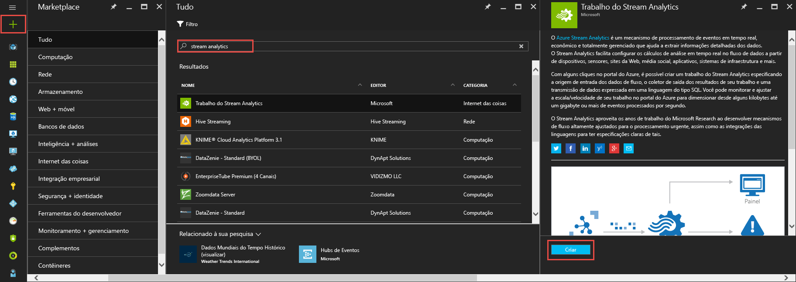

Clique em “**Criação rápida**”.

Para a configuração de **“Conta de Armazenamento de Monitoramento Regional”**, selecione **“Criar Nova Conta de Armazenamento”** e dê um nome exclusivo a ela. O Stream Analytics do Azure usará essa conta para armazenar informações de monitoramento para todos os trabalhos futuros.

> [AZURE.NOTE] Você deve criar essa conta de armazenamento apenas uma vez por região e esse armazenamento será compartilhado entre todos os trabalhos de Stream Analytics criados nessa região.

Clique em **"Criar trabalho do Stream Analytics"** na parte inferior da página.

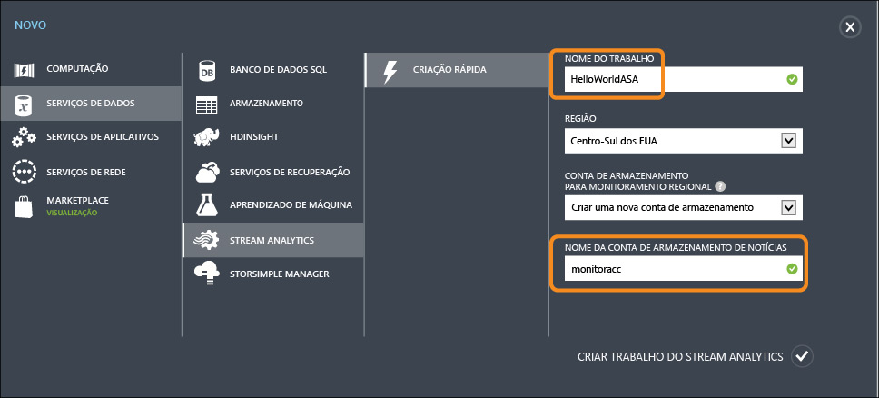

## Consulta do Stream Analytics do Azure

Clique na guia Consulta para ir para o Editor de consulta. A guia Consulta contém uma consulta de T-SQL que executa a transformação dos dados de evento de entrada.

## Dados brutos de arquivamento

A forma mais simples de consulta é uma passagem que arquivará todos os dados de entrada para sua saída designada.

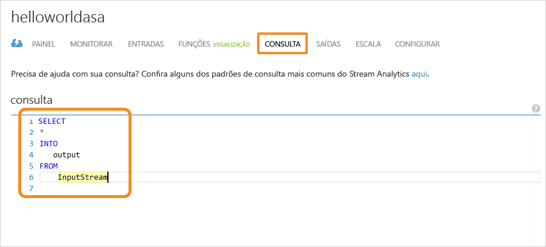

Baixe agora o arquivo de dados de exemplo do [GitHub](https://aka.ms/azure-stream-analytics-get-started-iot) para um local no seu computador. Copie e cole a consulta do arquivo **PassThrough.txt**. Clique no botão Teste abaixo e selecione o arquivo de dados chamado **HelloWorldASA InputStream.json** de seu local de download.

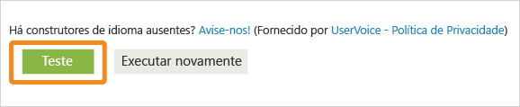

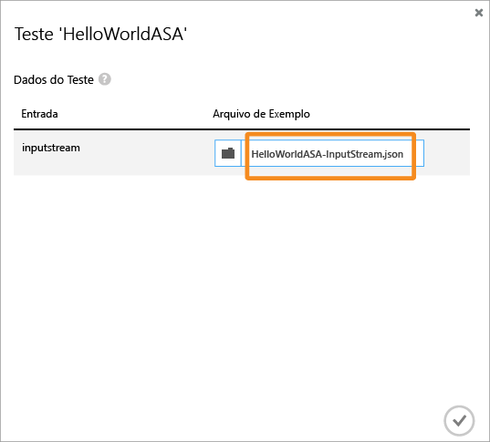

Você pode ver os resultados da consulta no navegador, conforme exibido abaixo.

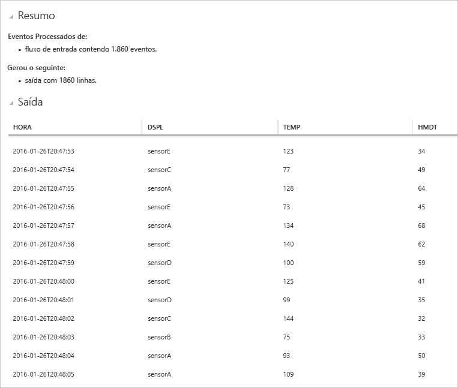

## Filtragem de dados com base em uma condição

Vamos tentar filtrar os resultados com base em uma condição. Gostaríamos de mostrar resultados somente para aqueles eventos que são provenientes do "SensorA". A consulta está localizada no arquivo **Filtering.txt**.

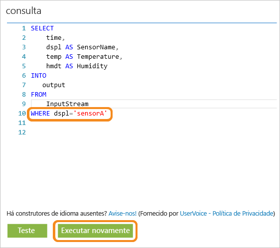

Observe que aqui estamos comparando um valor de cadeia de caracteres e sua diferenciação de caracteres maiúsculos e minúsculos. Clique no botão **Executar novamente** para executar a consulta. A consulta deve retornar apenas 389 linhas de 1860 eventos.

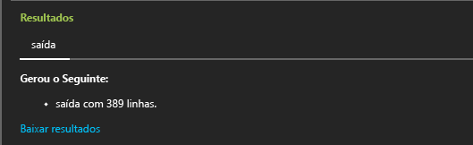

## Alerta para disparar o fluxo de trabalho de negócios

Agora, faremos nossa consulta mais detalhada. Para cada tipo de sensor, se você deseja monitorar a temperatura média por 30 segundos e exibir os resultados somente se a temperatura média estiver acima de 100 graus, podemos escrever a Consulta a seguir e, em seguida, clicar em **Executar novamente** para ver os resultados. A consulta está localizada no arquivo **ThresholdAlerting.txt**.

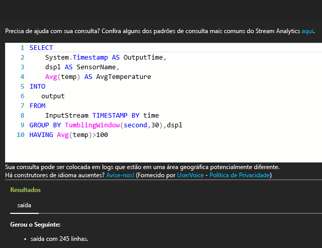

Agora, você pode ver que os resultados contêm apenas 245 linhas e lista os sensores nos quais a temperatura média é superior a 100. Nesta consulta, agrupamos o fluxo de eventos por **dspl**, que é o Nome de Sensor e sobre uma **Janela em Cascata** de 30 segundos. Quando fazemos essas consultas temporais, é essencial afirmar como queremos contar o progresso. Usando a cláusula **TIMESTAMP BY**, especificamos a coluna "tempo" como uma maneira de progresso de tempo para todos os cálculos temporais. Para obter informações detalhadas, leia os tópicos do MSDN sobre [Gerenciamento de tempo](https://msdn.microsoft.com/library/azure/mt582045.aspx) e [Funções de janelas](https://msdn.microsoft.com/library/azure/dn835019.aspx).

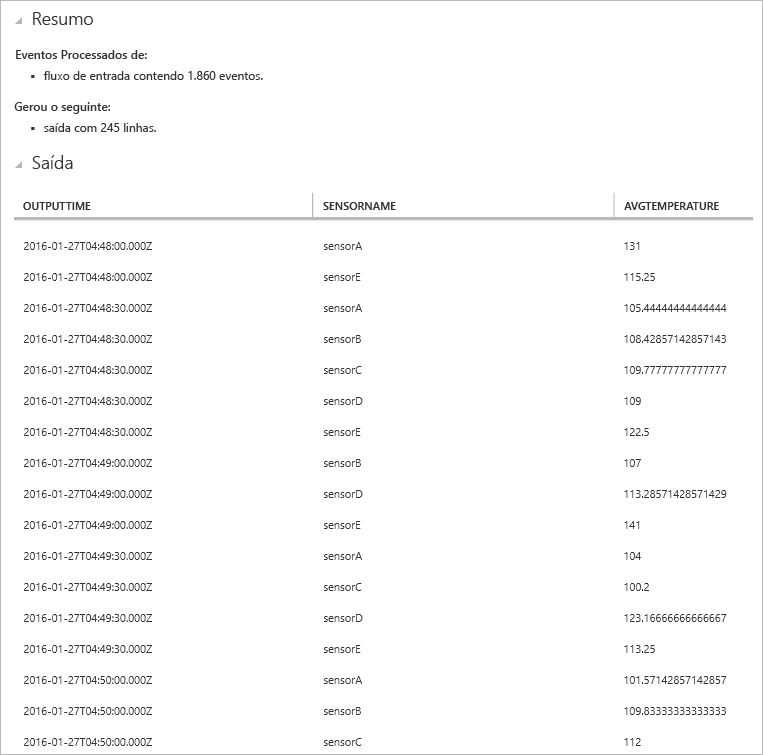

## Detectar a ausência de eventos

Como podemos escrever uma consulta para localizar a falta de eventos de entrada? Isso é relativamente fácil de fazer. Vamos descobrir a última vez que um Sensor enviou dados e, em seguida, não enviou quaisquer eventos no próximo minuto. A consulta está localizada no arquivo **AbsenseOfEvent.txt**.

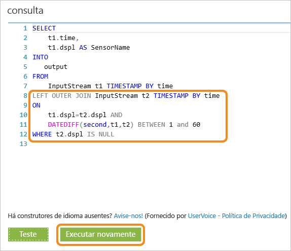

Aqui, estamos usando um **LEFT OUTER JOIN** no mesmo fluxo de dados (associação em si). Para uma junção interna, um resultado é retornado somente quando uma correspondência é encontrada. Mas para uma junção **LEFT OUTER**, se um evento do lado esquerdo da junção for incomparável, uma linha com NULL para todas as colunas da linha à direita será retornada. Essa técnica é muito útil para localizar a ausência de eventos. Consulte a documentação do MSDN para obter mais informações sobre [JOIN](https://msdn.microsoft.com/library/azure/dn835026.aspx).

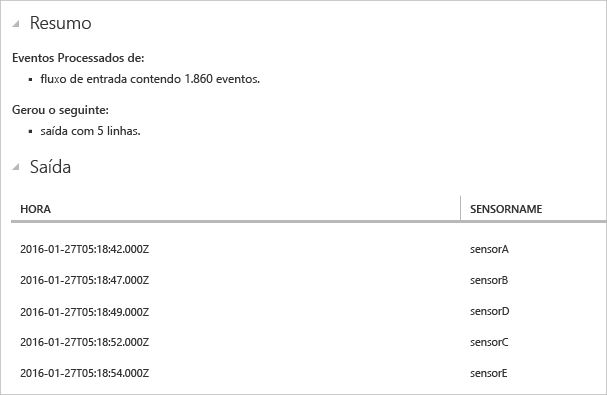

## Conclusão

O objetivo deste tutorial é demonstrar como escrever consultas de linguagem de consulta do Stream Analytics e ver os resultados no navegador. No entanto, isso está apenas começando. Há muito mais que você pode fazer com Stream Analytics. O Stream Analytics dá suporte a várias entradas e saídas e ainda pode aproveitar as funções no Aprendizado de Máquina do Azure, tornando-a uma ferramenta robusta para analisar fluxos de dados. Você pode começar a explorar mais sobre Stream Analytics usando nosso [Mapa de aprendizado](https://azure.microsoft.com/documentation/learning-paths/stream-analytics/) e, para obter mais informações sobre como escrever consultas, leia o artigo em [Padrões comuns de consulta](./stream-analytics-stream-analytics-query-patterns.md).

<!---HONumber=AcomDC_0817_2016-->