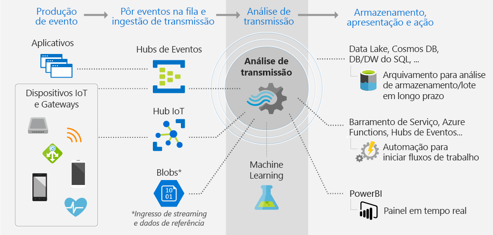

# O que é o Stream Analytics?

O Azure Stream Analytics é um mecanismo de processamento de eventos totalmente gerenciado que lhe permite configurar cálculos de análise em tempo real no fluxo de dados. Os dados podem vir de dispositivos, sensores, sites, feeds de mídia social, aplicativos, sistemas de infraestrutura e muito mais. 

## Para o que psso usar o Stream Analytics?

Com o Stream Analytics, você pode examinar grandes volumes de dados que fluem de dispositivos ou processos, extrair informações do fluxo de dados e procurar padrões, tendências e relações. Com base no que está nos dados, você pode executar tarefas de aplicativo. Por exemplo, você pode gerar alertas, disparar fluxos de trabalho de automação, passar informações para uma ferramenta de relatório, como o Power BI, ou armazenar dados para investigação posterior. 

Exemplos de cenários do Stream Analytics incluem:

* Análise e alertas de negociação na bolsa em tempo real oferecidas por empresas de serviços financeiros.
* Detecção de fraudes em tempo real com base no exame dos dados da transação. 
* Serviços de proteção de dados e identidade.
* Análise de dados gerados por sensores e acionadores inseridos em objetos físicos (Internet das Coisas, ou IoT).
* Análise de sequência de cliques da Web.
* Usos CRM (gerenciamento de relacionamento com o cliente) clientes, como a emissão de alertas quando a experiência do cliente piora em determinado intervalo de tempo.

## Como funciona o Stream Analytics?

O diagrama a seguir ilustra o pipeline do Stream Analytics, mostrando como os dados são incluídos, analisados e enviados para apresentação ou ação. 

O Stream Analytics começa com uma fonte de dados de streaming. Os dados podem ser incluídos no Azure vindos de um dispositivo usando um hub de eventos do Azure ou um hub IoT. Os dados também podem ser extraídos de um repositório de dados, como o Armazenamento de Blobs do Azure. 

Para examinar o fluxo, crie um *trabalho* do Stream Analytics que especifique de onde os dados estão vindo. O trabalho também especifica um *transformação*&mdash; em como procurar dados, padrões ou relações. Nesta tarefa, o Stream Analytics dá suporte a uma linguagem de consulta do tipo SQL que lhe permite filtrar, classificar, agregar e associar fluxo de dados em um período de tempo.

Por fim, o trabalho especifica uma saída para onde enviar os dados transformados. Isso lhe permite controlar o que fazer em resposta às informações que você analisou. Por exemplo, em resposta à análise, você pode:

* Enviar um comando para alterar as configurações do dispositivo. 
* Enviar dados para uma fila que é monitorada por um processo que executa ação com base em suas descobertas. 
* Enviar dados para um painel do Power BI para emissão de relatórios.
* Enviar dados para armazenamento, como o Data Lake Store, o banco de dados do SQL Server ou o Armazenamento de Blobs ou de Tabelas do Azure.

Enquanto um trabalho estiver em execução, você poderá monitorar e ajustar quantos eventos ele processa por segundo. Você também pode fazer com que trabalhos gerem logs de diagnóstico para solução de problemas.

## Principais recursos e benefícios

O Stream Analytics foi projetado para ser fácil de usar, flexível, econômico e escalonável para qualquer tamanho de trabalho.

### Conectividade com muitas entradas e saídas

O Stream Analytics se conecta diretamente a [Hubs de Eventos do Azure](https://azure.microsoft.com/services/event-hubs/) e a [Hubs IoT do Azure](https://azure.microsoft.com/services/iot-hub/) para a ingestão de fluxo, e ao [serviço Armazenamento de Blobs do Azure](https://docs.microsoft.com/azure/storage/storage-introduction#blob-storage-accounts) para ingerir dados históricos. Se você receber dados de hubs de eventos, poderá combinar o Stream Analytics com outras fontes de dados e mecanismos de processamento.

A entrada de trabalho também pode incluir dados de referência (dados estáticos ou alterados lentamente). Você pode adicionar dados de streaming a esses dados de referência para executar operações de pesquisa da mesma maneira que faria com consultas a banco de dados.

A saída de um trabalho do Stream Analytics pode ser roteada em várias direções. Ela pode ser gravada no armazenamento, como blobs ou tabelas de armazenamento do Azure, Banco de Dados SQL do Azure, Azure Data Lake Stores ou BD Cosmos do Azure. A partir daí, os dados podem ir para análise em lote no Azure HDInsight. Você pode enviar a saída para outro serviço, para ser consumido por outro processo, como filas, tópicos de Barramento de Serviço do Azure ou hubs de eventos. Você pode enviar a saída para visualização no Power BI.

### Fácil de uso

Para definir as transformações, use uma [linguagem de consulta do Stream Analytics](https://msdn.microsoft.com/library/azure/dn834998.aspx) simples e declarativa que lhe permite criar análises sofisticadas sem programação. A linguagem de consulta usa o fluxo de dados como entrada. Você pode filtrar e classificar os dados, agregar valores, executar cálculos, unir dados (dentro de um fluxo ou em dados de referência) e usar as funções geoespaciais. Você pode editar consultas no portal, usando o IntelliSense e a verificação de sintaxe, e pode testar consultas usando dados de exemplo que podem ser extraídos do fluxo em tempo real.

### Linguagem de consulta extensível

Você pode estender os recursos da linguagem de consulta definindo e chamando funções adicionais. Você pode definir as chamadas de função no serviço Azure Machine Learning para tirar proveito das soluções do Azure Machine Learning. Você também pode integrar UDFs (funções do definidas pelo usuário) JavaScript para executar cálculos complexos como parte de uma consulta do Stream Analytics.

### Escalabilidade

O Stream Analytics pode lidar com até 1 GB de dados de entrada por segundo. A Integração com [Hubs de eventos do Azure](https://azure.microsoft.com/services/event-hubs/) e [Hubs IoT do Azure](https://azure.microsoft.com/services/iot-hub/) permite que a solução ingira milhões de eventos por segundo, provenientes de dispositivos conectados, cliques em fluxos e arquivos de log, para citar alguns. Usando o recurso de partição dos hubs de eventos, você pode dividir os cálculos em etapas lógicas, cada um com a capacidade de ser mais particionado para aumentar a escalabilidade.

### Baixo custo

Como um serviço de nuvem, o Stream Analytics é otimizado para que você possa começar com baixo custo. O serviço foi desenvolvido para ser pago com base no uso de uma unidade de streaming e na quantidade de dados processados pelo sistema. O uso é obtido com base no volume de eventos processados e na capacidade de computação provisionada no cluster para lidar com os trabalhos do Stream Analytics.

### Confiabilidade, recuperação rápida e capacidade de repetição

Como um serviço gerenciado na nuvem, o Stream Analytics ajuda a evitar a perda de dados e fornece continuidade dos negócios. Se ocorrerem falhas, o serviço fornecerá recursos internos de recuperação. Com a capacidade de manter o estado internamente, o serviço fornece resultados reproduzíveis garantindo que é possível arquivar eventos e aplicar novamente o processamento no futuro, sempre obtendo os mesmos resultados. Assim, você pode voltar no tempo e investigar cálculos ao fazer análise de causas-raiz, análises hipotéticas, etc.

## Próximas etapas

* Comece [experimentando entradas e consultas de dispositivos IoT](stream-analytics-get-started-with-azure-stream-analytics-to-process-data-from-iot-devices.md).
* Crie uma [solução Stream Analytics de ponta a ponta](stream-analytics-real-time-fraud-detection.md) que examina os metadados de telefone para procurar chamadas fraudulentas.
* Saiba mais sobre a linguagem de consulta do tipo SQL para o Stream Analytics e sobre conceitos exclusivos como [funções de janela](stream-analytics-window-functions.md).
* Saiba como [dimensionar trabalhos do Stream Analytics](stream-analytics-scale-jobs.md). 
* Saiba como [integrar o Stream Analytics e o Azure Machine Learning](stream-analytics-machine-learning-integration-tutorial.md).
* Encontre respostas para suas perguntas sobre o Stream Analytics no [Fórum do Azure Stream Analytics](https://social.msdn.microsoft.com/Forums/home?forum=AzureStreamAnalytics).

