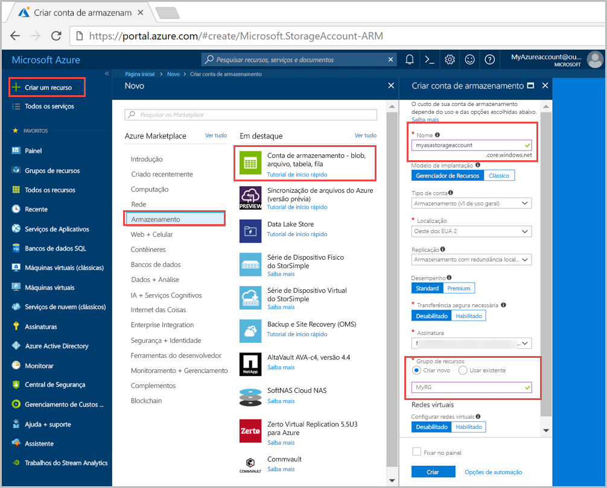
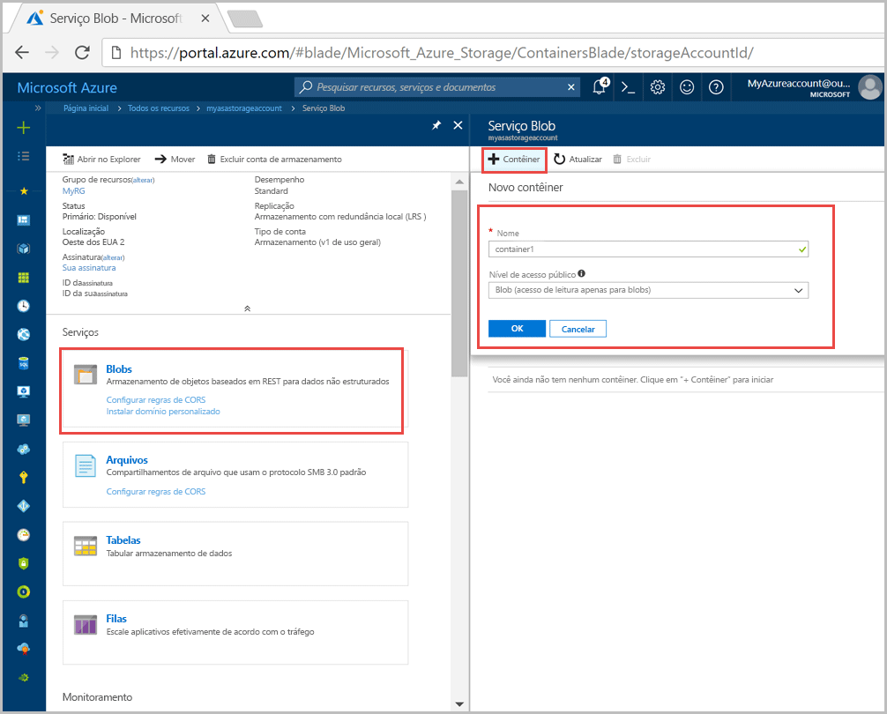
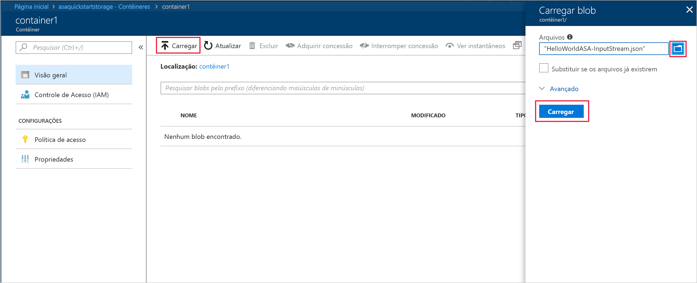
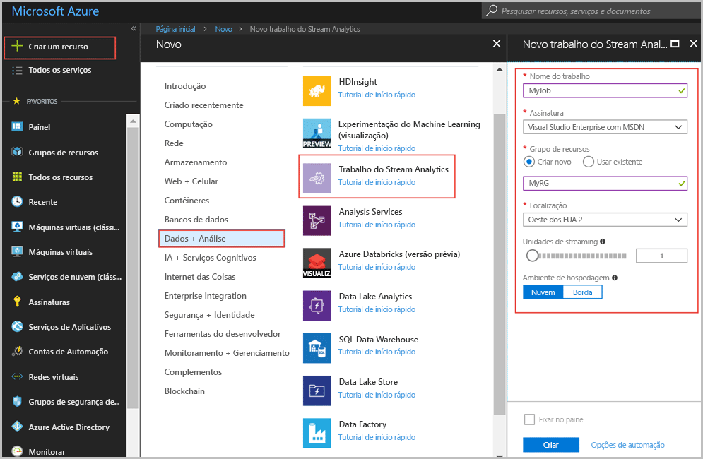
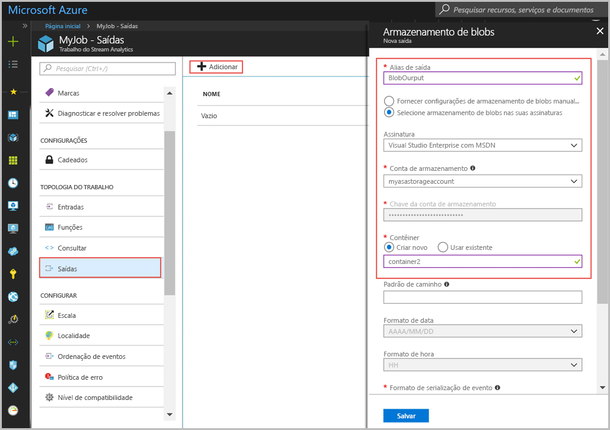
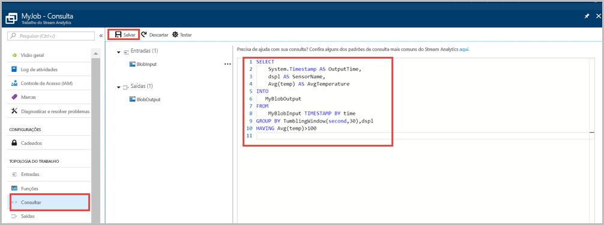
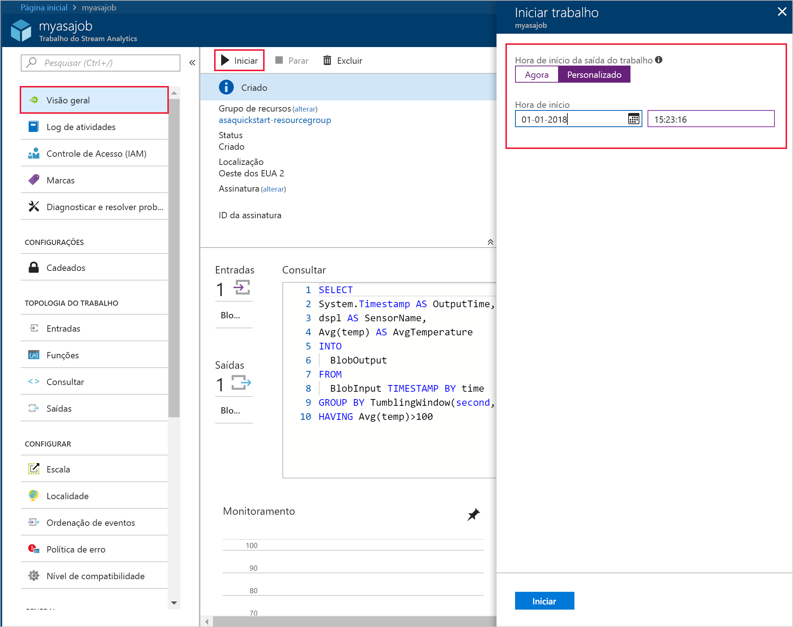
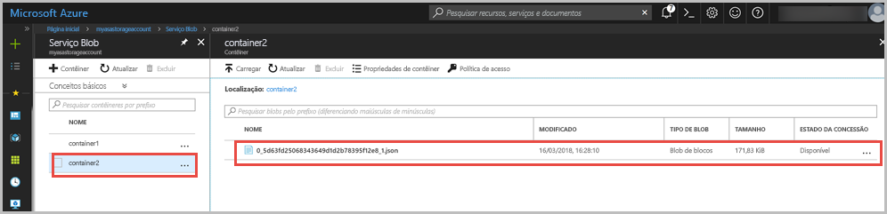

# <a name="quickstart-create-a-stream-analytics-job-by-using-the-azure-portal"></a>Início Rápido: criar um trabalho do Stream Analytics usando o portal do Azure

Este início rápido mostra como começar com a criação de um trabalho do Stream Analytics. Neste início rápido, você define um trabalho do Stream Analytics que lê dados de um sensor de exemplo e filtra as linhas com média de temperatura acima de 100 a cada 30 segundos. Neste artigo, você lê dados do armazenamento de blobs, transforma os dados e grava-os em um contêiner diferente no mesmo armazenamento de blobs.

## <a name="before-you-begin"></a>Antes de começar

* Se você não tem uma assinatura do Azure, crie uma [conta gratuita](https://azure.microsoft.com/free/).

* Entre no [portal do Azure](https://portal.azure.com/).

## <a name="prepare-the-input-data"></a>Preparar os dados de entrada

Antes de definir o trabalho do Stream Analytics, você deve preparar os dados que estão configurados como entrada do trabalho. Execute as seguintes etapas para preparar os dados de entrada exigidos pelo trabalho:

1. Baixe os [dados do sensor de exemplo](https://github.com/Azure/azure-stream-analytics/blob/master/Samples/GettingStarted/HelloWorldASA-InputStream.json) do GitHub. Os dados de exemplo contêm informações do sensor no seguinte formato JSON:  

   ```json
   {
     "time": "2016-01-26T21:18:52.0000000",
     "dspl": "sensorC",
     "temp": 87,
     "hmdt": 44
   }
   ```
2. Entrar no Portal do Azure  

3. No canto superior esquerdo do portal do Azure, selecione **Criar um recurso** > **Armazenamento** > **Conta de armazenamento**. Preencha a folha do trabalho da conta de armazenamento com o **Nome** definido como "myasastorageaccount", o **Local** definido como "Oeste dos EUA 2", o **Grupo de recursos** definido como "MyRG" (tenha a conta de armazenamento no mesmo grupo de recursos do trabalho do Streaming para melhorar o desempenho). As configurações restantes podem ser deixadas em seus valores padrão.  

   

4. Na folha **Todos os recursos**, localize a conta de armazenamento criada na etapa anterior. Abra a folha **Visão geral** e o bloco **Blobs**.  

5. Na folha **Serviço Blob**, selecione **Contêiner**, forneça um **Nome** para o contêiner, como *container1*, e altere o  **Nível de acesso público** para Blob (acesso de leitura anônimo somente para blobs) > selecione **OK**.  

   

6. Vá para o contêiner criado na etapa anterior, selecione **Carregar** e carregue os dados do sensor que você obteve na etapa 1.  

   

## <a name="create-a-stream-analytics-job"></a>Criar um trabalho de Stream Analytics

1. Entrar no Portal do Azure  

2. Selecione **Criar um recurso** no canto superior esquerdo do portal do Azure.  

3. Selecione **Dados + Análise** > **Trabalho do Stream Analytics** na lista de resultados.  

4. Preencha a folha de trabalho do Stream Analytics com as seguintes informações:

   |**Configuração**  |**Valor sugerido**  |**Descrição**  |
   |---------|---------|---------|
   |Nome do trabalho   |  myJob   |   Insira um nome para identificar o trabalho do Stream Analytics. O nome do trabalho do Stream Analytics pode conter somente caracteres alfanuméricos, hifens e sublinhados e deve ter entre 3 e 63 caracteres. |
   |Assinatura  | \<Sua assinatura\> |  Selecione a assinatura do Azure que você deseja usar para este trabalho. |
   |Grupo de recursos   |   myResourceGroup  |   Selecione **Criar Novo** e insira um novo nome de grupo de recursos para a conta. |
   |Local padrão  |  \<Selecione a região mais próxima de seus usuários\> | Selecione a localização geográfica onde você pode hospedar seu trabalho do Stream Analytics. Use o local mais próximo de seus usuários para melhorar o desempenho e reduzir o custo de transferência dos dados. |
   |Unidades de transmissão  | 1  |   As unidades de streaming representam os recursos de computação necessários para executar um trabalho. Por padrão, esse valor é definido como 1. Para saber mais sobre como dimensionar unidades de streaming, consulte o artigo [Entendendo e ajustando as unidades de streaming](stream-analytics-streaming-unit-consumption.md).   |
   |Ambiente de hospedagem  |  Nuvem  |   Os trabalhos do Stream Analytics podem ser implantados na nuvem ou na borda. O Cloud permite que você implante no Azure Cloud e o Edge permite que você implante em um dispositivo IoT Edge. |

   

5. Marque a caixa **Fixar no painel** para colocar o trabalho no painel e, em seguida, selecione **Criar**.  

6. Você deve ver uma mensagem 'Implantação em andamento...' exibida no canto superior direito da janela do navegador. 

## <a name="configure-input-to-the-job"></a>Configurar a entrada para o trabalho

Nesta seção, você configurará o armazenamento de blobs como uma entrada para o trabalho do Stream Analytics. Antes de configurar a entrada, crie uma conta de armazenamento de blobs.  

### <a name="add-the-input"></a>Adicionar a entrada 

1. Navegue até o trabalho do Stream Analytics.  

2. Selecione **Entradas** > **Adicionar Entrada do Sream** > **Armazenamento de blobs**.  

3. Preencha a folha **Armazenamento de Blobs** com estes valores:

   |**Configuração**  |**Valor sugerido**  |**Descrição**  |
   |---------|---------|---------|
   |Alias de entrada  |  BlobInput   |  Insira um nome para identificar a entrada do trabalho.   |
   |Assinatura   |  \<Sua assinatura\> |  Selecione a assinatura do Azure que tem a conta de armazenamento criada. A conta de armazenamento pode estar na mesma assinatura ou em uma diferente. Este exemplo pressupõe que você criou a conta de armazenamento na mesma assinatura. |
   |Conta de armazenamento  |  myasastorageaccount |  Escolha ou insira o nome da conta de armazenamento. Os nomes das contas de armazenamento são detectados automaticamente quando elas são criadas na mesma assinatura. |
   |Contêiner  | container1 | Escolha o nome do contêiner que tem os dados de exemplo. Os nomes de contêiner são detectados automaticamente quando eles são criados na mesma assinatura. |

4. Deixe as outras opções com os valores padrão e selecione **Salvar** para salvar as configurações.  

   
 
## <a name="configure-output-to-the-job"></a>Configurar a saída para o trabalho

1. Navegue até o trabalho do Stream Analytics criado anteriormente.  

2. Selecione **Saídas > Adicionar > Armazenamento de Blobs**.  

3. Preencha a folha **Armazenamento de Blobs** com estes valores:

   |**Configuração**  |**Valor sugerido**  |**Descrição**  |
   |---------|---------|---------|
   |Alias de saída |   BlobOutput   |   Insira um nome para identificar a saída do trabalho. |
   |Assinatura  |  \<Sua assinatura\>  |  Selecione a assinatura do Azure que tem a conta de armazenamento criada. A conta de armazenamento pode estar na mesma assinatura ou em uma diferente. Este exemplo pressupõe que você criou a conta de armazenamento na mesma assinatura. |
   |Conta de armazenamento |  myasastorageaccount |   Escolha ou insira o nome da conta de armazenamento. Os nomes das contas de armazenamento são detectados automaticamente quando elas são criadas na mesma assinatura.       |
   |Contêiner |   container2  |  Crie um novo contêiner na mesma conta de armazenamento que você usou para a entrada.   |

4. Deixe as outras opções com os valores padrão e selecione **Salvar** para salvar as configurações.  

   
 
## <a name="define-the-transformation-query"></a>Definir a consulta de transformação

1. Navegue até o trabalho do Stream Analytics criado anteriormente.  

2. Selecione **Consulta** e atualize a consulta da seguinte maneira:  

   ```sql
   SELECT 
   System.Timestamp AS OutputTime,
   dspl AS SensorName,
   Avg(temp) AS AvgTemperature
   INTO
     MyBlobOutput
   FROM
     MyBlobInput TIMESTAMP BY time
   GROUP BY TumblingWindow(second,30),dspl
   HAVING Avg(temp)>100
   ```

3. Neste exemplo, a consulta lê os dados do blob e os copia para um novo arquivo no blob selecionando **Salvar**.  

   

## <a name="start-the-stream-analytics-job-and-check-the-output"></a>Iniciar o trabalho do Stream Analytics e verificar a saída

1. Retorne para a folha de visão geral do trabalho e selecione **Iniciar**  

2. Em **Iniciar trabalho**, selecione **Personalizado** no campo **Hora de início**. Selecione um dia antes de quando você carregou o arquivo para o armazenamento de blobs porque a hora em que o arquivo foi carregado é anterior à hora atual. Quando terminar, selecione **Iniciar**.  

   

3. Depois de alguns minutos, no portal, localize a conta de armazenamento e o contêiner que você configurou como saída para o trabalho. Agora você pode ver o arquivo de saída no contêiner. O trabalho leva alguns minutos para ser iniciado pela primeira vez. Depois de iniciado, ele continuará a ser executado com a chegada dos dados.  

   

## <a name="clean-up-resources"></a>Limpar recursos

Quando não forem mais necessários, exclua o grupo de recursos, o trabalho de streaming e todos os recursos relacionados. A exclusão do trabalho evita a cobrança das unidades de streaming consumidas por ele. Se você está planejando usar o trabalho no futuro, pode interrompê-lo e reiniciar mais tarde, quando necessário. Se você não for mais usar o trabalho, exclua todos os recursos criados neste início rápido usando as seguintes etapas:

1. No menu à esquerda no Portal do Azure, selecione **Grupos de recursos** e selecione o nome do recurso criado.  

2. Em sua página de grupo de recursos, selecione **Excluir**, digite o nome do recurso para excluir na caixa de texto e selecione **Excluir**.

## <a name="next-steps"></a>Próximas etapas

Neste início rápido, você implantou um trabalho do Stream Analytics simples. Para saber mais sobre como configurar outras fontes de entrada e executar detecção em tempo real, avance para o artigo a seguir:

> [!div class="nextstepaction"]
> [Detecção de fraude em tempo real usando o Azure Stream Analytics](stream-analytics-real-time-fraud-detection.md)

