# <a name="quickstart-create-a-stream-analytics-job-by-using-the-azure-portal"></a>Início Rápido: criar um trabalho do Stream Analytics usando o portal do Azure

Este início rápido mostra como começar com a criação de um trabalho do Stream Analytics. Neste início rápido, você define um trabalho do Stream Analytics que lê dados de streaming em tempo real e filtra mensagens indicando temperatura acima de 27 graus. Seu trabalho do Stream Analytics lerá dados de um dispositivo do Hub IoT, transformará os dados e fará write-back para um contêiner no armazenamento de blobs. Os dados de entrada usados neste início rápido são gerados por um simulador online do Raspberry Pi. 

## <a name="before-you-begin"></a>Antes de começar

* Se você não tiver uma assinatura do Azure, crie uma [conta gratuita](https://azure.microsoft.com/free/).

* Entre no [Portal do Azure](https://portal.azure.com/).

## <a name="prepare-the-input-data"></a>Preparar os dados de entrada

Antes de definir o trabalho do Stream Analytics, você deve preparar os dados, que serão posteriormente configurados como a entrada do trabalho. Para preparar os dados de entrada exigidos pelo trabalho, complete as seguintes etapas:

1. Entre no [Portal do Azure](https://portal.azure.com/).

2. Selecione **Criar um recurso** > **Internet das Coisas** > **Hub IoT**.

3. No painel do **Hub IoT**, insira as seguintes informações:
   
   |**Configuração**  |**Valor sugerido**  |**Descrição**  |
   |---------|---------|---------|
   |Assinatura  | \<Sua assinatura\> |  Selecione a assinatura do Azure que você deseja usar. |
   |Grupo de recursos   |   asaquickstart-resourcegroup  |   Selecione **Criar Novo** e insira um novo nome de grupo de recursos para a conta. |
   |Região  |  \<Selecione a região mais próxima de seus usuários\> | Selecione uma localização geográfica na qual você possa hospedar o Hub IoT. Use a localização mais próxima dos usuários. |
   |Nome do Hub IoT  | MyASAIoTHub  |   Selecione um nome para o Hub IoT.   |

   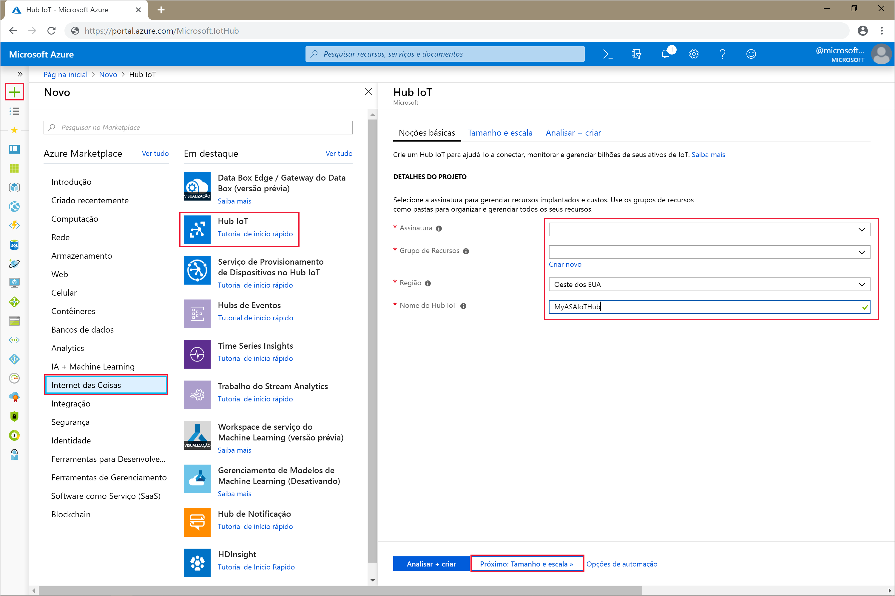

4. Selecione **Avançar: definir o tamanho e a escala**.

5. Escolha **Tipo de preço e escala**. Para este início rápido, selecione a camada **F1 – Gratuita**, caso ela ainda esteja disponível em sua assinatura. Para obter mais informações, consulte [Preço do Hub IoT](https://azure.microsoft.com/pricing/details/iot-hub/).

   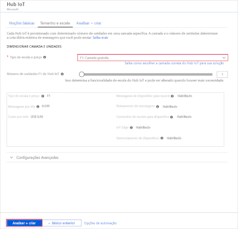

6. Selecione **Examinar + criar**. Examine as informações do Hub IoT e clique em **Criar**. A criação do Hub IoT pode levar alguns minutos. Você pode monitorar o progresso no painel **Notificações**.

7. No menu de navegação do Hub IoT, clique em **Adicionar** em **Dispositivos IoT**. Adicione uma **ID do dispositivo** e clique em **Salvar**.

   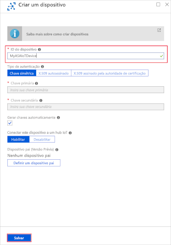

8. Assim que o dispositivo tiver sido criado, abra-o na lista **Dispositivos IoT**. Copie a **Cadeia de conexão – chave primária** e salve-a em um bloco de notas para uso futuro.

   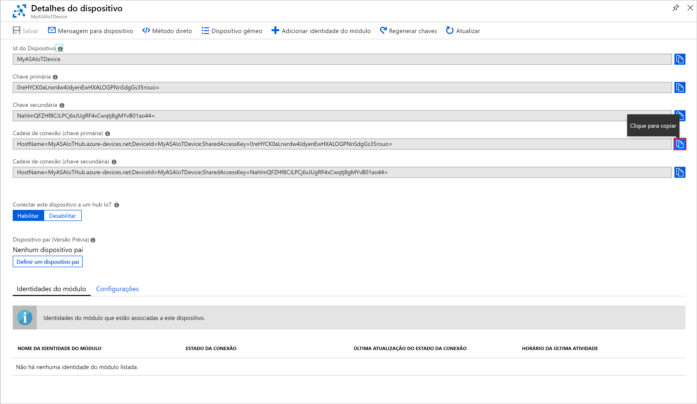

## <a name="create-blob-storage"></a>Criar o armazenamento de blobs

1. No canto superior esquerdo do portal do Azure, selecione **Criar um recurso** > **Armazenamento** > **Conta de armazenamento**.

2. No painel **Criar conta de armazenamento**, insira um nome para a conta de armazenamento, um local e um grupo de recursos. Escolha o mesmo local e grupo de recursos do Hub IoT criado. Clique em **Revisar + criar** para criar a conta.

   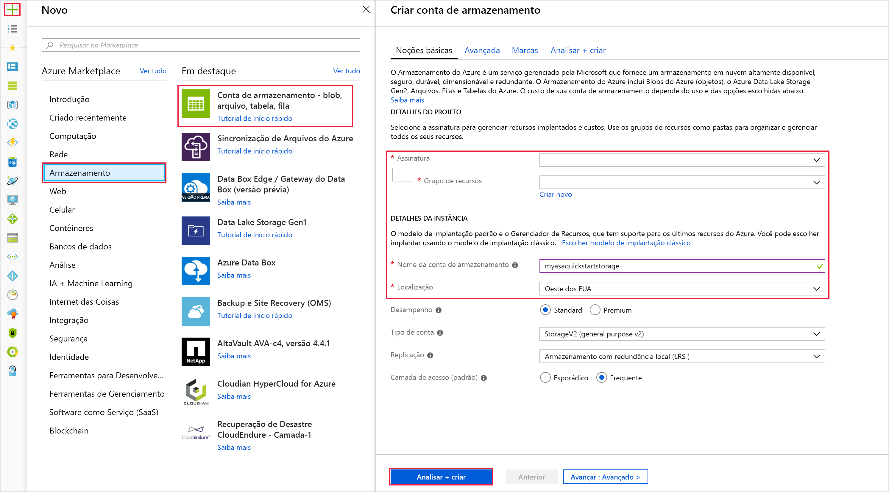

3. Assim que sua conta de armazenamento tiver sido criada, selecione o bloco **Blobs** no painel **Visão geral**.

   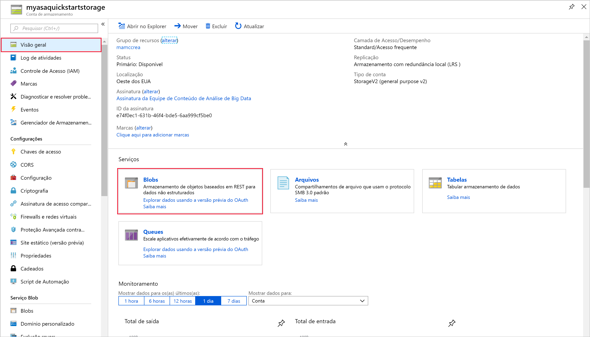

4. Na página **Serviço Blob**, selecione **Contêiner** e forneça um nome a ele, por exemplo, *conteiner1*. Deixe o **Nível de acesso público** como **Particular (sem acesso anônimo)** e selecione **OK**.

   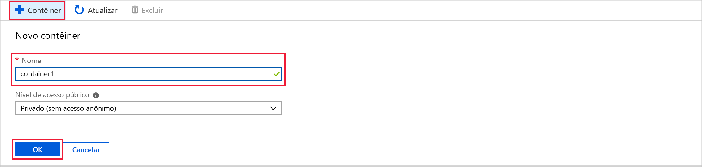

## <a name="create-a-stream-analytics-job"></a>Criar um trabalho de Stream Analytics

1. Entre no Portal do Azure.

2. Selecione **Criar um recurso** no canto superior esquerdo do portal do Azure.  

3. Selecione **Dados + Análise** > **Trabalho do Stream Analytics** na lista de resultados.  

4. Preencha a página de trabalho do Stream Analytics com as seguintes informações:

   |**Configuração**  |**Valor sugerido**  |**Descrição**  |
   |---------|---------|---------|
   |Nome do trabalho   |  MyASAJob   |   Insira um nome para identificar o trabalho do Stream Analytics. O nome do trabalho do Stream Analytics pode conter somente caracteres alfanuméricos, hifens e sublinhados e deve ter entre 3 e 63 caracteres. |
   |Assinatura  | \<Sua assinatura\> |  Selecione a assinatura do Azure que você deseja usar para este trabalho. |
   |Grupo de recursos   |   asaquickstart-resourcegroup  |   Selecione o mesmo grupo de recursos do Hub IoT. |
   |Local padrão  |  \<Selecione a região mais próxima de seus usuários\> | Selecione a localização geográfica onde você pode hospedar seu trabalho do Stream Analytics. Use o local mais próximo de seus usuários para melhorar o desempenho e reduzir o custo de transferência dos dados. |
   |Unidades de transmissão  | 1  |   As unidades de streaming representam os recursos de computação necessários para executar um trabalho. Por padrão, esse valor é definido como 1. Para saber mais sobre como dimensionar unidades de streaming, consulte o artigo [Entendendo e ajustando as unidades de streaming](stream-analytics-streaming-unit-consumption.md).   |
   |Ambiente de hospedagem  |  Nuvem  |   Os trabalhos do Stream Analytics podem ser implantados na nuvem ou na borda. O Cloud permite que você implante no Azure Cloud e o Edge permite que você implante em um dispositivo IoT Edge. |

   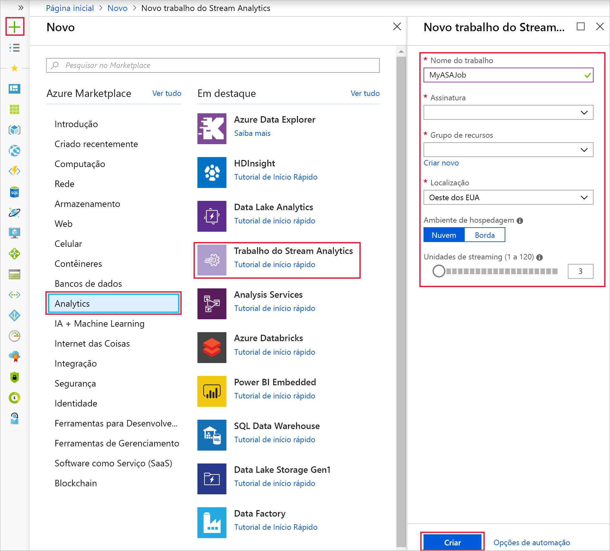

5. Marque a caixa **Fixar no painel** para colocar o trabalho no painel e, em seguida, selecione **Criar**.  

6. Você deve ver uma notificação de *Implantação em andamento...* exibida no canto superior direito da janela do navegador. 

## <a name="configure-job-input"></a>Configurar entrada de trabalho

Nesta seção, você configurará uma entrada de dispositivo do Hub IoT para um trabalho do Stream Analytics. Use o Hub IoT criado na seção anterior do início rápido.

1. Navegue até o trabalho do Stream Analytics.  

2. Selecione **Entradas** > **Adicionar entrada do Stream** > **Hub IoT**.  

3. Preencha a página **Hub IoT** com os seguintes valores:

   |**Configuração**  |**Valor sugerido**  |**Descrição**  |
   |---------|---------|---------|
   |Alias de entrada  |  IoTHubInput   |  Insira um nome para identificar a entrada do trabalho.   |
   |Assinatura   |  \<Sua assinatura\> |  Selecione a assinatura do Azure que tem a conta de armazenamento criada. A conta de armazenamento pode estar na mesma assinatura ou em uma diferente. Este exemplo pressupõe que você criou a conta de armazenamento na mesma assinatura. |
   |Hub IoT  |  MyASAIoTHub |  Insira o nome do Hub IoT criado na seção anterior. |

4. Deixe as outras opções com os valores padrão e selecione **Salvar** para salvar as configurações.  

   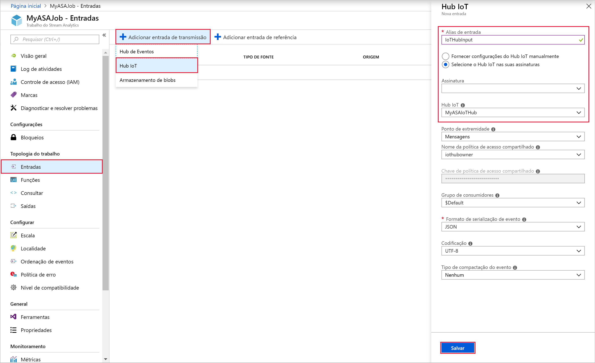
 
## <a name="configure-job-output"></a>Configurar saída de trabalho

1. Navegue até o trabalho do Stream Analytics criado anteriormente.  

2. Selecione **Saídas** > **Adicionar** > **Armazenamento de blobs**.  

3. Preencha a página **Armazenamento de Blob** com estes valores:

   |**Configuração**  |**Valor sugerido**  |**Descrição**  |
   |---------|---------|---------|
   |Alias de saída |   BlobOutput   |   Insira um nome para identificar a saída do trabalho. |
   |Assinatura  |  \<Sua assinatura\>  |  Selecione a assinatura do Azure que tem a conta de armazenamento criada. A conta de armazenamento pode estar na mesma assinatura ou em uma diferente. Este exemplo pressupõe que você criou a conta de armazenamento na mesma assinatura. |
   |Conta de armazenamento |  asaquickstartstorage |   Escolha ou insira o nome da conta de armazenamento. Os nomes das contas de armazenamento são detectados automaticamente quando elas são criadas na mesma assinatura.       |
   |Contêiner |   container1  |  Selecione o contêiner existente que você criou em sua conta de armazenamento.   |

4. Deixe as outras opções com os valores padrão e selecione **Salvar** para salvar as configurações.  

   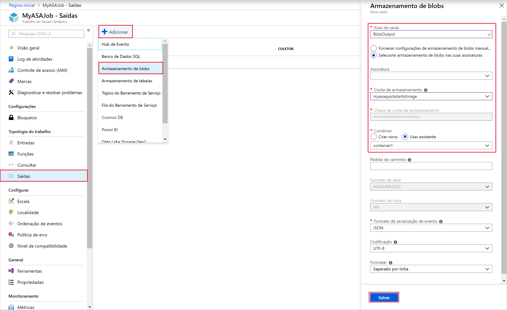
 
## <a name="define-the-transformation-query"></a>Definir a consulta de transformação

1. Navegue até o trabalho do Stream Analytics criado anteriormente.  

2. Selecione **Consulta** e atualize a consulta da seguinte maneira:  

   ```sql
   SELECT *
   INTO BlobOutput
   FROM IoTHubInput
   HAVING Temperature > 27
   ```

3. Neste exemplo, a consulta lê os dados do Hub IoT e os copia para um novo arquivo no blob. Clique em **Salvar**.  

   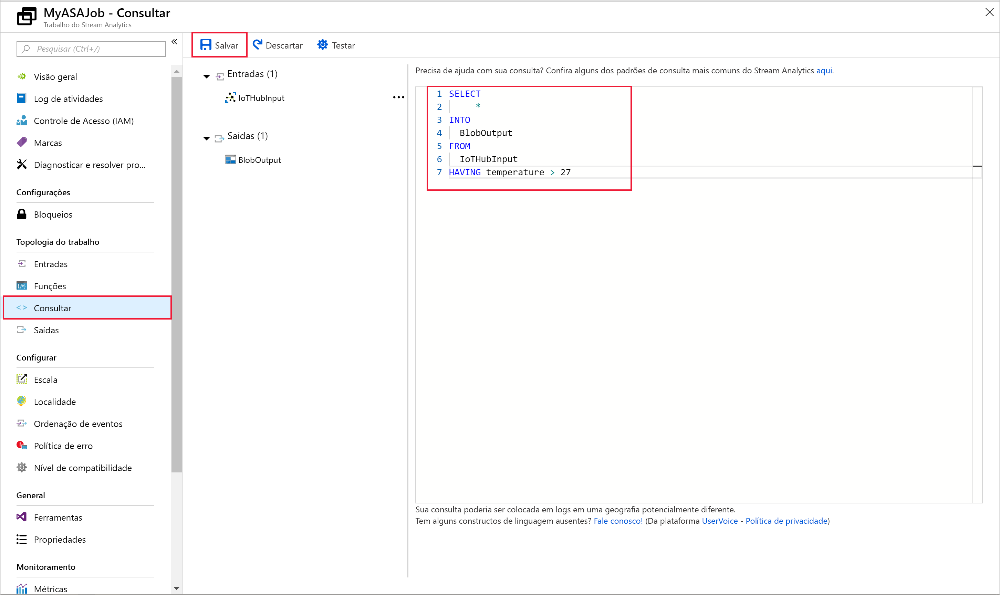

## <a name="run-the-iot-simulator"></a>Executar o simulador de IoT

1. Abra o [Simulador Online de IoT do Azure do Raspberry Pi](https://azure-samples.github.io/raspberry-pi-web-simulator/).

2. Substitua o espaço reservado na Linha 15 pela cadeia de conexão do dispositivo do Hub IoT do Azure salva em uma seção anterior.

3. Clique em **Executar**. A saída deve exibir os dados de sensor e as mensagens que estão sendo enviadas ao Hub IoT.

   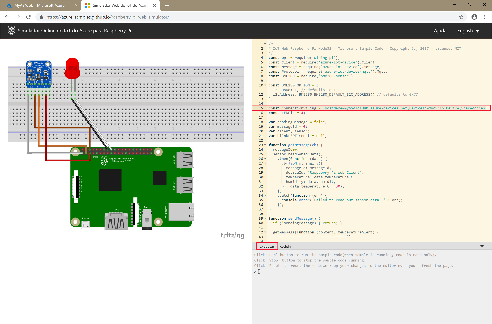

## <a name="start-the-stream-analytics-job-and-check-the-output"></a>Iniciar o trabalho do Stream Analytics e verificar a saída

1. Retorne para a página de visão geral do trabalho e selecione **Iniciar**.

2. Em **Iniciar trabalho**, selecione **Agora** no campo **Hora de início da saída do trabalho**. Em seguida, selecione **Iniciar** para iniciar o trabalho.

3. Depois de alguns minutos, no portal, localize a conta de armazenamento e o contêiner que você configurou como saída para o trabalho. Agora você pode ver o arquivo de saída no contêiner. O trabalho leva alguns minutos para ser iniciado pela primeira vez. Depois de iniciado, ele continuará a ser executado com a chegada dos dados.  

   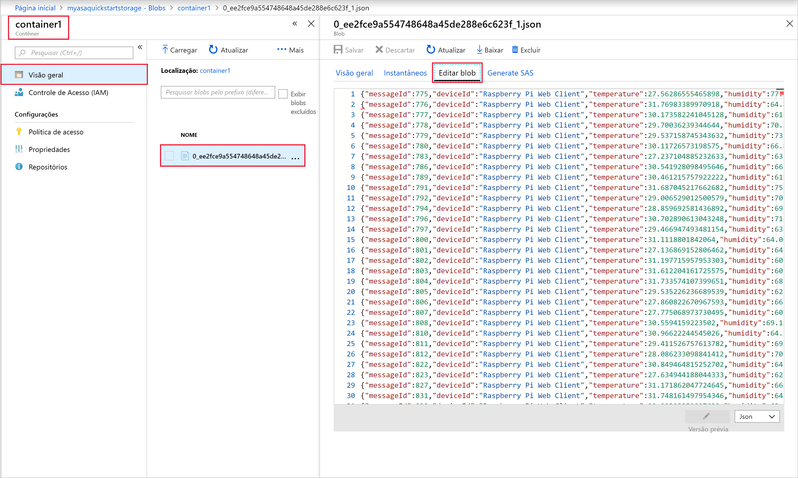

## <a name="clean-up-resources"></a>Limpar recursos

Quando não forem mais necessários, exclua o grupo de recursos, o trabalho de streaming e todos os recursos relacionados. A exclusão do trabalho evita a cobrança das unidades de streaming consumidas por ele. Se você está planejando usar o trabalho no futuro, pode interrompê-lo e reiniciar mais tarde, quando necessário. Se você não for mais usar o trabalho, exclua todos os recursos criados neste início rápido usando as seguintes etapas:

1. No menu à esquerda no Portal do Azure, selecione **Grupos de recursos** e selecione o nome do recurso criado.  

2. Em sua página de grupo de recursos, selecione **Excluir**, digite o nome do recurso para excluir na caixa de texto e selecione **Excluir**.

## <a name="next-steps"></a>Próximas etapas

Neste guia de início rápido, você implantou um trabalho simples do Stream Analytics usando o portal do Azure. Você também pode implantar trabalhos do Stream Analytics usando o [PowerShell](stream-analytics-quick-create-powershell.md) e o [Visual Studio](stream-analytics-quick-create-vs.md).

Para saber mais sobre como configurar outras fontes de entrada e executar detecção em tempo real, avance para o artigo a seguir:

> [!div class="nextstepaction"]
> [Detecção de fraude em tempo real usando o Azure Stream Analytics](stream-analytics-real-time-fraud-detection.md)

