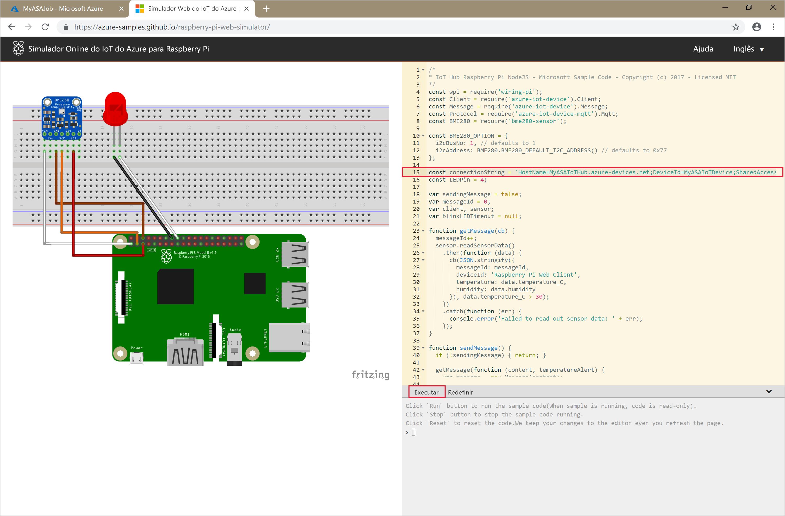

# <a name="quickstart-create-a-stream-analytics-job-using-azure-powershell"></a>Início Rápido: Criar um trabalho do Stream Analytics usando o Azure PowerShell

O módulo do Azure PowerShell é usado para criar e gerenciar recursos do Azure usando scripts ou cmdlets do PowerShell. Este início rápido demonstra em detalhes como usar o módulo do Azure PowerShell para implantar e executar um trabalho do Azure Stream Analytics. 

O trabalho de exemplo lê dados de streaming de um dispositivo Hub IoT. Os dados de entrada são gerados por um simulador online do Raspberry Pi. Em seguida, o trabalho do Stream Analytics transforma os dados usando a linguagem de consulta do Stream Analytics para filtrar mensagens com uma temperatura superior a 27°. Por fim, ele grava os eventos de saída resultantes em um arquivo no armazenamento de blobs. 

## <a name="before-you-begin"></a>Antes de começar

* Se você não tiver uma assinatura do Azure, crie uma [conta gratuita.](https://azure.microsoft.com/free/)  

* Este início rápido requer o módulo Azure PowerShell versão 3.6 ou posterior. Execute `Get-Module -ListAvailable AzureRM` para localizar a versão que está instalada em seu computador local. Se você precisar instalá-lo ou atualizá-lo, confira [Instalar o módulo do Azure PowerShell](https://docs.microsoft.com/powershell/azure/install-azurerm-ps).

* Algumas ações do Hub IoT não são compatíveis com o Azure PowerShell e precisam ser concluídas por meio da CLI do Azure versão 2.0.24 ou posterior e da extensão de IoT para a CLI do Azure. [Instale a CLI do Azure](https://docs.microsoft.com/cli/azure/install-azure-cli?view=azure-cli-latest) e use `az extension add --name azure-cli-iot-ext` para instalar a extensão de IoT.


## <a name="sign-in-to-azure"></a>Entrar no Azure

Entre em sua assinatura do Azure com o comando `Connect-AzureRmAccount` e insira suas credenciais do Azure no navegador pop-up:

```powershell
# Connect to your Azure account
Connect-AzureRmAccount
```

Caso tenha mais de uma assinatura, selecione a assinatura que deseja usar para este início rápido executando os cmdlets a seguir. Substitua `<your subscription name>` pelo nome da sua assinatura:  

```powershell
# List all available subscriptions.
Get-AzureRmSubscription

# Select the Azure subscription you want to use to create the resource group and resources.
Get-AzureRmSubscription -SubscriptionName "<your subscription name>" | Select-AzureRmSubscription
```

## <a name="create-a-resource-group"></a>Criar um grupo de recursos

Crie um grupo de recursos do Azure com [New-AzureRmResourceGroup](https://docs.microsoft.com/powershell/module/azurerm.resources/new-azurermresourcegroup). Um grupo de recursos é um contêiner lógico no qual os recursos do Azure são implantados e gerenciados.

```powershell
$resourceGroup = "StreamAnalyticsRG"
$location = "WestUS2"
New-AzureRmResourceGroup `
   -Name $resourceGroup `
   -Location $location 
```

## <a name="prepare-the-input-data"></a>Preparar os dados de entrada

Antes de definir o trabalho do Stream Analytics, prepare os dados que estão configurados como entrada do trabalho.

O bloco de código da CLI do Azure a seguir executa muitos comandos para preparar os dados de entrada necessários para o trabalho. Examine as seções para entender o código.

1. Na janela do PowerShell, execute o comando [az login](https://docs.microsoft.com/cli/azure/authenticate-azure-cli?view=azure-cli-latest) para entrar em sua conta do Azure. 

   Quando você entrar com êxito, a CLI do Azure retornará uma lista de suas assinaturas. Copie a assinatura que está você está usando para este início rápido e execute o comando [az account set](https://docs.microsoft.com/cli/azure/manage-azure-subscriptions-azure-cli?view=azure-cli-latest#change-the-active-subscription) para selecionar essa assinatura. Escolha a mesma assinatura selecionada na seção anterior com o PowerShell. Substitua `<your subscription name>` pelo nome de sua assinatura.

   ```azurecli
   az login
   
   az account set --subscription "<your subscription>"
   ```

2. Crie um Hub IoT usando o comando [az iot hub create](../iot-hub/iot-hub-create-using-cli.md#create-an-iot-hub). Este exemplo cria um Hub IoT chamado **MyASAIoTHub**. Como os nomes do Hub IoT são exclusivos, você precisa inventar seu próprio nome do Hub IoT. Defina o SKU como F1 para usar a camada gratuita se ela estiver disponível com sua assinatura. Caso contrário, escolha a próxima camada mais baixa.

   ```azurecli
   az iot hub create --name "<your IoT Hub name>" --resource-group $resourceGroup --sku S1
   ```

   Quando o hub IoT for criado, obtenha a cadeia de conexão do Hub IoT usando o comando [az iot hub show-connection-string](https://docs.microsoft.com/cli/azure/iot/hub?view=azure-cli-latest). Copie a cadeia de conexão inteira e salve-a para quando você adicionar o Hub IoT como entrada para o trabalho do Stream Analytics.
   
   ```azurecli
   az iot hub show-connection-string --hub-name "MyASAIoTHub"
   ```

3. Adicione um dispositivo ao Hub IoT usando o comando [az iothub device-identity create](../iot-hub/quickstart-send-telemetry-c.md#register-a-device). Este exemplo cria um dispositivo chamado **MyASAIoTDevice**.

   ```azurecli
   az iot hub device-identity create --hub-name "MyASAIoTHub" --device-id "MyASAIoTDevice"
   ```

4. Obtenha a cadeia de conexão do dispositivo usando o comando [az iot hub device-identity show-connection-string](). Copie a cadeia de conexão inteira e salve-a para quando você criar o simulador do Raspberry Pi.

   ```azurecli
   az iot hub device-identity show-connection-string --hub-name "MyASAIoTHub" --device-id "MyASAIoTDevice" --output table
   ```

   **Exemplo de saída:**

   ```azurecli
   HostName=MyASAIoTHub.azure-devices.net;DeviceId=MyASAIoTDevice;SharedAccessKey=a2mnUsg52+NIgYudxYYUNXI67r0JmNubmfVafojG8=
   ```

## <a name="create-blob-storage"></a>Criar o armazenamento de blobs

O bloco de código do Azure PowerShell a seguir usa comandos para criar o armazenamento de blobs usado para a saída de trabalho. Examine as seções para entender o código.

1. Crie uma conta de armazenamento padrão de uso geral usando o cmdlet [New-AzureRmStorageAccount](https://docs.microsoft.com/powershell/module/azurerm.storage/New-AzureRmStorageAccount).  Este exemplo cria uma conta de armazenamento chamada **myasaquickstartstorage** com LRS (armazenamento com redundância local) e criptografia de blob (habilitada por padrão).  
   
2. Recupere o contexto da conta de armazenamento `$storageAccount.Context` que define a conta de armazenamento a ser usada. Ao trabalhar com contas de armazenamento, referencie o contexto em vez de fornecer as credenciais repetidamente. 

3. Crie um contêiner de armazenamento usando [New-AzureStorageContainer](https://docs.microsoft.com/powershell/module/azure.storage/new-azurestoragecontainer).

4. Copie a chave de armazenamento gerada pelo código e salve essa chave para criar a saída do trabalho de streaming mais tarde.

   ```powershell
   $storageAccountName = "myasaquickstartstorage"
   $storageAccount = New-AzureRmStorageAccount `
     -ResourceGroupName $resourceGroup `
     -Name $storageAccountName `
     -Location $location `
     -SkuName Standard_LRS `
     -Kind Storage
   
   $ctx = $storageAccount.Context
   $containerName = "container1"
   
   New-AzureStorageContainer `
     -Name $containerName `
     -Context $ctx
   
   $storageAccountKey = (Get-AzureRmStorageAccountKey `
     -ResourceGroupName $resourceGroup `
     -Name $storageAccountName).Value[0]
   
   Write-Host "The <storage account key> placeholder needs to be replaced in your output json files with this key value:" 
   Write-Host $storageAccountKey -ForegroundColor Cyan
   ```

## <a name="create-a-stream-analytics-job"></a>Criar um trabalho de Stream Analytics

Crie um trabalho do Stream Analytics com o cmdlet [New-AzureRmStreamAnalyticsJob](https://docs.microsoft.com/powershell/module/azurerm.streamanalytics/new-azurermstreamanalyticsjob?view=azurermps-5.4.0). Esse cmdlet usa o nome do trabalho, o nome do grupo de recursos e a definição de trabalho como parâmetros. O nome do trabalho pode ser qualquer nome amigável que identifique o trabalho. Ele só pode ter caracteres alfanuméricos, hifens e sublinhados e precisa ter entre 3 e 63 caracteres. A definição de trabalho é um arquivo JSON que contém as propriedades necessárias para se criar um trabalho. Em seu computador local, crie um arquivo chamado `JobDefinition.json` e adicione os seguintes dados JSON a ele:

```json
{    
   "location":"WestUS2",  
   "properties":{    
      "sku":{    
         "name":"standard"  
      },  
      "eventsOutOfOrderPolicy":"adjust",  
      "eventsOutOfOrderMaxDelayInSeconds":10,  
      "compatibilityLevel": 1.1
   }
}
```

Em seguida, execute o cmdlet `New-AzureRmStreamAnalyticsJob`. Substitua o valor da variável `jobDefinitionFile` pelo caminho no qual você armazenou o arquivo JSON da definição de trabalho. 

```powershell
$jobName = "MyStreamingJob"
$jobDefinitionFile = "C:\JobDefinition.json"
New-AzureRmStreamAnalyticsJob `
  -ResourceGroupName $resourceGroup `
  -File $jobDefinitionFile `
  -Name $jobName `
  -Force 
```

## <a name="configure-input-to-the-job"></a>Configurar a entrada para o trabalho

Adicione uma entrada para seu trabalho usando o cmdlet [New-AzureRmStreamAnalyticsInput](https://docs.microsoft.com/powershell/module/azurerm.streamanalytics/new-azurermstreamanalyticsinput?view=azurermps-5.4.0). Esse cmdlet usa o nome do trabalho, o nome de entrada do trabalho, o nome do grupo de recursos e a definição da entrada do trabalho como parâmetros. A definição de entrada do trabalho é um arquivo JSON que contém as propriedades necessárias para configurar a entrada do trabalho. Neste exemplo, você criará um armazenamento de blobs como uma entrada. 

Em seu computador local, crie um arquivo chamado `JobInputDefinition.json` e adicione os seguintes dados JSON a ele. Substitua o valor de `accesspolicykey` pela parte `SharedAccessKey` da cadeia de conexão do Hub IoT salva em uma seção anterior.

```json
{
    "properties": {
        "type": "Stream",
        "datasource": {
            "type": "Microsoft.Devices/IotHubs",
            "properties": {
                "iotHubNamespace": "MyASAIoTHub",
                "sharedAccessPolicyName": "iothubowner",
                "sharedAccessPolicyKey": "accesspolicykey",
                "endpoint": "messages/events",
                "consumerGroupName": "$Default"
                }
        },
        "compression": {
            "type": "None"
        },
        "serialization": {
            "type": "Json",
            "properties": {
                "encoding": "UTF8"
            }
        }
    },
    "name": "IoTHubInput",
    "type": "Microsoft.StreamAnalytics/streamingjobs/inputs"
}
```

Em seguida, execute o cmdlet `New-AzureRmStreamAnalyticsInput`; substitua o valor da variável `jobDefinitionFile` pelo caminho no qual você armazenou o arquivo JSON da definição de entrada de trabalho. 

```powershell
$jobInputName = "IoTHubInput"
$jobInputDefinitionFile = "C:\JobInputDefinition.json"
New-AzureRmStreamAnalyticsInput `
  -ResourceGroupName $resourceGroup `
  -JobName $jobName `
  -File $jobInputDefinitionFile `
  -Name $jobInputName 
```

## <a name="configure-output-to-the-job"></a>Configurar a saída para o trabalho

Adicione uma saída ao trabalho usando o cmdlet [New-AzureRmStreamAnalyticsOutput](https://docs.microsoft.com/powershell/module/azurerm.streamanalytics/new-azurermstreamanalyticsoutput?view=azurermps-5.4.0). Esse cmdlet usa o nome do trabalho, o nome de saída do trabalho, o nome do grupo de recursos e a definição da saída do trabalho como parâmetros. A definição de saída do trabalho é um arquivo JSON que contém as propriedades necessárias para configurar a saída do trabalho. Este exemplo usa o armazenamento de blobs como saída. 

Em seu computador local, crie um arquivo chamado `JobOutputDefinition.json` e adicione os seguintes dados JSON a ele. Substitua o valor de `accountKey` pela chave de acesso da sua conta de armazenamento, que é o valor armazenado em $storageAccountKey. 

```json
{
    "properties": {
        "datasource": {
            "type": "Microsoft.Storage/Blob",
            "properties": {
                "storageAccounts": [
                    {
                      "accountName": "asaquickstartstorage",
                      "accountKey": "<storage account key>"
                    }],
                "container": "container1",
                "pathPattern": "output/",
                "dateFormat": "yyyy/MM/dd",
                "timeFormat": "HH"
            }
        },
        "serialization": {
            "type": "Json",
            "properties": {
                "encoding": "UTF8",
                "format": "LineSeparated"
            }
        }
    },
    "name": "BlobOutput",
    "type": "Microsoft.StreamAnalytics/streamingjobs/outputs"
}
```

Em seguida, execute o cmdlet `New-AzureRmStreamAnalyticsOutput`. Substitua o valor da variável `jobOutputDefinitionFile` pelo caminho em que você armazenou o arquivo JSON de definição da saída do trabalho. 

```powershell
$jobOutputName = "BlobOutput"
$jobOutputDefinitionFile = "C:\JobOutputDefinition.json"
New-AzureRmStreamAnalyticsOutput `
  -ResourceGroupName $resourceGroup `
  -JobName $jobName `
  -File $jobOutputDefinitionFile `
  -Name $jobOutputName -Force 
```

## <a name="define-the-transformation-query"></a>Definir a consulta de transformação

Adicione uma transformação ao trabalho usando o cmdlet [New-AzureRmStreamAnalyticsTransformation](https://docs.microsoft.com/powershell/module/azurerm.streamanalytics/new-azurermstreamanalyticstransformation?view=azurermps-5.4.0). Esse cmdlet usa o nome do trabalho, o nome da transformação do trabalho, o nome do grupo de recursos e a definição da transformação do trabalho como parâmetros. Em seu computador local, crie um arquivo chamado `JobTransformationDefinition.json` e adicione os seguintes dados JSON a ele. O arquivo JSON contém um parâmetro de consulta que define a consulta de transformação:

```json
{     
   "name":"MyTransformation",  
   "type":"Microsoft.StreamAnalytics/streamingjobs/transformations",  
   "properties":{    
      "streamingUnits":1,  
      "script":null,  
      "query":" SELECT * INTO BlobOutput FROM IoTHubInput HAVING Temperature > 27"  
   }  
}
```

Em seguida, execute o cmdlet `New-AzureRmStreamAnalyticsTransformation`. Substitua o valor da variável `jobTransformationDefinitionFile` pelo caminho no qual você armazenou o arquivo JSON da definição de transformação do trabalho. 

```powershell
$jobTransformationName = "MyJobTransformation"
$jobTransformationDefinitionFile = "C:\JobTransformationDefinition.json"
New-AzureRmStreamAnalyticsTransformation `
  -ResourceGroupName $resourceGroup `
  -JobName $jobName `
  -File $jobTransformationDefinitionFile `
  -Name $jobTransformationName -Force
```
## <a name="run-the-iot-simulator"></a>Executar o simulador de IoT

1. Abra o [Simulador Online de IoT do Azure do Raspberry Pi](https://azure-samples.github.io/raspberry-pi-web-simulator/).

2. Substitua o espaço reservado na Linha 15 pela cadeia de conexão inteira do Dispositivo Hub IoT do Azure salva em uma seção anterior.

3. Clique em **Executar**. A saída deve exibir os dados de sensor e as mensagens que estão sendo enviadas ao Hub IoT.

   

## <a name="start-the-stream-analytics-job-and-check-the-output"></a>Iniciar o trabalho do Stream Analytics e verificar a saída

Inicie o trabalho usando o cmdlet [Start-AzureRmStreamAnalyticsJob](https://docs.microsoft.com/powershell/module/azurerm.streamanalytics/start-azurermstreamanalyticsjob?view=azurermps-5.4.0). Esse cmdlet usa o nome do trabalho, o nome do grupo de recursos, o modo inicial de saída e a hora de início como parâmetros. `OutputStartMode` aceita valores de `JobStartTime`, `CustomTime` ou `LastOutputEventTime`. Para saber mais sobre o que cada um desses valores referencia, confira a seção [Parâmetros](https://docs.microsoft.com/powershell/module/azurerm.streamanalytics/start-azurermstreamanalyticsjob?view=azurermps-5.4.0) na documentação do PowerShell. 

Depois de executar o cmdlet a seguir, ele retornará `True` como saída se o trabalho for iniciado. No contêiner de armazenamento, uma pasta de saída é criada com os dados transformados. 

```powershell
Start-AzureRmStreamAnalyticsJob `
  -ResourceGroupName $resourceGroup `
  -Name $jobName `
  -OutputStartMode 'JobStartTime'
```

## <a name="clean-up-resources"></a>Limpar recursos

Quando não forem mais necessários, exclua o grupo de recursos, o trabalho de streaming e todos os recursos relacionados. A exclusão do trabalho evita a cobrança das unidades de streaming consumidas por ele. Se você estiver planejando usar o trabalho no futuro, ignore a exclusão e pare o trabalho agora. Se você não pretende continuar usando esse trabalho, exclua todos os recursos criados por este início rápido executando o seguinte cmdlet:

```powershell
Remove-AzureRmResourceGroup `
  -Name $resourceGroup 
```

## <a name="next-steps"></a>Próximas etapas

Neste guia de início rápido, você implantou um trabalho simples do Stream Analytics usando PowerShell. Você também pode implantar trabalhos do Stream Analytics usando o [portal do Azure](stream-analytics-quick-create-portal.md) e o [Visual Studio](stream-analytics-quick-create-vs.md).

Para saber mais sobre como configurar outras fontes de entrada e executar detecção em tempo real, avance para o artigo a seguir:

> [!div class="nextstepaction"]
> [Detecção de fraude em tempo real usando o Azure Stream Analytics](stream-analytics-real-time-fraud-detection.md)
