# <a name="quickstart-create-a-stream-analytics-job-by-using-the-azure-stream-analytics-tools-for-visual-studio"></a>Início Rápido: Criar um trabalho do Stream Analytics usando ferramentas do Azure Stream Analytics para Visual Studio

Este guia de início rápido mostra como criar e executar um trabalho do Stream Analytics usando ferramentas do Azure Stream Analytics para Visual Studio. O trabalho de exemplo lê dados de streaming do armazenamento de Blobs do Azure. O arquivo de dados de entrada usado neste guia de início rápido contém dados estáticos apenas para fins ilustrativos. Em um cenário do mundo real, você usa o fluxo de dados de entrada para um trabalho do Stream Analytics. Neste guia de início rápido, você definirá um trabalho que calcula a temperatura média quando forem ultrapassados 100° e grava os eventos de saída resultante em um novo arquivo.

## <a name="before-you-begin"></a>Antes de começar

* Se você não tiver uma assinatura do Azure, crie uma [conta gratuita](https://azure.microsoft.com/free/).

* Entre no [portal do Azure](https://portal.azure.com/).

* Instale o Visual Studio 2017, o Visual Studio 2015, o Visual Studio 2013 Update 4. As edições Enterprise (Ultimate/Premium), Professional, Community têm suporte. Não há suporte para a Edição Express.

* Siga as [instruções de instalação](https://docs.microsoft.com/azure/stream-analytics/stream-analytics-tools-for-visual-studio-install) para instalar as ferramentas do Stream Analytics para o Visual Studio.

## <a name="prepare-the-input-data"></a>Preparar os dados de entrada

Antes de definir o trabalho do Stream Analytics, você deve preparar os dados, que estão configurados como entrada do trabalho. Para preparar os dados de entrada exigidos pelo trabalho, execute as seguintes etapas:

1. Baixe os [dados do sensor de exemplo](https://raw.githubusercontent.com/Azure/azure-stream-analytics/master/Samples/GettingStarted/HelloWorldASA-InputStream.json) do GitHub. Os dados de exemplo contêm informações do sensor no seguinte formato JSON:  

   ```json
   {
     "time": "2018-01-26T21:18:52.0000000",
     "dspl": "sensorC",
     "temp": 87,
     "hmdt": 44
   }
   ```
2. Entre no [portal do Azure](https://portal.azure.com/).

3. No canto superior esquerdo do portal do Azure, selecione **Criar um recurso** > **Armazenamento** > **Conta de armazenamento**. Preencha a página do trabalho da conta de Armazenamento com **Nome** definido como "asaquickstartstorage", **Local** definido como "Oeste dos EUA", **Grupo de recursos** definido como "asaquickstart-resourcegroup" (tenha a conta de armazenamento no mesmo grupo de recursos do trabalho do Streaming para melhorar o desempenho). As configurações restantes podem ser deixadas em seus valores padrão.  

   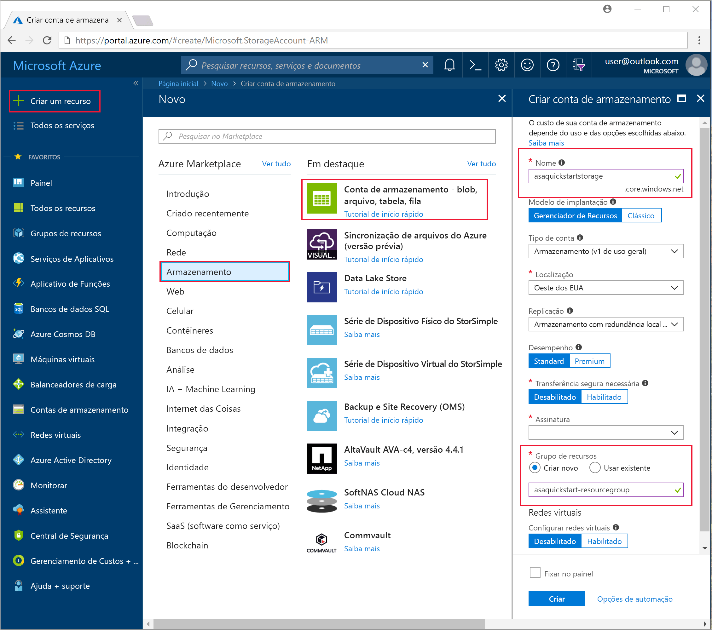

4. Na página **Todos os recursos**, localize a conta de armazenamento criada na etapa anterior. Abra a página **Visão geral** e o bloco **Blobs**.  

5. Na página do **Serviço de Blob**, selecione **Contêiner**, forneça um **Nome** para seu contêiner, como *container1* > selecione **OK**.  

   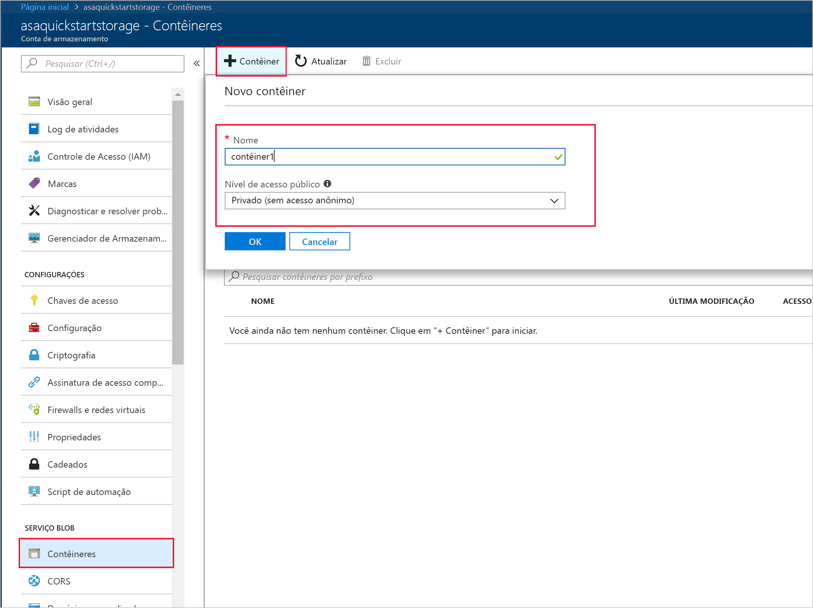

6. Vá para o contêiner que você criou na etapa anterior. Selecione **Carregar** e carregue os dados do sensor que você obteve da primeira etapa.  

   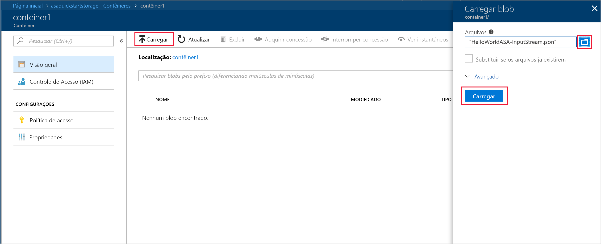

## <a name="create-a-stream-analytics-project"></a>Criar um projeto do Stream Analytics

1. Inicie o Visual Studio.

2. Selecione **Arquivo > Novo Projeto**.  

3. Na lista de modelos à esquerda, selecione **Stream Analytics** e então selecione **Aplicativo do Stream Analytics do Azure**.  

4. Digite o **Nome** e **Local** do projeto e o **Nome da solução** e selecione **OK**.

   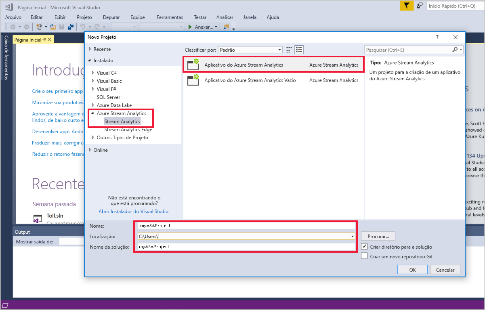

Observe os elementos que são incluídos em um projeto do Azure Stream Analytics.

   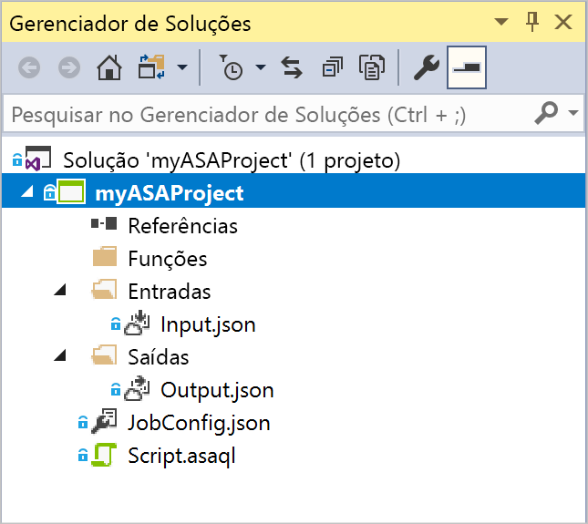


## <a name="choose-the-required-subscription"></a>Escolha a assinatura necessária

1. No Visual Studio, no menu **Exibir**, selecione **Gerenciador de Servidores**.

2. Clique com o botão direito do mouse em **Azure**, selecione **Conectar-se à assinatura do Microsoft Azure** e, em seguida, entre com a conta do Azure.

## <a name="define-input"></a>Definir entrada

1. No **Gerenciador de Soluções**, expanda o nó **Entradas** e clique duas vezes em **Input.json**.

2. Preencha a **Configuração de entrada do Stream Analytics** com os seguintes valores:

   |**Configuração**  |**Valor sugerido**  |**Descrição**   |
   |---------|---------|---------|
   |Alias de entrada  |  Entrada   |  Insira um nome para identificar a entrada do trabalho.   |
   |Tipo de Fonte   |  Fluxo de dados |  Escolha a fonte de entrada apropriada: Fluxo de dados ou Dados de referência.   |
   |Fonte  |  Armazenamento de Blobs |  Escolha a fonte de entrada apropriada.   |
   |Recurso  | Escolha fonte de dados da conta atual | Escolha entre inserir os dados manualmente ou selecione uma conta existente.   |
   |Assinatura  |  \<Sua assinatura\>   | Selecione a assinatura do Azure que tem a conta de armazenamento criada. A conta de armazenamento pode estar na mesma assinatura ou em uma diferente. Este exemplo pressupõe que você criou a conta de armazenamento na mesma assinatura.   |
   |Conta de armazenamento  |  asaquickstartstorage   |  Escolha ou insira o nome da conta de armazenamento. Os nomes das contas de armazenamento são detectados automaticamente quando elas são criadas na mesma assinatura.   |
   |Contêiner  |  container1   |  Selecione o contêiner existente que você criou em sua conta de armazenamento.   |
   
3. Deixe as outras opções com os valores padrão e selecione **Salvar** para salvar as configurações.  

   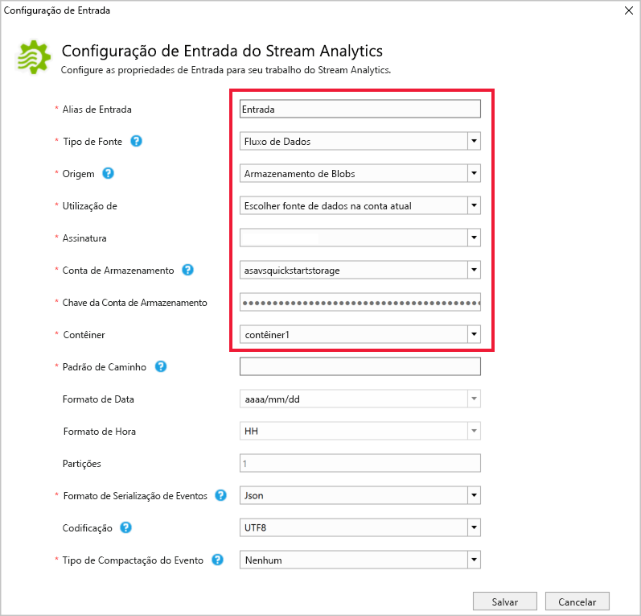

## <a name="define-output"></a>Definir saída

1. No **Gerenciador de Soluções**, expanda o nó **Saídas** e clique duas vezes em **Output.json**.

2. Preencha a **Configuração de saída do Stream Analytics** com os seguintes valores:

   |**Configuração**  |**Valor sugerido**  |**Descrição**   |
   |---------|---------|---------|
   |Alias de saída  |  Saída   |  Insira um nome para identificar a saída do trabalho.   |
   |Coletor   |  Armazenamento de Blobs |  Escolha o coletor apropriado.    |
   |Recurso  |  Forneça as configurações da fonte de dados manualmente |  Escolha entre inserir os dados manualmente ou selecione uma conta existente.   |
   |Assinatura  |  \<Sua assinatura\>   | Selecione a assinatura do Azure que tem a conta de armazenamento criada. A conta de armazenamento pode estar na mesma assinatura ou em uma diferente. Este exemplo pressupõe que você criou a conta de armazenamento na mesma assinatura.   |
   |Conta de armazenamento  |  asaquickstartstorage   |  Escolha ou insira o nome da conta de armazenamento. Os nomes das contas de armazenamento são detectados automaticamente quando elas são criadas na mesma assinatura.   |
   |Contêiner  |  container1   |  Selecione o contêiner existente que você criou em sua conta de armazenamento.   |
   |Padrão de caminho  |  output   |  Digite o nome do caminho de arquivo a ser criado dentro do contêiner.   |
   
3. Deixe as outras opções com os valores padrão e selecione **Salvar** para salvar as configurações.  

   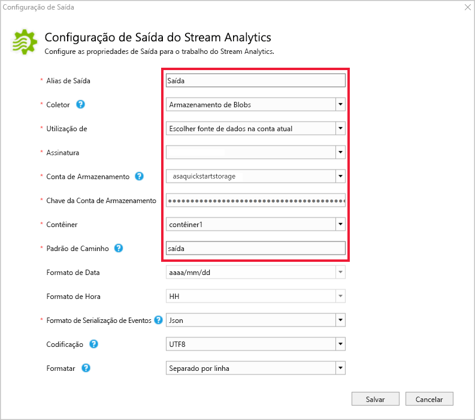

## <a name="define-the-transformation-query"></a>Definir a consulta de transformação

1. Abra **Script.asaql** no **Gerenciador de Soluções** no Visual Studio.

2. Adicione a consulta a seguir:

   ```sql
   SELECT 
   System.Timestamp AS OutputTime,
   dspl AS SensorName,
   Avg(temp) AS AvgTemperature
   INTO
     Output
   FROM
     Input TIMESTAMP BY time
   GROUP BY TumblingWindow(second,30),dspl
   HAVING Avg(temp)>100
   ```

## <a name="submit-a-stream-analytics-query-to-azure"></a>Enviar uma consulta do Stream Analytics para o Azure

1. No **Editor de Consultas**, selecione **Enviar para o Azure** no editor de scripts.

2. Selecione **Criar um novo trabalho do Azure Stream Analytics** e insira um **Nome de trabalho**. Escolha a **Assinatura**, **Grupo de recursos**, e o **Local** usados no começo do Início Rápido.

   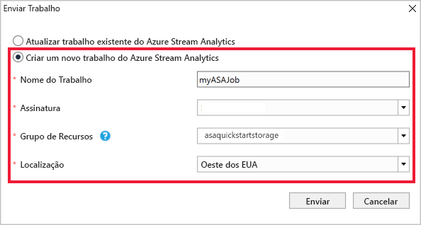

## <a name="start-the-stream-analytics-job-and-check-output"></a>Inicie o trabalho do Stream Analytics e verifique a saída

1. Após o trabalho ser criado, a exibição do trabalho abrirá automaticamente. Selecione o botão de seta verde para iniciar o trabalho,

   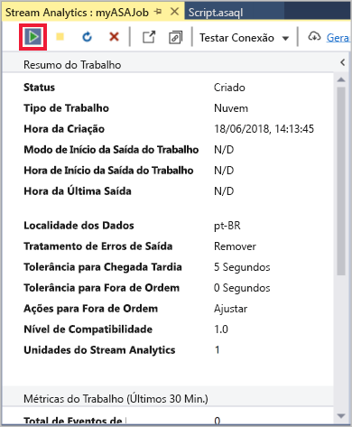

2. Altere a data de **Hora personalizada** para `2018-01-01` e selecione **Iniciar**.

   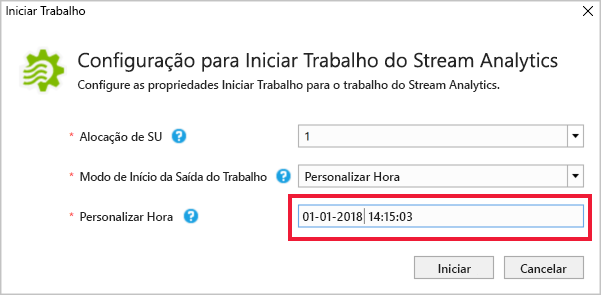

3. Observe que o status do trabalho foi alterado para **Em execução** e há eventos de entrada/saída. Isso pode levar alguns minutos.

   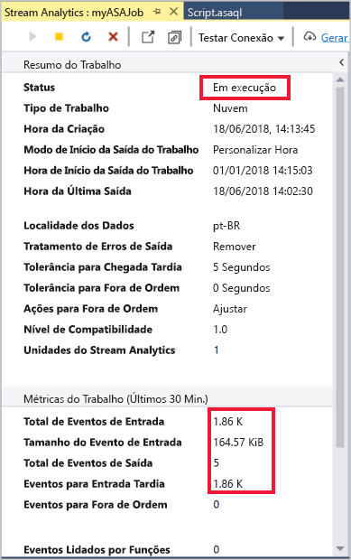

4. Para exibir os resultados, no menu **Exibição**, selecione **Cloud Explorer** e navegue até a conta de armazenamento em seu grupo de recursos. Em **Contêineres de Blobs**, clique duas vezes em **container1**e, em seguida, n caminho do arquivo de **saída**.

   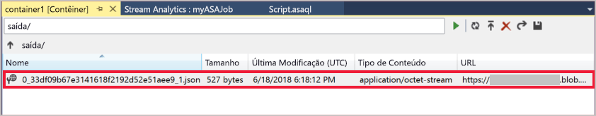

## <a name="clean-up-resources"></a>Limpar recursos

Quando não forem mais necessários, exclua o grupo de recursos, o trabalho de streaming e todos os recursos relacionados. A exclusão do trabalho evita a cobrança das unidades de streaming consumidas por ele. Se você está planejando usar o trabalho no futuro, pode interrompê-lo e reiniciar mais tarde, quando necessário. Se você não for mais usar o trabalho, exclua todos os recursos criados neste início rápido usando as seguintes etapas:

1. No menu à esquerda no Portal do Azure, selecione **Grupos de recursos** e selecione o nome do recurso criado.  

2. Em sua página de grupo de recursos, selecione **Excluir**, digite o nome do recurso para excluir na caixa de texto e selecione **Excluir**.

## <a name="next-steps"></a>Próximas etapas

Neste guia de início rápido, você implantou um trabalho simples do Stream Analytics. Para saber mais sobre como configurar outras fontes de entrada e executar detecção em tempo real, avance para o artigo a seguir:

> [!div class="nextstepaction"]
> [Detecção de fraude em tempo real usando o Azure Stream Analytics](stream-analytics-real-time-fraud-detection.md)
