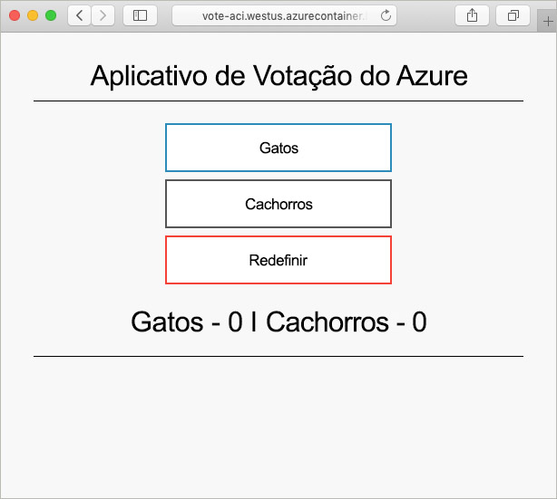

# <a name="create-a-terraform-configuration-for-azure"></a>Criar uma configuração do Terraform no Azure

Neste exemplo, você obterá experiência na criação de uma configuração do Terraform e na implantação dessa configuração no Azure. Após a conclusão, você terá implantado uma instância do Azure Cosmos DB, uma Instância de Contêiner do Azure e um aplicativo que funciona nesses dois recursos. Este documento pressupõe que todo o trabalho seja concluído no Azure Cloud Shell, que tem as ferramentas do Terraform pré-instaladas. Caso você deseje trabalhar com o exemplo em seu próprio sistema, o Terraform poderá ser instalado usando as instruções encontradas [aqui](../virtual-machines/linux/terraform-install-configure.md).

## <a name="create-first-configuration"></a>Criar a primeira configuração

Nesta seção, você criará a configuração para uma instância do Azure Cosmos DB.

Selecione **Experimentar agora** para abrir o Azure Cloud Shell. Depois de abri-lo, insira `code .` para abrir o editor de códigos do Cloud Shell.

```azurecli-interactive
code .
```

Copie e cole a configuração do Terraform a seguir.

Essa configuração modela um grupo de recursos do Azure, um inteiro aleatório e uma instância do Azure Cosmos DB. O inteiro aleatório é usado no nome da instância do Cosmos DB. Várias configurações do Cosmos DB também são definidas. Para obter uma lista completa das configurações do Terraform no Cosmos DB, confira a [referência do Terraform no Cosmos DB](https://www.terraform.io/docs/providers/azurerm/r/cosmosdb_account.html).

Salve o arquivo como `main.tf` quando terminar. Essa operação pode ser feita usando as reticências na parte superior direita do editor de códigos.

```azurecli-interactive
resource "azurerm_resource_group" "vote-resource-group" {
  name     = "vote-resource-group"
  location = "westus"
}

resource "random_integer" "ri" {
  min = 10000
  max = 99999
}

resource "azurerm_cosmosdb_account" "vote-cosmos-db" {
  name                = "tfex-cosmos-db-${random_integer.ri.result}"
  location            = "${azurerm_resource_group.vote-resource-group.location}"
  resource_group_name = "${azurerm_resource_group.vote-resource-group.name}"
  offer_type          = "Standard"
  kind                = "GlobalDocumentDB"

  consistency_policy {
    consistency_level       = "BoundedStaleness"
    max_interval_in_seconds = 10
    max_staleness_prefix    = 200
  }

  geo_location {
    location          = "westus"
    failover_priority = 0
  }
}
```

O comando [terraform init](https://www.terraform.io/docs/commands/init.html) inicializa o diretório de trabalho. Execute `terraform init` no terminal do Cloud Shell para preparar a implantação da nova configuração.

```azurecli-interactive
terraform init
```

O comando [terraform plan](https://www.terraform.io/docs/commands/plan.html) pode ser usado para validar se a configuração está formatada corretamente e visualizar quais recursos serão criados, atualizados ou destruídos. Os resultados podem ser armazenados em um arquivo e usados em um momento posterior para aplicar a configuração.

Execute `terraform plan` para testar a nova configuração do Terraform.

```azurecli-interactive
terraform plan --out plan.out
```

Aplique a configuração usando [terraform apply](https://www.terraform.io/docs/commands/apply.html) e especificando o nome do arquivo de plano. Esse comando implanta os recursos em sua assinatura do Azure.

```azurecli-interactive
terraform apply plan.out
```

Quando terminar, você poderá ver que o grupo de recursos foi criado e uma instância do Azure Cosmos DB foi colocada no grupo de recursos.

## <a name="update-configuration"></a>Atualizar configuração

Atualize a configuração para incluir uma Instância de Contêiner do Azure. O contêiner executa um aplicativo que lê e grava os dados no Cosmos DB.

Copie a configuração a seguir na parte inferior do arquivo `main.tf`. Salve o arquivo quando terminar.

Duas variáveis de ambiente são definidas, `COSMOS_DB_ENDPOINT` e `COSMOS_DB_MASTERKEY`. Essas variáveis armazenam a localização e a chave para acessar o banco de dados. Os valores dessas variáveis são obtidos na instância do banco de dados criada na última etapa. Esse processo é conhecido como interpolação. Para saber mais sobre a interpolação do Terraform, confira [Sintaxe de interpolação](https://www.terraform.io/docs/configuration/interpolation.html).


A configuração também inclui um bloco de saída, que retorna o FQDN (nome de domínio totalmente qualificado) da instância de contêiner.

```azurecli-interactive
resource "azurerm_container_group" "vote-aci" {
  name                = "vote-aci"
  location            = "${azurerm_resource_group.vote-resource-group.location}"
  resource_group_name = "${azurerm_resource_group.vote-resource-group.name}"
  ip_address_type     = "public"
  dns_name_label      = "vote-aci"
  os_type             = "linux"

  container {
    name   = "vote-aci"
    image  = "microsoft/azure-vote-front:cosmosdb"
    cpu    = "0.5"
    memory = "1.5"
    ports  = {
      port     = 80
      protocol = "TCP"
    }

    secure_environment_variables {
      "COSMOS_DB_ENDPOINT"  = "${azurerm_cosmosdb_account.vote-cosmos-db.endpoint}"
      "COSMOS_DB_MASTERKEY" = "${azurerm_cosmosdb_account.vote-cosmos-db.primary_master_key}"
      "TITLE"               = "Azure Voting App"
      "VOTE1VALUE"          = "Cats"
      "VOTE2VALUE"          = "Dogs"
    }
  }
}

output "dns" {
  value = "${azurerm_container_group.vote-aci.fqdn}"
}
```

Execute `terraform plan` para criar o plano atualizado e visualizar as alterações a serem feitas. Você deverá ver que um recurso da Instância de Contêiner do Azure foi adicionado à configuração.

```azurecli-interactive
terraform plan --out plan.out
```

Por fim, execute `terraform apply` para aplicar a configuração.

```azurecli-interactive
terraform apply plan.out
```

Depois de concluído, anote o FQDN da instância de contêiner.

## <a name="test-application"></a>Testar aplicativo

Navegue para o FQDN da instância de contêiner. Se tudo for configurado corretamente, você deverá ver o aplicativo a seguir.



## <a name="clean-up-resources"></a>Limpar recursos

Após a conclusão, o grupo de recursos e os recursos do Azure poderão ser removidos usando o comando [terraform destroy](https://www.terraform.io/docs/commands/destroy.html).

```azurecli-interactive
terraform destroy -auto-approve
```

## <a name="next-steps"></a>Próximas etapas

Neste exemplo, você criou, implantou e destruiu uma configuração do Terraform. Para obter mais informações sobre como usar o Terraform no Azure, confira a documentação do provedor Azure Terraform.

> [!div class="nextstepaction"]
> [Provedor Azure Terraform](https://www.terraform.io/docs/providers/azurerm/)
