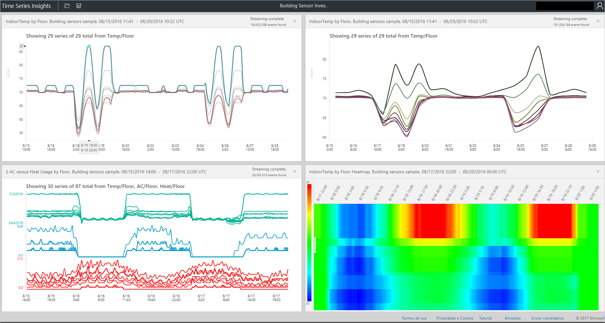

# Azure Time Series Insights Explorer
Este artigo aborda os vários recursos e opções disponíveis no aplicativo Web do Time Series Insights Explorer. Use o Time Series Insights Explorer no navegador da Web para criar visualizações dos dados.
 
O Azure Time Series Insights é um serviço totalmente gerenciado de análise, armazenamento e visualização que facilita a exploração e análise de bilhões de eventos de IoT simultaneamente. Ele fornece uma exibição global dos dados, o que permite validar rapidamente sua solução de IoT e evitar um tempo de inatividade dispendioso de dispositivos críticos. Descubra tendências ocultas, detecte anomalias e realize análises de causa raiz quase em tempo real. Atualmente, o Time Series Insights Explorer está em visualização pública.

## Pré-requisitos

Antes de usar o Time Series Insights Explorer, é necessário:
- Criar um ambiente do Time Series Insights
- Fornecer acesso à sua conta no ambiente
- Adicionar uma origem de evento para ingerir dados e armazená-los

## Explorar e consultar dados
Alguns minutos após conectar a origem do evento ao ambiente do Time Series Insights, você pode explorar e consultar seus dados de série temporal.

1. Para começar, abra o [Time Series Insights Explorer](https://insights.timeseries.azure.com/) no navegador da Web e selecione um ambiente no lado esquerdo da janela. Todos os ambientes aos quais você tem acesso são listados em ordem alfabética.

2. Depois de selecionar um ambiente, use as configurações **FROM** e **TO** da parte superior ou clique e arraste sobre o período de tempo desejado.  Clique na lupa na parte superior direita ou clique com o botão direito do mouse sobre o período de tempo selecionado e selecione **Pesquisar**.  

3. Também atualize a disponibilidade automaticamente a cada minuto, selecionando o botão **Automático Ativado**.

4. Observe que o ícone de nuvem do Azure leva você para seu ambiente no portal do Azure.

   

5. Em seguida, você verá um gráfico que mostra uma contagem de todos os eventos durante o período de tempo selecionado.  Aqui, você tem uma série de controles:

    **Painel do Editor de Termos**: o espaço de termo é o local em que você consulta o ambiente.  Ele é encontrado no lado esquerdo da tela e habilita 
      - **Medir**: essa lista suspensa mostra todas as colunas numéricas (Duplos)
      - **Dividir Por**: essa lista suspensa mostra colunas categóricas (Cadeias de caracteres)
      - Habilite a interpolação escalonada, mostre o mínimo e o máximo e ajuste o eixo Y no painel de controle ao lado da medida.  Além disso, ajuste se os dados mostrados são uma contagem, média ou soma dos dados.
      - Adicione até cinco termos a serem exibidos no mesmo eixo X.  Use o botão **Copiar** para adicionar outro termo ou clique no botão **Adicionar** para adicionar um novo termo.
     
        

      - **Predicado**: o predicado permite filtrar rapidamente os eventos usando o conjunto de operandos listados abaixo. Caso você realize uma pesquisa fazendo uma seleção ou um clique, o predicado será automaticamente atualizado de acordo com essa pesquisa.      Os tipos de operando com suporte incluem:

         |Operação  |Tipos com suporte  |Observações  |
         |---------|---------|---------|
         |<, >, <=, >=     |  Double, DateTime, TimeSpan       |         |
         |=, !=, <>     | String, Bool, Double, DateTime, TimeSpan, NULL        |         |
         |IN     | String, Bool, Double, DateTime, TimeSpan, NULL        |  Todos os operandos devem ser do mesmo tipo ou ser uma constante NULL.        |
         |HAS     | Cadeia de caracteres        |  Apenas os literais de cadeia de caracteres de constante são permitidos no lado direito. Uma cadeia de caracteres vazia e NULL não são permitidas.       |

      - **Exemplos de consultas**
      
         

6. A ferramenta de controle deslizante **Tamanho do Intervalo** permite ampliar e reduzir intervalos sobre o mesmo período de tempo.  Isso fornece um controle mais preciso dos movimentos entre fatias de tempo grandes que mostram tendências suaves até fatias que são tão pequenas quanto milissegundos, permitindo ver recortes granulares e de alta resolução dos dados. O ponto de partida padrão do controle deslizante é definido como a exibição mais ideal dos dados na seleção: balanceamento de resolução, velocidade de consulta e granularidade.

7. A ferramenta **Pincel de tempo** facilita a navegação de um período de tempo para outro, colocando uma experiência do usuário intuitiva na frente e no centro para uma movimentação direta entre intervalos de tempo.

8. O comando **Salvar** permite salvar a consulta atual e habilitá-la para compartilhar com outros usuários do ambiente. Usando **Abrir**, você pode ver todas as consultas salvas e as consultas compartilhadas de outros usuários em ambientes aos quais você tem acesso. 

   

9. A ferramenta **Exibição de Perspectiva** fornece uma exibição simultânea de até quatro consultas exclusivas. Encontre o botão da exibição de perspectiva no canto superior direito do gráfico.  

   

10. O **Gráfico** permite explorar os dados visualmente. As ferramentas do gráfico incluem:

   - Selecionar/clicar, que possibilita uma seleção de um período de tempo específico ou de uma única série de dados.  
   - Em uma seleção de intervalo de tempo, você pode ampliar ou explorar eventos.  
   - Em uma série de dados, você pode dividir a série por outra coluna, adicionar a série como um novo termo, mostrar apenas a série selecionada, excluir a série selecionada, executar ping da série ou explorar eventos da série selecionada.
   - Na área de filtro à esquerda do gráfico, você pode ver todas as séries de dados exibidas e reordená-las por nome ou valor, exibir todas as séries de dados ou as séries especificamente fixadas ou não fixadas.  Também selecione uma única série de dados e divida a série por outra coluna, adicione a série como um novo termo, mostre apenas a série selecionada, exclua a série selecionada, fixe essa série ou explore eventos da série selecionada.
   - Ao exibir vários termos simultaneamente, empilhe, desempilhe, consulte dados adicionais sobre uma série de dados e use o mesmo eixo Y em todos os termos com os botões do canto superior direito do gráfico.
 
    

11. O **mapa de calor** pode ser usado para identificar rapidamente séries de dados exclusivas ou anormais em determinada consulta. Apenas um termo de pesquisa pode ser visualizado como um mapa de calor.    

   

12. **Eventos**: quando você escolhe explorar eventos ao selecionar ou clicar com o botão direito do mouse acima, o painel de eventos é disponibilizado.  Aqui, você pode ver todos os seus eventos brutos e exportá-los como arquivos JSON ou CSV. Observe que o Time Series Insights armazena todos os dados brutos.

   

13. Clique na guia **ESTATÍSTICAS** depois de explorar os eventos para expor os padrões e as estatísticas de coluna.  

   - **Padrões**: esse recurso revela de maneira proativa os padrões estatisticamente significativos em uma região de dados selecionada. Isso libera você da necessidade de examinar milhares de eventos para entender quais padrões garantem mais tempo e energia. Além disso, o Time Series Insights possibilita que você vá diretamente para esses padrões estatisticamente significativos para continuar realizando uma análise. Esse recurso também é útil para investigações post-mortem em dados históricos. 

   - **Estatísticas de Coluna**: as estatísticas de coluna fornecem gráficos e tabelas que dividem os dados de cada coluna da série de dados selecionada sobre o período de tempo selecionado.  
 
       

Agora você viu os vários recursos e opções disponíveis no aplicativo Web do Time Series Insights Explorer. 

## Próximas etapas
> [!div class="nextstepaction"]
>[Diagnosticar e resolver problemas no ambiente do Time Series Insights](time-series-insights-diagnose-and-solve-problems.md)
