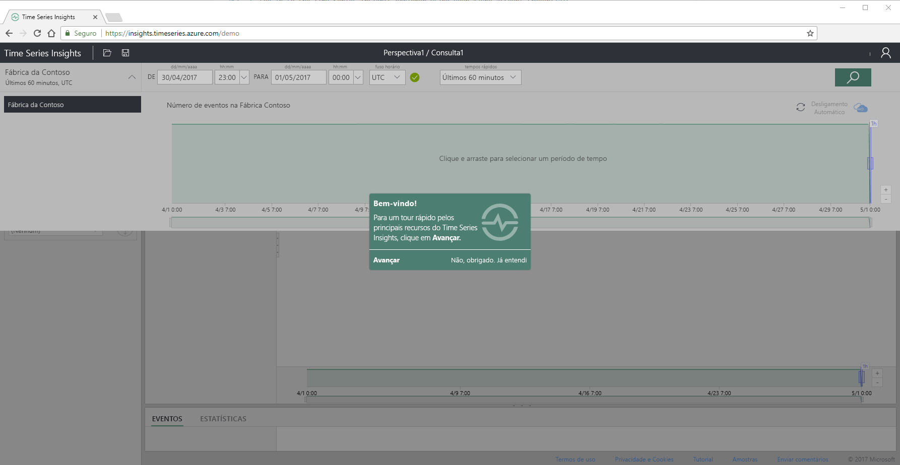
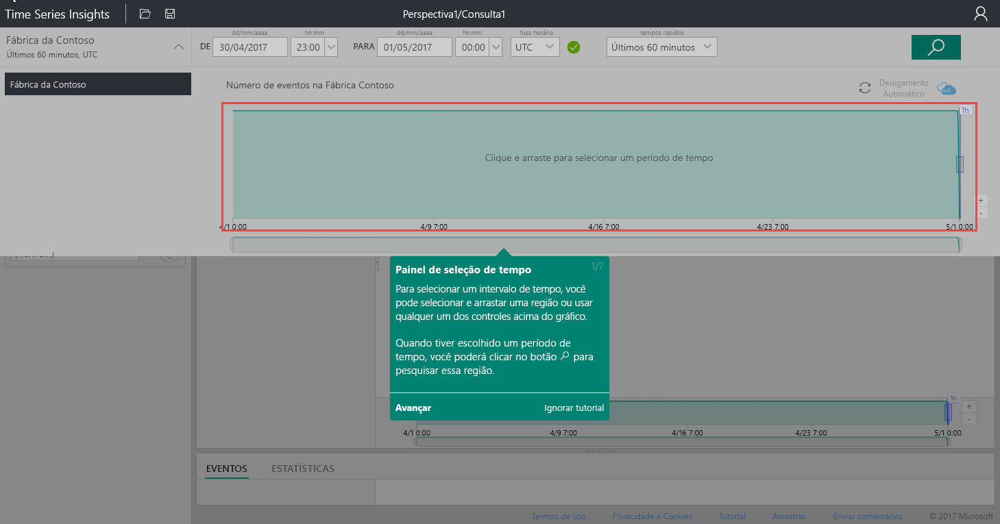
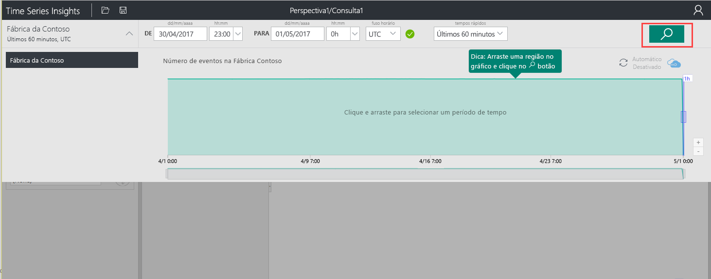
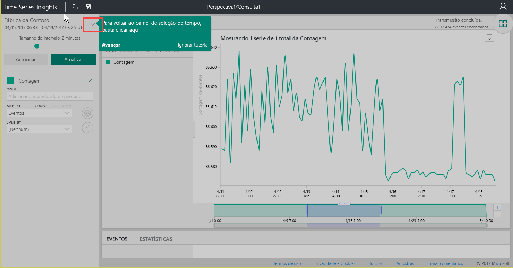
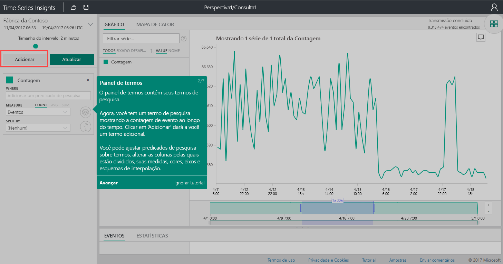
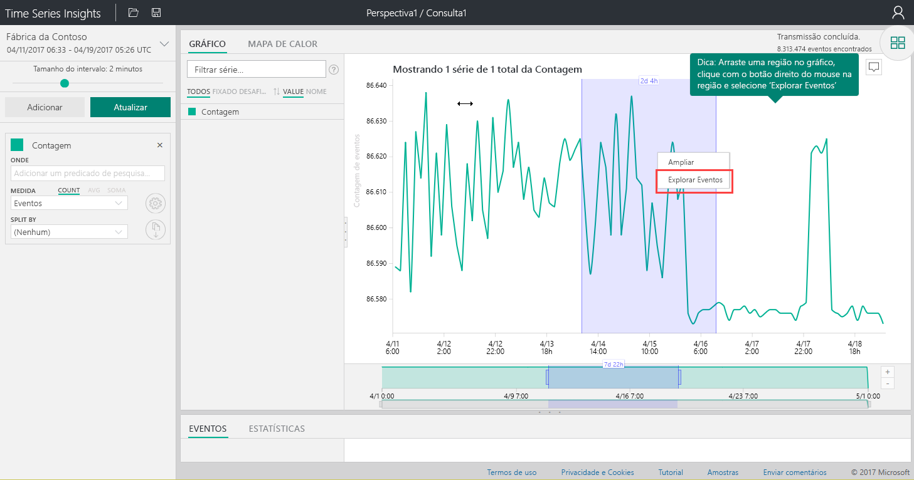
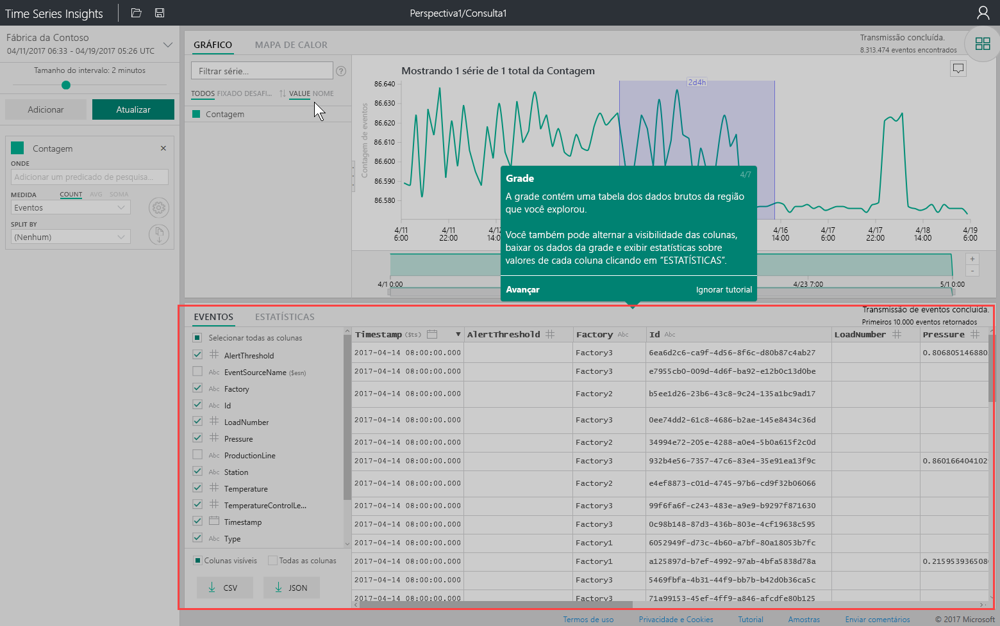
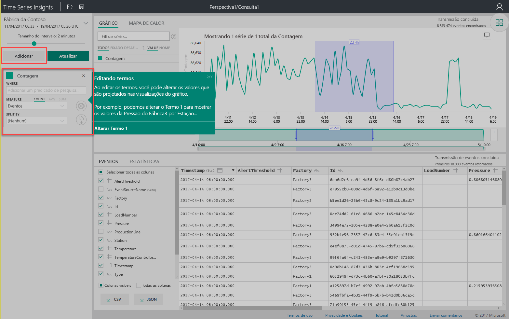
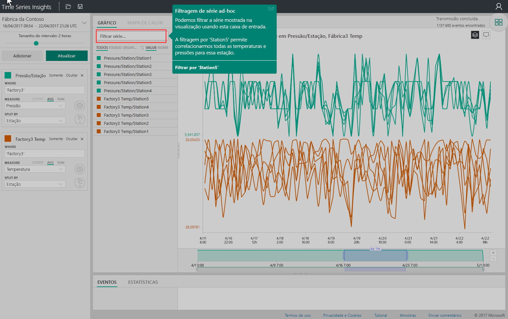

# Guia de início rápido: Explorar o Azure Time Series Insights
Este guia de início rápido mostra como começar a usar o Azure Time Series Insights Explorer em um ambiente de demonstração gratuita. Você aprenderá a usar o navegador da Web para visualizar grandes volumes de dados de IoT e conhecerá os principais recursos do Time Series Insights Explorer. 

O Azure Time Series Insights é um serviço totalmente gerenciado de análise, armazenamento e visualização que facilita a exploração e análise de bilhões de eventos de IoT simultaneamente. Ele oferece uma visão global dos dados, permitindo que você valide rapidamente sua solução IoT e evite o tempo de inatividade dispendioso para dispositivos críticos, ajudando você a descobrir tendências ocultas, detectar anomalias e realizar análises de causa raiz quase em tempo real.  Caso esteja criando um aplicativo que precisa armazenar ou consultar dados de série temporal, desenvolva-o usando as APIs REST do Time Series Insights.

Caso você não tenha uma assinatura do Azure, crie uma [conta gratuita do Azure](https://azure.microsoft.com/free/?ref=microsoft.com&utm_source=microsoft.com&utm_medium=docs&utm_campaign=visualstudio) antes de começar.

## Descubra o Time Series Insights Explorer em um ambiente de demonstração

1. No navegador, navegue para [https://insights.timeseries.azure.com/demo](https://insights.timeseries.azure.com/demo). 

2. Se solicitado, faça logon no Time Series Insights Explorer usando suas credenciais da conta do Azure. 
 
3. A página de tour rápido do Time Series Insights será exibida. Clique em **Avançar** para iniciar o tour rápido.

   

4. O **Painel de seleção de tempo** será exibido. Use esse painel para selecionar um período a ser visualizado.

   

5. Clique e arraste na região e, em seguida, clique no botão **Pesquisar**.
 
    

   O Time Series Insights exibe uma visualização de gráfico para o período especificado. Realize várias ações internas com o gráfico de linhas, como filtragem, anexação, classificação e empilhamento. 

   Para retornar ao **Painel de seleção de tempo**, clique na seta para baixo, conforme mostrado:

   

6. Clique em **Adicionar** no **Painel de termos** para adicionar um novo termo de pesquisa.

   

7. No gráfico, você pode selecionar uma região, clicar com o botão direito do mouse na região e selecionar **Explorar Eventos**.
 
   

   Uma grade dos dados brutos é exibida na região que está sendo explorada:

   

8. Edite os termos para alterar os valores no gráfico e adicione outro termo para fazer uma correlação cruzada entre diferentes tipos de valores:

   

9. Insira um termo de filtro na caixa **Filtrar série...**  para a filtragem de série ad hoc. Para o guia de início rápido, insira **Station5** para fazer uma correlação cruzada entre a temperatura e a pressão dessa estação.
 
   

Depois de concluir o guia de início rápido, faça experiências com o conjunto de dados de exemplo para criar visualizações diferentes. 

### Próximas etapas
Você está pronto para criar seu próprio ambiente do Time Series Insights:
> [!div class="nextstepaction"]
> [Planejar o ambiente do Time Series Insights](time-series-insights-environment-planning.md)
