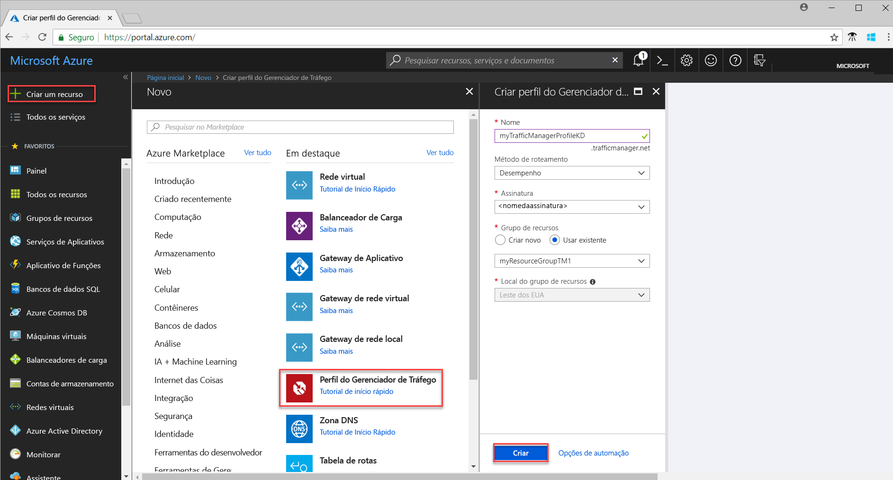
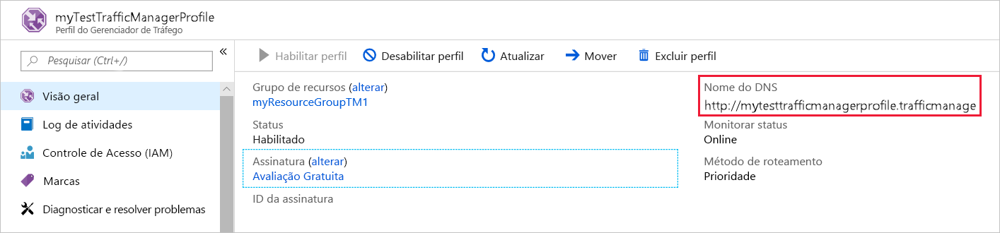
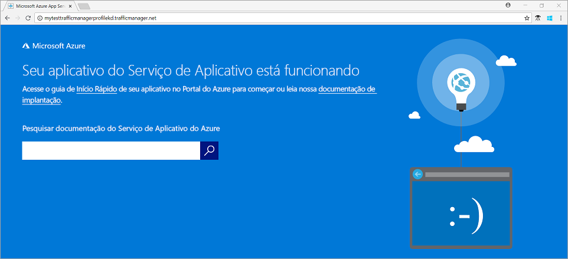

# Início Rápido: Criar um perfil do Gerenciador de Tráfego para um aplicativo Web altamente disponível

Este início rápido descreve como criar um perfil do Gerenciador de Tráfego que fornece alta disponibilidade para seu aplicativo Web. 

O cenário descrito neste início rápido inclui duas instâncias de um aplicativo Web em execução em diferentes regiões do Azure. Um perfil do Gerenciador de Tráfego com base em [prioridade de ponto de extremidade](traffic-manager-routing-methods.md#priority) é criado a fim de ajudar a direcionar o tráfego de usuário para o site primário que executa o aplicativo. O Gerenciador de Tráfego monitora o aplicativo Web e fornece failover automático para o site de backup continuamente quando o site primário não está disponível.

Se você não tiver uma assinatura do Azure, crie uma [conta gratuita](https://azure.microsoft.com/free/?WT.mc_id=A261C142F) antes de começar.

## Entrar no Azure 
Entre no Portal do Azure em https://portal.azure.com.

## Pré-requisitos
Este início rápido requer que você implante duas instâncias de um aplicativo Web em execução em diferentes regiões do Azure (*Leste dos EUA* e *Europa Ocidental*). As duas instâncias do aplicativo Web servem como pontos de extremidade primários e de backup para o Gerenciador de Tráfego.

1. No canto superior esquerdo da tela, selecione **Criar um recurso** > **Web** > **Aplicativo Web** > **Criar**.
2. Em **Aplicativo Web**, insira ou selecione as informações abaixo e insira as configurações padrão quando nenhuma for especificada:

     | Configuração         | Valor     |
     | ---              | ---  |
     | NOME           | Insira um nome exclusivo para o aplicativo Web  |
     | Grupo de recursos          | Selecione **Novo**e digite *myResourceGroupTM1* |
     | Plano do Serviço de Aplicativo/Localização         | Selecione **Novo**.  No Plano do Serviço de Aplicativo, insira *myAppServicePlanEastUS*e selecione **OK**. 
     |      Local padrão  |   Leste dos EUA        |
    |||

3. Selecione **Criar**.
4. Um site da Web padrão é criado quando o aplicativo Web é implantado com êxito.
5. Repita as etapas 1 a 3 para criar um segundo site em uma região do Azure diferente com as seguintes configurações:

     | Configuração         | Valor     |
     | ---              | ---  |
     | NOME           | Insira um nome exclusivo para o aplicativo Web  |
     | Grupo de recursos          | Selecione **Novo**e digite *myResourceGroupTM2* |
     | Plano do Serviço de Aplicativo/Localização         | Selecione **Novo**.  No Plano do Serviço de Aplicativo, insira *myAppServicePlanWestEurope*e selecione **OK**. 
     |      Local padrão  |   Europa Ocidental      |
    |||

## Criar um perfil do Gerenciador de Tráfego
Crie um perfil do Gerenciador de Tráfego que direciona o tráfego de usuário com base na prioridade de ponto de extremidade.

1. No canto superior esquerdo da tela, selecione **Criar um recurso** > **Rede** > **Perfil do Gerenciador de Tráfego**  >  **Criar**.
2. No **perfil Criar Gerenciador de Tráfego**, insira ou selecione as informações a seguir, aceite os padrões para as configurações restantes e selecione **Criar**:
    
    | Configuração                 | Valor                                              |
    | ---                     | ---                                                |
    | NOME                   | Esse nome deve ser exclusivo na zona trafficmanager.net e resulta no nome DNS **trafficmanager.net**, que é usado para acessar seu perfil do Gerenciador de Tráfego.|
    | Método de roteamento          | Selecione o método de encaminhamento **Prioridades**.|
    | Assinatura            | Selecione sua assinatura.|
    | Grupo de recursos          | Selecione **Existente** e *myResourceGroupTM1*.|
    |Local padrão |Essa configuração refere-se ao local do grupo de recursos e não tem impacto no perfil do Gerenciador de Tráfego que será implantado globalmente.|
    |||
    
    
   

## Adicionar pontos de extremidade do Gerenciador de Tráfego

Adicione o site no *Leste dos EUA* como ponto de extremidade primário para encaminhar todo o tráfego de usuários. Adicione o site na *Europa Ocidental* como um ponto de extremidade de backup. Quando o ponto de extremidade primário não estiver disponível, o tráfego será encaminhado automaticamente para o ponto de extremidade secundário.

1. Na barra de pesquisa do portal, pesquise o nome do Perfil do Gerenciador de Tráfego que você criou na seção anterior e selecione o perfil do gerenciador de tráfego nos resultados que são exibidos.
2. Em **Perfil do Gerenciador de Tráfego**, na seção **Configurações**, clique em **Pontos de Extremidade** e clique em **Adicionar**.
3. Insira, ou selecione, as informações a seguir, aceite os padrões para as configurações restantes e, em seguida, selecione **OK**:

    | Configuração                 | Valor                                              |
    | ---                     | ---                                                |
    | Tipo                    | Ponto de extremidade do Azure                                   |
    | NOME           | myPrimaryEndpoint                                        |
    | Tipo de recurso de destino           | Serviço de Aplicativo                          |
    | Recurso de destino          | **Escolha um serviço de aplicativo** para mostrar a lista dos aplicativos Web na mesma assinatura. Em **Recursos**, escolha o Serviço de Aplicativo que deseja adicionar como o primeiro ponto de extremidade. |
    | Prioridade               | Selecione **1**. Isso faz com que todo o tráfego passe para esse ponto de extremidade, se ele estiver íntegro.    |
    
4. Repita as etapas 2 e 3 para o próximo ponto de extremidade de aplicativos Web. Certifique-se de adicioná-lo com o valor de **Prioridade** definido como **2**.
5.  Quando a adição de ambos os pontos de extremidade estiver concluída, eles serão exibidos em **Perfil do Gerenciador de Tráfego** com seu status de monitoramento como **Online**.

    

## Testar perfil de Gerenciador de Tráfego
Nesta seção, você primeiro determina o nome de domínio de seu perfil do Gerenciador de Tráfego e vê como o Gerenciador de Tráfego faz failover para o ponto de extremidade secundário quando o ponto de extremidade primário não está disponível.
### Determinar o nome DNS
1.  Na barra de pesquisa do portal, procure o nome do **Perfil do Gerenciador de Tráfego** criado na seção anterior. Nos resultados exibidos, clique no perfil do gerenciador de tráfego.
2. Clique em **Visão Geral**.
3. O **Perfil do Gerenciador de Tráfego** exibe o nome DNS do perfil do Gerenciador de Tráfego criado recentemente.
  
   

### Ver o Gerenciador de Tráfego em ação

1. Em um navegador da Web, digite o nome DNS do perfil do Gerenciador de Tráfego para exibir o site da Web padrão do aplicativo Web. Nesse cenário de início rápido, todas as solicitações são encaminhadas para o ponto de extremidade primário definido como **Prioridade 1**.

2. Para ver o failover Gerenciador de Tráfego em ação, desabilite o site primário da seguinte maneira:
    1. Na página do perfil do Gerenciador de Tráfego, selecione **Configurações**>**Pontos de Extremidade**>*MyPrimaryEndpoint*.
    2. Em *MyPrimaryEndpoint*, selecione **Desabilitado**. 
    3. O ponto de extremidade primário *MyPrimaryEndpoint* agora mostra o status como **Desabilitado**.
3. Copie o nome DNS do seu perfil do Gerenciador de Tráfego da etapa anterior para exibir o site em um navegador da Web com êxito. Quando o ponto de extremidade primário está desabilitado, o tráfego de usuário é encaminhado para o ponto de extremidade secundário.

## Limpar recursos
Quando não for mais necessário, exclua os grupos de recursos, os aplicativos Web e todos os recursos relacionados. Para fazer isso, selecione os grupos de recursos (*myResourceGroupTM1* e *myResourceGroupTM2*) e clique em **Excluir**.

## Próximas etapas
Neste início rápido, você criou um perfil do Gerenciador de Tráfego que permite direcionar o tráfego de usuário para um aplicativo Web de alta disponibilidade. Para saber mais sobre o encaminhamento de tráfego, prossiga para os tutoriais do Gerenciador de Tráfego.

> [!div class="nextstepaction"]
> [Tutoriais do Gerenciador de Tráfego](traffic-manager-configure-performance-routing-method.md)

