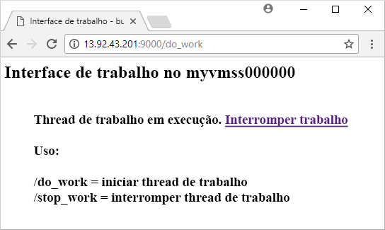
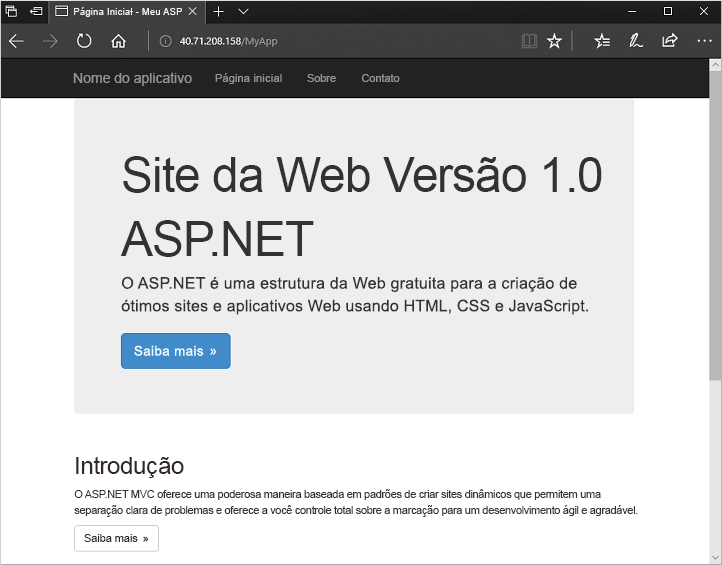

# <a name="create-a-virtual-machine-scale-set-with-the-azure-cli-20"></a>Criar um conjunto de dimensionamento de máquinas virtuais com o CLI do Azure 2.0
Um conjunto de dimensionamento de máquinas virtuais permite implantar e gerenciar um conjunto de máquinas virtuais idênticas de dimensionamento automático. Dimensione o número de VMs no conjunto de dimensionamento manualmente ou defina regras para o dimensionamento automático com base no uso de recursos, como CPU, demanda de memória ou tráfego de rede. Neste artigo de introdução, você cria um conjunto de dimensionamento de máquinas virtuais com um modelo do Azure Resource Manager. Também é possível criar um conjunto de dimensionamento com a [CLI do Azure 2.0](virtual-machine-scale-sets-create-cli.md), com o [Azure PowerShell](virtual-machine-scale-sets-create-powershell.md) ou com o [Portal do Azure](virtual-machine-scale-sets-create-portal.md).


## <a name="overview-of-templates"></a>Visão geral de modelos
Os modelos do Azure Resource Manager permitem a implantação de grupos de recursos relacionados. Os modelos são escritos em JSON (JavaScript Object Notation) e definem todo o ambiente de infraestrutura do Azure para seu aplicativo. Em um único modelo, é possível criar o conjunto de dimensionamento de máquinas virtuais, instalar aplicativos e configurar regras de dimensionamento automático. Com o uso de variáveis e parâmetros, esse modelo pode ser reutilizado para atualizar conjuntos de dimensionamento existentes ou criar conjuntos adicionais. Você pode implantar modelos por meio do portal do Azure, CLI do Azure 2.0 ou o Azure PowerShell, ou chamá-los de pipelines de integração contínua/ entrega contínua (CI/CD).

Para obter mais informações sobre modelos, consulte [Visão geral do Azure Resource Manager](https://docs.microsoft.com/azure/azure-resource-manager/resource-group-overview#template-deployment)


## <a name="define-a-scale-set"></a>Definir um conjunto de dimensionamento
Um modelo define a configuração de cada tipo de recurso. Um tipo de recurso de conjunto de dimensionamento de máquinas virtuais é semelhante a uma VM individual. As partes principais do tipo de recurso de conjunto de dimensionamento de máquinas virtuais são:

| Propriedade                     | Descrição da propriedade                                  | Exemplo de valor do modelo                    |
|------------------------------|----------------------------------------------------------|-------------------------------------------|
| Tipo                         | Tipo de recurso do Azure a ser criado                            | Microsoft.Compute/virtualMachineScaleSets |
| Nome                         | O nome do conjunto de dimensionamento                                       | myScaleSet                                |
| location                     | O local para criar o conjunto de dimensionamento                     | Leste dos EUA                                   |
| sku.name                     | O tamanho da VM para cada instância do conjunto de dimensionamento                  | Standard_A1                               |
| sku.capacity                 | O número de instâncias de VM a serem criadas inicialmente           | 2                                         |
| upgradePolicy.mode           | Modo de atualização de instância de VM quando ocorrem alterações              | Automático                                 |
| imageReference               | A plataforma ou a imagem personalizada a ser usada nas instâncias de VM | Canonical Ubuntu Server 16.04-LTS         |
| osProfile.computerNamePrefix | O prefixo do nome de cada instância de VM                     | myvmss                                    |
| osProfile.adminUsername      | O nome de usuário de cada instância de VM                        | azureuser                                 |
| osProfile.adminPassword      | A senha de cada instância de VM                        | P@ssw0rd!                                 |

 O trecho a seguir mostra a definição de recurso do conjunto de dimensionamento principal em um modelo. Para manter o exemplo curto, a configuração da NIC (placa de interface de rede) virtual não é mostrada. Para personalizar um modelo de conjunto de dimensionamento, altere o tamanho da VM ou a capacidade inicial, ou use uma plataforma diferente ou uma imagem personalizada.

```json
{
  "type": "Microsoft.Compute/virtualMachineScaleSets",
  "name": "myScaleSet",
  "location": "East US",
  "apiVersion": "2016-04-30-preview",
  "sku": {
    "name": "Standard_A1",
    "capacity": "2"
  },
  "properties": {
    "upgradePolicy": {
      "mode": "Automatic"
    },
    "virtualMachineProfile": {
      "storageProfile": {
        "osDisk": {
          "caching": "ReadWrite",
          "createOption": "FromImage"
        },
        "imageReference":  {
          "publisher": "Canonical",
          "offer": "UbuntuServer",
          "sku": "16.04-LTS",
          "version": "latest"
        }
      },
      "osProfile": {
        "computerNamePrefix": "myvmss",
        "adminUsername": "azureuser",
        "adminPassword": "P@ssw0rd!"
      }
    }
  }
}
```


## <a name="install-an-application"></a>Instalar um aplicativo
Quando você implanta um conjunto de dimensionamento, as extensões da VM podem fornecer tarefas de configuração e de automação pós-implantação, tais como instalar um aplicativo. Os scripts podem ser baixados do armazenamento do Azure ou do GitHub, ou fornecidos ao Portal do Azure no tempo de execução da extensão. Para aplicar uma extensão ao conjunto de dimensionamento, adicione a seção *extensionProfile* ao exemplo anterior do recurso. O perfil da extensão normalmente define as propriedades a seguir:

- Tipo de extensão
- Editor de extensão
- Versão da extensão
- Local dos scripts de configuração ou de instalação
- Comandos a serem executados nas instâncias da VM

Vejamos duas maneiras de instalar um aplicativo com extensões – com a extensão de Script personalizado para instalar um aplicativo Python no Linux ou com a extensão de DSC do PowerShell para instalar um aplicativo ASP.NET no Windows.

### <a name="python-http-server-on-linux"></a>Servidor HTTP do Python em Linux
O [servidor HTTP Python no Linux](https://github.com/Azure/azure-quickstart-templates/tree/master/201-vmss-bottle-autoscale) usa a extensão de Script personalizado para instalar o [Bottle](http://bottlepy.org/docs/dev/), uma estrutura de Web Python e um servidor HTTP simples. 

Dois scripts são definidos em *fileUris* - *installserver.sh* e *workserver.py*. Esses arquivos são baixados do GitHub e o *commandToExecute* define `bash installserver.sh` para o aplicativo ser instalado e configurado:

```json
"extensionProfile": {
  "extensions": [
    {
      "name": "AppInstall",
      "properties": {
        "publisher": "Microsoft.Azure.Extensions",
        "type": "CustomScript",
        "typeHandlerVersion": "2.0",
        "autoUpgradeMinorVersion": true,
        "settings": {
          "fileUris": [
            "https://raw.githubusercontent.com/Azure/azure-quickstart-templates/master/201-vmss-bottle-autoscale/installserver.sh",
            "https://raw.githubusercontent.com/Azure/azure-quickstart-templates/master/201-vmss-bottle-autoscale/workserver.py"
          ],
          "commandToExecute": "bash installserver.sh"
        }
      }
    }
  ]
}
```

### <a name="aspnet-application-on-windows"></a>Aplicativo ASP.NET no Windows
O modelo de exemplo do [aplicativo ASP.NET no Windows](https://github.com/Azure/azure-quickstart-templates/tree/master/201-vmss-windows-webapp-dsc-autoscale) usa a extensão de DSC do PowerShell para instalar um aplicativo ASP.NET MVC, que é executado no IIS. 

Um script de instalação é baixado do GitHub, conforme definido na *URL*. A extensão executa *InstallIIS* do script *IISInstall.ps1*, conforme definido em *função* e *Script*. O aplicativo ASP.NET é fornecido como um pacote de Implantação da Web, e também pode ser baixado do GitHub, conforme definido em *WebDeployPackagePath*:

```json
"extensionProfile": {
  "extensions": [
    {
      "name": "Microsoft.Powershell.DSC",
      "properties": {
        "publisher": "Microsoft.Powershell",
        "type": "DSC",
        "typeHandlerVersion": "2.9",
        "autoUpgradeMinorVersion": true,
        "forceUpdateTag": "1.0",
        "settings": {
          "configuration": {
            "url": "https://raw.githubusercontent.com/Azure/azure-quickstart-templates/master/201-vmss-windows-webapp-dsc-autoscale/DSC/IISInstall.ps1.zip",
            "script": "IISInstall.ps1",
            "function": "InstallIIS"
          },
          "configurationArguments": {
            "nodeName": "localhost",
            "WebDeployPackagePath": "https://raw.githubusercontent.com/Azure/azure-quickstart-templates/master/201-vmss-windows-webapp-dsc-autoscale/WebDeploy/DefaultASPWebApp.v1.0.zip"
          }
        }
      }
    }
  ]
}
```

## <a name="deploy-the-template"></a>Implantar o modelo
A maneira mais simples de implantar o modelo [Servidor HTTP do Python em Linux](https://github.com/Azure/azure-quickstart-templates/tree/master/201-vmss-bottle-autoscale) ou o [aplicativo ASP.NET MVC no Windows](https://github.com/Azure/azure-quickstart-templates/tree/master/201-vmss-windows-webapp-dsc-autoscale) é usar o botão **Implantar no Azure** encontrado na nos arquivos leiame no GitHub.  Você também pode usar o PowerShell ou a CLI do Azure para implantar os modelos de exemplo.

### <a name="azure-cli-20"></a>CLI do Azure 2.0
Você pode usar o CLI do Azure 2.0 para instalar o servidor HTTP Python no Linux, da seguinte maneira:

```azurecli-interactive
# Create a resource group
az group create --name myResourceGroup --location EastUS

# Deploy template into resource group
az group deployment create \
    --resource-group myResourceGroup \
    --template-uri https://raw.githubusercontent.com/Azure/azure-quickstart-templates/master/201-vmss-bottle-autoscale/azuredeploy.json
```

Para ver seu aplicativo em ação, obtenha o endereço IP público do balanceador de carga com a [az network public-ip list](/cli/azure/network/public-ip#az_network_public_ip_show) da seguinte maneira:

```azurecli-interactive
az network public-ip list \
    --resource-group myResourceGroup \
    --query [*].ipAddress -o tsv
```

Insira o endereço IP público do balanceador de carga em um navegador da Web no formato *http://<publicIpAddress>: 9000/do_work*. O balanceador de carga distribui o tráfego para uma de suas instâncias de VM, conforme mostrado no exemplo a seguir:




### <a name="azure-powershell"></a>Azure PowerShell
Use o Azure PowerShell para instalar o aplicativo ASP.NET no Windows da seguinte maneira:

```azurepowershell-interactive
# Create a resource group
New-AzureRmResourceGroup -Name myResourceGroup -Location EastUS

# Deploy template into resource group
New-AzureRmResourceGroupDeployment `
    -ResourceGroupName myResourceGroup `
    -TemplateFile https://raw.githubusercontent.com/Azure/azure-quickstart-templates/master/201-vmss-windows-webapp-dsc-autoscale/azuredeploy.json
```

Para ver seu aplicativo em ação, obtenha o endereço IP público do balanceador de carga com [Get-AzureRmPublicIpAddress](/powershell/module/azurerm.network/get-azurermpublicipaddress) como demonstrado a seguir:

```azurepowershell-interactive
Get-AzureRmPublicIpAddress -ResourceGroupName myResourceGroup | Select IpAddress
```

Insira o endereço IP público do balanceador de carga em um navegador da Web no formato *http://<publicIpAddress>/MyApp*. O balanceador de carga distribui o tráfego para uma de suas instâncias de VM, conforme mostrado no exemplo a seguir:




## <a name="clean-up-resources"></a>Limpar recursos
Quando não for mais necessário, use [az group delete](/cli/azure/group#az_group_delete) para remover o grupo de recursos, o conjunto de dimensionamento e todos os recursos relacionados, como demonstrado a seguir:

```azurecli-interactive 
az group delete --name myResourceGroup
```


## <a name="next-steps"></a>Próximas etapas
