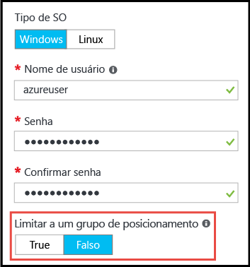

# <a name="working-with-large-virtual-machine-scale-sets"></a>Trabalhando com conjuntos de dimensionamento grandes de máquinas virtuais
Agora você pode criar [conjuntos de dimensionamento de máquina virtual](/azure/virtual-machine-scale-sets/) do Azure com uma capacidade de até 1.000 VMs. Neste documento, um _conjunto de dimensionamento de máquinas virtuais grande_ é definido como um conjunto de dimensionamento capaz de ser redimensionado para mais de 100 VMs. Esse recurso é definido por uma propriedade de conjunto de dimensionamento (_singlePlacementGroup=False_). 

Certos aspectos de conjuntos de dimensionamento grandes, como domínios de falhas e balanceamento de carga, se comportam de maneira diferente de um conjunto de dimensionamento padrão. Este documento explica as características de conjuntos de dimensionamento grandes e descreve o que você precisa saber para usá-los com êxito nos aplicativos. 

Uma abordagem comum para implantar a infraestrutura de nuvem em grande escala é criar um conjunto de _unidades de dimensionamento_, por exemplo, criando vários conjuntos de dimensionamento de VMs em várias VNETs e contas de armazenamento. Essa abordagem fornece gerenciamento mais fácil em comparação com VMs únicas, e várias unidades de escala são úteis para muitos aplicativos, especialmente aqueles que exigem outros componentes empilháveis, como várias redes virtuais e pontos de extremidade. No entanto, se o aplicativo requer um único cluster grande, pode ser mais fácil implantar um único conjunto de dimensionamento com até 1.000 VMs. Cenários de exemplo incluem implantações de big data centralizadas ou grades de computação que exigem o gerenciamento simples de um grande pool de nós de trabalho. Combinado com o [disco de dados conectado](virtual-machine-scale-sets-attached-disks.md) do conjunto de dimensionamento de máquina virtual, os conjuntos de dimensionamento de grande escala o habilitam a implantar uma infraestrutura escalonável que consiste em milhares de vCPUs e petabytes de armazenamento, como uma única operação.

## <a name="placement-groups"></a>Grupos de posicionamento 
O que torna um conjunto de dimensionamento _grande_ especial não é o número de VMs, mas o número de _grupos de posicionamento_ que ele contém. Um grupo de posicionamento é uma construção semelhante a um conjunto de disponibilidade do Azure, com seus próprios domínios de falha e domínios de atualização. Por padrão, um conjunto de dimensionamento consiste em um único grupo de posicionamento com tamanho máximo de 100 VMs. Se uma propriedade de conjunto de dimensionamento chamada _singlePlacementGroup_ for definido como _false_, o conjunto de dimensionamento poderá ser composto de vários grupos de posicionamento e ter um intervalo de 0-1.000 VMs. Quando definido com o valor padrão _true_, um conjunto de dimensionamento é composto de um grupo único posicionamento e tem um intervalo de 0 a 100 VMs.

## <a name="checklist-for-using-large-scale-sets"></a>Lista de verificação para uso em conjuntos de dimensionamento grandes
Para decidir se o aplicativo pode fazer uso eficiente de conjuntos de dimensionamento grandes, considere os seguintes requisitos:

- Se estiver planejando implantar um grande número de VMs, talvez seus limites de cota de vCPU de computação precisem ser aumentados. 
- Conjuntos de dimensionamento criados com base em imagens do Azure Marketplace podem ser dimensionados para até 1.000 VMs.
- Conjuntos de dimensionamento criados com base em imagens personalizadas (imagens de VM que você cria e carrega por conta própria) atualmente podem ser dimensionados para até 600 VMs.
- Conjuntos de dimensionamento grandes exigem Discos Gerenciados do Azure. Conjuntos de dimensionamento que não são criados com Discos Gerenciados exigem várias contas de armazenamento (uma para cada 20 VMs). Conjuntos de dimensionamento grandes são projetados para trabalhar exclusivamente com Discos Gerenciados para reduzir a sobrecarga de gerenciamento de armazenamento e evitar o risco de execução em limites de assinatura para contas de armazenamento. 
- O balanceamento de carga da camada 4 com conjuntos de dimensionamento composto por vários grupos de posicionamento exige o [SKU Standard do Azure Load Balancer](../load-balancer/load-balancer-standard-overview.md). O SKU Standard do Load Balancer oferece benefícios adicionais, como a capacidade de balanceamento de carga entre vários conjuntos de dimensionamento. O SKU Standard também requer que o conjunto de dimensionamento tenha um Grupo de Segurança de Rede associado a ele, caso contrário, os pools de NAT não funcionam corretamente. Se precisar usar a SKU Básica do Azure Load Balancer, verifique se o conjunto de dimensionamento está configurado para usar um único grupo de posicionamento, que é a configuração padrão.
- O balanceamento de carga da camada 7 com o Gateway de Aplicativo do Azure tem suporte para todos os conjuntos de dimensionamento.
- Um conjunto de dimensionamento é definido com uma única sub-rede. Verifique se a sub-rede tem um espaço de endereço grande o suficiente para todas as VMs de que você precisa. Por padrão, um conjunto de dimensionamento superprovisiona (cria VMs extras no momento da implantação ou expansão, pelas quais você não é cobrado) para melhorar o desempenho e a confiabilidade da implantação. Permita um espaço de endereço 20% maior do que o número de VMs para as quais você planeja dimensionar.
- Domínios de falha e domínios de atualização só são consistentes dentro de um grupo de posicionamento. Essa arquitetura não altera a disponibilidade geral do conjunto de dimensionamento, pois as VMs são distribuídas uniformemente por hardware físico distinto, mas significa que, se você precisar garantir que duas VMs estejam em um hardware diferente, verifique se elas estão em domínios de falha diferentes no mesmo grupo de posicionamento. Consulte este link [Regiões do Azure e disponibilidade](https://docs.microsoft.com/azure/virtual-machines/windows/regions-and-availability/). 
- A ID de grupo de posicionamento e o domínio de falhas são mostrados na _exibição da instância_ de uma VM de conjunto de dimensionamento. Você pode exibir a instância do modo de exibição de uma VM de conjunto de dimensionamento no [Gerenciador de Recursos do Azure](https://resources.azure.com/).

## <a name="creating-a-large-scale-set"></a>Criando um conjunto de dimensionamento grande
Quando você cria um conjunto de dimensionamento no portal do Azure, basta especificar o valor de *Contagem de instâncias* para até 1.000. Se for mais de 100 instâncias, *Habilitar dimensionamento acima de 100 instâncias* será definido como *Sim*, o que permitirá que ele seja dimensionado para vários grupos de posicionamento. 



Você pode criar um conjunto de dimensionamento grande de máquina virtual usando o comando da [CLI do Azure](https://github.com/Azure/azure-cli) _az vmss create_. Esse comando define padrões inteligentes, como tamanho da sub-rede com base no argumento _instance-count_:

```bash
az group create -l southcentralus -n biginfra
az vmss create -g biginfra -n bigvmss --image ubuntults --instance-count 1000
```
O comando _vmss create_ usará determinados valores de configuração como padrão se você não especificá-los. Para ver as opções disponíveis que você pode substituir, experimente:
```bash
az vmss create --help
```

Se estiver criando um conjunto de dimensionamento grande por meio da composição de um modelo do Azure Resource Manager, verifique se o modelo cria um conjunto de dimensionamento com base em Discos Gerenciados do Azure. É possível definir a propriedade _singlePlacementGroup_ como _false_ na seção _propriedades_ do recurso _Microsoft.Compute/virtualMachineScaleSets_. O seguinte fragmento JSON mostra o início de um modelo de conjunto de dimensionamento, incluindo a capacidade de 1.000 VMs e a configuração _"singlePlacementGroup": false_:
```json
{
  "type": "Microsoft.Compute/virtualMachineScaleSets",
  "location": "australiaeast",
  "name": "bigvmss",
  "sku": {
    "name": "Standard_DS1_v2",
    "tier": "Standard",
    "capacity": 1000
  },
  "properties": {
    "singlePlacementGroup": false,
    "upgradePolicy": {
      "mode": "Automatic"
    }
```
Para obter um exemplo completo de grande escala definida no modelo, consulte [ https://github.com/gbowerman/azure-myriad/blob/master/bigtest/bigbottle.json ](https://github.com/gbowerman/azure-myriad/blob/master/bigtest/bigbottle.json).

## <a name="converting-an-existing-scale-set-to-span-multiple-placement-groups"></a>Converter um conjunto de dimensionamento existente para abranger vários grupos de posicionamento
Para tornar um conjunto de dimensionamento de máquina virtual existente capaz de ser redimensionado para mais de 100 VMs, você precisa alterar a propriedade _singplePlacementGroup_ para _false_ no modelo de conjunto de dimensionamento. Você pode testar a alteração dessa propriedade com o [Gerenciador de Recursos do Azure](https://resources.azure.com/). Localize um conjunto de dimensionamento existente, selecione _Editar_ e altere a propriedade _singlePlacementGroup_. Se não vir essa propriedade, talvez você esteja exibindo o conjunto de dimensionamento com uma versão mais antiga da API Microsoft.Compute.

> [!NOTE]
> Você pode alterar um conjunto de dimensionamento de oferecer suporte a apenas um único grupo de posicionamento (o comportamento padrão) para dar suporte a vários grupos de posicionamento, mas não é possível fazer o oposto. Portanto, entenda as propriedades de conjuntos de dimensionamento grandes antes da conversão.


