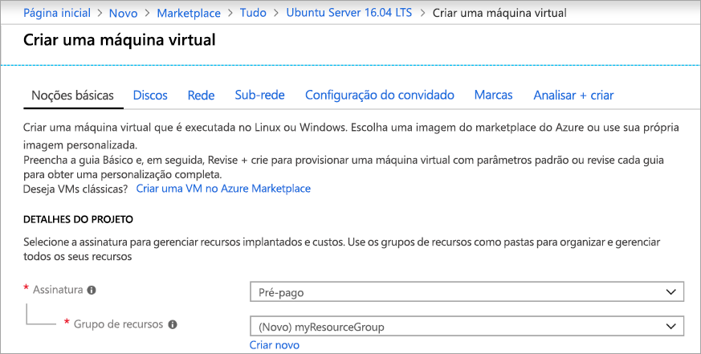
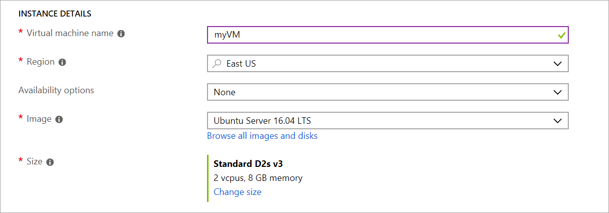
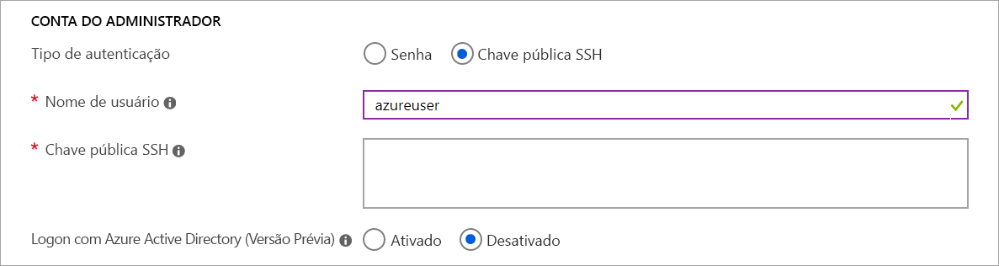
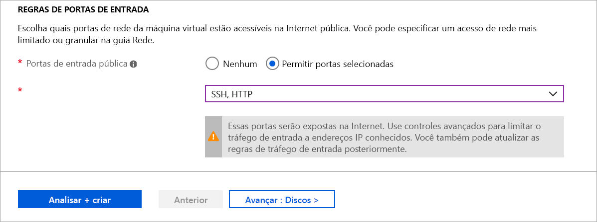

# <a name="quickstart-create-a-linux-virtual-machine-in-the-azure-portal"></a>Início Rápido: criar uma máquina virtual do Linux no portal do Azure

As máquinas virtuais (VM) do Azure podem ser criadas por meio do Portal do Azure. O portal do Azure é uma interface de usuário baseada em navegador para criar as VMS e seus recursos relacionados. Este início rápido mostra como usar o Portal do Azure para implantar uma máquina virtual (VM) Linux que executa o Ubuntu 16.04 LTS. Para ver a VM em ação, você também habilita o SSH na VM e instala o servidor Web do NGINX.

Se você não tiver uma assinatura do Azure, crie uma [conta gratuita](https://azure.microsoft.com/free/?WT.mc_id=A261C142F) antes de começar.

## <a name="create-ssh-key-pair"></a>Criar o par de chaves SSH

Você precisa de um par de chaves SSH para concluir este início rápido. Se você já tiver um par de chaves SSH, você pode ignorar esta etapa.

Abra um shell bash e use [ssh-keygen](https://www.ssh.com/ssh/keygen/) para criar um par de chaves SSH. Se você não tiver um shell bash no seu computador local, você pode usar o [Azure Cloud Shell](https://shell.azure.com/bash).  

```bash
ssh-keygen -t rsa -b 2048
```

O comando acima gera as chaves públicas e privadas com o nome padrão do `id_rsa` no `~/.ssh directory`. O comando retorna o caminho completo para a chave pública. Use o caminho para a chave pública para exibir seu conteúdo com `cat`.

```bash 
cat ~/.ssh/id_rsa.pub
```

Salve a saída desse comando. Você precisará dele ao configurar sua conta de administrador para fazer logon em sua VM.

Para obter mais informações sobre como criar pares de chave SSH, incluindo o uso de PuTTy, consulte [Como usar chaves SSH com o Windows](ssh-from-windows.md).

Se você criar o par de chaves SSH usando o Cloud Shell, ele será armazenado em um compartilhamento de arquivos do Azure que é [montado automaticamente pelo Cloud Shell](https://docs.microsoft.com/azure/cloud-shell/persisting-shell-storage). Não exclua essa conta de armazenamento ou compartilhamento de arquivo até depois de recuperar suas chaves ou você perderá o acesso à VM. 

## <a name="sign-in-to-azure"></a>Entrar no Azure

Entre no [Portal do Azure](https://portal.azure.com).

## <a name="create-virtual-machine"></a>Criar máquina virtual

1. Escolha **Criar um recurso** no canto superior esquerdo do portal do Azure.

1. Na caixa de pesquisa acima da lista de recursos do Azure Marketplace, procure e selecione **Ubuntu Server 16.04 LTS** por Canonical, escolha **Criar**.

1. Na guia **Básico**, em **Detalhes do projeto**, verifique se a assinatura correta está selecionada e, em seguida, escolha **Criar** em **Grupo de recursos**. Na janela pop-up, digite *myResourceGroup* no nome do grupo de recursos e, em seguida, escolha **OK*. 

    

1. Em **Detalhes da instância**, digite *myVM* para o **Nome da máquina virtual** e escolha *Leste dos EUA* para **Região**. Deixe os outros padrões.

    

1. Em **Conta de administrador**, selecione **Chave pública SSH**, digite seu nome de usuário e, em seguida, cole sua chave pública na caixa de texto. Remova os espaços em branco à esquerda ou à direita em sua chave pública.

    

1. Em **Regras de porta de entrada** > **Portas de entrada públicas**, escolha **Permitir portas selecionadas** e, em seguida, selecione **SSH (22)** e **HTTP (80)** na lista suspensa. 

    

1. Deixe os padrões restantes e, em seguida, selecione o botão **Examinar + criar** na parte inferior da página.

1. Na página **Criar uma máquina virtual**, você pode ver os detalhes sobre a VM que você está prestes a criar. Quando estiver pronto, selecione **Criar**.

Levará alguns minutos para que sua VM seja implantada. Quando a implantação for concluída, vá para a próxima seção.

    
## <a name="connect-to-virtual-machine"></a>Conectar-se à máquina virtual

Crie uma conexão SSH com a VM.

1. Selecione o botão **Conectar** na página visão geral da sua VM. 

    

2. Na página **Conectar à máquina virtual**, mantenha as opções padrão para conectar-se com o endereço IP na porta 22. Em **Logon usando a conta local de VM** um comando de conexão é mostrado. Clique no botão para copiar o comando. O exemplo a seguir mostra a aparência do comando de conexão SSH:

    ```bash
    ssh azureuser@10.111.12.123
    ```

3. Usando o mesmo shell bash que você usou para criar seu par de chaves SSH (como o [Azure Cloud Shell](https://shell.azure.com/bash) ou o shell bash local) cole o comando de conexão SSH no shell para criar uma sessão SSH. 

## <a name="install-web-server"></a>Instalar servidor Web

Para ver a VM em ação, instale o servidor Web do NGINX. Na sua sessão de SSH, atualize suas fontes de pacote e, em seguida, instale o pacote mais recente do NGINX.

```bash
sudo apt-get -y update
sudo apt-get -y install nginx
```

Quando terminar, digite `exit` para sair da sessão SSH.


## <a name="view-the-web-server-in-action"></a>Ver o servidor Web em ação

Use um navegador da Web de sua escolha para exibir a página inicial padrão do NGINX. Insira o endereço IP público da VM como o endereço Web. O endereço IP público pode ser encontrado na página de visão geral de VM ou como parte da cadeia de conexão SSH usada anteriormente.


## <a name="clean-up-resources"></a>Limpar recursos

Quando o grupo de recursos, a máquina virtual e todos os recursos relacionados não forem mais necessários, exclua-os. Para fazer isso, selecione o grupo de recursos da máquina virtual, selecione **Excluir**, em seguida, confirme o nome do grupo de recursos para excluir.

## <a name="next-steps"></a>Próximas etapas

Neste início rápido, você implantou uma máquina virtual simples, criou um Grupo de Segurança de Rede e uma regra e instalou um servidor Web básico. Para saber mais sobre máquinas virtuais do Azure, continue o tutorial para VMs do Linux.

> [!div class="nextstepaction"]
> [Tutoriais de máquina virtual do Linux Azure](./tutorial-manage-vm.md)
