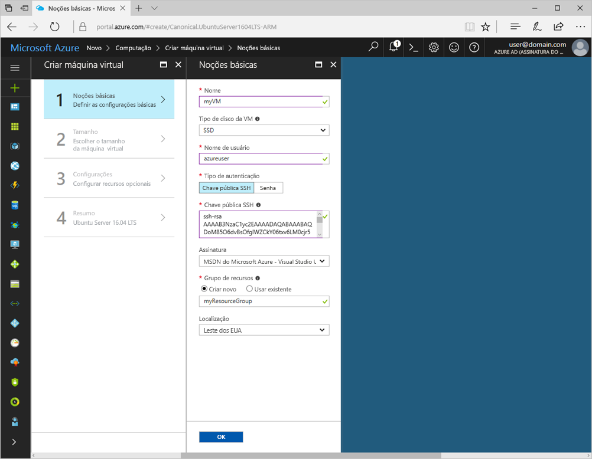
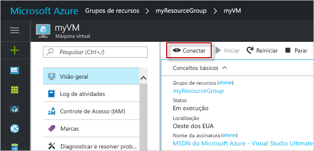

# <a name="create-a-linux-virtual-machine-with-the-azure-portal"></a>Criar uma máquina virtual Linux com o Portal do Azure

Máquinas virtuais do Azure podem ser criadas por meio do Portal do Azure. Esse método fornece uma interface do usuário baseada em navegador para a criação e configuração de máquinas virtuais e todos os recursos relacionados. Esse Início Rápido percorre a criação de uma máquina virtual usando o portal do Azure.

Se você não tiver uma assinatura do Azure, crie uma [conta gratuita](https://azure.microsoft.com/en-us/free/?WT.mc_id=A261C142F) antes de começar.

## <a name="create-ssh-key-pair"></a>Criar o par de chaves SSH

Você precisa de um par de chaves SSH para concluir este início rápido. Se você já tiver um par de chave SSH, essa etapa pode ser ignorada. Se você estiver usando um computador Windows, siga as instruções descritas [aqui](ssh-from-windows.md). 

Em um shell Bash, execute este comando e siga as orientações da tela. A saída do comando inclui o nome do arquivo da chave pública. O conteúdo desse arquivo é necessário ao criar a máquina virtual.

```bash
ssh-keygen -t rsa -b 2048
```

## <a name="log-in-to-azure"></a>Fazer logon no Azure 

Faça logon no Portal do Azure em http://portal.azure.com.

## <a name="create-virtual-machine"></a>Criar máquina virtual

1. Clique no botão **Novo** no canto superior esquerdo do Portal do Azure.

2. Selecione **Computação** na folha **Novo**, selecione *Ubuntu Server 16.04 LTS* na folha **Computação** e, em seguida, clique no botão **Criar**.

3. Preencha o formulário **Básico** da máquina virtual. Para **Tipo de autenticação**, selecione *SSH*. Ao colar na sua **chave pública SSH**, tome cuidado para remover qualquer espaço em branco à direita ou à esquerda. Para **Grupo de Recursos**, crie um novo. Um grupo de recursos é um contêiner lógico no qual os recursos do Azure são criados e gerenciados coletivamente. Ao concluir, clique em **OK**.

      

4. Escolha um tamanho para a VM. Para ver mais tamanhos, selecione **Exibir todos os** ou altere o filtro **Tipo de disco com suporte**. 

      

5. Na folha de configurações, selecione *Sim* em **Usar discos gerenciados**, mantenha os padrões para o restante das configurações e clique em **OK**.

6. Na página de resumo, clique em **OK** para iniciar a implantação da máquina virtual.

7. Para monitorar o status de implantação, clique na máquina virtual. A VM pode ser encontrada no painel do Portal do Azure ou selecionando **Máquinas Virtuais** no menu esquerdo. Quando a VM tiver sido criada, o status será alterado para *Em implantação* ou *Em execução*.


## <a name="open-port-80-for-web-traffic"></a>Abra a porta 80 para tráfego da Web 

Por padrão, somente as conexões de SSH são permitidas em máquinas virtuais Linux implantadas no Azure. Se essa VM for se transformar em um servidor Web, você precisará abrir a porta 80 para o tráfego da Web. Esta etapa orienta a criação de uma regra NSG (grupo de segurança de rede) para permitir conexões de entrada na porta 80.

1. Na folha da máquina virtual, na seção **Conceitos básicos**, clique no nome do **Grupo de recursos**.
2. Na folha do grupo de recursos, clique no **Grupo de segurança da rede** na lista de recursos. O nome NSG deve ser o nome da VM com *- nsg* acrescentado ao final.
3. Clique no cabeçalho **Regra de Segurança de Entrada** para abrir a lista de regras de entrada. Você deve ver uma regra de RDP já na lista.
4. Clique em **+ Adicionar** para abrir a folha **Adicionar regra de segurança de entrada**.
5. Em **Nome**, digite *nginx*. Verifique se o **Intervalo de portas** está definido para *80* e a **Ação** está definida para *Permitir*. Clique em **OK**.


## <a name="connect-to-virtual-machine"></a>Conectar-se à máquina virtual

Após a implantação, crie uma conexão SSH com a máquina virtual.

1. Clique no botão **Conectar** na folha da máquina virtual. O botão conectar exibe uma cadeia de conexão SSH que pode ser usada para conectar-se à máquina virtual.

     

2. Execute o seguinte comando para criar uma sessão SSH. Substitua a cadeia de conexão com aquela que você copiou do Portal do Azure.

```bash 
ssh <replace with IP address>
```

## <a name="install-nginx"></a>Instalar o NGINX

Use o seguinte script bash para atualizar fontes de pacote e instalar o pacote mais recente do NGINX. 

```bash 
#!/bin/bash

# update package source
apt-get -y update

# install NGINX
apt-get -y install nginx
```

## <a name="view-the-ngix-welcome-page"></a>Exibir a página de boas-vindas do NGIX

Com o NGINX instalado e a porta 80 que agora está aberta na sua VM da Internet, você pode usar um navegador da Web de sua escolha para exibir a página de boas-vindas do NGINX padrão. Obtenha o *Endereço IP público* da folha para a VM e use-o para visitar a página Web padrão.

 
## <a name="delete-virtual-machine"></a>Excluir máquina virtual

Quando o grupo de recursos, a máquina virtual e todos os recursos relacionados não forem mais necessários, exclua-os. Para fazer isso, selecione o grupo de recursos na folha da máquina virtual e clique em **Excluir**.

## <a name="next-steps"></a>Próximas etapas

[Tutorial Criar máquinas virtuais altamente disponíveis](create-cli-complete.md?toc=%2fazure%2fvirtual-machines%2flinux%2ftoc.json)

[Explorar as amostras de CLI de implantação de VM](../windows/cli-samples.md?toc=%2fazure%2fvirtual-machines%2flinux%2ftoc.json)

