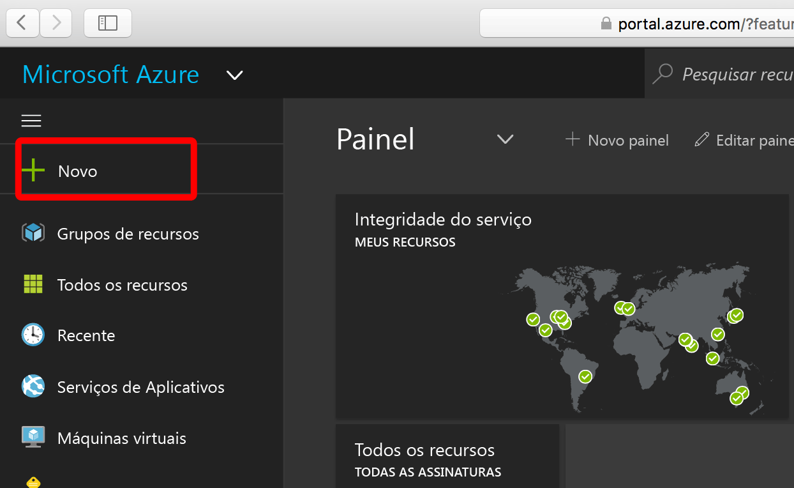
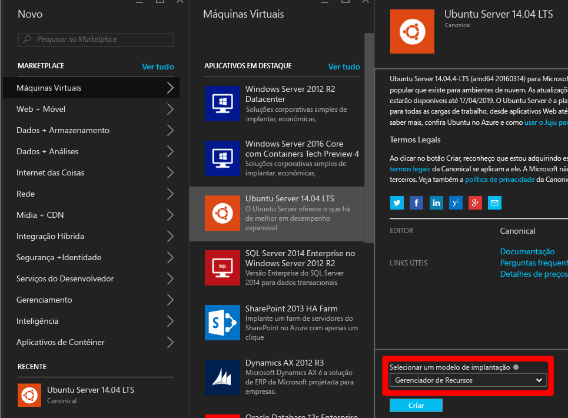
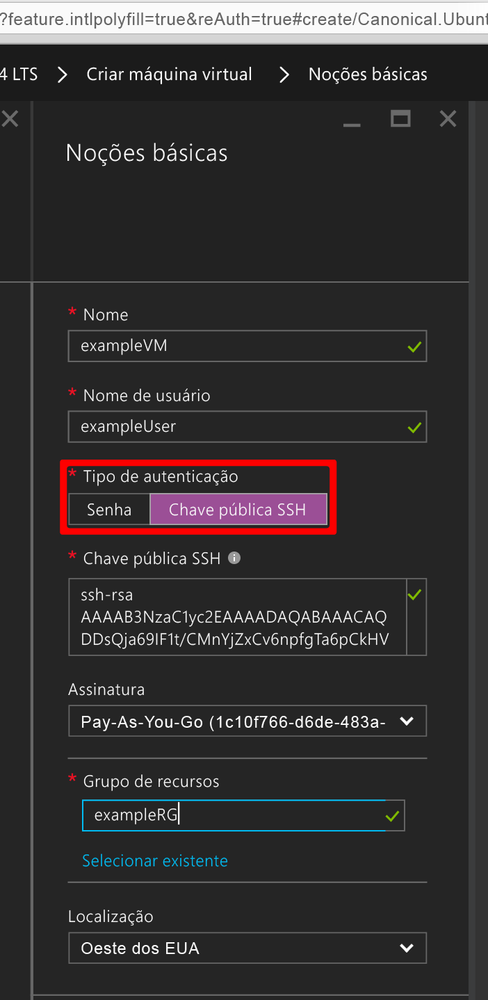
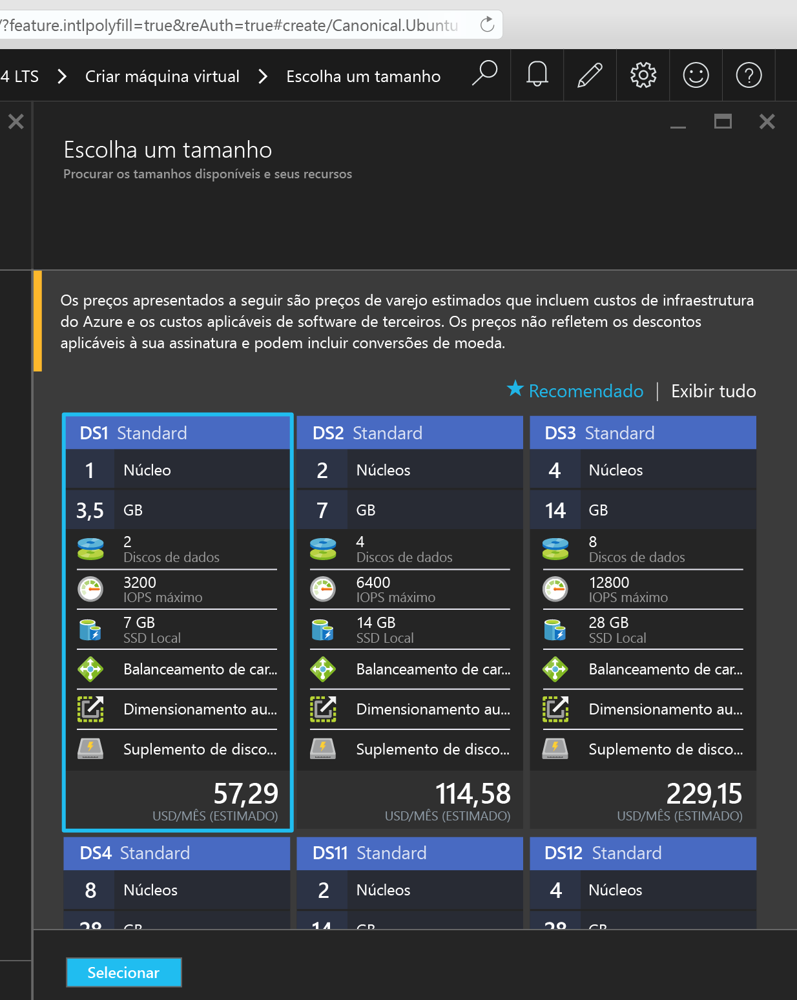
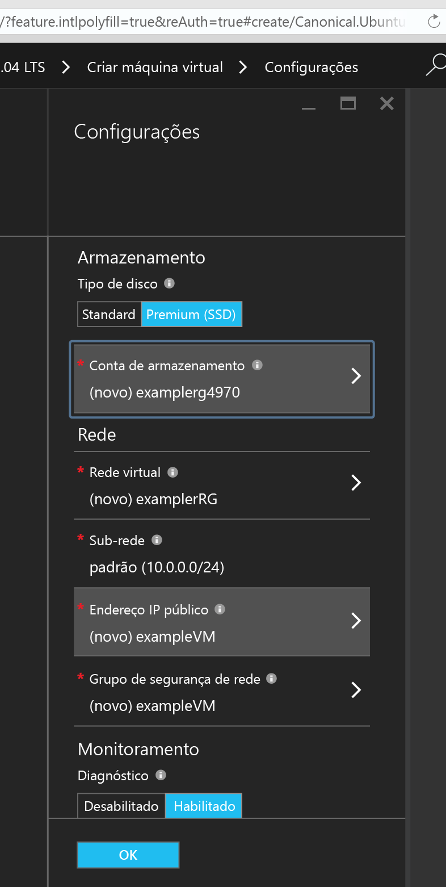
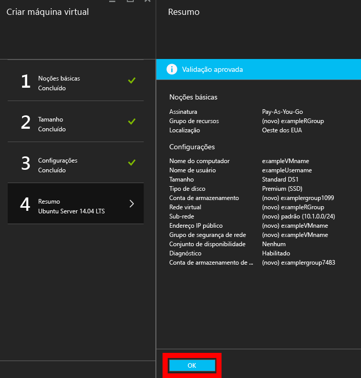
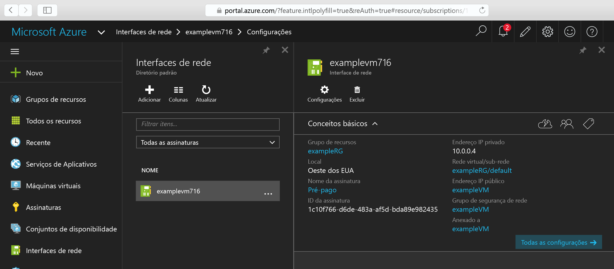
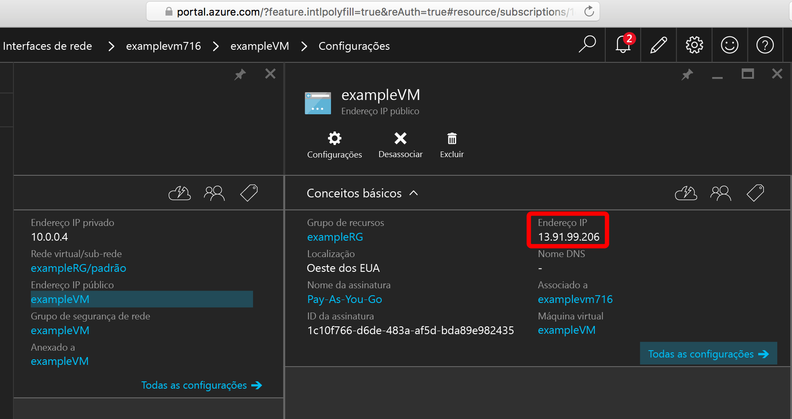

<properties
    pageTitle="Criar uma VM do Linux usando o Portal do Azure | Microsoft Azure"
    description="Criar uma VM do Linux usando o Portal do Azure."
    services="virtual-machines-linux"
    documentationCenter=""
    authors="vlivech"
    manager="timlt"
    editor=""
    tags="azure-resource-manager"
/>

<tags
    ms.service="virtual-machines-linux"
    ms.workload="infrastructure-services"
    ms.tgt_pltfrm="vm-linux"
    ms.devlang="na"
    ms.topic="hero-article"
    ms.date="04/12/2016"
    ms.author="v-livech"
/>

# Criar uma VM do Linux no Azure usando o Portal

Este artigo mostra como usar o [Portal do Azure](https://portal.azure.com/) para criar uma Máquina Virtual do Linux rapidamente. Os únicos requisitos são [uma conta do Azure](https://azure.microsoft.com/pricing/free-trial/) e [arquivos de chave públicos e privados SSH](virtual-machines-linux-mac-create-ssh-keys.md).


1. Conectado ao Portal do Azure com sua identidade de conta do Azure, clique em **+ Novo** no canto superior esquerdo:

    

2. Clique em **Máquinas Virtuais** no **Marketplace**, então, em **Ubuntu Server 14.04 LTS** na lista de imagens **Aplicativos em Destaque**. Verifique na parte inferior se o modelo de implantação é `Resource Manager` e clique em **Criar**.

    

3. Na página **Noções Básicas**, insira:
    - um nome para a máquina virtual
    - um nome de usuário para o usuário administrador
    - o Tipo de Autenticação definido para **chave pública SSH**
    - sua chave pública SSH como uma cadeia de caracteres (por padrão, de seu diretório `~/.ssh/`)
    - um nome de grupo de recursos (para criar um novo grupo de implantação) ou selecione um grupo existente

    e clique em **OK** para continuar e escolher o tamanho da VM. Ela deve ter a seguinte aparência:

    

4. Escolha o tamanho **DS1**, que instala o Ubuntu em um SSD Premium, e clique em **Selecionar** para definir as configurações.

    

5. Em **Configurações**, mantenha os valores Armazenamento e Rede como padrão, e clique em **OK** para exibir o resumo. Observe que o tipo de disco foi definido para SSD Premium escolhendo DS1; o **S** indica SSD.

    

6. Confirme as configurações para sua nova VM Ubuntu e clique em **OK**.

    

7. Abra o Painel do Portal, em **Interfaces de rede**, escolha sua NIC

    

8. Abra o menu Endereços IP Públicos nas configurações de NIC

    

9. SSH para o IP público usando sua chave pública SSH

```
ahmetL@fedora$ ssh -i ~/.ssh/azure_id_rsa ubuntu@13.91.99.206
```

## Próximas etapas

Agora que você criou uma VM Linux rapidamente a ser usada para fins de teste ou demonstração, Para criar uma VM do Linux personalizada para sua infraestrutura, você pode seguir qualquer um dos artigos abaixo.

- [Criar uma VM do Linux no Azure usando Modelos](virtual-machines-linux-cli-deploy-templates.md)
- [Criar uma VM do Linux Protegida por SSH no Azure usando Modelos](virtual-machines-linux-create-ssh-secured-vm-from-template.md)
- [Criar uma VM do Linux usando a CLI do Azure](virtual-machines-linux-create-cli-complete.md)

Esses artigos o ajudarão a criar uma infraestrutura do Azure, bem como quaisquer ferramentas de implantação da infraestrutura patenteadas e de fonte aberta, de configuração e orquestração.

<!----HONumber=AcomDC_0420_2016-->