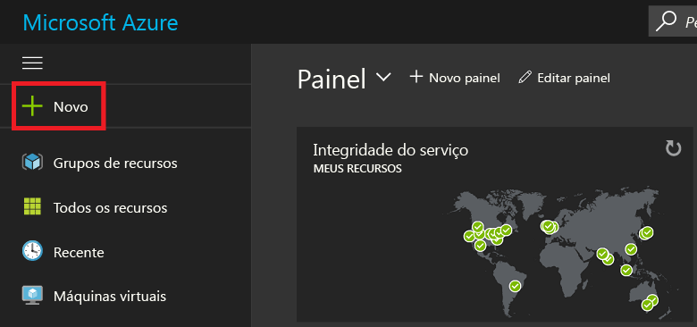
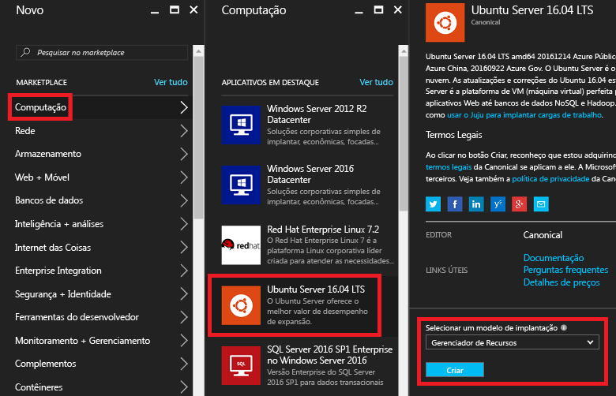
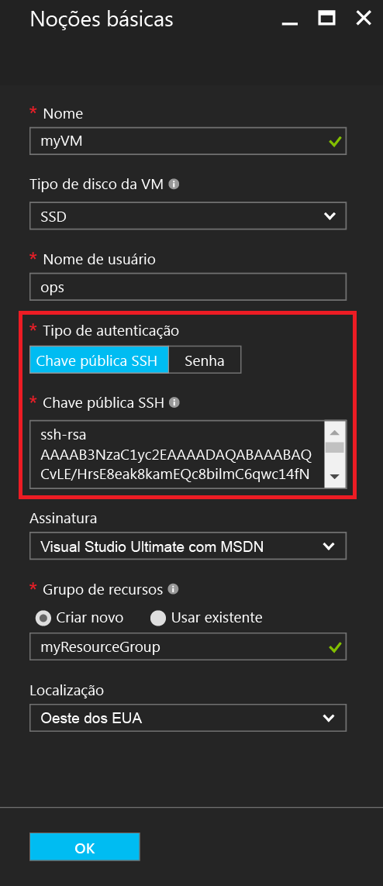
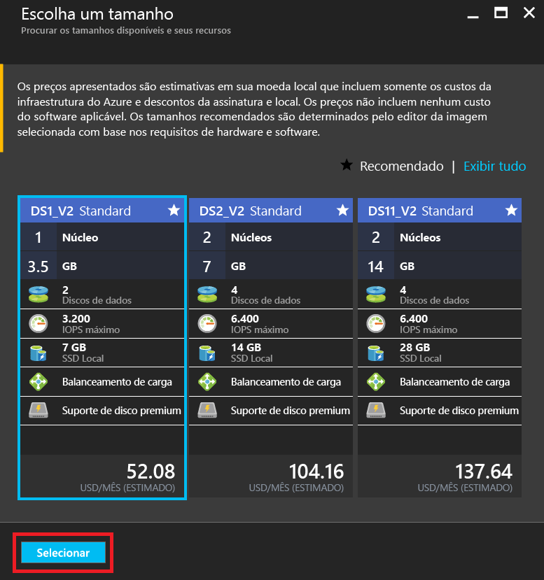
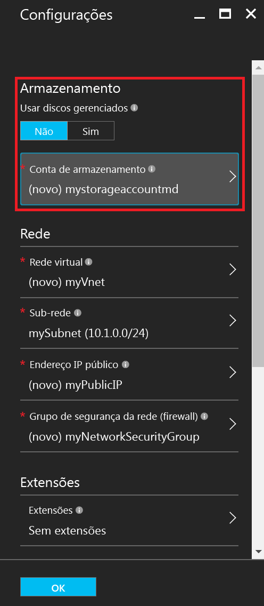
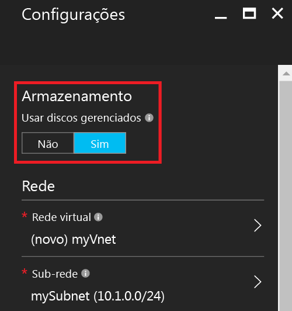
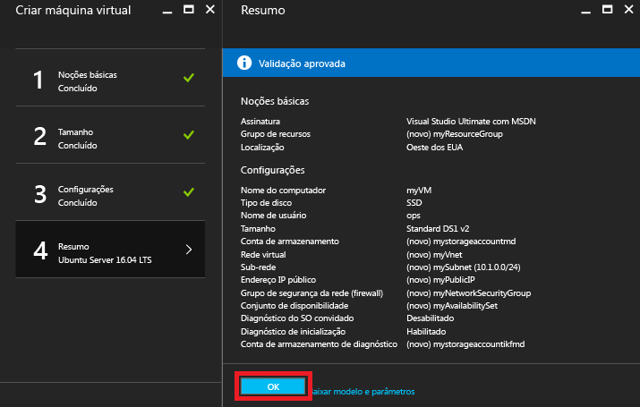
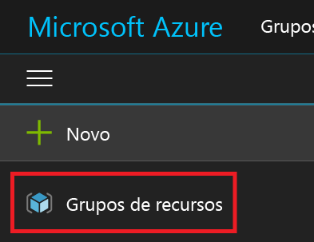
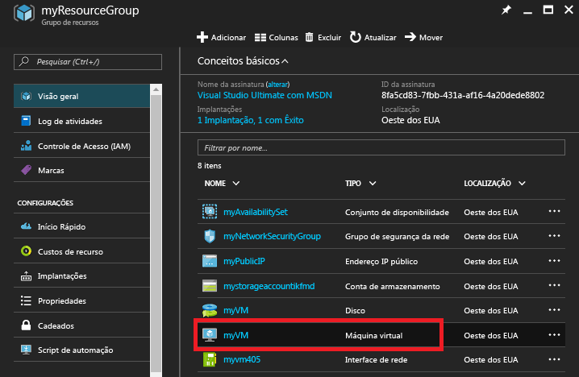
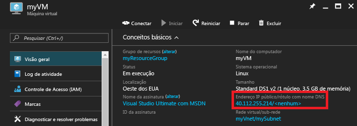

# <a name="create-a-linux-vm-on-azure-using-the-portal"></a>Criar uma VM do Linux no Azure usando o Portal
Este artigo mostra a você como usar o [Portal do Azure](https://portal.azure.com/) para criar uma Máquina Virtual do Linux.

Esses requisitos são:

* [uma conta do Azure](https://azure.microsoft.com/pricing/free-trial/)
* [arquivos de chave SSH pública e privada](virtual-machines-linux-mac-create-ssh-keys.md?toc=%2fazure%2fvirtual-machines%2flinux%2ftoc.json)

## <a name="sign-in"></a>Entrar
Entre no portal do Azure com sua identidade de conta do Azure. Clique em **+ Novo** no canto superior esquerdo:



## <a name="choose-vm"></a>Escolher VM
Clique em **Computar** no **Marketplace**, então selecione **Ubuntu Server 16.04 LTS** na lista de imagens **Aplicativos em Destaque**.  Verifique na parte inferior se o modelo de implantação é `Resource Manager` e clique em **Criar**.



## <a name="enter-vm-options"></a>Inserir opções de VM
Na página **Noções Básicas** , insira:

* um nome para a máquina virtual
* o tipo de disco de VM (SSD, por padrão, ou HDD)
* um nome de usuário para o usuário administrador
* defina o **Tipo de Autenticação** como **Chave pública SSH**
* sua chave pública SSH como uma cadeia de caracteres (de seu diretório `~/.ssh/`)
* um nome de grupo de recursos ou selecione um grupo de recursos existente

e clique em **OK** para continuar. A folha deve ser semelhante à seguinte captura de tela:



## <a name="choose-vm-size"></a>Escolher tamanho da VM
Escolha um tamanho de VM. Nos exemplos a seguir, escolha **DS1_V2 Standard**, que instala o Ubuntu em um SSD Premium. O **S** no tamanho da VM significa suporte a SSD. Clique em **Selecionar** para definir as configurações.



## <a name="storage-and-network"></a>Armazenamento e rede
Na folha **Configurações**, você pode optar por usar Azure Managed Disks para sua VM. A configuração padrão atual é usar discos não gerenciados. Os Azure Managed Disks são tratados pela plataforma do Azure e não exigem nenhuma preparação ou local para armazenamento. Para saber mais sobre Azure Managed Disks, veja [Visão geral dos Azure Managed Disks](../storage/storage-managed-disks-overview.md). Para discos não gerenciados, você precisa criar ou selecionar uma conta de armazenamento para seus discos rígidos virtuais:



Se você optar por usar os Azure Managed Disks, não haverá nenhuma opção de armazenamento adicional para configurar, conforme mostrado no exemplo a seguir:



Deixe o resto das configurações de rede como padrão.

## <a name="confirm-vm-settings-and-launch"></a>Confirmar as configurações e o início de máquina virtual
Confirme as configurações para sua nova VM Ubuntu e clique em **OK**.



## <a name="select-the-vm-resource"></a>Selecionar o recurso de máquina virtual
Abra a home page do Portal e selecione **Grupos de recursos** no menu do canto superior esquerdo. Se necessário, clique nas três barras na parte superior do menu para expandir a lista, da seguinte maneira:



Selecione o grupo de recursos, então clique em sua nova VM:



## <a name="find-the-public-ip"></a>Localizar o IP público
Exiba o **endereço IP público** atribuído à sua VM:



## <a name="ssh-to-the-vm"></a>SSH para a VM
SSH para o IP público usando sua chave pública SSH.  Em uma estação de trabalho Mac ou Linux, você pode fazer SSH diretamente do Terminal. Se você estiver em uma estação de trabalho do Windows, precisará usar PuTTY, MobaXTerm ou Cygwin SSH para Linux.  Se você ainda não tiver feito isso, aqui está um documento que prepara sua estação de trabalho do Windows para SSH para Linux.

[Como usar chaves SSH com o Windows no Azure](virtual-machines-linux-ssh-from-windows.md?toc=%2fazure%2fvirtual-machines%2flinux%2ftoc.json)

```
ssh -i ~/.ssh/azure_id_rsa ops@40.112.255.214
```

## <a name="next-steps"></a>Próximas etapas
Agora que você criou uma VM Linux rapidamente a ser usada para fins de teste ou demonstração, Para criar uma VM do Linux personalizada para sua infraestrutura, você pode seguir qualquer um destes artigos.

* [Criar uma VM do Linux no Azure usando Modelos](virtual-machines-linux-cli-deploy-templates.md?toc=%2fazure%2fvirtual-machines%2flinux%2ftoc.json)
* [Criar uma VM do Linux Protegida por SSH no Azure usando Modelos](virtual-machines-linux-create-ssh-secured-vm-from-template.md?toc=%2fazure%2fvirtual-machines%2flinux%2ftoc.json)
* [Criar uma VM do Linux usando a CLI do Azure](virtual-machines-linux-create-cli-complete.md?toc=%2fazure%2fvirtual-machines%2flinux%2ftoc.json)


