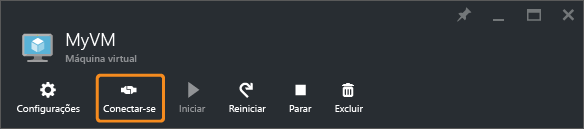

<properties
	pageTitle="Conectar uma VM do Windows Server | Microsoft Azure"
	description="Saiba como se conectar e fazer logon em uma VM do Windows usando o portal do Azure e o modelo de implantação do Gerenciador de Recursos."
	services="virtual-machines-windows"
	documentationCenter=""
	authors="cynthn"
	manager="timlt"
	editor="tysonn"
	tags="azure-resource-manager"/>

<tags
	ms.service="virtual-machines-windows"
	ms.workload="infrastructure-services"
	ms.tgt_pltfrm="vm-windows"
	ms.devlang="na"
	ms.topic="get-started-article"
	ms.date="05/05/2016"
	ms.author="cynthn"/>

# Como se conectar e fazer logon em uma máquina virtual do Azure executando o Windows 

Você usará o botão **Conectar** no portal do Azure para iniciar uma sessão da Área de Trabalho Remota (RDP). Primeiro, conecte-se à máquina virtual, em seguida, faça logon.

## Conectar-se à máquina virtual

1. Se ainda não tiver feito isso, entre no [portal do Azure](https://portal.azure.com/).

2.	No menu Hub, clique em **Máquinas Virtuais**.

3.	Selecione a máquina virtual na lista.

4. Na folha da máquina virtual, clique em **Conectar**.

	
	
 > [AZURE.TIP] Se o botão 'Conectar' no portal estiver acinzentado e você não estiver conectado ao Azure por meio de uma [Rota Expressa](../expressroute/expressroute-introduction.md)ou conexão [VPN Site a Site](../vpn-gateway/vpn-gateway-howto-site-to-site-resource-manager-portal.md), precisará criar e atribuir à VM um endereço IP público antes de usar o RDP. Você pode ler mais sobre os [endereços IP públicos no Azure](../virtual-network/virtual-network-ip-addresses-overview-arm.md).

## Faça logon na máquina virtual

[AZURE.INCLUDE [virtual-machines-log-on-win-server](../../includes/virtual-machines-log-on-win-server.md)]

## Próximas etapas

Se você tiver problemas ao tentar se conectar, consulte [Solucionar Problemas de conexões da Área de Trabalho Remota para uma Máquina Virtual do Azure baseada no Windows](virtual-machines-windows-troubleshoot-rdp-connection.md). Este artigo orienta você no diagnóstico e na solução de problemas comuns.

<!---HONumber=AcomDC_0518_2016-->