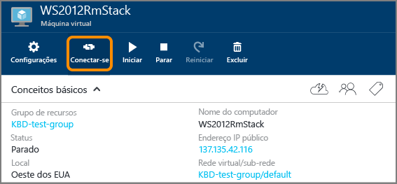

<properties
	pageTitle="Faça logon em uma VM do Windows Server | Microsoft Azure"
	description="Saiba como fazer logon em uma VM do Windows Server usando o portal do Azure e o modelo de implantação do Gerenciador de Recursos."
	services="virtual-machines-windows"
	documentationCenter=""
	authors="cynthn"
	manager="timlt"
	editor="tysonn"
	tags="azure-resource-manager"/>

<tags
	ms.service="virtual-machines-windows"
	ms.workload="infrastructure-services"
	ms.tgt_pltfrm="vm-windows"
	ms.devlang="na"
	ms.topic="get-started-article"
	ms.date="01/21/2016"
	ms.author="cynthn"/>

# Como fazer logon em uma máquina virtual executando o Windows Server 

[AZURE.INCLUDE [learn-about-deployment-models](../../includes/learn-about-deployment-models-rm-include.md)] [classic deployment model](virtual-machines-windows-classic-connect-logon.md).

Você usará o botão **Conectar** no portal do Azure para iniciar uma sessão de Área de Trabalho Remota. Primeiro, conecte-se à máquina virtual, em seguida faça logon.

## Conectar-se à máquina virtual

1. Se ainda não tiver feito isso, entre no [portal do Azure](https://portal.azure.com/).

2.	No menu Hub, clique em **Máquinas Virtuais**.

3.	Selecione a máquina virtual na lista.

4. Na folha da máquina virtual, clique em **Conectar**.

	

## Faça logon na máquina virtual

[AZURE.INCLUDE [virtual-machines-log-on-win-server](../../includes/virtual-machines-log-on-win-server.md)]

## Solucionar problemas

Se as dicas sobre como fazer logon não forem úteis para resolver seu problema, veja [Solucionar problemas de conexões da Área de Trabalho Remota com uma Máquina Virtual do Azure baseada em Windows](virtual-machines-windows-troubleshoot-rdp-connection.md). Este artigo orienta você no diagnóstico e na solução de problemas comuns.

<!----HONumber=AcomDC_0323_2016-->