# Experimentar a instalação de uma função em sua VM do Windows
Quando você tiver sua primeira VM (máquina virtual) em funcionamento, passe para a instalação de software e serviços. Para este tutorial, vamos usar o Gerenciador de Servidores na VM do Windows Server para instalar o IIS. Em seguida, criaremos um NSG (Grupo de Segurança de Rede) usando o Portal do Azure para abrir a porta 80 para tráfego IIS. 

Se você ainda não criou sua primeira VM, volte para [Criar sua primeira máquina virtual do Windows no portal do Azure](virtual-machines-windows-hero-tutorial.md?toc=%2fazure%2fvirtual-machines%2fwindows%2ftoc.json) antes de continuar com este tutorial.

## Verificar se a VM está em execução
1. Abra o [Portal do Azure](https://portal.azure.com).
2. No menu hub, clique em **Máquinas Virtuais**. Selecione a máquina virtual na lista.
3. Se o status for **Parado (Desalocado)**, clique no botão **Iniciar** na folha **Essentials** da VM. Se o status indicar **Em Execução**, passe para a próxima etapa.

## Conectar-se à máquina virtual e entrar
1. No menu hub, clique em **Máquinas Virtuais**. Selecione a máquina virtual na lista.
2. Na folha da máquina virtual, clique em **Conectar**. Isso cria e baixa um arquivo .rdp (Protocolo de Área de Trabalho Remota) que é como um atalho para se conectar ao seu computador. Convém salvar o arquivo em sua área de trabalho para facilitar o acesso. **Abra** esse arquivo para conectar sua VM.
   
    
3. Você receberá um aviso de que o .rdp é proveniente de um editor desconhecido. Isso é normal. Na janela de Área de Trabalho Remota, clique em **Conectar** para continuar.
   
    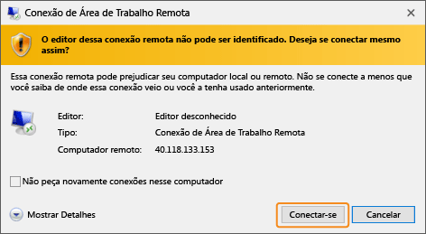
4. Na janela de Segurança do Windows, digite o nome de usuário e a senha para a conta local que você criou durante a criação da VM. O nome de usuário é inserido como *vmname*&#92;*nome de usuário*, depois, clique em **OK**.
   
    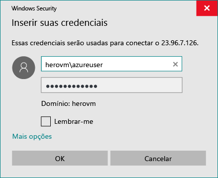
5. Você receberá um aviso de que o certificado não pode ser verificado. Isso é normal. Clique em **Sim** para verificar a identidade da máquina virtual e concluir o logon.
   
   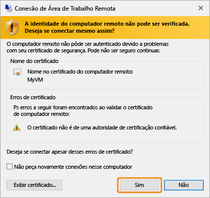

Se você tiver problemas ao tentar conectar, consulte [Solucionar problemas de conexões da Área de Trabalho Remota com uma Máquina Virtual do Azure baseada no Windows](virtual-machines-windows-troubleshoot-rdp-connection.md?toc=%2fazure%2fvirtual-machines%2fwindows%2ftoc.json).

## Instalar o IIS em sua VM
Agora que você está conectado à VM, iremos instalar uma função de servidor para que possa experimentar mais.

1. Abra o **Gerenciador de Servidores** se ainda não estiver aberto. Clique no menu **Iniciar** e em **Gerenciador de Servidores**.
2. No **Gerenciador de Servidores**, selecione **Servidor Local** no painel à esquerda. 
3. No menu, selecione **Gerenciar** > **Adicionar Funções e Recursos**.
4. No Assistente para Adicionar Funções e Recursos, na página **Tipo de Instalação**, escolha **Instalação baseada em função ou recurso**, em seguida, clique em **Próximo**.
   
    
5. Selecione a VM no pool de servidores e clique em **Próximo**.
6. Na página **Funções do Servidor**, selecione **Servidor Web (IIS)**.
   
    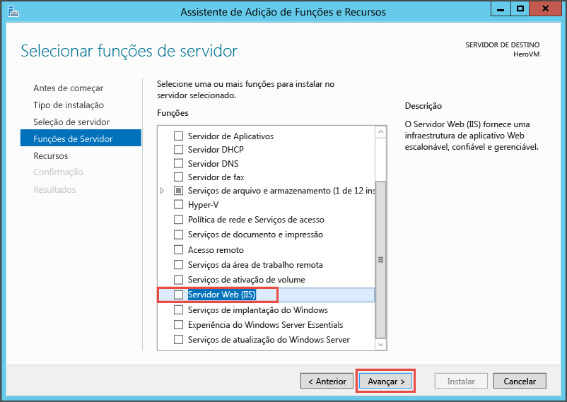
7. No menu pop-up para adicionar recursos necessários para o IIS, verifique se a opção **Incluir ferramentas de gerenciamento** está selecionada, em seguida, clique em **Adicionar Recursos**. Quando o pop-up fechar, clique em **Próximo** no assistente.
   
    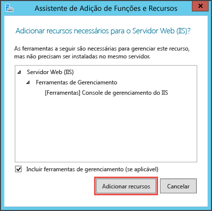
8. Na página de recursos, clique em **Próximo**.
9. Na página **Função do Servidor Web (IIS)**, clique em **Próximo**. 
10. Na página **Serviços da Função**,clique em **Próximo**. 
11. Na página **Confirmação**, clique em **Instalar**. 
12. Quando a instalação for concluída, clique em **Fechar** no assistente.

## Abrir a porta 80
Para sua VM aceitar o tráfego de entrada na porta 80, você precisa adicionar uma regra de entrada ao grupo de segurança da rede. 

1. Abra o [Portal do Azure](https://portal.azure.com).
2. Em **Máquinas virtuais** , selecione a VM criada.
3. Nas configurações das máquinas virtuais, selecione **Interfaces de rede** e, em seguida, selecione a interface de rede existente.
   
    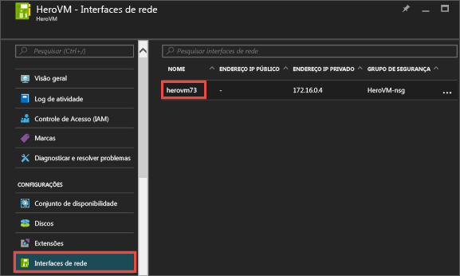
4. Em **Essentials** para a interface de rede, clique no **Grupo de Segurança da Rede**.
   
    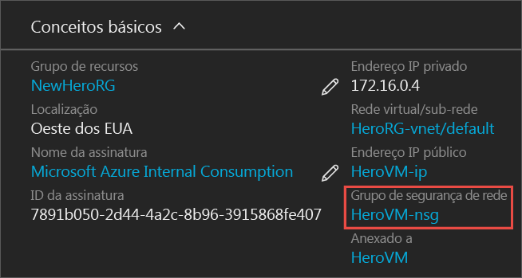
5. Na folha **Essentials** do NSG, você deve ter uma regra de entrada padrão existente para **default-allow-rdp**, que permite fazer logon na VM. Você adicionará outra regra de entrada para permitir o tráfego do IIS. Clique em **Regra de segurança de entrada**.
   
    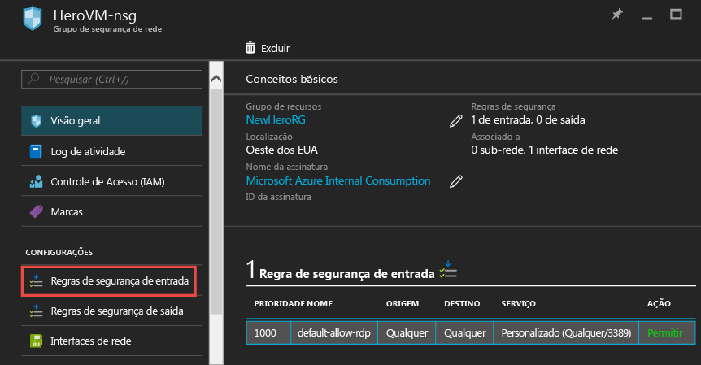
6. Nas **Regras de segurança de entrada**, clique em **Adicionar**.
   
    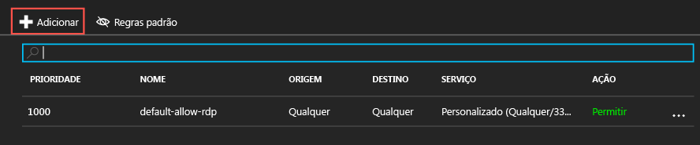
7. Nas **Regras de segurança de entrada**, clique em **Adicionar**. Digite **80** no intervalo de portas e verifique se **Permitir** está selecionado. Quando terminar, clique em **OK**.
   
    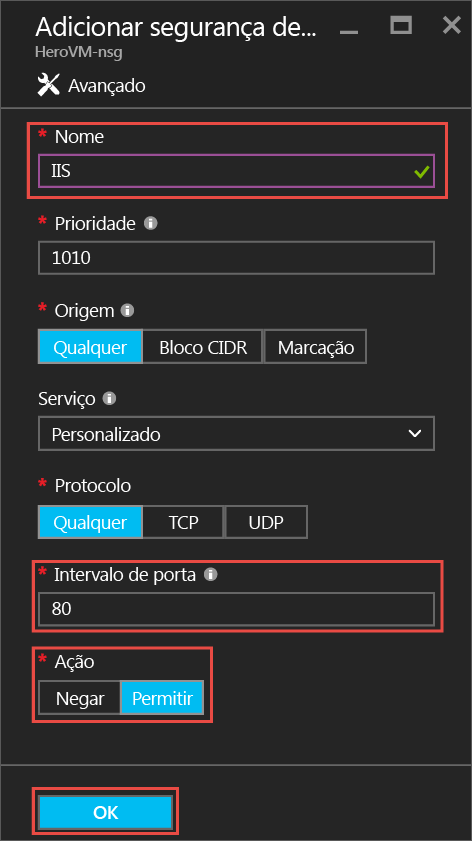

Para obter mais informações sobre os NSGs, regras de entrada e saída, consulte [Permitir o acesso externo à sua VM usando o portal do Azure](virtual-machines-windows-nsg-quickstart-portal.md?toc=%2fazure%2fvirtual-machines%2fwindows%2ftoc.json)

## Conectar ao site do IIS padrão
1. No portal do Azure, clique em **Máquinas virtuais** , em seguida, selecione sua VM.
2. Na folha **Essentials**, copie seu **Endereço IP público**.
   
    
3. Abra um navegador e na barra de endereços, digite seu endereço IP público assim: http://<publicIPaddress> e clique em **Enter** para ir para esse endereço.
4. Seu navegador deve abrir a página Web padrão do IIS. É algo semelhante a isto:
   
    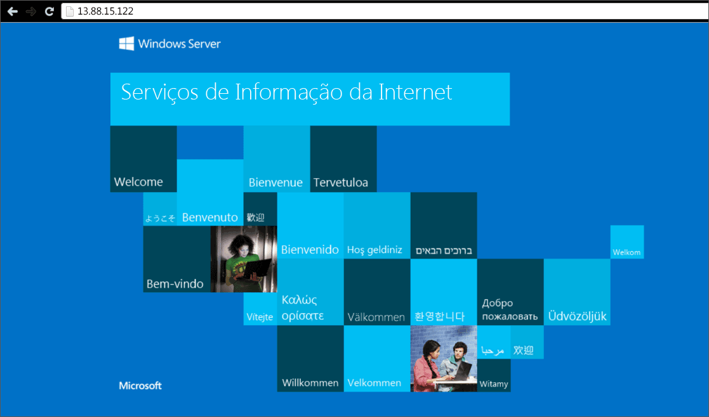

## Próximas etapas
* Você também pode experimentar [anexar um disco de dados](virtual-machines-windows-attach-disk-portal.md?toc=%2fazure%2fvirtual-machines%2fwindows%2ftoc.json) à sua máquina virtual. Os discos de dados oferecem mais armazenamento para sua máquina virtual.

<!--HONumber=Nov16_HO3-->

