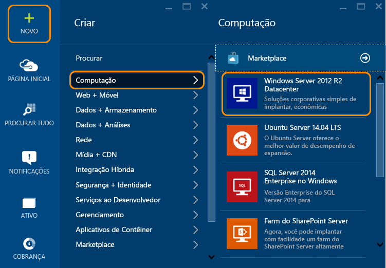
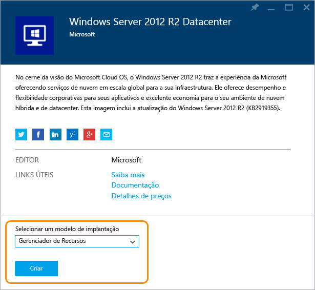
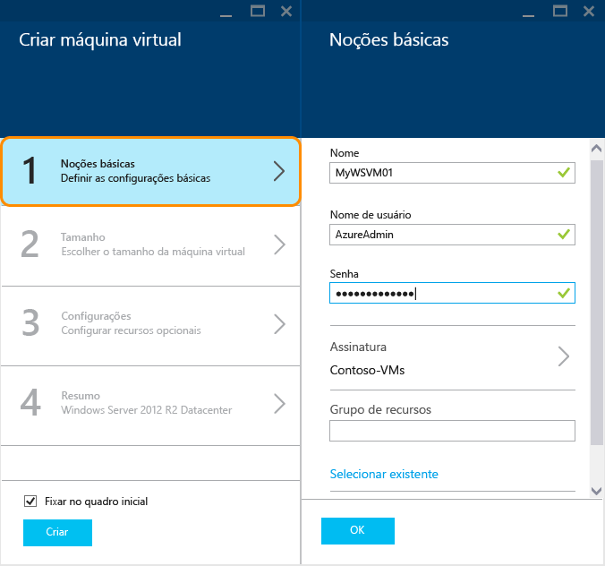
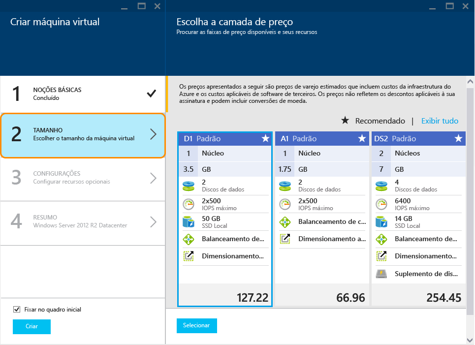
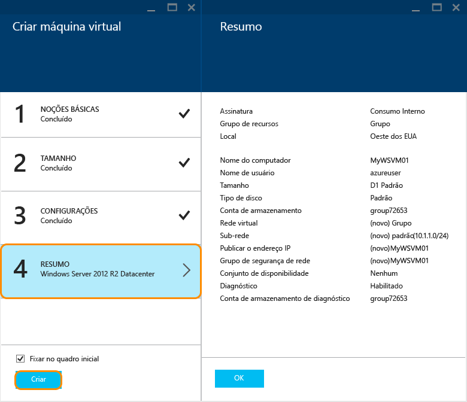

<properties
	pageTitle="Criar uma VM do Windows no Portal do Azure | Microsoft Azure"
	description="Saiba como criar uma máquina virtual do Windows usando o portal do Azure"
	keywords="máquina virtual do Windows, criar uma máquina virtual, máquina virtual, configurando uma máquina virtual"
	services="virtual-machines-windows"
	documentationCenter=""
	authors="cynthn"
	manager="timlt"
	editor=""
	tags="azure-resource-manager"/>
<tags
	ms.service="virtual-machines-windows"
	ms.workload="infrastructure-services"
	ms.tgt_pltfrm="vm-windows"
	ms.devlang="na"
	ms.topic="hero-article"
	ms.date="04/14/2016"
	ms.author="cynthn"/>

# Criar uma máquina virtual do Windows no Portal do Azure

Este tutorial mostra como é fácil criar uma VM do Windows em apenas alguns minutos usando o portal do Azure. Usamos uma imagem do Windows Server 2012 R2 Datacenter como exemplo, mas ela é apenas uma das muitas imagens que o Azure oferece. Suas opções de imagem dependem de sua assinatura. Por exemplo, imagens da área de trabalho podem estar disponíveis para [assinantes do MSDN](https://azure.microsoft.com/pricing/member-offers/msdn-benefits-details/?WT.mc_id=A261C142F).

Se não tiver uma assinatura do Azure, você poderá criar uma [conta gratuita](https://azure.microsoft.com/free/) em apenas alguns minutos.

## Passo a passo em vídeo

Aqui está um [passo a passo em vídeo](https://channel9.msdn.com/Blogs/Azure-Documentation-Shorts/Create-A-Virtual-Machine-Running-Windows-In-The-Azure-Preview-Portal) deste tutorial.

## Selecione a imagem de máquina virtual do Windows 2012 R2 do marketplace

1. Entre no [Portal do Azure](https://portal.azure.com).

2. No menu Hub, clique em **Novo** > **Computação** > **Windows Server 2012 R2 Datacenter**.

	

3. Na página **Windows Server 2012 R2 Datacenter**, em **Selecionar um modelo de implantação**, selecione **Gerenciador de Recursos**. Clique em **Criar**.

	

## Criar sua primeira máquina virtual do Windows

Depois de selecionar a imagem, você poderá usar as configurações padrão do Azure para a maior parte das configurações e criar rapidamente a máquina virtual.

1. Na folha **Criar máquina virtual**, clique em **Noções básicas**.

2. Insira um **Nome** para a máquina virtual. O nome não pode conter caracteres especiais.

3. Insira um **Nome de usuário** administrativo e uma **Senha** forte. A senha deve ter entre 8 e 123 caracteres e ter pelo menos 3 dos seguintes: um caractere minúsculo, um caractere maiúsculo, um número e um caractere especial. **Você precisa do nome do usuário e da senha para se conectar à máquina virtual**.

4. Se você tiver mais de uma assinatura, especifique a da nova máquina virtual. Selecione um [Grupo de recursos](../resource-group-overview/#resource-groups) novo ou existente e um **Local** de datacenter do Azure, como **Oeste dos EUA**.

	

	
2. Clique em **Tamanho** e selecione um tamanho de máquina virtual apropriado para suas necessidades. Cada tamanho especifica o número de núcleos de computação, memória e outros recursos, como suporte para Armazenamento Premium, o que afeta o preço. O Azure recomenda automaticamente determinados tamanhos, dependendo da imagem escolhida.

	

	>[AZURE.NOTE] O Armazenamento Premium está disponível para máquinas virtuais de série DS em determinadas regiões. O Armazenamento Premium é a melhor opção de armazenamento para cargas de trabalho de uso intensivo de dados, como um banco de dados. Para obter detalhes, confira [Armazenamento Premium: armazenamento de alto desempenho para as cargas de trabalho das máquinas virtuais do Azure](../storage/storage-premium-storage.md).

3. Clique em **Configurações** para ver as configurações de rede e o armazenamento da nova máquina virtual. Para uma primeira máquina virtual, geralmente você pode aceitar as configurações padrão. Se tiver selecionado um tamanho de máquina virtual compatível, você poderá experimentar o Armazenamento Premium, selecionando **Premium (SSD)** em **Tipo de disco**.

	

6. Clique em **Resumo** para examinar suas opções de configuração. Quando terminar a revisão ou a atualização das configurações, clique em **Criar**.

	

8. Enquanto o Azure cria a máquina virtual, você pode acompanhar o andamento em **Máquinas Virtuais**, no menu do hub.

## Conectar-se à máquina virtual e fazer logon

1. Se ainda não tiver feito isso, entre no [portal do Azure](https://portal.azure.com/).

2.	No menu Hub, clique em **Máquinas Virtuais**.

3.	Selecione a máquina virtual na lista.

4. Na folha da máquina virtual, clique em **Conectar**.

	

[AZURE.INCLUDE [virtual-machines-log-on-win-server](../../includes/virtual-machines-log-on-win-server.md)]

Se você tiver problemas ao tentar se conectar, confira [Solucionar Problemas de conexões da Área de Trabalho Remota para uma Máquina Virtual do Azure baseada no Windows](virtual-machines-windows-troubleshoot-rdp-connection.md).

Você agora pode trabalhar com a máquina virtual, como faria com qualquer outro servidor.

## Próximas etapas

* Você também pode [criar uma VM do Windows usando o Powershell](virtual-machines-windows-ps-create.md) ou [criar uma máquina virtual do Linux](virtual-machines-linux-quick-create-cli.md) usando a CLI do Azure.

<!---HONumber=AcomDC_0427_2016-->