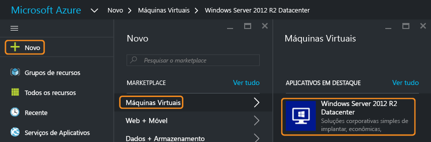
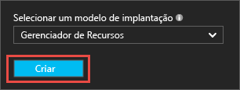
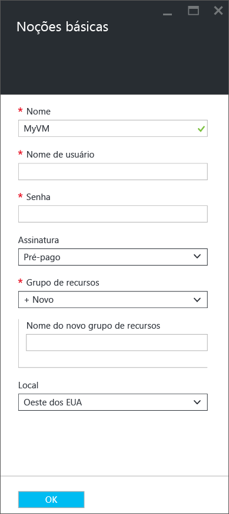
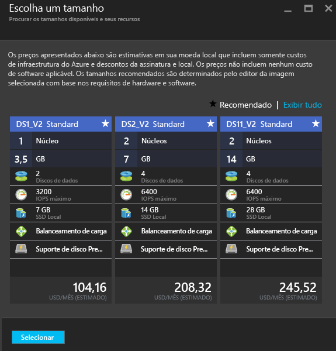
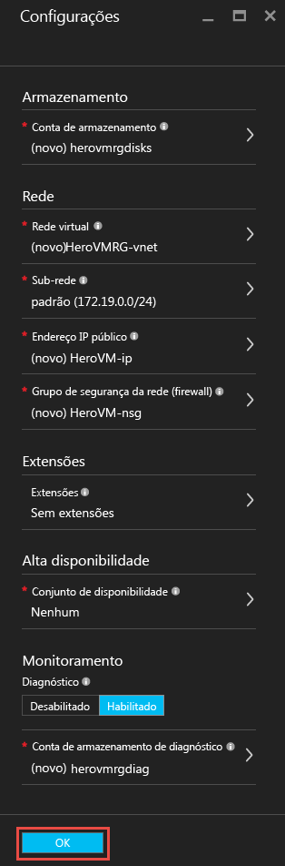
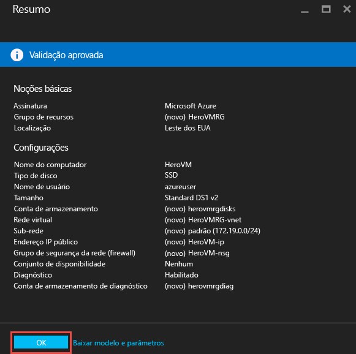
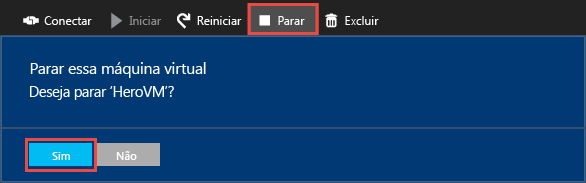

# Criar sua primeira máquina virtual do Windows no Portal do Azure
Este tutorial mostra como é fácil criar uma máquina virtual (VM) do Windows em poucos minutos usando o portal do Azure.

Se você não tiver uma assinatura do Azure, crie uma [conta gratuita](https://azure.microsoft.com/free/) antes de começar.

## Escolher a imagem de VM no Marketplace
Usamos uma imagem do Windows Server 2012 R2 Datacenter como exemplo, mas ela é apenas uma das muitas imagens que o Azure oferece. Suas opções de imagem dependem de sua assinatura. Por exemplo, algumas imagens da área de trabalho estão disponíveis para [os assinantes do MSDN](https://azure.microsoft.com/pricing/member-offers/msdn-benefits-details/?WT.mc_id=A261C142F).

1. Entre no [Portal do Azure](https://portal.azure.com).
2. No menu do hub, clique em **Novo** > **Máquinas Virtuais** > **Windows Server 2012 R2 Datacenter**.
   
    
3. Na folha **Windows Server 2012 R2 Datacenter**, em **Selecionar um modelo de implantação**, verifique se o **Gerenciador de Recursos** está selecionado. Clique em **Criar**.
   
    

## Criar sua primeira máquina virtual do Windows
Depois de selecionar a imagem, você poderá usar as configurações padrão e criar rapidamente a máquina virtual.

1. Na folha **Básico**, insira um **Nome** para a máquina virtual. O nome deve ter de 1 a 15 caracteres e não pode conter caracteres especiais.
2. Insira um **Nome de usuário**, e uma **Senha** forte que será usada para criar uma conta local na VM. A conta local é usada para conectar e gerenciar a VM.
   
    A senha deve ter de 8 a 123 caracteres e atender três dos quatro requisitos de complexidade a seguir: um caractere minúsculo, um caractere maiúsculo, um número e um caractere especial. Confira mais sobre os [requisitos de nome de usuário e senha](virtual-machines-windows-faq.md#what-are-the-username-requirements-when-creating-a-vm).
3. Selecione um [Grupo de recursos](../resource-group-overview.md#resource-groups) existente ou digite o nome de um novo. Digite um **Local** do datacenter do Azure, por exemplo, **Oeste dos EUA**.
4. Quando terminar, clique em **OK** para continuar na próxima seção.
   
    
5. Escolha um [tamanho](virtual-machines-windows-sizes.md) de VM, em seguida, clique em **Selecionar** para continuar.
   
    
6. Na folha **Configurações**, você pode alterar as opções de rede e armazenamento. Para este tutorial, aceite as configurações padrão. Se você selecionou um tamanho de máquina virtual compatível, poderá experimentar o Armazenamento Premium do Azure selecionando **Premium (SSD)** em **Tipo de disco**. Quando terminar de fazer as alterações, clique em **OK**.
   
    
7. Clique em **Resumo** para examinar suas opções. Quando você vir a mensagem **Validação passada**, clique em **OK**.
   
    
8. Enquanto o Azure cria a máquina virtual, você pode acompanhar o andamento em **Máquinas Virtuais** no menu do hub.

## Conectar a máquina virtual e fazer logon
1. No menu do hub, clique em **Máquinas Virtuais**.
2. Selecione a máquina virtual na lista.
3. Na folha da máquina virtual, clique em **Conectar**. Isso cria e baixa um arquivo .rdp (Protocolo de Área de Trabalho Remota) que é como um atalho para se conectar ao seu computador. Convém salvar o arquivo em sua área de trabalho para facilitar o acesso. **Abra** esse arquivo para conectar sua VM.
   
    
4. Você receberá um aviso de que o .rdp é proveniente de um editor desconhecido. Isso é normal. Na janela de Área de Trabalho Remota, clique em **Conectar** para continuar.
   
    
5. Na janela de Segurança do Windows, digite o nome de usuário e a senha para a conta local que você criou durante a criação da VM. O nome de usuário é inserido como *vmname*& #92;*nome de usuário*, depois, clique em **OK**.
   
    
6. Você receberá um aviso de que o certificado não pode ser verificado. Isso é normal. Clique em **Sim** para verificar a identidade da máquina virtual e concluir o logon.
   
   

Se você tiver problemas ao tentar conectar, consulte [Solucionar problemas de conexões da Área de Trabalho Remota com uma Máquina Virtual do Azure baseada no Windows](virtual-machines-windows-troubleshoot-rdp-connection.md).

Agora, você pode trabalhar com a máquina virtual como faria com qualquer outro servidor.

## Opcional: Parar a VM
É aconselhável interromper a VM para não incorrer em encargos quando você não a estiver usando. Basta clicar em **Parar**, em seguida, clique em **Sim**.

Clique no botão **Iniciar** para reiniciar a VM quando você estiver pronto para usá-la novamente.

## Próximas etapas
* Você pode fazer experiências com sua nova VM [instalando o IIS](virtual-machines-windows-hero-role.md). Este tutorial também mostra como abrir a porta 80 para o tráfego da Web de entrada usando um grupo de segurança de rede (NSG).
* Você também pode [criar uma VM do Windows usando o PowerShell](virtual-machines-windows-ps-create.md) ou [criar uma máquina virtual do Linux](virtual-machines-linux-quick-create-cli.md) usando a CLI do Azure.
* Se você estiver interessado na automatização das implantações, consulte [Criar uma máquina virtual do Windows usando um modelo do Resource Manager](virtual-machines-windows-ps-template.md).

<!----HONumber=AcomDC_0912_2016--->