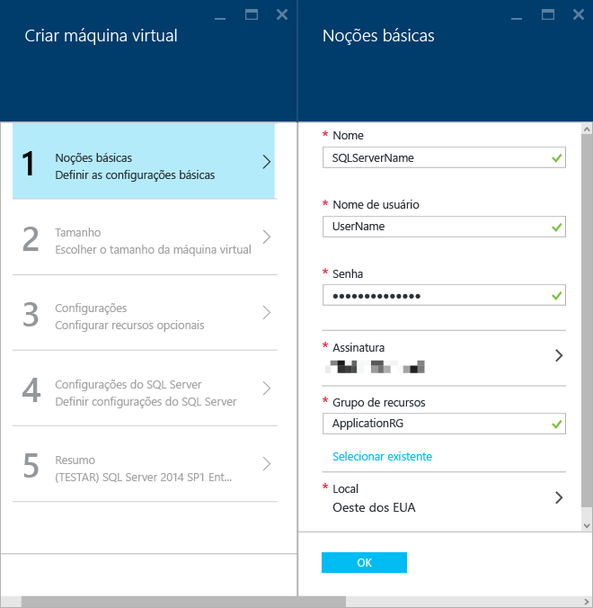

<properties
	pageTitle="Provisionar uma máquina virtual do SQL Server no Portal do Azure | Microsoft Azure"
	description="Criar uma máquina virtual do SQL Server no modo de Gerenciador de Recursos do Azure. Este tutorial usa principalmente a interface do usuário e ferramentas em vez de scripts."
	services="virtual-machines-windows"
	documentationCenter="na"
	authors="MikeRayMSFT"
    editor=""
	manager="jeffreyg"
	tags="azure-resource-manager" />

<tags
	ms.service="virtual-machines-windows"
	ms.devlang="na"
	ms.topic="article"
	ms.tgt_pltfrm="vm-windows-sql-server"
	ms.workload="infrastructure-services"
	ms.date="03/24/2016"
	ms.author="mikeray" />

# Provisionar uma máquina virtual do SQL Server no Portal do Azure

## Visão geral

Este tutorial completo mostra como provisionar uma máquina virtual do Azure no portal usando o modelo do Gerenciador de Recursos do Azure e como configurar o SQL Server de um modelo na Galeria do Azure.

[AZURE.INCLUDE [learn-about-deployment-models](../../includes/learn-about-deployment-models-rm-include.md)]modelo de implantação clássico.

A galeria de VMs (máquinas virtuais) do Azure inclui várias imagens que contêm o Microsoft SQL Server. Você pode selecionar uma das imagens de VM da galeria e, com apenas alguns cliques, provisionar a VM para o ambiente do Azure.

Neste tutorial, você irá:

- [Conectar-se ao Portal do Azure e provisionar uma imagem de VM do SQL a partir da galeria com o modelo de implantação do Gerenciador de Recursos](#Provision)

- [Definir as configurações da máquina virtual e do SQL Server](#ConfigureVM)

- [Abrir a máquina virtual usando a Área de Trabalho Remota](#Open)

- [Conectar-se à instância do SQL Server usando o SQL Server Management Studio em outro computador](#Connect)

- [Próximas etapas](#Next)

Este tutorial presume que você já tenha uma conta do Azure. Se você não tiver uma conta do Azure, visite [Avaliação gratuita do Azure](https://azure.microsoft.com/pricing/free-trial/).

## <a id="Provision">Provisionar uma imagem de VM SQL da galeria com o modelo de implantação do Gerenciador de Recursos

1. Faça logon no [portal do Azure](https://portal.azure.com) usando sua conta.
1. No Portal do Azure, clique em **+Novo**. O portal abrirá a folha **Novo**. Os modelos de VM do SQL Server estão no grupo **Computação** do Marketplace.

1. Na folha **Novo**, clique em **Computação**.
1. Para ver todos os tipos de recursos na folha **Computação**, clique em **Ver todos**.     
1. Em **Servidores de banco de dados**, clique em **SQL Server** para ver todos os modelos disponíveis para SQL Server. Talvez você precise rolar a tela para baixo para localizar **Servidores de banco de dados**.
1. 	Cada modelo identifica uma versão do SQL Server e um sistema operacional. Selecione uma dessas imagens da lista para exibir uma folha contendo seus detalhes.
1.	A folha de detalhes fornece uma descrição da imagem dessa máquina virtual e permite a seleção de um modelo de implantação. Em **Selecionar um modelo de implantação**, selecione **Gerenciador de Recursos** e clique em **Criar**.     

## <a id="ConfigureVM"> Configurar a VM
No Portal do Azure, há cinco folhas para configuração de uma máquina virtual do SQL Server.

1.	Definir as configurações básicas
1.	Escolher o tamanho da máquina virtual
1.	Definir as configurações da máquina virtual
1.	Configurar o SQL Server
1.	Examinar o resumo

## 1\. Definir as configurações básicas
Na folha **Criar Máquina Virtual**, em **Noções Básicas**, forneça as seguintes informações:

* Um **Nome** de máquina virtual exclusivo.
* Na caixa **Nome de usuário**, digite um nome de usuário exclusivo para a conta de administrador local da máquina. Essa conta também será membro da função de servidor fixa sysadmin do SQL Server.
* Na caixa **Senha**, digite uma senha forte.
* Se você tiver várias assinaturas, verifique se a assinatura é a correta para a VM que você está prestes a compilar.
* Na caixa **Grupo de recursos**, digite um nome para o grupo de recursos. Como alternativa, para usar um grupo de recursos existente, clique em **Selecionar existente**. Um grupo de recursos é uma coleção de serviços relacionados no Azure. Para saber mais sobre grupos de recursos, confira [Visão geral do Azure Resource Manager](../resource-group-overview.md). Verifique se **Local** está correto para as suas necessidades.
* Clique em **OK** para salvar as configurações.  

>  

## 2\. Escolher o tamanho da máquina virtual
Na folha **Criar Máquina Virtual**, em **Tamanho**, escolha um tamanho de máquina virtual. O Portal do Azure exibirá os tamanhos recomendados. Para saber mais sobre os tamanhos de máquinas virtuais, confira [Tamanhos de máquinas virtuais](virtual-machines-linux-sizes.md). Os tamanhos têm base no modelo selecionado. O tamanho calcula o custo mensal para execução da VM. Selecione um tamanho de VM para seu servidor. Para saber mais sobre os tamanhos de VM do SQL Server, confira as [Práticas recomendadas de desempenho para o SQL Server em máquinas virtuais do Azure](virtual-machines-windows-classic-sql-perf.md).

## 3\. Definir as configurações da máquina virtual
Na folha **Criar Máquina Virtual**, em **Configurações**, configure o armazenamento do Azure, a rede e o monitoramento para a máquina virtual.

- Em **Armazenamento**, especifique um tipo de disco. Armazenamento Premium é recomendado para cargas de trabalho de produção.

>[AZURE.NOTE] O Armazenamento Premium está habilitado por padrão. Isso redimensiona automaticamente seu computador para um tamanho que dá suporte ao Armazenamento Premium. Se você desabilitar o Armazenamento Premium, sua seleção de tamanho de máquina anterior será usada.

- Em **Conta de armazenamento**, você pode aceitar o nome da conta de armazenamento provisionado automaticamente ou clicar em **Conta de armazenamento** para escolher uma conta existente e configurar o tipo de conta de armazenamento. Por padrão, o Azure cria uma nova conta de armazenamento com o armazenamento com redundância local.

- Em **Rede**, você pode aceitar os valores preenchidos automaticamente para os recursos ou clicar em cada recurso para configurar a **Rede virtual**, a **Sub-rede**, o **Endereço IP público** e o **Grupo de Segurança de Rede**. Por padrão, o Azure configura automaticamente esses valores.

- O Azure habilita o **Monitoramento** por padrão com a mesma conta de armazenamento designada para a VM. Você pode alterar essas configurações aqui.

- Em **Conjunto de disponibilidade**, especifique um conjunto de disponibilidade. Para a finalidade deste tutorial, selecione **nenhum**. Se você planeja configurar Grupos de Disponibilidade SQL AlwaysOn, configure a disponibilidade para evitar recriar a máquina virtual. Para obter mais informações, consulte [Gerenciar a Disponibilidade de Máquinas Virtuais](virtual-machines-windows-manage-availability.md).

## 4\. Configurar o SQL Server
Na folha **Criar Máquina Virtual** em **Configurar o SQL Server**, defina as configurações e otimizações específicas para o SQL Server. As configurações possíveis para o SQL Server incluem:

- Conectividade
- Autenticação
- Otimização de armazenamento
- Aplicação de patch
- Backups
- Integração do Cofre da Chave

### Conectividade
Em **Conectividade SQL**, especifique **Pública (Internet)** para permitir conexões com o SQL Server de máquinas ou serviços na Internet. Com essa opção selecionada, o Azure configurará automaticamente o firewall e o grupo de segurança de rede para permitir o tráfego na porta 1433.    

Para conectar-se ao SQL Server pela Internet, também será necessário habilitar a Autenticação do SQL Server.

>[AZURE.NOTE]Para garantir a segurança, restrinja a porta de origem usando o Grupo de Segurança de Rede. Para obter mais informações, consulte [O que é um NSG (Grupo de Segurança de Rede)?](../virtual-network/virtual-networks-nsg.md)

Se você preferir não permitir conexões com o Mecanismo de Banco de Dados pela internet automaticamente, escolha uma das seguintes opções:
- **Local (apenas dentro da VM)** para permitir conexões com o SQL Server somente de dentro da VM.
- **Privada (dentro da Rede Virtual)** para permitir conexões com o SQL Server de computadores ou serviços na mesma rede virtual.

A **porta** é padronizada para 1433. Você pode especificar um número de porta diferente. Para saber mais, confira [Connect to a SQL Server Virtual Machine (Resource Manager) | Microsoft Azure (Conectar-se a uma máquina virtual do SQL Server [Resource Manager] | Microsoft Azure)](virtual-machines-windows-sql-connect.md).

### Autenticação
Se você precisar de Autenticação do SQL Server, clique em **Habilitar** em **Autenticação do SQL**.

   

Se você habilitar a Autenticação do SQL Server, especifique um **Nome de logon** e **Senha**. Esse nome de usuário será um logon de Autenticação do SQL Server e membro da função de servidor fixa sysadmin. Confira [Escolher um modo de autenticação](http://msdn.microsoft.com/library/ms144284.aspx) para saber mais sobre os Modos de Autenticação. Por padrão, o SQL Server não permite a Autenticação do SQL Server. Nesse cenário, os administradores locais na máquina virtual podem se conectar à instância do SQL Server.

>[AZURE.NOTE] Se você pretende acessar o SQL Server pela Internet (ou seja, a opção de conectividade Pública), habilite a autenticação do SQL aqui. O acesso público ao SQL Server exige o uso da Autenticação do SQL.

### Otimização de armazenamento
Clique em **Configuração de armazenamento** para especificar os requisitos de armazenamento. Você pode especificar os requisitos como operações IOPs (entrada/saída por segundo), taxa de transferência em MB/s e tamanho total de armazenamento. Configure-os usando as escalas deslizantes. O portal calcula automaticamente o número de discos com base nesses requisitos.

Por padrão, o Azure otimiza o armazenamento para 5000 IOPs, 200 MB e 1 TB de espaço de armazenamento. Você pode alterar essas configurações de armazenamento com base na carga de trabalho. Em **Armazenamento otimizado para**, escolha uma das seguintes opções

- **Geral** é a configuração padrão e dá suporte para a maioria das cargas de trabalho.
- O processamento **Transacional** otimiza o armazenamento para cargas de trabalho OLTP tradicionais de banco de dados.
- O **data warehouse** otimiza o armazenamento para cargas de trabalho de análise e emissão de relatórios.

A imagem a seguir mostra a folha Configuração de armazenamento.    

>[AZURE.NOTE] Os limites de configuração do armazenamento dependem do tamanho da máquina virtual. Para saber mais, confira [Tamanhos para máquinas virtuais](virtual-machines-linux-sizes.md).

### Aplicação de patch
A **Aplicação de patch automatizada do SQL** está habilitada por padrão. A aplicação de patch automatizada permite que o Azure aplique patches automaticamente no SQL Server e no sistema operacional. Especifique um dia da semana, hora e duração de um período de manutenção. O Azure executará a aplicação do patch no período de manutenção. O agendamento do período de manutenção usa a localidade da VM para a hora. Se você não quiser que o Azure aplique automaticamente o patch no SQL Server e no sistema operacional, clique em **Desabilitar**.

   

Para saber mais, confira [Aplicação de patch automatizada para SQL Server em máquinas virtuais do Azure](virtual-machines-windows-classic-ps-sql-patch.md).

### Backups
Habilite backups automáticos de banco de dados para todos os bancos de dados em **Backup automatizado do SQL**. Ao habilitar o backup automatizado do SQL, é possível configurar o seguinte:

- Período de retenção do backup em dias
- Qual conta de armazenamento usar para backups
- Se deseja ou não criptografar o backup. Para criptografar o backup, clique em **Habilitar**. Se os backups automatizados estiverem criptografados, especifique uma senha. O Azure cria um certificado para criptografar os backups e usa a senha especificada para proteger esse certificado.

   

 Para obter mais informações, veja [Backup Automatizado para o SQL Server em Máquinas Virtuais do Azure](virtual-machines-windows-classic-ps-sql-backup.md).

### Integração do Cofre da Chave
Para armazenar segredos de segurança no Azure para criptografia, clique em **Integração do cofre de chaves do Azure** e clique em **Habilitar**.

   

A tabela a seguir lista os parâmetros necessários para configurar a integração do Cofre da Chave do Azure.

|PARÂMETRO|DESCRIÇÃO|EXEMPLO|
|----------|----------|-------|
|**URL do cofre da chave** | O local do cofre da chave.|https://contosokeyvault.vault.azure.net/ |
|**Nome de entidade AKV** |Nome de entidade de serviço do Active Directory do Azure Também é chamado de ID do Cliente. |fde2b411-33d5-4e11-af04eb07b669ccf2|
| **Segredo da entidade AKV**|A Integração AKV cria uma credencial no SQL Server, permitindo que a VM tenha acesso ao cofre da chave. Escolha um nome para essa credencial. | 9VTJSQwzlFepD8XODnzy8n2V01Jd8dAjwm/azF1XDKM=|
|**Nome da credencial**|Escolha um nome para identificar essa credencial.| mycred1|

Para saber mais, confira [Configure Azure Key Vault Integration for SQL Server on Azure VMs (Configurar a integração do Cofre de Chaves do Azure para o SQL em VMs do Azure)](virtual-machines-windows-classic-ps-sql-keyvault.md).

## 5\. Examinar o resumo
Examine o resumo e clique em **OK** para criar o SQL Server, o grupo de recursos e os recursos especificados para esta VM. Você pode monitorar a implantação do Portal do Azure. O botão **Notificações** na parte superior da tela mostra o status básico da implantação.

##<a id="Open"> Abrir a máquina virtual usando a Área de Trabalho Remota e concluir a instalação
Execute estas etapas para usar a Área de Trabalho Remota para abrir a máquina virtual:

1.	Após a compilação da VM do Azure, um ícone para a VM será exibido no painel do Azure. Clique no ícone para ver informações sobre a VM.
1.	Na parte superior da folha da VM, clique em **Conectar**. O navegador baixará um arquivo .rdp para a VM. Abra o arquivo .rdp.
1.	A Conexão de Área de Trabalho Remota mostrará uma notificação de que o publicador dessa conexão remota não pode ser identificado e perguntará se você deseja se conectar mesmo assim. Clique em **Conectar**.
1.	Na caixa de diálogo **Segurança do Windows**, clique em **Usar outra conta**. Em **Nome de usuário**, digite o <machine name><nome de usuário> especificado ao configurar a VM.

Depois de se conectar à máquina virtual do SQL Server, você pode iniciar o SQL Server Management Studio e conectar-se à Autenticação do Windows usando suas credenciais de administrador local. Isso também permite que você altere as configurações do firewall ou definições de configuração do SQL Server pós-provisionamento, caso necessário.

##<a id="Connect"> Conectar-se ao SQL Server pela Internet

Se você quiser se conectar ao seu mecanismo de banco de dados do SQL Server a partir da Internet, várias etapas deverão ser executadas, por exemplo, configurar o firewall, habilitar a autenticação do SQL Server e configurar o grupo de segurança de rede. Você deve ter uma regra de Grupo de Segurança de Rede para permitir o tráfego TCP na porta 1433.

Se você utiliza o portal para provisionar uma imagem de máquina virtual do SQL Server com o gerenciador de recursos, estas etapas foram realizadas quando você escolheu **Pública** como a opção de conectividade do SQL e habilitou a autenticação do SQL Server. No entanto, é necessário concluir algumas etapas restantes para acessar a instância do SQL Server pela Internet.

>[AZURE.NOTE] Se você não selecionou Pública durante o provisionamento, será necessário executar etapas adicionais para acessar a instância do SQL Server pela Internet. Para saber mais, confira [Connect to a SQL Server Virtual Machine (Resource Manager) | Microsoft Azure (Conectar-se a uma máquina virtual do SQL Server [Resource Manager] | Microsoft Azure)](virtual-machines-windows-sql-connect.md).

As etapas a seguir não serão necessárias se você só precisar acessar a Máquina Virtual localmente ou de dentro da mesma Rede Virtual.

> [AZURE.INCLUDE [Conectar-se ao SQL Server em um Gerenciador de Recursos de VM](../../includes/virtual-machines-sql-server-connection-steps-resource-manager.md)]

##<a id="Next">Próximas etapas
Para obter outras informações sobre como usar o SQL Server no Azure, veja [SQL Server em Máquinas Virtuais do Azure](virtual-machines-windows-classic-sql-overview.md).

<!-----------HONumber=AcomDC_0330_2016-->