<properties
	pageTitle="Provisionar uma máquina virtual do SQL Server | Microsoft Azure"
	description="Criar e conectar-se a uma máquina virtual do SQL Server no Azure usando o Portal. Este tutorial usa o modo Resource Manager."
	services="virtual-machines-windows"
	documentationCenter="na"
	authors="rothja"
	editor=""
	manager="jhubbard"
	tags="azure-resource-manager" />
<tags
	ms.service="virtual-machines-windows"
	ms.devlang="na"
	ms.topic="hero-article"
	ms.tgt_pltfrm="vm-windows-sql-server"
	ms.workload="infrastructure-services"
	ms.date="05/16/2016"
	ms.author="jroth" />

# Provisionar uma máquina virtual do SQL Server no Portal do Azure

> [AZURE.SELECTOR]
- [Portal](virtual-machines-windows-portal-sql-server-provision.md)
- [PowerShell](virtual-machines-windows-ps-sql-create.md)

Este tutorial completo mostra a você como usar o Portal do Azure para provisionar uma máquina virtual com o SQL Server em execução.

[AZURE.INCLUDE [learn-about-deployment-models](../../includes/learn-about-deployment-models-rm-include.md)]modelo de implantação clássico.

A galeria de VMs (máquinas virtuais) do Azure inclui várias imagens que contêm o Microsoft SQL Server. Com alguns cliques, você pode selecionar uma das imagens de VM do SQL da galeria e provisioná-la em seu ambiente do Azure.

Neste tutorial, você irá:

- [Selecionar uma imagem de VM do SQL na galeria](#select-a-sql-vm-image-from-the-gallery)
- [Configurar e criar a VM](#configure-the-vm)
- [Abrir a VM usando a Área de Trabalho Remota.](#open-the-vm-with-remote-desktop)
- [Conectar-se ao SQL Server remotamente](#connect-to-sql-server-remotely)

## Selecionar uma imagem de VM do SQL na galeria

1. Faça logon no [portal do Azure](https://portal.azure.com) usando sua conta.

	>[AZURE.NOTE] Se você não tiver uma conta do Azure, visite [Avaliação gratuita do Azure](https://azure.microsoft.com/pricing/free-trial/).

1. No Portal do Azure, clique em **Novo**. O portal abrirá a folha **Novo**. Os recursos de VM do SQL Server estão no grupo **Máquinas Virtuais** do Marketplace.

1. Na folha **Novo**, clique em **Máquinas Virtuais**.
1. Para ver todas as imagens disponíveis, clique em **Ver tudo** na folha **Máquinas Virtuais**.

	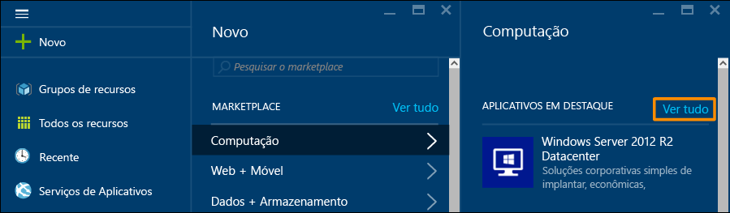

1. Em **Servidores de banco de dados**, clique em **SQL Server** para ver todos os modelos disponíveis para SQL Server. Talvez você precise rolar a tela para baixo para localizar **Servidores de banco de dados**.

	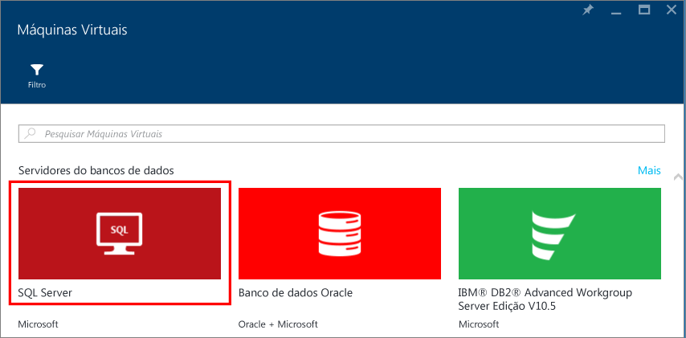

1. 	Cada modelo identifica uma versão do SQL Server e um sistema operacional. Selecione uma dessas imagens da lista para exibir uma folha contendo seus detalhes.
1.	A folha de detalhes fornece uma descrição da imagem dessa máquina virtual e permite a seleção de um modelo de implantação. Em **Selecionar um modelo de implantação**, verifique se **Resource Manager** está selecionado e clique em **Criar**.

	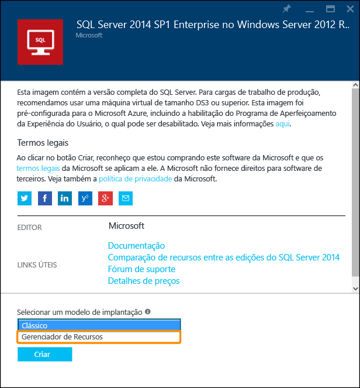

## Configurar a VM
No Portal do Azure, há cinco folhas para configuração de uma máquina virtual do SQL Server.

| Etapa | Descrição |
|---------------------|-------------------------------|
| **Noções básicas** | [Definir as configurações básicas](#1-configure-basic-settings) |
| **Tamanho** | [Escolher o tamanho da máquina virtual](#2-choose-virtual-machine-size) |
| **Configurações** | [Configurar os recursos opcionais](#3-configure-optional-features) |
| **Configurações do SQL Server** | [Definir as configurações do SQL Server](#4-configure-sql-server-settings) |
| **Resumo** | [Examinar o resumo](#5-review-the-summary) |

## 1\. Definir as configurações básicas
Na folha **Básico**, forneça as seguintes informações:

* Digite um **Nome** exclusivo de máquina virtual.
* Especifique um **Nome de usuário** para a conta de administrador local da máquina. Essa conta também será membro da função de servidor fixa sysadmin do SQL Server.
* Use uma **Senha** forte.
* Se você tiver várias assinaturas, verifique se a assinatura é a correta para a VM que você está prestes a compilar.
* Na caixa **Grupo de recursos**, digite um nome para um novo grupo de recursos. Como alternativa, para usar um grupo de recursos existente, clique em **Selecionar existente**. Um grupo de recursos é uma coleção de recursos relacionados no Azure (máquinas virtuais, contas de armazenamento, redes virtuais etc.).
	
	>[AZURE.NOTE] O uso de um novo grupo de recursos é útil se você estiver apenas testando ou aprendendo sobre implantações do SQL Server no Azure. Após a conclusão de seu teste, você poderá excluir todo o grupo de recursos. Isso exclui todos os recursos associados a esse grupo de recursos, incluindo a VM do SQL. Para saber mais sobre grupos de recursos, confira [Visão geral do Azure Resource Manager](../resource-group-overview.md).

* Selecione um **Local** para essa implantação.
* Clique em **OK** para salvar as configurações.

	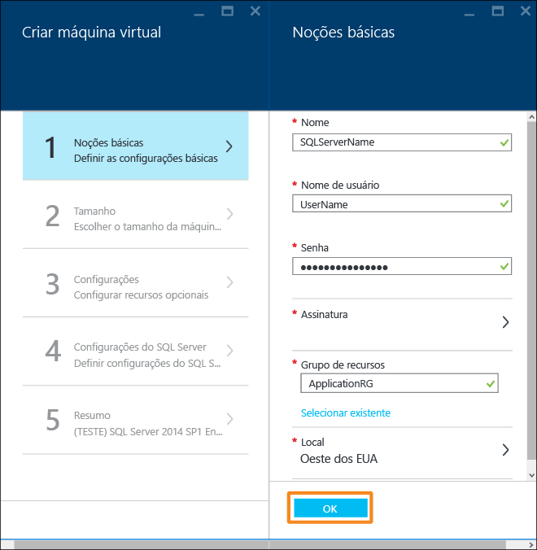

## 2\. Escolher o tamanho da máquina virtual
Na etapa **Tamanho**, escolha um tamanho de máquina virtual na folha **Escolher um tamanho**. Inicialmente, isso apresenta os tamanhos recomendados de máquina. Os tamanhos têm base no modelo selecionado. Também calcula o custo mensal para execução da VM.

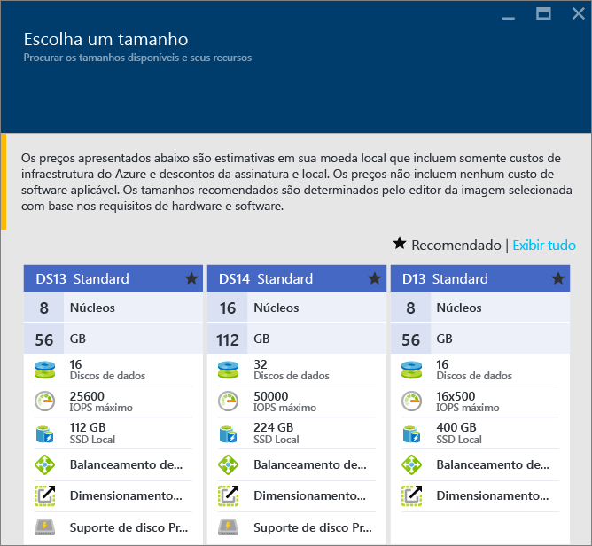

Para cargas de trabalho de produção, recomendamos a seleção de um tamanho de máquina virtual que ofereça suporte ao [Armazenamento Premium](../storage/storage-premium-storage.md). Se você não precisar desse nível de desempenho, use o botão **Exibir tudo** para ver todas as opções de tamanho de máquina. Por exemplo, você pode usar um tamanho de máquina menor para um ambiente de teste ou desenvolvimento.

>[AZURE.NOTE] Para obter mais informações sobre tamanhos de máquinas virtuais, confira [Tamanhos de máquinas virtuais](virtual-machines-windows-sizes.md). Para saber mais sobre os tamanhos de VM do SQL Server, confira as [Práticas recomendadas de desempenho para o SQL Server em máquinas virtuais do Azure](virtual-machines-windows-sql-performance.md).

Escolha o tamanho da máquina e clique em **Selecionar**.

## 3\. Configurar os recursos opcionais
Na folha **Configurações**, defina o armazenamento do Azure, a rede e o monitoramento para a máquina virtual.

- Em **Armazenamento**, especifique um **Tipo de disco** do tipo Standard ou Premium (SSD). Armazenamento Premium é recomendado para cargas de trabalho de produção.

>[AZURE.NOTE] Se você selecionar Premium (SSD) para um tamanho de máquina que não oferece suporte ao Armazenamento Premium, sua máquina será redimensionada para um tamanho que ofereça suporte ao Armazenamento Premium.

- Em **Conta de armazenamento**, você pode aceitar o nome da conta de armazenamento provisionado automaticamente ou clicar em **Conta de armazenamento** para escolher uma conta existente e configurar o tipo de conta de armazenamento. Por padrão, o Azure cria uma nova conta de armazenamento com o armazenamento com redundância local. Para saber mais sobre as opções de armazenamento, confira [Replicação do Armazenamento do Azure](../storage/storage-redundancy.md).

- Em **Rede**, você pode aceitar os valores populados automaticamente para os recursos ou clicar em cada recurso para configurar a **Rede virtual**, a **Sub-rede**, o **Endereço IP público** e o **Grupo de Segurança de Rede**. Para a finalidade deste tutorial, mantenha os valores padrão.

- O Azure habilita o **Monitoramento** por padrão com a mesma conta de armazenamento designada para a VM. Você pode alterar essas configurações aqui.

- Em **Conjunto de disponibilidade**, especifique um conjunto de disponibilidade. Para a finalidade deste tutorial, selecione **nenhum**. Se você planeja configurar Grupos de Disponibilidade SQL AlwaysOn, configure a disponibilidade para evitar recriar a máquina virtual. Para obter mais informações, consulte [Gerenciar a Disponibilidade de Máquinas Virtuais](virtual-machines-windows-manage-availability.md).

Ao concluir as configurações, clique em **OK**.

## 4\. Definir as configurações do SQL Server
Na folha **Configurações do SQL Server**, defina configurações e otimizações específicas para o SQL Server. As configurações possíveis para o SQL Server incluem as seguintes:

| Configuração |
|---------------------|
| [Conectividade](#connectivity) |
| [Autenticação](#authentication) |
| [Configuração de armazenamento](#storage-configuration) |
| [Aplicação de patch automatizada](#automated-patching) |
| [Backup Automatizado](#automated-backup) |
| [Integração do Cofre da Chave do Azure](#azure-key-vault-integration) |

### Conectividade
Em **Conectividade SQL**, especifique o tipo de acesso desejado para a instância do SQL Server nesta VM. Para a finalidade deste tutorial, escolha **Pública (Internet)** para permitir conexões com o SQL Server de máquinas ou serviços na Internet. Com essa opção selecionada, o Azure configurará automaticamente o firewall e o grupo de segurança de rede para permitir o tráfego na porta 1433.

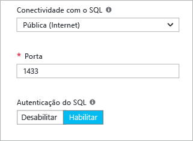

Para conectar-se ao SQL Server pela Internet, também será necessário habilitar a Autenticação do SQL Server, que está descrita na próxima seção.

>[AZURE.NOTE] Se seus clientes se conectarem ao SQL Server de uma porta específica, você poderá restringir a conectividade nessa porta de origem. Faça isso editando o Grupo de Segurança de Rede após a criação da VM. Para saber mais, confira [O que é um NSG (Grupo de Segurança de Rede)?](../virtual-network/virtual-networks-nsg.md).

Se você preferir não permitir conexões com o Mecanismo de Banco de Dados pela internet, escolha uma das seguintes opções:

- **Local (apenas dentro da VM)** para permitir conexões com o SQL Server somente de dentro da VM.
- **Privada (dentro da Rede Virtual)** para permitir conexões com o SQL Server de computadores ou serviços na mesma rede virtual.

Em geral, melhore a segurança escolhendo a conectividade mais restritiva que seu cenário permite. No entanto, todas as opções são protegidas por meio de regras do Grupo de Segurança de Rede e por meio da Autenticação do SQL/Windows.

A **porta** usada por padrão é 1433. Você pode especificar um número de porta diferente. Para saber mais, confira [Conectar-se a uma máquina virtual do SQL Server (Gerenciador de Recursos) | Microsoft Azure](virtual-machines-windows-sql-connect.md).

### Autenticação
Se você precisar de Autenticação do SQL Server, clique em **Habilitar** em **Autenticação do SQL**.

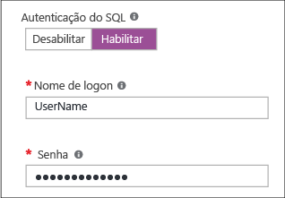

>[AZURE.NOTE] Se você pretende acessar o SQL Server pela Internet (ou seja, a opção de conectividade Pública), habilite a autenticação do SQL aqui. O acesso público ao SQL Server exige o uso da Autenticação do SQL.

Se você habilitar a Autenticação do SQL Server, especifique um **Nome de logon** e uma **Senha**. Esse nome de usuário será um logon de Autenticação do SQL Server e membro da função de servidor fixa sysadmin. Confira [Escolher um modo de autenticação](http://msdn.microsoft.com/library/ms144284.aspx) para saber mais sobre os Modos de Autenticação.

Se você não habilitar a Autenticação do SQL Server, poderá usar a conta local de Administrador na VM para se conectar à instância do SQL Server.

### Configuração de armazenamento
Clique em **Configuração de armazenamento** para especificar os requisitos de armazenamento.

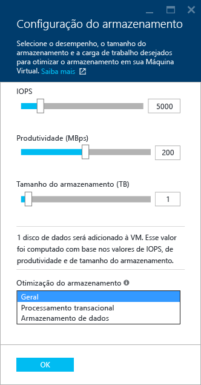

>[AZURE.NOTE] Se você selecionar o armazenamento Standard, essa opção não estará disponível. A otimização de armazenamento automático está disponível apenas para o Armazenamento Premium.

Você pode especificar os requisitos como operações IOPs (entrada/saída por segundo), taxa de transferência em MB/s e tamanho total de armazenamento. Configure-os usando as escalas deslizantes. O portal calcula automaticamente o número de discos com base nesses requisitos.

Por padrão, o Azure otimiza o armazenamento para 5000 IOPs, 200 MB e 1 TB de espaço de armazenamento. Você pode alterar essas configurações de armazenamento com base na carga de trabalho. Em **Armazenamento otimizado para**, escolha uma das seguintes opções

- **Geral** é a configuração padrão e dá suporte à maioria das cargas de trabalho.
- O processamento **Transacional** otimiza o armazenamento para cargas de trabalho OLTP tradicionais de banco de dados.
- O **Data warehouse** otimiza o armazenamento para cargas de trabalho de análise e emissão de relatórios.

>[AZURE.NOTE] Os limites superiores nos controles deslizantes variam dependendo do tamanho selecionado para a máquina virtual.

### Aplicação de patch automatizada
A **Aplicação de patch automatizada** está habilitada por padrão. A aplicação de patch automatizada permite que o Azure aplique patches automaticamente no SQL Server e no sistema operacional. Especifique um dia da semana, hora e duração de um período de manutenção. O Azure executará a aplicação do patch no período de manutenção. O agendamento do período de manutenção usa a localidade da VM para a hora. Se você não quiser que o Azure aplique automaticamente o patch no SQL Server e no sistema operacional, clique em **Desabilitar**.

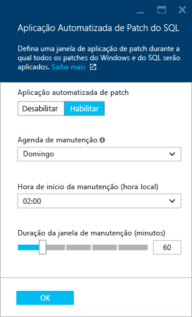

Para saber mais, confira [Aplicação de patch automatizada para SQL Server em máquinas virtuais do Azure](virtual-machines-windows-classic-sql-automated-patching.md).

### Backup Automatizado
Habilite backups automáticos de banco de dados para todos os bancos de dados em **Backup automatizado**. O backup automatizado está desabilitado por padrão.

Ao habilitar o backup automatizado do SQL, é possível configurar o seguinte:

- Período de retenção do backup em dias
- Conta de armazenamento a ser usada para backups
- Opção de criptografia para o backup.

Para criptografar o backup, clique em **Habilitar**. Em seguida, especifique a **Senha**. O Azure cria um certificado para criptografar os backups e usa a senha especificada para proteger esse certificado.

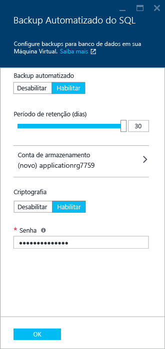

 Para obter mais informações, veja [Backup Automatizado para o SQL Server em Máquinas Virtuais do Azure](virtual-machines-windows-classic-sql-automated-backup.md).

### Integração do Cofre da Chave do Azure
Para armazenar segredos de segurança no Azure para criptografia, clique em **Integração do cofre de chaves do Azure** e clique em **Habilitar**.

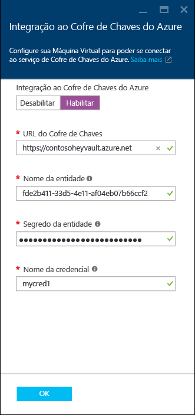

A tabela a seguir lista os parâmetros necessários para configurar a integração do Cofre da Chave do Azure.

|PARÂMETRO|DESCRIÇÃO|EXEMPLO|
|----------|----------|-------|
|**URL do cofre da chave** |O local do cofre da chave.|https://contosokeyvault.vault.azure.net/ |
|**Nome de entidade** |Nome de entidade de serviço do Active Directory do Azure Também é chamado de ID do Cliente. |fde2b411-33d5-4e11-af04eb07b669ccf2|
| **Segredo da entidade**|Segredo da entidade de serviço do Azure Active Directory. Isso também é chamado de Segredo do Cliente. | 9VTJSQwzlFepD8XODnzy8n2V01Jd8dAjwm/azF1XDKM=|
|**Nome da credencial**|**Nome da credencial**: a integração AKV cria uma credencial no SQL Server, permitindo que a VM tenha acesso ao cofre da chave. Escolha um nome para essa credencial.| mycred1|

Para saber mais, confira [Configurar a integração do Cofre de Chaves do Azure para o SQL em VMs do Azure](virtual-machines-windows-classic-ps-sql-keyvault.md).

Ao concluir as configurações do SQL Server, clique em **OK**.

## 5\. Examinar o resumo
Na folha **Resumo**, examine o resumo e clique em **OK** para criar o SQL Server, o grupo de recursos e os recursos especificados para essa VM.

Você pode monitorar a implantação do Portal do Azure. O botão **Notificações** na parte superior da tela mostra o status básico da implantação.

>[AZURE.NOTE] Para você ter uma ideia sobre os tempos de implantação, eu implantei uma VM do SQL na região Leste dos EUA com as configurações padrão. Isso levou um total de 26 minutos para ser concluído. Mas sua implantação pode ser rápida ou mais lenta de acordo com sua região e com as configurações selecionadas.

## Abrir a VM usando a Área de Trabalho Remota.

Use as etapas a seguir para se conectar à máquina virtual com a Área de Trabalho Remota.

1. Após a compilação da VM do Azure, um ícone para a VM será exibido no painel do Azure. Você também pode encontrá-lo navegando por suas máquinas virtuais existentes. Clique em sua nova máquina virtual do SQL para ver seus detalhes.
1. Na parte superior da folha **Máquina virtual**, clique em **Conectar**.
1. O navegador baixará um arquivo .rdp para a VM. Abra o arquivo .rdp. 
1. A Conexão de área de trabalho remota avisará você de que o distribuidor dessa conexão remota não pode ser identificado. Clique em **Conectar** para continuar.
1. Na caixa de diálogo **Segurança do Windows**, clique em **Usar outra conta**.
1. Em **Nome de usuário** digite **<nome de usuário>**, em que <user name> é o nome de usuário especificado por você durante a configuração da VM. Observe que você precisa adicionar uma barra invertida inicial.
1. Digite a **Senha** que você configurou anteriormente para essa VM e clique em **OK** para se conectar.
1. Se outra caixa de diálogo **Conexão de Área de Trabalho Remota** perguntar se você deseja se conectar, clique em **Sim**.

Depois de se conectar à máquina virtual do SQL Server, você pode iniciar o SQL Server Management Studio e conectar-se à Autenticação do Windows usando suas credenciais de administrador local. Se você habilitou a Autenticação do SQL Server, também será possível se conectar com a Autenticação do SQL usando o logon e a senha do SQL configurados durante o provisionamento.

O acesso à máquina permite que você altere diretamente as configurações da máquina e do SQL Server com base em suas necessidades. Por exemplo, você pode definir as configurações do firewall ou alterar as configuração do SQL Server.

## Conectar-se ao SQL Server remotamente

Neste tutorial, selecionamos o acesso **Público** para a máquina virtual e a **Autenticação do SQL Server**. Essas configurações definiram automaticamente a máquina virtual para permitir conexões do SQL Server de qualquer cliente pela internet (supondo que o logon do SQL esteja correto).

>[AZURE.NOTE] Se você não selecionou Pública durante o provisionamento, será necessário executar etapas adicionais para acessar a instância do SQL Server pela Internet. Para saber mais, confira [Conectar-se a uma Máquina Virtual do SQL Server](virtual-machines-windows-sql-connect.md).

As seções a seguir mostram como se conectar à instância do SQL Server em sua VM de um computador diferente pela internet.

> [AZURE.INCLUDE [Conectar-se ao SQL Server em um Gerenciador de Recursos de VM](../../includes/virtual-machines-sql-server-connection-steps-resource-manager.md)]

## Próximas etapas
Para saber mais sobre como usar o SQL Server no Azure, confira [SQL Server em máquinas virtuais do Azure](virtual-machines-windows-sql-server-iaas-overview.md) e as [Perguntas frequentes](virtual-machines-windows-sql-server-iaas-faq.md).

Para obter uma visão geral em vídeo do SQL Server em máquinas virtuais do Azure, assista [A VM do Azure é a melhor plataforma para o SQL Server 2016](https://channel9.msdn.com/Events/DataDriven/SQLServer2016/Azure-VM-is-the-best-platform-for-SQL-Server-2016).

<!---HONumber=AcomDC_0518_2016-->