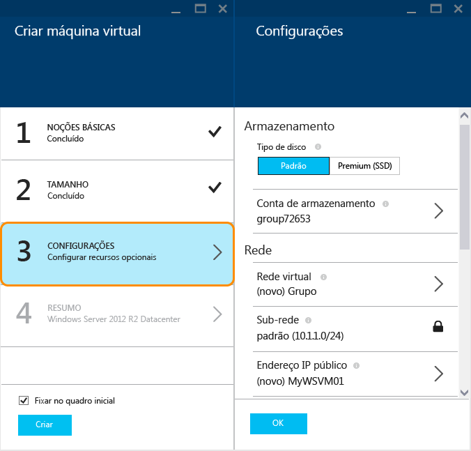
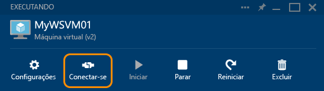

<properties
	pageTitle="Criar uma máquina virtual executando o Windows no portal de visualização do Azure | Microsoft Azure"
	description="Saiba como criar um recurso de VM (máquina virtual) do Azure executando o Windows, usando o Azure Marketplace no portal de visualização do Azure"
	services="virtual-machines"
	documentationCenter=""
	authors="KBDAzure"
	manager="timlt"
	editor=""
	tags="azure-resource-manager"/>
<tags
	ms.service="virtual-machines"
	ms.workload="infrastructure-services"
	ms.tgt_pltfrm="vm-windows"
	ms.devlang="na"
	ms.topic="get-started-article"
	ms.date="07/13/2015"
	ms.author="kathydav"/>

# Criar uma máquina virtual executando o Windows no portal de visualização do Azure#

> [AZURE.SELECTOR]
- [Azure preview portal](virtual-machines-windows-tutorial.md)
- [Azure portal](virtual-machines-windows-tutorial-classic-portal.md)
- [PowerShell - Resource manager](virtual-machines-deploy-rmtemplates-powershell.md)
- [PowerShell - Service management](virtual-machines-ps-create-preconfigure-windows-vms.md)

Este tutorial mostra como é fácil criar uma VM (máquina virtual) do Azure em apenas alguns minutos no portal de visualização. Usaremos uma imagem do Windows Server 2012 R2 Datacenter como exemplo para criar a VM no Gerenciador de Recursos do Azure, mas essa é apenas uma das muitas imagens oferecidas pelo Azure. Observe que as opções de imagem dependem de sua assinatura. Por exemplo, imagens de desktop podem estar disponíveis para assinantes do MSDN.

Você também pode criar VMs usando suas próprias imagens, com modelos do Gerenciador de Recursos ou com ferramentas de automação. Para saber mais sobre esse e outros métodos, consulte [Diferentes maneiras de criar uma máquina virtual do Windows](virtual-machines-windows-choices-create-vm.md).

[AZURE.INCLUDE [free-trial-note](../../includes/free-trial-note.md)]

## Selecionar a imagem

Vá para o Azure Marketplace no portal de visualização para localizar a imagem de VM do Windows Server desejada.

1. Entre no [portal de visualização](https://portal.azure.com).

2. No menu Hub, clique em **Novo** > **Computação** > **Windows Server 2012 R2 Datacenter**.

	

	>[AZURE.TIP]Para localizar outras imagens, clique em **Marketplace** e, em seguida, pesquise ou filtre os itens disponíveis.

3. Na página **Windows Server 2012 R2 Datacenter**, selecione **Usar a pilha do Gerenciador de Recursos** para criar a VM no Gerenciador de Recursos do Azure. (Para a maioria das novas cargas de trabalho, recomendamos a pilha do Gerenciador de Recursos. Para considerações, consulte [Provedores de computação, de rede e armazenamento do Azure no Gerenciador de Recursos do Azure](virtual-machines-azurerm-versus-azuresm.md)). Em seguida, clique em **Criar**.

	

## Criar a máquina virtual

Depois de selecionar a imagem, você poderá usar as configurações padrão do Azure para a maior parte da configuração e criar rapidamente a VM.

1. Na folha **Criar a máquina virtual**, clique em **Noções básicas**. Insira um **Nome** desejado para a VM, o **Nome de usuário** administrativo e uma **Senha** forte. Se você tiver mais de uma assinatura, especifique a assinatura certa para a nova VM, bem como um **Grupo de recursos** novo ou existente e um **Local** para o data center do Azure.

	

	>[AZURE.NOTE]O **Nome de usuário** se refere à conta administrativa que você usa para gerenciar o servidor. Crie uma senha que seja difícil para outras pessoas adivinharem mas da qual você possa se lembrar. **Você precisará do nome do usuário e da senha para fazer logon na máquina virtual**.

2. Clique em **Tamanho** e selecione um tamanho de VM apropriado para suas necessidades. Cada tamanho especifica o número de núcleos de computação, memória e outros recursos, como suporte para Armazenamento Premium, o que afetará o preço. O Azure recomenda automaticamente determinados tamanhos, dependendo da imagem escolhida.

	

	>[AZURE.NOTE]O Armazenamento Premium está disponível para máquinas virtuais de série DS em determinadas regiões. O Armazenamento Premium é a melhor opção de armazenamento para cargas de trabalho de uso intensivo de dados, como um banco de dados. Para obter detalhes, confira [Armazenamento Premium: armazenamento de alto desempenho para as cargas de trabalho das máquinas virtuais do Azure](storage-premium-storage-preview-portal.md).

3. Clique em **Configurações** para ver as configurações de rede e de armazenamento da nova VM. Para uma primeira VM, geralmente você aceita as configurações padrão. Se tiver selecionado um tamanho de VM que ofereça suporte o Armazenamento Premium, você poderá experimentá-lo selecionando **Premium (SSD)** em **Tipo de disco**.

	

6. Clique em **Resumo** para rever suas opções de configuração. Quando terminar a revisão ou a atualização das configurações, clique em **Criar**.

	

8. Enquanto o Azure cria a VM, é possível acompanhar o progresso em **Notificações**, no menu Hub. Após o Azure criar a VM, você a verá no Quadro Inicial, a menos que tenha desmarcado **Fixar no Quadro Inicial** na folha **Criar máquina virtual**.

## Faça logon na máquina virtual

Após criar a VM, você pode fazer logon nela para que possa gerenciar as configurações e os aplicativos que serão executados na VM.

>[AZURE.NOTE]Para mais dicas de requisitos e solução de problemas, consulte [Conecte-se à uma máquina virtual Azure com RDP ou SSH](https://msdn.microsoft.com/library/azure/dn535788.aspx).

1. Se ainda não fez isso, entre no [portal de visualização](https://portal.azure.com).

2. Clique na VM no quadro inicial. Se você precisar encontrá-la, clique em **Procurar Tudo** > **Recente** ou **Procurar Tudo** > **Máquinas virtuais**. Em seguida, selecione sua VM na lista.

3. Na folha VM, clique em **Conectar**.

	

4. Clique em **Abrir** para usar o arquivo do Protocolo RDP criado automaticamente para a máquina virtual do Windows Server.

5. Clique em **Conectar**.

6. Digite o nome de usuário e a senha especificados na criação da máquina virtual e clique em **OK**.

7. Clique em **Sim** para verificar a identidade da máquina virtual.

	Você agora pode trabalhar com a máquina virtual, como faria com qualquer outro servidor.

## Próximas etapas

* Use o Azure PowerShell e a CLI do Azure para [localizar e selecionar imagens da VM](resource-groups-vm-searching.md).
* Automatize a implantação e o gerenciamento de VM e de carga de trabalho com o [Gerenciador de Recursos do Azure](virtual-machines-how-to-automate-azure-resource-manager.md) e os [modelos do Gerenciador de Recursos do Azure](http://azure.microsoft.com/documentation/templates/).

<!---HONumber=August15_HO6-->