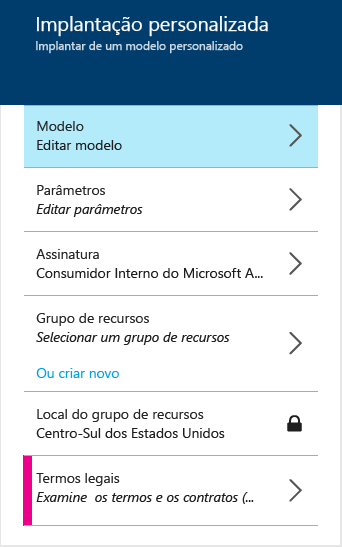

<properties
	pageTitle="Implantar farms do SharePoint com os modelos do ARM | Microsoft Azure"
	description="Implante facilmente um farm de três ou nove servidores do SharePoint com modelos do Gerenciador de Recursos e o Portal de Visualização do Azure, Azure PowerShell ou CLI do Azure."
	services="virtual-machines"
	documentationCenter=""
	authors="JoeDavies-MSFT"
	manager="timlt"
	editor=""
	tags="azure-resource-manager"/>

<tags
	ms.service="virtual-machines"
	ms.workload="infrastructure-services"
	ms.tgt_pltfrm="vm-windows-sharepoint"
	ms.devlang="na"
	ms.topic="hero-article"
	ms.date="10/20/2015"
	ms.author="josephd"/>

# Implantar farms do SharePoint com os modelos do Gerenciador de Recursos do Azure

[AZURE.INCLUDE [learn-about-deployment-models](../../includes/learn-about-deployment-models-rm-include.md)]modelo de implantação clássica. Você não pode criar esse recurso com o modelo de implantação clássica.

Use as instruções neste artigo para implantar um novo farm de três ou nove servidores do SharePoint Server 2013 usando os modelos de Gerenciador de Recursos.

## Implantar um farm de três servidores do SharePoint

Para um farm básico do SharePoint Server 2013, um modelo do Gerenciador de Recursos cria três máquinas virtuais em uma nova rede virtual em três sub-redes diferentes.

Você pode executar o modelo com o portal do Azure, o Azure PowerShell ou a CLI do Azure.

> [AZURE.NOTE]Você também pode criar essa configuração usando o item [Farm do SharePoint 2013 não HA](https://azure.microsoft.com/marketplace/partners/sharepoint2013/sharepoint2013farmsharepoint2013-nonha/) no Azure Marketplace do portal do Azure.

### Portal do Azure

Para implantar essa carga de trabalho usando um modelo do Gerenciador de Recursos e o portal do Azure, clique [aqui](https://portal.azure.com/#create/Microsoft.Template/uri/https%3A%2F%2Fraw.githubusercontent.com%2FAzure%2Fazure-quickstart-templates%2Fmaster%2Fsharepoint-three-vm%2Fazuredeploy.json).

1.	Clique em **Parâmetros**. No painel **Parâmetros**, insira novos valores, selecione os valores permitidos ou aceite os valores padrão e clique em **OK**.
2.	Se necessário, clique em **Assinatura** e selecione a assinatura correta do Azure.
3.	Clique em **Grupo de recursos** e selecione um grupo de recursos existente. Como alternativa, clique em **Ou criar novo** para criar um novo para essa carga de trabalho.
4.	Se necessário, clique em **Local do grupo de recursos** e selecione o local correto do Azure.
6.	Clique em **Termos legais** para examinar os termos e o contrato de utilização do modelo e clique em **Comprar**.
7.	Clique em **Criar**.

Dependendo do modelo, pode levar algum tempo para o Azure criar a carga de trabalho. Ao concluir, você terá um novo farm de três servidores do SharePoint em seu grupo de recursos novos ou existentes.

### PowerShell do Azure

> [AZURE.NOTE]Este artigo contém comandos para o Azure PowerShell Preview 1.0. Para executar esses comandos no Azure PowerShell 0.9.8 e em versões anteriores, substitua **New-AzureRMResourceGroup** por **New-AzureResourceGroup**, substitua **New-AzureRMResourceGroupDeployment** por **New-AzureResourceGroupDeployment**, e adicione o comando **Switch-AzureMode AzureResourceManager** antes do comando **New-AzureResourceGroup**. Para saber mais, consulte [Azure PowerShell 1.0 Preview](https://azure.microsoft.com/blog/azps-1-0-pre/).

Preencha o nome de uma implantação do Azure, um novo nome do Grupo de Recursos e um local de datacenter do Azure no seguinte conjunto de comandos. Remova tudo que estiver entre aspas, incluindo os caracteres < and >.

	$deployName="<deployment name>"
	$RGName="<resource group name>"
	$locName="<Azure location, such as West US>"
	$templateURI="https://raw.githubusercontent.com/Azure/azure-quickstart-templates/master/sharepoint-three-vm/azuredeploy.json"
	New-AzureRMResourceGroup -Name $RGName -Location $locName
	New-AzureRMResourceGroupDeployment -Name $deployName -ResourceGroupName $RGName -TemplateUri $templateURI

Aqui está um exemplo.

	$deployName="TestDeployment"
	$RGName="TestRG"
	$locname="West US"
	$templateURI="https://raw.githubusercontent.com/Azure/azure-quickstart-templates/master/sharepoint-three-vm/azuredeploy.json"
	New-AzureRMResourceGroup -Name $RGName -Location $locName
	New-AzureRMResourceGroupDeployment -Name $deployName -ResourceGroupName $RGName -TemplateUri $templateURI

Em seguida, execute o bloco de comando no prompt do Azure PowerShell.

Ao executar o comando **New-AzureRMResourceGroupDeployment**, será solicitado que você forneça os valores de uma série de parâmetros. Depois de especificar todos os valores de parâmetros, **New-AzureRMResourceGroupDeployment** criará e configurará as máquinas virtuais.

Quando a execução do modelo for concluída, você terá um novo farm de três servidores do SharePoint em seu novo grupo de recursos.

### CLI do Azure

Antes de começar, verifique se você tem a versão correta do Azure CLI instalada, faça logon e alterne para o novo modo do Gerenciador de Recursos. Para obter detalhes, clique [aqui](virtual-machines-deploy-rmtemplates-azure-cli.md#getting-ready).

Primeiro, crie um novo grupo de recursos. Use o seguinte comando e especifique o nome do grupo e o local do datacenter do Azure no qual você deseja implantar.

	azure group create <group name> <location>

Em seguida, use o seguinte comando e especifique o nome do novo grupo de recursos e o nome de uma implantação do Azure.

	azure group deployment create --template-uri https://raw.githubusercontent.com/Azure/azure-quickstart-templates/master/sharepoint-three-vm/azuredeploy.json <group name> <deployment name>

Aqui está um exemplo.

	azure group create sp3serverfarm eastus2
	azure group deployment create --template-uri https://raw.githubusercontent.com/Azure/azure-quickstart-templates/master/sharepoint-three-vm/azuredeploy.json sp3serverfarm spdevtest

Ao executar o comando **azure group deployment create**, você receberá uma solicitação para fornecer os valores para uma série de parâmetros. Quando você tiver especificado todos os valores de parâmetro, o Azure criará e configurará as máquinas virtuais.

Agora você tem um novo farm de três servidores do SharePoint em seu novo grupo de recursos.

## Implantar um farm de nove servidores do SharePoint

Para um farm do SharePoint Server 2013 de alta disponibilidade, um modelo do Gerenciador de Recursos cria nove máquinas virtuais em uma nova rede virtual em quatro sub-redes diferentes.

> [AZURE.NOTE]Você também pode criar essa configuração usando o item [Farm do SharePoint 2013 HA](https://azure.microsoft.com/marketplace/partners/sharepoint2013/sharepoint2013farmsharepoint2013-ha/) no Azure Marketplace do portal do Azure.

### Portal do Azure

Para implantar essa carga de trabalho usando um modelo do Gerenciador de Recursos e o portal do Azure, clique [aqui](https://portal.azure.com/#create/Microsoft.Template/uri/https%3A%2F%2Fraw.githubusercontent.com%2FAzure%2Fazure-quickstart-templates%2Fmaster%2Fsharepoint-server-farm-ha%2Fazuredeploy.json).

1.	Clique em **Parâmetros**. No painel **Parâmetros**, insira novos valores, selecione os valores permitidos ou aceite os valores padrão e clique em **OK**.
2.	Se necessário, clique em **Assinatura** e selecione a assinatura correta do Azure.
3.	Clique em **Grupo de recursos** e selecione um grupo de recursos existente. Como alternativa, clique em **Ou criar novo** para criar um novo para essa carga de trabalho.
4.	Se necessário, clique em **Local do grupo de recursos** e selecione o local correto do Azure.
5.	Clique em **Termos legais** para examinar os termos e o contrato de utilização do modelo e clique em **Comprar**.
6.	Clique em **Criar**.

Dependendo do modelo, pode levar algum tempo para o Azure criar a carga de trabalho. Ao concluir, você terá um novo farm de nove servidores do SharePoint em seu grupo de recursos novos ou existentes.

### PowerShell do Azure

> [AZURE.NOTE]Este artigo contém comandos para o Azure PowerShell Preview 1.0. Para executar esses comandos no Azure PowerShell 0.9.8 e em versões anteriores, substitua **New-AzureRMResourceGroup** por **New-AzureResourceGroup**, substitua **New-AzureRMResourceGroupDeployment** por **New-AzureResourceGroupDeployment**, e adicione o comando **Switch-AzureMode AzureResourceManager** antes do comando **New-AzureResourceGroup**. Para saber mais, consulte [Azure PowerShell 1.0 Preview](https://azure.microsoft.com/blog/azps-1-0-pre/).

Preencha o nome de uma implantação do Azure, um novo nome do Grupo de Recursos e um local de datacenter do Azure no seguinte conjunto de comandos. Remova tudo que estiver entre aspas, incluindo os caracteres < and >.

	$deployName="<deployment name>"
	$RGName="<resource group name>"
	$locName="<Azure location, such as West US>"
	$templateURI="https://raw.githubusercontent.com/Azure/azure-quickstart-templates/master/sharepoint-server-farm-ha/azuredeploy.json"
	New-AzureRMResourceGroup -Name $RGName -Location $locName
	New-AzureRMResourceGroupDeployment -Name $deployName -ResourceGroupName $RGName -TemplateUri $templateURI

Aqui está um exemplo.

	$deployName="TestDeployment"
	$RGName="TestRG"
	$locname="West US"
	$templateURI="https://raw.githubusercontent.com/Azure/azure-quickstart-templates/master/sharepoint-server-farm-ha/azuredeploy.json"
	New-AzureRMResourceGroup -Name $RGName -Location $locName
	New-AzureRMResourceGroupDeployment -Name $deployName -ResourceGroupName $RGName -TemplateUri $templateURI

Em seguida, execute o bloco de comando no prompt de comando do Azure PowerShell.

Ao executar o comando **New-AzureRMResourceGroupDeployment**, será solicitado que você forneça os valores de uma série de parâmetros. Depois de especificar todos os valores de parâmetros, **New-AzureRMResourceGroupDeployment** criará e configurará as máquinas virtuais.

Quando a execução do modelo for concluída, você terá um novo farm de nove servidores do SharePoint em seu novo grupo de recursos.

### CLI do Azure

Antes de começar, verifique se você tem a versão correta do Azure CLI instalada, faça logon e alterne para o novo modo do Gerenciador de Recursos. Para obter detalhes, clique [aqui](virtual-machines-deploy-rmtemplates-azure-cli.md#getting-ready).

Primeiro, crie um novo grupo de recursos. Use o seguinte comando e especifique o nome do grupo e o local do datacenter do Azure no qual você deseja implantar.

	azure group create <group name> <location>

Em seguida, use o seguinte comando e especifique o nome do novo grupo de recursos e o nome de uma implantação do Azure.

	azure group deployment create --template-uri https://raw.githubusercontent.com/Azure/azure-quickstart-templates/master/sharepoint-server-farm-ha/azuredeploy.json <group name> <deployment name>

Aqui está um exemplo.

	azure group create sphaserverfarm eastus2
	azure group deployment create --template-uri https://raw.githubusercontent.com/Azure/azure-quickstart-templates/master/sharepoint-server-farm-ha/azuredeploy.json sphaserverfarm spdevtest

Ao executar o comando **azure group deployment create**, você receberá uma solicitação para fornecer os valores para uma série de parâmetros. Quando você tiver especificado todos os valores de parâmetro, o Azure criará e configurará as máquinas virtuais.

Quando a execução do modelo for concluída, você terá, então, um novo farm de nove servidores do SharePoint Server 2013 em seu novo grupo de recursos.

## Recursos adicionais

[Farms do SharePoint hospedados nos serviços de infraestrutura do Azure](virtual-machines-sharepoint-infrastructure-services.md)

[Implantar e gerenciar máquinas virtuais usando modelos do Gerenciador de Recursos do Azure e o Azure PowerShell](virtual-machines-deploy-rmtemplates-powershell.md)

[Computação do Azure, provedores de Rede e Armazenamento no Gerenciador de Recursos do Azure](virtual-machines-azurerm-versus-azuresm.md)

[Visão geral do Gerenciador de Recursos do Azure](../resource-group-overview.md)

[Implantar e gerenciar máquinas virtuais usando modelos do Gerenciador de Recursos do Azure e a CLI do Azure](virtual-machines-deploy-rmtemplates-azure-cli.md)

[Documentação de máquinas virtuais](http://azure.microsoft.com/documentation/services/virtual-machines/)

[Como instalar e configurar o Azure PowerShell](../install-configure-powershell.md)

<!---HONumber=AcomDC_1203_2015-->