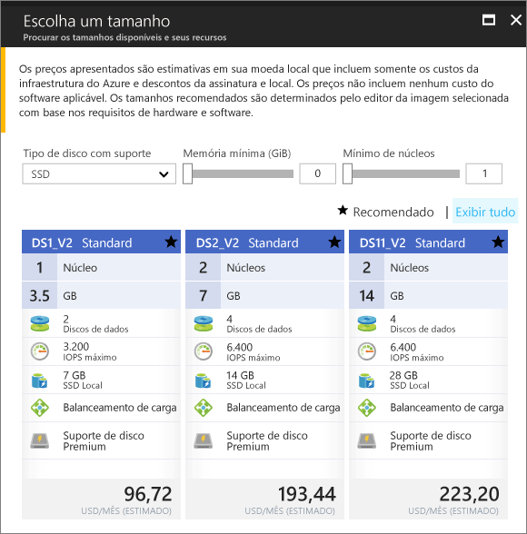

# <a name="create-a-windows-virtual-machine-in-an-availability-zone-with-the-azure-portal"></a>Crie uma máquina virtual do Windows em uma Região de Disponibilidade com o portal do Azure

Este artigo aborda usando o portal do Azure para criar uma máquina virtual em uma região de disponibilidade do Azure. Uma [zona de disponibilidade](../../availability-zones/az-overview.md) é uma zona fisicamente separada em uma região do Azure. Use zonas de disponibilidade para proteger seus aplicativos e dados de uma improvável falha ou perda de um datacenter inteiro.

[!INCLUDE [availability-zones-preview-statement.md](../../../includes/availability-zones-preview-statement.md)]


## <a name="log-in-to-azure"></a>Fazer logon no Azure 

Faça logon no Portal do Azure em https://portal.azure.com.

## <a name="create-virtual-machine"></a>Criar máquina virtual

1. Clique em **Criar um recurso** no canto superior esquerdo do Portal do Azure.

2. Selecione **Computação** e, em seguida, selecione **Windows Server 2016 Datacenter**. 

3. Insira as informações da máquina virtual. O nome do usuário e a senha inseridos aqui são usados para fazer logon na máquina virtual. Ao concluir, clique em **OK**.

    

4. Selecione um tamanho para a VM. Para ver mais tamanhos, selecione **Exibir todos os** ou altere o filtro **Tipo de disco com suporte**. Tome cuidado ao selecionar um dos tamanhos de suporte na visualização de zonas de disponibilidade, como *DS1_v2 Standard*. 

      

5. Em **Configurações** > **Alta Disponibilidade**, selecione uma das zonas de numeração da **Zona de disponibilidade** suspensa, mantenha os padrões restantes, e Clique em **Ok**.

    

6. Na página de resumo, clique em **Comprar** para iniciar a implantação da máquina virtual.

7. A VM será fixada ao painel do portal do Azure. Depois que a implantação for concluída, a folha de resumo da VM abrirá automaticamente.


## <a name="zone-for-ip-address-and-managed-disk"></a>Zona de endereço IP e de disco gerenciado

Quando a VM é implantada em uma zona de disponibilidade, o endereço IP e os recursos de disco gerenciado são implantados na mesma região de disponibilidade. Você pode confirmar as configurações de zona usando o Azure PowerShell. Se você precisa instalar ou atualizar, confira [Instalar o módulo do Azure PowerShell](/powershell/azure/install-azurerm-ps).

Os exemplos a seguir obtêm informações sobre os recursos em um grupo de recursos denominado *myResourceGroup*. Substitua o nome do grupo de recursos que você usou para criar a máquina virtual.

Ache a zona do endereço de IP público com [Get-AzureRmPublicIPAddress](/en-us/powershell/module/azurerm.network/get-azurermpublicipaddress):

```powershell
Get-AzureRmPublicIpAddress -ResourceGroupName myResourceGroup
```
A `Zones` configuração na saída mostra que o endereço IP público está na mesma região da disponibilidade da VM:

```powershell
Name                     : myVM-ip
ResourceGroupName        : myResourceGroup
Location                 : eastus2
Id                       : /subscriptions/e44f251c-c67e-4760-9ed6-bf99a306ecff/resourceGroups/danlep0911/providers/Micr
                           osoft.Network/publicIPAddresses/myVM-ip
Etag                     : W/"b67e14c0-7e8a-4d12-91c5-da2a5dfad132"
ResourceGuid             : 314bf57d-9b25-4474-9282-db3561d536aa
ProvisioningState        : Succeeded
Tags                     :
PublicIpAllocationMethod : Dynamic
IpAddress                : 13.68.16.25
PublicIpAddressVersion   : IPv4
IdleTimeoutInMinutes     : 4
IpConfiguration          : {
                             "Id": "/subscriptions/e44f251c-c67e-4760-9ed6-bf99a306ecff/resourceGroups/myResourceGroup/providers/Microsoft.Network/networkInterfaces/myVM11842/ipConfigurations/ipconfig1"
                           }
DnsSettings              : null
Zones                    : {2}
```


O recurso de disco gerenciado para a VM também é criado na mesma região de disponibilidade. Você pode verificar isso com [Get-AzureRmDisk](/powershell/module/azurerm.compute/get-azurermdisk):

```powershell
Get-AzureRmDisk -ResourceGroupName myResourceGroup
```

A saída mostra que o disco gerenciado está na mesma região da disponibilidade da VM:

```powershell
ResourceGroupName  : myResourceGroup
AccountType        : PremiumLRS
OwnerId            : /subscriptions/d5b9d4b7-6fc1-0000-0000-000000000000/resourceGroups/myResourceGroup/providers/Microsoft.
                     Compute/virtualMachines/myVM
ManagedBy          : /subscriptions/d5b9d4b7-6fc1-0000-0000-000000000000/resourceGroups/myResourceGroup/providers/Microsoft.
                     Compute/virtualMachines/myVM
Sku                : Microsoft.Azure.Management.Compute.Models.DiskSku
Zones              : {2}
TimeCreated        : 9/7/2017 6:57:26 PM
OsType             : Windows
CreationData       : Microsoft.Azure.Management.Compute.Models.CreationData
DiskSizeGB         : 127
EncryptionSettings :
ProvisioningState  : Succeeded
Id                 : /subscriptions/d5b9d4b7-6fc1-0000-0000-000000000000/resourceGroups/myResourceGroup/providers/Microsoft.
                     Compute/disks/myVM_OsDisk_1_bd921920bb0a4650becfc2d830000000
Name               : myVM_OsDisk_1_bd921920bb0a4650becfc2d830000000
Type               : Microsoft.Compute/disks
Location           : eastus2
Tags               : {}
```

## <a name="next-steps"></a>Próximas etapas

Neste artigo, você aprendeu a criar uma VM em uma região de disponibilidade. Saiba mais sobre [regiões e disponibilidade](regions-and-availability.md) para máquinas virtuais do Azure.
