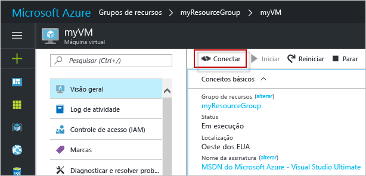

# <a name="create-a-windows-virtual-machine-with-the-azure-portal"></a>Criar uma máquina virtual do Windows com o Portal do Azure

Máquinas virtuais do Azure podem ser criadas por meio do Portal do Azure. Esse método fornece uma interface do usuário baseada em navegador para a criação e configuração de máquinas virtuais e todos os recursos relacionados. Esse Início Rápido percorre a criação de uma máquina virtual e a instalação de um servidor Web na VM.

Se você não tiver uma assinatura do Azure, crie uma [conta gratuita](https://azure.microsoft.com/free/?WT.mc_id=A261C142F) antes de começar.

## <a name="log-in-to-azure"></a>Fazer logon no Azure

Faça logon no Portal do Azure em http://portal.azure.com.

## <a name="create-virtual-machine"></a>Criar máquina virtual

1. Clique no botão **Novo** no canto superior esquerdo do Portal do Azure.

2. Selecione **Computação**, selecione **Datacenter do Windows Server 2016** e certifique-se de que **Gerenciador de Recursos** é o modelo de implantação selecionado. Selecione o botão **Criar** . 

3. Insira as informações da máquina virtual. O nome do usuário e a senha inseridos aqui são usados para fazer logon na máquina virtual. Ao concluir, clique em **OK**.

      

4. Selecione um tamanho para a VM. Para ver mais tamanhos, selecione **Exibir todos os** ou altere o filtro **Tipo de disco com suporte**. 

      

5. Na folha de configurações, selecione **Sim** em **Usar discos gerenciados**, mantenha os padrões para o restante das configurações e clique em **OK**.

6. Na página de resumo, clique em **OK** para iniciar a implantação da máquina virtual.

7. A VM será fixada ao painel do portal do Azure. Depois que a implantação for concluída, a folha de resumo da VM abre automaticamente.


## <a name="connect-to-virtual-machine"></a>Conectar-se à máquina virtual

Inicie uma conexão da área de trabalho remota para a máquina virtual.

1. Clique no botão **Conectar** nas propriedades da máquina virtual. Um arquivo do protocolo RDP (.rdp) é criado e baixado.

     

2. Para se conectar à sua VM, abra o arquivo RDP baixado. Se solicitado, clique em **Conectar**. Em um Mac, você precisa de um cliente RDP, como este [Cliente de Área de Trabalho Remota](https://itunes.apple.com/us/app/microsoft-remote-desktop/id715768417?mt=12) da Mac App Store.

3. Insira o nome de usuário e a senha especificados na criação da máquina virtual e clique em **Ok**.

4. Você pode receber um aviso do certificado durante o processo de logon. Clique em **Sim** ou em **Continuar** para prosseguir com o processo de conexão.


## <a name="install-iis-using-powershell"></a>Instalar o IIS usando o PowerShell

Na máquina virtual, inicie uma sessão do PowerShell e execute o seguinte comando para instalar o IIS.

```powershell
Install-WindowsFeature -name Web-Server -IncludeManagementTools
```

Quando terminar, saia da sessão de RDP e retorne às propriedades da VM no portal do Azure.

## <a name="open-port-80-for-web-traffic"></a>Abra a porta 80 para tráfego da Web 

Um Grupo de Segurança de Rede (NSG) protege o tráfego de entrada e saída. Quando uma VM é criada no portal do Azure, uma regra de entrada é criada na porta 3389 para conexões RDP. Como essa VM hospeda um servidor Web, uma regra NSG precisa ser criada para a porta 80.

1. Na máquina virtual, clique no nome do **Grupo de recursos**.
2. Selecione **o grupo de segurança de rede**. O NSG pode ser identificado usando a coluna **Tipo**. 
3. No menu à esquerda, em configurações, clique em **Regras de segurança de entrada**.
4. Clique em **Adicionar**.
5. Em **Nome**, digite **http**. Verifique se o **Intervalo de portas** está definido para 80 e a **Ação** está definida para **Permitir**. 
6. Clique em **OK**.


## <a name="view-the-iis-welcome-page"></a>Exibir a página de boas-vindas do IIS

Com o IIS instalado e a porta 80 aberta para a sua VM, o servidor Web agora pode ser acessado da Internet. Abra o navegador Web e insira o endereço IP público da VM. o endereço IP público pode ser encontrado na folha da VM no portal do Azure.

 

## <a name="delete-virtual-machine"></a>Excluir máquina virtual

Quando o grupo de recursos, a máquina virtual e todos os recursos relacionados não forem mais necessários, exclua-os. Para fazer isso, selecione o grupo de recursos na folha da máquina virtual e clique em **Excluir**.

## <a name="next-steps"></a>Próximas etapas

Neste início rápido, você implantou uma máquina virtual simples, uma regra de grupo de segurança de rede e instalou um servidor Web. Para saber mais sobre máquinas virtuais do Azure, continue o tutorial para VMs do Windows.

> [!div class="nextstepaction"]
> [Tutoriais de máquina virtual do Windows Azure](./tutorial-manage-vm.md)

