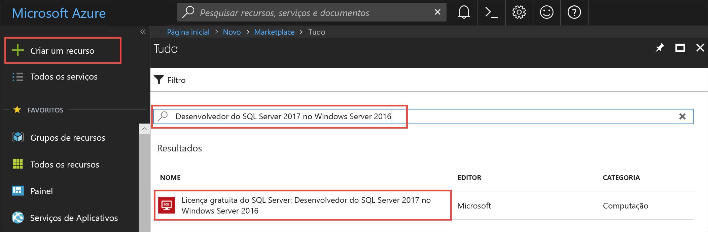
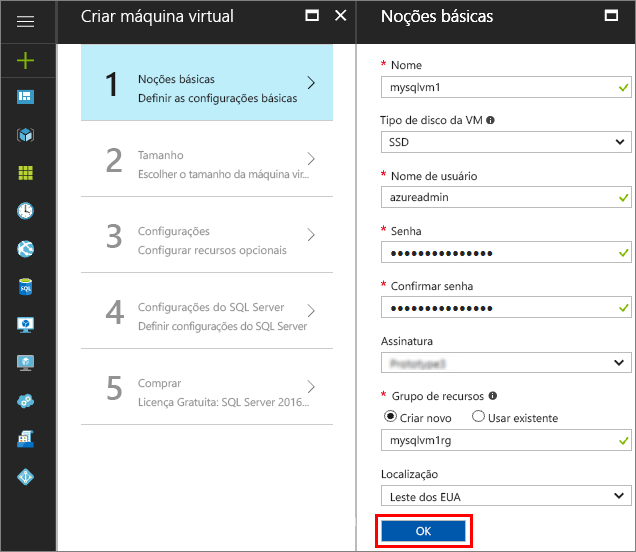
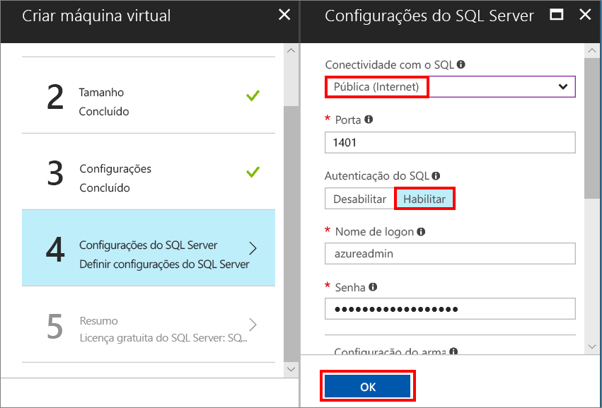
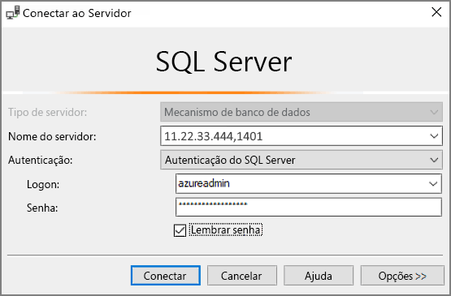

# Início Rápido: criar uma máquina virtual do Windows do SQL Server 2017 no portal do Azure

> [!div class="op_single_selector"]
> * [Windows](quickstart-sql-vm-create-portal.md)
> * [Linux](../../linux/sql/provision-sql-server-linux-virtual-machine.md)

Esse Início Rápido percorre a criação de uma máquina virtual do SQL Server usando o portal do Azure.

> [!TIP]
> Este início rápido fornece um caminho para provisionar rapidamente e conectar-se a uma VM do SQL. Para obter mais informações sobre outras opções de provisionamento da VM SQL, confira o [Guia de provisionamento para VMs do Windows do SQL Server no portal do Azure](virtual-machines-windows-portal-sql-server-provision.md).

Se você não tiver uma assinatura do Azure, crie uma [conta gratuita](https://azure.microsoft.com/free/?WT.mc_id=A261C142F) antes de começar.

##  Selecione uma imagem da VM do SQL Server

1. Faça logon no [portal do Azure](https://portal.azure.com) usando sua conta.

1. No portal do Azure, clique em **Criar um recurso**. 

1. No campo de pesquisa, digite **Desenvolvedor do SQL Server 2017 no Windows Server 2016** e pressione ENTER.

1. Selecione a imagem **Licença Gratuita do SQL Server: Desenvolvedor do SQL Server 2017 no Windows Server 2016**.

   

   > [!TIP]
   > A edição de Desenvolvedor é usada neste tutorial porque é uma edição completa do SQL Server e é gratuita para fins de teste de desenvolvimento. Você paga apenas o custo da execução da VM. Para concluir a consideração de preço, consulte [Diretrizes para os preços de VMs do Azure do SQL Server](virtual-machines-windows-sql-server-pricing-guidance.md).

1. Clique em **Criar**.

##  Forneça detalhes básicos

Na janela **Básico**, forneça as seguintes informações:

1. No campo **Nome**, insira um nome exclusivo da máquina virtual. 

1. No campo **Nome de usuário**, insira um nome para a conta do administrador local na VM.

1. Forneça uma **Senha**forte.

1. Insira um nome de **Grupo de recursos**. Esse grupo ajuda a gerenciar todos os recursos associados à máquina virtual.

1. Verifique as outras configurações padrão e, em seguida, clique em **OK** para continuar.

   

## Escolher o tamanho da máquina virtual

Na etapa **Tamanho**, escolha um tamanho de máquina virtual na janela **Escolher um tamanho**. A janela exibe inicialmente os tamanhos recomendados da máquina com base na imagem selecionada. 

1. Clique em **Exibir tudo** para ver todos os tamanhos de máquina disponíveis.

1. Para esse início rápido, selecione **D2S_V3**. O portal mostra o custo de máquina mensal estimado para uso contínuo (não incluindo os custos de licenciamento do SQL Server). Observe que a Developer Edition não tem custos de licenciamento adicionais para o SQL Server. Para obter informações de preço mais específicas, confira a [página de preço](https://azure.microsoft.com/pricing/details/virtual-machines/windows/).

   > [!TIP]
   > O tamanho de máquina **D2S_V3** economiza dinheiro durante o teste. Mas para as cargas de trabalho de produção, consulte os tamanhos recomendados de máquina e a configuração em [Práticas recomendadas de desempenho para o SQL Server em Máquinas Virtuais do Azure](virtual-machines-windows-sql-performance.md).

1. Clique em **Selecionar** para continuar.

## Configurar os recursos opcionais

Na janela **Configurações**, clique em **OK** para selecionar os padrões.

## Configurações do SQL Server

Na janela **Configurações do SQL Server**, configure as seguintes opções.

1. Na lista suspensa **Conectividade do SQL**, selecione **Pública (Internet)**. Isso permite conexões do SQL Server pela Internet.

1. Altere a **Porta** para **1401** para evitar o uso de um nome de porta conhecida no cenário de público.

1. Em **Autenticação SQL**, clique em **Habilitar**. O logon do SQL é definido como o mesmo nome de usuário e senha que você configurou para a VM.

1. Altere outras configurações, se necessário, e clique em **OK** para concluir a configuração da VM do SQL Server.

   

## Criar a VM do SQL Server

Na janela **Resumo**, examine o resumo e clique em **Comprar** para criar o SQL Server, o grupo de recursos e os recursos específicos dessa VM.

Você pode monitorar a implantação no portal do Azure. O botão **Notificações** na parte superior da tela mostra o status básico da implantação.

> [!TIP]
> Implantar uma VM do Windows SQL Server pode levar um bom tempo.

## Conectar-se ao SQL Server

1. No portal, localize o **endereço IP público** da VM na seção **Visão geral** das propriedades da sua máquina virtual.

1. Em um computador diferente conectado à Internet, abra o SSMS (SQL Server Management Studio).

   > [!TIP]
   > Se você não tiver o SQL Server Management Studio, poderá baixá-lo [aqui](https://docs.microsoft.com/sql/ssms/download-sql-server-management-studio-ssms).

1. Na caixa de diálogo **Conectar ao Servidor** ou **Conectar ao Mecanismo de Banco de Dados**, edite o valor **Nome do servidor**. Insira o endereço IP público da VM. Em seguida, adicione uma vírgula e adicione a porta personalizada, **1401**, que especificamos quando você configurou a nova VM. Por exemplo, `11.22.33.444,1401`.

1. Na caixa **Autenticação**, selecione **Autenticação do SQL Server**.

1. Na caixa **Login** , digite o nome de um login válido do SQL.

1. Na caixa **Senha** , digite a senha de login.

1. Clique em **Conectar**.

    

##  Faça logon na VM remotamente

Use as etapas a seguir para se conectar à máquina virtual do SQL Server com a Área de Trabalho Remota:

[!INCLUDE [Connect to SQL Server VM with remote desktop](../../../../includes/virtual-machines-sql-server-remote-desktop-connect.md)]

Depois de se conectar à máquina virtual do SQL Server, você pode iniciar o SQL Server Management Studio e conectar-se à Autenticação do Windows usando suas credenciais de administrador local. Se você habilitou a Autenticação do SQL Server, também será possível se conectar com a Autenticação do SQL usando o logon e a senha do SQL configurados durante o provisionamento.

O acesso à máquina permite que você altere diretamente as configurações da máquina e do SQL Server com base em suas necessidades. Por exemplo, você pode definir as configurações do firewall ou alterar as configuração do SQL Server.

## Limpar recursos

Se você não precisar que sua VM do SQL seja executada continuamente, será possível interrompê-la quando não estiver em uso para evitar encargos desnecessários. Você pode excluir também permanentemente todos os recursos associados à máquina virtual excluindo seu grupo de recursos associado no portal. Isso excluirá permanentemente a máquina virtual também, portanto, use esse comando com cuidado. Para obter mais informações, consulte [Gerenciar recursos do Azure pelo portal](../../../azure-resource-manager/resource-group-portal.md).

## Próximas etapas

Nesse guia de início rápido, você criou uma máquina virtual do SQL Server 2017 no Portal do Azure. Para saber mais sobre como migrar seus dados para o novo SQL Server, consulte o artigo a seguir.

> [!div class="nextstepaction"]
> [Migrar um banco de dados para uma VM do SQL](virtual-machines-windows-migrate-sql.md)
