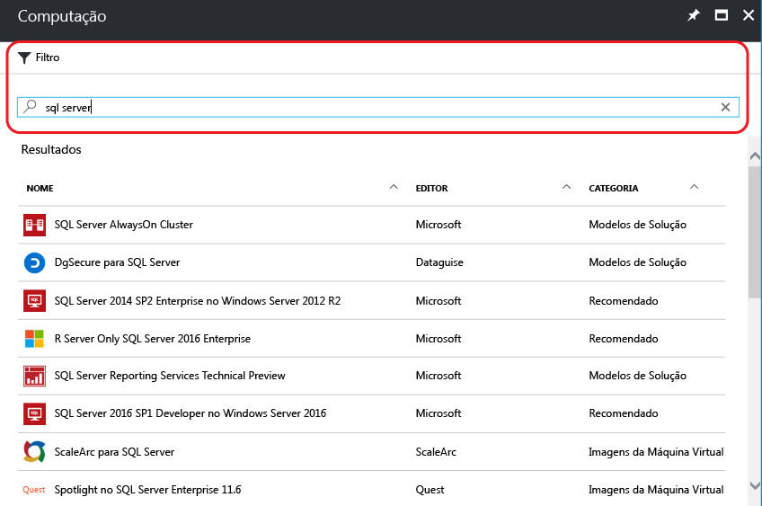
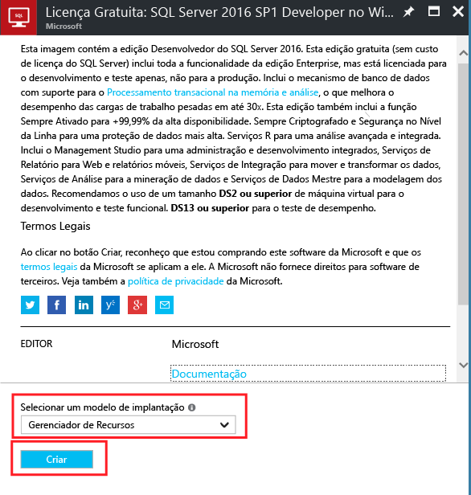
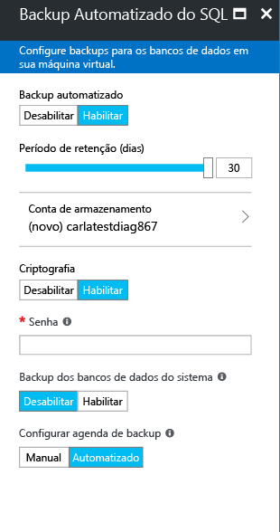

# Provisionar uma máquina virtual do SQL Server no portal do Azure
> [!div class="op_single_selector"]
> * [Portal](virtual-machines-windows-portal-sql-server-provision.md)
> * [PowerShell](virtual-machines-windows-ps-sql-create.md)
> 
> 

Este tutorial completo mostra como usar o portal do Azure para provisionar uma máquina virtual que executa o SQL Server.

A galeria de VMs (máquinas virtuais) do Azure inclui várias imagens que contêm o Microsoft SQL Server. Com alguns cliques, você pode selecionar uma das imagens de VM do SQL da galeria e provisioná-la em seu ambiente do Azure.

Neste tutorial, você irá:

* [Selecionar uma imagem de VM do SQL na galeria](#select-a-sql-vm-image-from-the-gallery)
* [Configurar e criar a VM](#configure-the-vm)
* [Abrir a VM usando a Área de Trabalho Remota.](#open-the-vm-with-remote-desktop)
* [Conectar-se ao SQL Server remotamente](#connect-to-sql-server-remotely)

## Selecionar uma imagem de VM do SQL na galeria

1. Faça logon no [portal do Azure](https://portal.azure.com) usando sua conta.

   > [!NOTE]
   > Se você não tiver uma conta do Azure, visite [Avaliação gratuita do Azure](https://azure.microsoft.com/pricing/free-trial/).

2. No portal do Azure, clique em **Novo**. O portal abre a folha **Novo** .

3. Na folha **Novo**, clique em **Computação** e em **Ver tudo**.

   

4. No campo de pesquisa, digite **SQL Server** e pressione ENTER.

5. Em seguida, clique no ícone **Filtro** e selecione **Microsoft** para o distribuidor. Clique em **Concluído** na folha do filtro para filtrar os resultados para as imagens do SQL Server publicadas pela Microsoft.

   

5. Examine as imagens disponíveis do SQL Server. Cada imagem identifica uma versão do SQL Server e um sistema operacional.

6. Selecione a imagem denominada **Licença Gratuita: Desenvolvedor do SQL Server 2016 SP1 no Windows Server 2016**.

   > [!TIP]
   > A edição de Desenvolvedor é usada neste tutorial porque é uma edição completa do SQL Server e é gratuita para fins de teste de desenvolvimento. Você paga apenas o custo da execução da VM. No entanto, você é livre para escolher qualquer uma das imagens para usar neste tutorial.

   > [!TIP]
   > As imagens de VM do SQL incluem os custos de licenciamento para o SQL Server no preço por minuto da VM que você cria (exceto para as edições Developer e Express). O SQL Server Developer é gratuito para desenvolvimento/teste (não para produção) e o SQL Express é gratuito para cargas de trabalho leves (menores que 1 GB de memória e menores que 10 GB de armazenamento). Há outra opção de BYOL (traga sua própria licença) e pagar apenas pela VM. Os nomes de imagem têm o prefixo {BYOL}. 
   >
   > Para obter mais informações sobre essas opções, consulte [Diretrizes para os preço das VMs do Azure do SQL Server](virtual-machines-windows-sql-server-pricing-guidance.md).

7. Em **Selecionar um modelo de implantação**, verifique se **Resource Manager** está selecionado. Resource Manager é o modelo de implantação recomendado para novas máquinas virtuais. 

8. Clique em **Criar**.

    

## Configurar a VM
Há cinco folhas para configuração de uma máquina virtual do SQL Server.

| Etapa | Descrição |
| --- | --- |
| **Noções básicas** |[Definir as configurações básicas](#1-configure-basic-settings) |
| **Tamanho** |[Escolher o tamanho da máquina virtual](#2-choose-virtual-machine-size) |
| **Configurações** |[Configurar os recursos opcionais](#3-configure-optional-features) |
| **Configurações do SQL Server** |[Definir as configurações do SQL Server](#4-configure-sql-server-settings) |
| **Resumo** |[Examinar o resumo](#5-review-the-summary) |

## 1. Definir as configurações básicas

Na folha **Básico** , forneça as seguintes informações:

* Digite um **Nome**exclusivo da máquina virtual.

* Selecione **SSD** para o tipo de disco da VM para ter um desempenho ideal.

* Especifique um **Nome de usuário** para a conta do administrador local na VM. Essa conta também é adicionada à função de servidor fixa **sysadmin** do SQL Server.

* Forneça uma **Senha**forte.

* Se você tem várias assinaturas, verifique se a assinatura é a correta para a nova VM.

* Na caixa **Grupo de recursos** , digite um nome para um novo grupo de recursos. Como alternativa, para usar um grupo de recursos existente, clique em **Usar existente**. Um grupo de recursos é uma coleção de recursos relacionados no Azure (máquinas virtuais, contas de armazenamento, redes virtuais etc.).

  > [!NOTE]
  > O uso de um novo grupo de recursos é útil se você estiver apenas testando ou aprendendo sobre implantações do SQL Server no Azure. Após concluir o teste, exclua o grupo de recursos para excluir automaticamente a VM e todos os recursos associados a esse grupo de recursos. Para saber mais sobre os grupos de recursos, confira [Visão geral do Azure Resource Manager](../../../azure-resource-manager/resource-group-overview.md).

* Selecione um **Local** para a região do Azure que hospedará esta implantação.

* Clique em **OK** para salvar as configurações.

    

## 2. Escolher o tamanho da máquina virtual

Na etapa **Tamanho**, escolha um tamanho de máquina virtual na folha **Escolher um tamanho**. A folha exibe inicialmente o tamanho recomendado da máquina baseado na imagem selecionada.

> [!IMPORTANT]
> O custo mensal estimado exibido na folha **Escolher um tamanho** não inclui os custos de licenciamento do SQL Server. Esse é o custo da VM sozinho. Para as edições Express e Developer do SQL Server, isso é o custo estimado total. Para outras edições, confira a [Página de preços das Máquinas Virtuais do Windows](https://azure.microsoft.com/pricing/details/virtual-machines/windows/) e selecione a edição de destino do SQL Server. Consulte também [Diretrizes para preços para VMs do Azure do SQL Server](virtual-machines-windows-sql-server-pricing-guidance.md).

Para as cargas de trabalho de produção, consulte os tamanhos recomendados de máquina e a configuração em [Práticas recomendadas de desempenho para o SQL Server em Máquinas Virtuais do Azure](virtual-machines-windows-sql-performance.md). Se você precisar de um tamanho de máquina não listado, clique no botão **Exibir todos**.

> [!NOTE]
> Para obter mais informações sobre tamanhos de máquinas virtuais, confira [Tamanhos de máquinas virtuais](../sizes.md?toc=%2fazure%2fvirtual-machines%2fwindows%2ftoc.json).

Escolha o tamanho da máquina e clique em **Selecionar**.

## 3. Configurar os recursos opcionais

Na folha **Configurações** , defina o armazenamento do Azure, a rede e o monitoramento da máquina virtual.

* Em **Armazenamento**, selecione **Sim** em usar **Managed Disks**.

   > [!NOTE]
   > A Microsoft recomenda os Managed Disks para o SQL Server. O Managed Disks lida com o armazenamento nos bastidores. Além disso, quando as máquinas virtuais com Managed Disks estão no mesmo conjunto de disponibilidade, o Azure distribui os recursos de armazenamento para fornecer a redundância apropriada. Para obter informações adicionais, consulte [Visão geral do Azure Managed Disks](../../../storage/storage-managed-disks-overview.md). Para obter informações específicas sobre os discos gerenciados em um conjunto de disponibilidade, consulte [Usar managed disks para VMs no conjunto de disponibilidade](../manage-availability.md).

* Em **Rede**, você pode aceitar os valores preenchidos automaticamente. Você também pode clicar em cada recurso para configurar manualmente a **Rede virtual**, **Sub-rede**, **Endereço IP público** e **Grupo de Segurança da Rede**. Para a finalidade deste tutorial, mantenha os valores padrão.

* O Azure habilita o **Monitoramento** por padrão com a mesma conta de armazenamento designada para a VM. Você pode alterar essas configurações aqui.

* Em **Conjunto de disponibilidade**, você pode deixar o padrão **nenhum** para este tutorial. Se você planeja configurar Grupos de Disponibilidade SQL AlwaysOn, configure a disponibilidade para evitar recriar a máquina virtual.  Para obter mais informações, consulte [Gerenciar a Disponibilidade de Máquinas Virtuais](../manage-availability.md?toc=%2fazure%2fvirtual-machines%2fwindows%2ftoc.json).

Ao concluir as configurações, clique em **OK**.

## 4. Definir as configurações do SQL Server
Na folha **Configurações do SQL Server** , defina as configurações e otimizações específicas para o SQL Server. As configurações possíveis para o SQL Server incluem as seguintes:

| Configuração |
| --- |
| [Conectividade](#connectivity) |
| [Autenticação](#authentication) |
| [Configuração de armazenamento](#storage-configuration) |
| [Aplicação de patch automatizada](#automated-patching) |
| [Backup Automatizado](#automated-backup) |
| [Integração do Cofre da Chave do Azure](#azure-key-vault-integration) |
| [R Services](#r-services) |

### Conectividade

Em **Conectividade SQL**, especifique o tipo de acesso desejado para a instância do SQL Server nesta VM. Para este tutorial, escolha **Pública (Internet)** para permitir conexões com o SQL Server a partir de máquinas ou serviços na Internet. Com essa opção selecionada, o Azure configura automaticamente o firewall e o grupo de segurança de rede para permitir o tráfego na porta 1433.

> [!TIP]
> Por padrão, o SQL Server atende em uma porta bem conhecida, **1433**. Para ter uma maior segurança, altere a porta na caixa de diálogo anterior para atender em uma porta não padrão, como 1401. Se você fizer isso, deverá conectar usando essa porta em qualquer ferramenta do cliente, como o SSMS.

Para conectar-se ao SQL Server pela Internet, você precisará habilitar a Autenticação do SQL Server, que está descrita na próxima seção.

Se você preferir não permitir conexões com o Mecanismo de Banco de Dados pela internet, escolha uma das seguintes opções:

* **Local (apenas dentro da VM)** para permitir conexões com o SQL Server somente de dentro da VM.
* **Privada (dentro da Rede Virtual)** para permitir conexões com o SQL Server a partir de computadores ou serviços na mesma rede virtual.

Em geral, melhore a segurança escolhendo a conectividade mais restritiva que seu cenário permite. No entanto, todas as opções são protegidas por meio de regras do Grupo de Segurança de Rede e por meio da Autenticação do SQL/Windows. Você pode editar o Grupo de Segurança de Rede depois da VM ser criada. Para obter mais informações, veja [Considerações sobre segurança para o SQL Server em Máquinas Virtuais do Azure](virtual-machines-windows-sql-security.md).

> [!NOTE]
> A imagem de máquina virtual para o SQL Server Express edition não habilita automaticamente o protocolo TCP/IP. Isso é verdadeiro mesmo para as opções de conectividade Pública e Privada. Para o Express Edition, você deve usar o SQL Server Configuration Manager para [habilitar manualmente o protocolo TCP/IP](#configure-sql-server-to-listen-on-the-tcp-protocol) depois de criar a máquina virtual.

### Autenticação

Se você precisar da Autenticação do SQL Server, clique em **Habilitar** under **Autenticação do SQL**.

> [!NOTE]
> Se você pretende acessar o SQL Server pela Internet (ou seja, a opção de conectividade Pública), habilite a autenticação do SQL aqui. O acesso público ao SQL Server exige o uso da Autenticação do SQL.
> 
> 

Se você habilitar a Autenticação do SQL Server, especifique um **Nome de logon** e **Senha**. Esse nome de usuário é configurado como um logon de Autenticação do SQL Server e membro da função de servidor fixa **sysadmin** . Consulte [Escolher um Modo de Autenticação](https://docs.microsoft.com/sql/relational-databases/security/choose-an-authentication-mode) para saber mais sobre os Modos de Autenticação.

Se você não habilitar a Autenticação do SQL Server, poderá usar a conta local de Administrador na VM para se conectar à instância do SQL Server.

### Configuração de armazenamento

Clique em **Configuração de armazenamento** para especificar os requisitos de armazenamento.

> [!NOTE]
> Se você configurou manualmente sua VM para usar o armazenamento padrão, essa opção não estará disponível. A otimização de armazenamento automático está disponível apenas para o Armazenamento Premium.

> [!TIP]
> O número de paradas e os limites superiores de cada controle deslizante dependem do tamanho da VM selecionada. Uma VM maior e mais eficiente é capaz de expandir mais.

Você pode especificar os requisitos como operações IOPs (entrada/saída por segundo), taxa de transferência em MB/s e tamanho total de armazenamento. Configure esses valores usando as escalas deslizantes. Você pode alterar essas configurações de armazenamento com base na carga de trabalho. O portal calcula automaticamente o número de discos a anexar e configura com base nesses requisitos.

Em **Armazenamento otimizado para**, escolha uma das seguintes opções:

* **Geral** é a configuração padrão e dá suporte à maioria das cargas de trabalho.
* **transacional** otimiza o armazenamento para cargas de trabalho OLTP tradicionais do banco de dados.
* **Data warehouse** otimiza o armazenamento para as cargas de trabalho de análise e emissão de relatórios.

### Aplicação de patch automatizada

**Automated patching** está habilitada por padrão. A aplicação de patch automatizada permite que o Azure aplique patches automaticamente no SQL Server e no sistema operacional. Especifique um dia da semana, hora e duração de um período de manutenção. O Azure realiza a aplicação de patch na janela de manutenção. O agendamento do período de manutenção usa a localidade da VM para a hora. Se você não quiser que o Azure aplique automaticamente o patch no SQL Server e no sistema operacional, clique em **Desabilitar**.  

Para saber mais, consulte [Aplicação de Patch Automatizada para SQL Server nas Máquinas Virtuais do Azure](virtual-machines-windows-sql-automated-patching.md).

### Backup Automatizado

Habilite backups automáticos do banco de dados para todos os bancos de dados em **Backup automatizado**. O backup automatizado está desabilitado por padrão.

Ao habilitar o backup automatizado do SQL, é possível configurar o seguinte:

* Período de retenção (dias) para backups
* Conta de armazenamento a ser usada para backups
* Opção de criptografia e senha para backups
* Bancos de dados do sistema de backup
* Configurar agendamento de backup

Para criptografar o backup, clique em **Habilitar**. Em seguida, especifique a **Senha**. O Azure cria um certificado para criptografar os backups e usa a senha especificada para proteger esse certificado.

 Para obter mais informações, veja [Backup Automatizado para o SQL Server em Máquinas Virtuais do Azure](virtual-machines-windows-sql-automated-backup.md).

### Integração do Cofre da Chave do Azure

Para armazenar os segredos de segurança no Azure para a criptografia, clique em **Integração do cofre de chaves do Azure** e clique em **Habilitar**.

A tabela a seguir lista os parâmetros necessários para configurar a integração do Cofre da Chave do Azure.

| PARÂMETRO | Descrição | EXEMPLO |
| --- | --- | --- |
| **URL do cofre da chave** |O local do cofre da chave. |https://contosokeyvault.vault.azure.net/ |
| **Nome de entidade** |Nome de entidade de serviço do Active Directory do Azure Ele também é chamado de ID do Cliente. |fde2b411-33d5-4e11-af04eb07b669ccf2 |
| **Segredo da entidade** |Segredo da entidade de serviço do Azure Active Directory. O segredo também é chamado de Segredo do Cliente. |9VTJSQwzlFepD8XODnzy8n2V01Jd8dAjwm/azF1XDKM= |
| **Nome da credencial** |**Nome da credencial**: a integração AKV cria uma credencial no SQL Server, permitindo que a VM tenha acesso ao cofre da chave. Escolha um nome para essa credencial. |mycred1 |

Para saber mais, consulte [Configurar a Integração do Cofre de Chaves do Azure para o SQL nas VMs do Azure](virtual-machines-windows-ps-sql-keyvault.md).

### R Services

Você tem a opção de habilitar o [SQL Server R Services](https://msdn.microsoft.com/library/mt604845.aspx). Isso permite que você use análises avançadas com o SQL Server 2016. Clique em **Habilitar** on the **SQL Server Settings** .

> [!NOTE]
> Para o SQL Server 2016 Developer Edition, essa opção é incorretamente desabilitada pelo portal. Para a Developer Edition, você deve habilitar os R Services manualmente depois de criar sua VM.

Ao concluir as configurações do SQL Server, clique em **OK**.

## 5. Examinar o resumo

Na folha **Resumo**, examine o resumo e clique em **Comprar** para criar o SQL Server, o grupo de recursos e os recursos específicos dessa VM.

Você pode monitorar a implantação do Portal do Azure. O botão **Notificações** na parte superior da tela mostra o status básico da implantação.

> [!NOTE]
> Para você ter uma ideia sobre os tempos de implantação, eu implantei uma VM do SQL na região Leste dos EUA com as configurações padrão. Essa implantação de teste levou um total de 26 minutos para ser concluída. Mas sua implantação pode ser rápida ou mais lenta de acordo com sua região e com as configurações selecionadas.

## Abrir a VM usando a Área de Trabalho Remota.

> [!INCLUDE [Connect to SQL Server VM with remote desktop](../../../../includes/virtual-machines-sql-server-remote-desktop-connect.md)]

## Conectar-se ao SQL Server remotamente

Neste tutorial, selecionamos o acesso **Público** para a máquina virtual e a **Autenticação do SQL Server**. Essas configurações definiram automaticamente a máquina virtual para permitir conexões do SQL Server de qualquer cliente pela internet (supondo que o logon do SQL esteja correto).

> [!NOTE]
> Se você não selecionou a opção Público durante o provisionamento, será necessário executar etapas adicionais para acessar a instância do SQL Server pela Internet. Para saber mais, confira [Conectar uma Máquina Virtual do SQL Server](virtual-machines-windows-sql-connect.md).
> 
> 

As seções a seguir mostram como se conectar à instância do SQL Server em sua VM de um computador diferente pela internet.

> [!INCLUDE [Connect to SQL Server in a VM Resource Manager](../../../../includes/virtual-machines-sql-server-connection-steps-resource-manager.md)]
> 
> 

## Próximas etapas
Para saber mais sobre como usar o SQL Server no Azure, consulte [SQL Server nas Máquinas Virtuais do Azure](virtual-machines-windows-sql-server-iaas-overview.md) e as [Perguntas Frequentes](virtual-machines-windows-sql-server-iaas-faq.md).

Para obter uma visão geral em vídeo do SQL Server em máquinas virtuais do Azure, assista ao vídeo [Azure VM is the best platform for SQL Server 2016 (A VM do Azure é a melhor plataforma para o SQL Server 2016)](https://channel9.msdn.com/Events/DataDriven/SQLServer2016/Azure-VM-is-the-best-platform-for-SQL-Server-2016).

[Explorar o Roteiro de Aprendizagem](https://azure.microsoft.com/documentation/learning-paths/sql-azure-vm/) do SQL Server nas máquinas virtuais do Azure.
