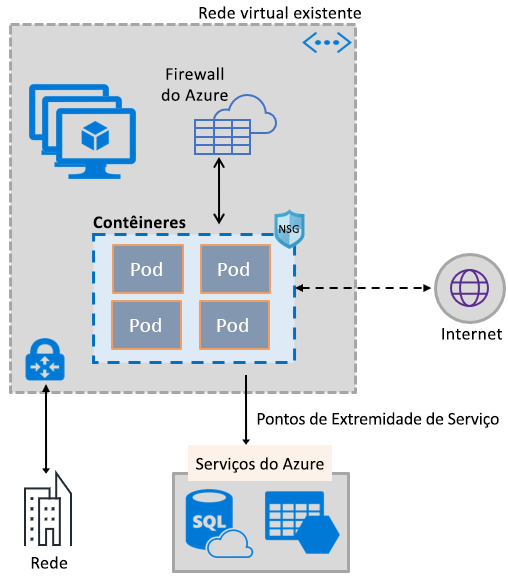
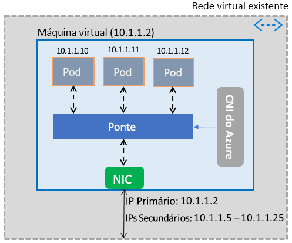

# Habilitar contêineres para usar as funcionalidades de Rede Virtual do Azure

Leve o conjunto avançado de funcionalidades de rede do Azure para os contêineres utilizando a mesma pilha de rede definida pelo software que alimenta as máquinas virtuais. O plug-in da CNI (adaptador de rede de contêineres) da Rede Virtual do Azure contêiner é instalado em uma máquina virtual do Azure. O plug-in atribui endereços IP de uma rede virtual aos contêineres acionados na máquina virtual, anexando-os à rede virtual e conectando-os diretamente a outros contêineres e aos recursos da rede virtual. O plug-in não depende de redes de sobreposição nem de rotas para a conectividade e fornece o mesmo desempenho que as máquinas virtuais. Em geral, o plug-in fornece as seguintes funcionalidades:

- Um endereço IP de rede virtual é atribuído a cada pod, que pode consistir em um ou mais contêineres.
- Os pods podem se conectar a redes virtuais emparelhadas e à VPN local pelo ExpressRoute ou à VPN site a site. Os pods também podem ser acessados por redes emparelhada e locais.
- Os pods podem acessar serviços como o Armazenamento do Azure e o Banco de Dados SQL do Azure, que são protegidos por pontos de extremidade de serviço da rede virtual.
- Grupos de segurança de rede e rotas podem ser aplicados diretamente aos pods.
- Os pods podem ser colocados diretamente atrás do Azure Load Balancer interno ou público, assim como as máquinas virtuais
- Os pods podem ser atribuídos a um endereço IP público, o que os torna diretamente acessíveis pela Internet. Os pods também podem acessar a Internet por conta própria.
- Funciona perfeitamente com os recursos de Kubernetes como os serviços, os controladores de entrada e o DNS Kube. Um serviço de Kubernetes também pode ser exposto interna ou externamente por meio do Azure Load Balancer.

A imagem a seguir mostra como o plug-in fornece as funcionalidades de Rede Virtual do Azure aos pods:

O plug-in dá suporte às plataformas Linux e Windows.

## Conectando pods a uma rede virtual

Os pods são ativados em uma máquina virtual que faz parte de uma rede virtual. Um pool de endereços IP dos Pods é configurado como endereços secundários no adaptador de rede da máquina virtual. A CNI do Azure define a conectividade de rede básica dos pods e gerencia a utilização dos endereços IP no pool. Quando um pod é ativado na máquina virtual, a CNI do Azure atribui um endereço IP disponível do pool e conecta o pod a uma ponte de software na máquina virtual. Quando o pod termina, o endereço IP é adicionado novamente ao pool. A imagem a seguir mostra como os pods se conectam a uma rede virtual:

## Acesso à Internet

Para permitir que os pods acessem a Internet, o plug-in configura as regras *iptables* para fazer a NAT (conversão de endereços de rede) do tráfico limitado da Internet dos pods. O endereço IP de origem do pacote é convertido no endereço IP primário no adaptador de rede da máquina virtual. As Máquinas Virtuais do Windows originam automaticamente o tráfego NAT (SNAT) destinado a endereços IP fora da sub-rede em que a máquina virtual está. Normalmente, todo o tráfego destinado a um endereço IP fora do intervalo de IP da rede virtual é convertido.

## limites

O plug-in dá suporte a até 250 pods por máquina virtual e até 16 mil pods em uma rede virtual. Esses limites são diferentes para o [Serviço de Kubernetes do Azure](../azure-subscription-service-limits.md?toc=%2fazure%2fvirtual-network%2ftoc.json#kubernetes-service-limits).

## Usando o plug-in

O plug-in pode ser usado das seguintes maneiras para fornecer conexão de rede virtual básica para pods ou contêineres do Docker:

- **Serviço de Kubernetes do Azure**: o plug-in é integrado ao AKS (Serviço de Kubernetes do Azure) e pode ser usado escolhendo a opção *Rede Avançada*. A Rede Avançada permite implantar um cluster Kubernetes em uma rede virtual existente ou nova. Para saber mais sobre a Rede Avançada e as etapas para configurá-la, confira [configuração de rede no AKS](../aks/networking-overview.md?toc=%2fazure%2fvirtual-network%2ftoc.json).
- **ACS-Engine**: é uma ferramenta que gera um modelo do Azure Resource Manager para a implantação de um cluster Kubernetes no Azure. Para obter instruções detalhadas, confira [Implantar o plug-in nos clusters Kubernetes do ACS-Engine](deploy-container-networking.md#deploy-plug-in-for-acs-engine-kubernetes-cluster).
- **Criando seu próprio cluster Kubernetes no Azure**: o plug-in pode ser usado para fornecer uma rede básica para pods em clusters Kubernetes que você implanta por conta própria, sem depender do AKS ou de ferramentas como o ACS-Engine. Nesse caso, o plug-in é instalado e habilitado em cada máquina virtual em um cluster. Para ver instruções detalhadas, confira [Implantar o plug-in em um cluster Kubernetes que você implanta por conta própria](deploy-container-networking.md#deploy-plug-in-for-a-kubernetes-cluster).
- **Conexão de rede virtual para contêineres do Docker no Azure**: o plug-in pode ser usado quando você não quer criar um cluster Kubernetes e deseja criar contêineres do Docker com conexão de rede virtual, em máquinas virtuais. Para obter instruções detalhadas, confira [Implantar o plug-in para Docker](deploy-container-networking.md#deploy-plug-in-for-docker-containers).

## Próximas etapas

[Implantar o plug-in](deploy-container-networking.md) para clusters Kubernetes ou contêineres do Docker